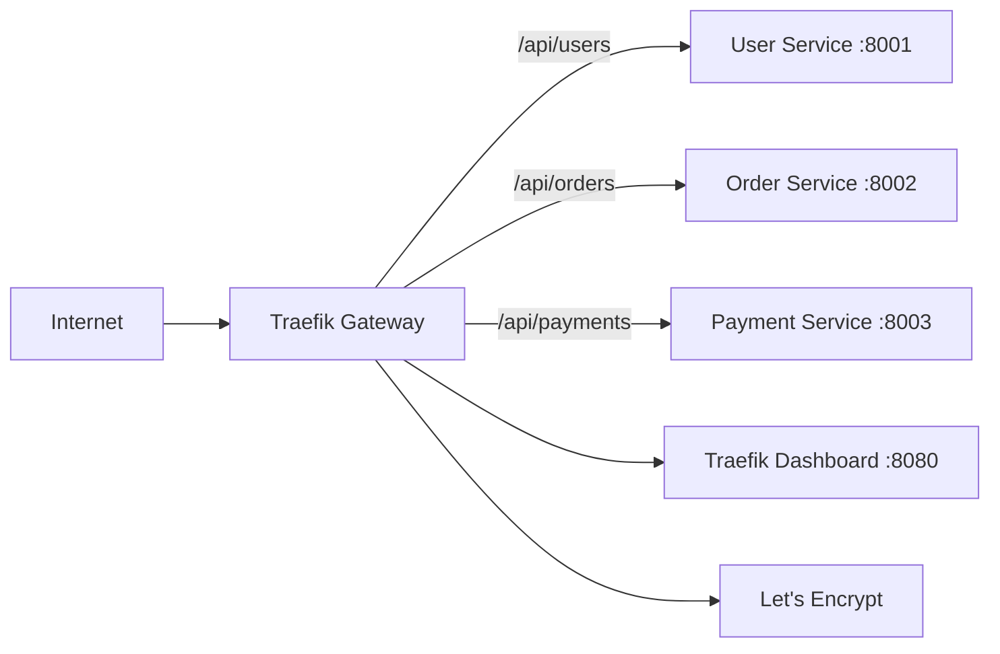

# How to Use Ansible to Configure API Gateways (Traefik)

Author: [nawazdhandala](https://www.github.com/nawazdhandala)

Tags: Ansible, Traefik, API Gateway, Reverse Proxy, DevOps

Description: Deploy and configure Traefik as an API gateway and reverse proxy using Ansible, with automatic HTTPS, dynamic routing, and middleware setup.

---

Traefik is a modern reverse proxy and API gateway that excels at automatic service discovery and dynamic configuration. Unlike traditional reverse proxies that require manual config reloads, Traefik watches for changes and updates its routing in real time. Ansible is perfect for setting up the initial Traefik deployment, configuring static settings, and managing file-based dynamic configurations.

I prefer Traefik for smaller to mid-size deployments because it handles Let's Encrypt certificates automatically and has a clean configuration model. Here is how to deploy and manage it with Ansible.

## Traefik Architecture



## Role Structure

```yaml
# roles/traefik/defaults/main.yml
# Default values for Traefik deployment
traefik_version: "3.0"
traefik_install_dir: /opt/traefik
traefik_config_dir: /etc/traefik
traefik_dynamic_config_dir: /etc/traefik/dynamic
traefik_log_dir: /var/log/traefik
traefik_acme_email: "admin@example.com"
traefik_dashboard_enabled: true
traefik_dashboard_port: 8080
traefik_entrypoints:
  web:
    address: ":80"
  websecure:
    address: ":443"
traefik_log_level: "INFO"
traefik_access_log: true
traefik_user: traefik
traefik_group: traefik
```

## Installing Traefik

```yaml
# roles/traefik/tasks/install.yml
# Download and install Traefik binary
- name: Create traefik system group
  ansible.builtin.group:
    name: "{{ traefik_group }}"
    system: true

- name: Create traefik system user
  ansible.builtin.user:
    name: "{{ traefik_user }}"
    group: "{{ traefik_group }}"
    system: true
    shell: /usr/sbin/nologin
    create_home: false

- name: Create traefik directories
  ansible.builtin.file:
    path: "{{ item }}"
    state: directory
    owner: "{{ traefik_user }}"
    group: "{{ traefik_group }}"
    mode: '0755'
  loop:
    - "{{ traefik_install_dir }}"
    - "{{ traefik_config_dir }}"
    - "{{ traefik_dynamic_config_dir }}"
    - "{{ traefik_log_dir }}"
    - "{{ traefik_config_dir }}/acme"

- name: Download Traefik binary
  ansible.builtin.get_url:
    url: "https://github.com/traefik/traefik/releases/download/v{{ traefik_version }}/traefik_v{{ traefik_version }}_linux_amd64.tar.gz"
    dest: /tmp/traefik.tar.gz
    mode: '0644'

- name: Extract Traefik binary
  ansible.builtin.unarchive:
    src: /tmp/traefik.tar.gz
    dest: "{{ traefik_install_dir }}"
    remote_src: true
  notify: restart traefik

- name: Set binary permissions
  ansible.builtin.file:
    path: "{{ traefik_install_dir }}/traefik"
    mode: '0755'
    owner: root
    group: root

- name: Allow Traefik to bind to privileged ports
  community.general.capabilities:
    path: "{{ traefik_install_dir }}/traefik"
    capability: cap_net_bind_service+ep
    state: present
```

## Static Configuration

```yaml
# roles/traefik/tasks/configure.yml
# Deploy Traefik static and dynamic configuration
- name: Deploy Traefik static configuration
  ansible.builtin.template:
    src: traefik.yml.j2
    dest: "{{ traefik_config_dir }}/traefik.yml"
    owner: "{{ traefik_user }}"
    group: "{{ traefik_group }}"
    mode: '0640'
  notify: restart traefik

- name: Deploy dynamic configuration files
  ansible.builtin.template:
    src: "dynamic/{{ item }}.yml.j2"
    dest: "{{ traefik_dynamic_config_dir }}/{{ item }}.yml"
    owner: "{{ traefik_user }}"
    group: "{{ traefik_group }}"
    mode: '0640'
  loop:
    - routers
    - middlewares
    - services
  # No restart needed - Traefik watches for file changes

- name: Deploy systemd service
  ansible.builtin.template:
    src: traefik.service.j2
    dest: /etc/systemd/system/traefik.service
    mode: '0644'
  notify:
    - reload systemd
    - restart traefik

- name: Start and enable Traefik
  ansible.builtin.service:
    name: traefik
    state: started
    enabled: true
```

```yaml
# roles/traefik/templates/traefik.yml.j2
# Traefik static configuration
global:
  checkNewVersion: false
  sendAnonymousUsage: false

log:
  level: "{{ traefik_log_level }}"
  filePath: "{{ traefik_log_dir }}/traefik.log"


accessLog:
  filePath: "{{ traefik_log_dir }}/access.log"
  bufferingSize: 100


entryPoints:

  {{ name }}:
    address: "{{ config.address }}"

    http:
      redirections:
        entryPoint:
          to: websecure
          scheme: https




api:
  dashboard: true
  insecure: true


providers:
  file:
    directory: "{{ traefik_dynamic_config_dir }}"
    watch: true

certificatesResolvers:
  letsencrypt:
    acme:
      email: "{{ traefik_acme_email }}"
      storage: "{{ traefik_config_dir }}/acme/acme.json"
      httpChallenge:
        entryPoint: web
```

## Dynamic Route Configuration

```yaml
# roles/traefik/templates/dynamic/routers.yml.j2
# Dynamic router configuration for Traefik
http:
  routers:

    {{ service.name }}-router:
      rule: "{{ service.rule }}"
      entryPoints:
        - websecure
      service: {{ service.name }}-service
      tls:
        certResolver: letsencrypt

      middlewares:

        - {{ mw }}



```

```yaml
# roles/traefik/templates/dynamic/services.yml.j2
# Dynamic service configuration for Traefik
http:
  services:

    {{ service.name }}-service:
      loadBalancer:
        servers:

          - url: "{{ server }}"


        healthCheck:
          path: "{{ service.health_check_path | default('/health') }}"
          interval: "{{ service.health_check_interval | default('30s') }}"
          timeout: "{{ service.health_check_timeout | default('5s') }}"


```

## Middleware Configuration

```yaml
# roles/traefik/templates/dynamic/middlewares.yml.j2
# Middleware definitions for Traefik
http:
  middlewares:
    rate-limit:
      rateLimit:
        average: 100
        burst: 200

    secure-headers:
      headers:
        stsSeconds: 31536000
        stsIncludeSubdomains: true
        stsPreload: true
        forceSTSHeader: true
        contentTypeNosniff: true
        browserXssFilter: true
        frameDeny: true
        customFrameOptionsValue: "SAMEORIGIN"

    compress-response:
      compress:
        excludedContentTypes:
          - text/event-stream

    api-auth:
      basicAuth:
        users:

          - "{{ user }}"


    strip-api-prefix:
      stripPrefix:
        prefixes:
          - "/api"
```

## Service Definitions in Variables

```yaml
# inventories/production/group_vars/api_gateway.yml
# Traefik service routing configuration
traefik_services:
  - name: user-api
    rule: "Host(`api.example.com`) && PathPrefix(`/api/v1/users`)"
    servers:
      - "http://10.0.2.10:8001"
      - "http://10.0.2.11:8001"
    middlewares:
      - rate-limit
      - secure-headers
    health_check: true
    health_check_path: "/health"

  - name: order-api
    rule: "Host(`api.example.com`) && PathPrefix(`/api/v1/orders`)"
    servers:
      - "http://10.0.2.12:8002"
      - "http://10.0.2.13:8002"
    middlewares:
      - rate-limit
      - secure-headers
    health_check: true

  - name: web-frontend
    rule: "Host(`app.example.com`)"
    servers:
      - "http://10.0.2.20:3000"
    middlewares:
      - compress-response
      - secure-headers

traefik_basic_auth_users:
  - "admin:$apr1$abc123$hashedpassword"
```

## Verification Tasks

```yaml
# roles/traefik/tasks/verify.yml
# Verify Traefik deployment is working correctly
- name: Check Traefik process is running
  ansible.builtin.command: pgrep -f traefik
  register: traefik_process
  changed_when: false

- name: Check Traefik dashboard is accessible
  ansible.builtin.uri:
    url: "http://127.0.0.1:{{ traefik_dashboard_port }}/api/overview"
    status_code: 200
  register: dashboard_check
  when: traefik_dashboard_enabled

- name: Display Traefik status
  ansible.builtin.debug:
    msg: "Traefik is running with {{ dashboard_check.json.http.routers.total | default(0) }} routers configured"
  when: traefik_dashboard_enabled
```

## Conclusion

Traefik's file-based provider makes it a great match for Ansible management. You deploy the static configuration once and then manage dynamic routes, services, and middlewares through templated YAML files that Traefik watches and reloads automatically. This means you can update routing rules without restarting the gateway. Combined with automatic Let's Encrypt certificates and built-in middleware for security headers, rate limiting, and compression, Traefik gives you a production-ready API gateway that is straightforward to manage with Ansible.
