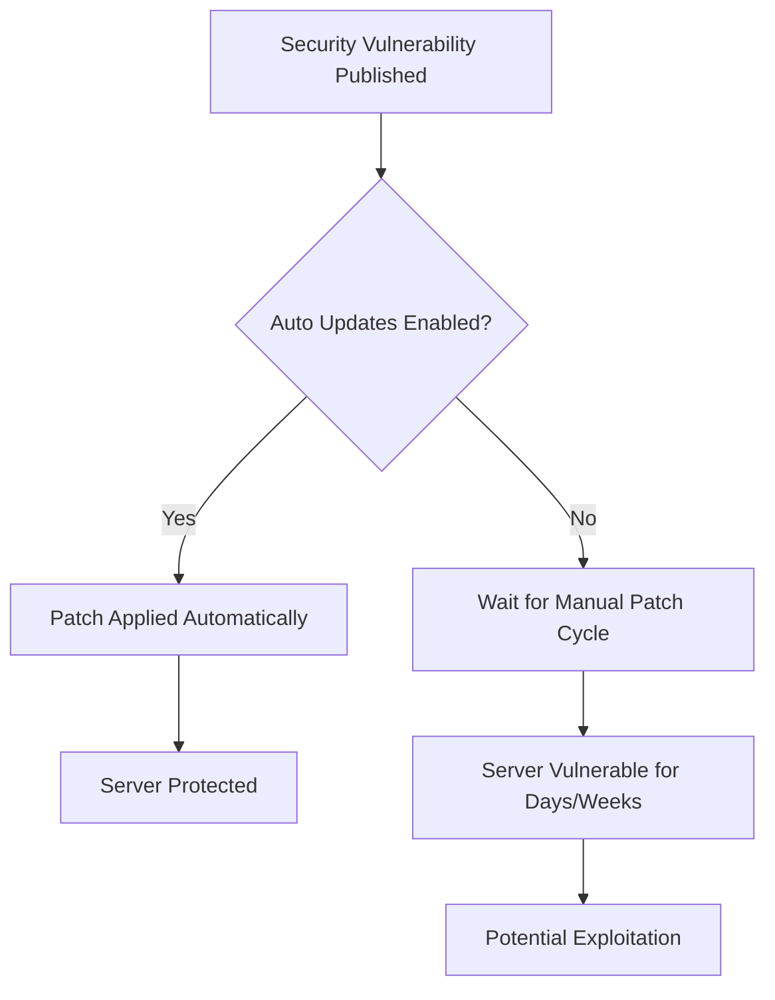

# How to Use Ansible to Configure Automatic Security Updates

Author: [nawazdhandala](https://www.github.com/nawazdhandala)

Tags: Ansible, Security Updates, Unattended Upgrades, Patch Management, Linux

Description: Configure automatic security updates on Debian and RHEL-based systems using Ansible to keep your servers patched without manual intervention.

---

Keeping servers patched is one of the most important security practices, and also one of the most neglected. The reason is simple: manual patching is time-consuming and disruptive. But leaving servers unpatched is how you end up in the news. Automatic security updates solve this by applying critical patches as soon as they are available, without human intervention.

In this post, I will show you how to configure automatic security updates on both Debian/Ubuntu and RHEL/CentOS systems using Ansible. We will cover unattended-upgrades, dnf-automatic, and how to control exactly which updates get applied automatically.

## The Case for Automatic Security Updates

Some teams resist automatic updates because they worry about breaking changes. That concern is valid for application-level updates, but security patches for the base OS are different. They fix known vulnerabilities and are tested specifically to avoid breaking existing functionality. The risk of not patching is almost always higher than the risk of a security update causing issues.



## Configuring Unattended Upgrades on Debian/Ubuntu

The `unattended-upgrades` package handles automatic updates on Debian-based systems. It can be configured to apply only security updates, email results, and automatically reboot if needed.

This playbook installs and configures unattended-upgrades:

```yaml
# debian_auto_updates.yml - Configure automatic security updates on Debian/Ubuntu
---
- name: Configure automatic security updates (Debian/Ubuntu)
  hosts: debian_servers
  become: true

  vars:
    auto_update_enabled: true
    auto_reboot: false
    auto_reboot_time: "02:00"
    auto_remove_unused: true
    update_email: sysadmin@example.com
    allowed_origins:
      - "${distro_id}:${distro_codename}-security"
    blacklisted_packages: []

  tasks:
    - name: Install unattended-upgrades
      ansible.builtin.apt:
        name:
          - unattended-upgrades
          - apt-listchanges
        state: present
        update_cache: true

    - name: Deploy unattended-upgrades configuration
      ansible.builtin.template:
        src: 50unattended-upgrades.j2
        dest: /etc/apt/apt.conf.d/50unattended-upgrades
        owner: root
        group: root
        mode: '0644'

    - name: Enable automatic updates
      ansible.builtin.copy:
        content: |
          APT::Periodic::Update-Package-Lists "1";
          APT::Periodic::Unattended-Upgrade "1";
          APT::Periodic::Download-Upgradeable-Packages "1";
          APT::Periodic::AutocleanInterval "7";
        dest: /etc/apt/apt.conf.d/20auto-upgrades
        owner: root
        group: root
        mode: '0644'

    - name: Enable unattended-upgrades timer
      ansible.builtin.systemd:
        name: apt-daily-upgrade.timer
        state: started
        enabled: true
```

The unattended-upgrades configuration template:

```
// templates/50unattended-upgrades.j2 - Unattended upgrades configuration
// Managed by Ansible

Unattended-Upgrade::Allowed-Origins {

    "{{ origin }}";

};

// Packages to never update automatically
Unattended-Upgrade::Package-Blacklist {

    "{{ pkg }}";

};

// Send email notification

Unattended-Upgrade::Mail "{{ update_email }}";
Unattended-Upgrade::MailReport "on-change";


// Remove unused dependencies
Unattended-Upgrade::Remove-Unused-Kernel-Packages "{{ 'true' if auto_remove_unused else 'false' }}";
Unattended-Upgrade::Remove-New-Unused-Dependencies "{{ 'true' if auto_remove_unused else 'false' }}";
Unattended-Upgrade::Remove-Unused-Dependencies "{{ 'true' if auto_remove_unused else 'false' }}";

// Automatic reboot settings
Unattended-Upgrade::Automatic-Reboot "{{ 'true' if auto_reboot else 'false' }}";
Unattended-Upgrade::Automatic-Reboot-Time "{{ auto_reboot_time }}";

// Logging
Unattended-Upgrade::SyslogEnable "true";
Unattended-Upgrade::SyslogFacility "daemon";

// Bandwidth limiting
Acquire::http::Dl-Limit "500";
```

## Configuring dnf-automatic on RHEL/CentOS/Fedora

On RHEL-based systems, `dnf-automatic` provides similar functionality.

This playbook configures dnf-automatic for security-only updates:

```yaml
# rhel_auto_updates.yml - Configure automatic security updates on RHEL
---
- name: Configure automatic security updates (RHEL/CentOS)
  hosts: rhel_servers
  become: true

  vars:
    auto_update_type: security  # Can be: default, security
    auto_apply: true
    auto_reboot: false
    update_email_to: root
    update_email_from: dnf-automatic@{{ ansible_fqdn }}

  tasks:
    - name: Install dnf-automatic
      ansible.builtin.yum:
        name: dnf-automatic
        state: present

    - name: Configure dnf-automatic
      ansible.builtin.template:
        src: automatic.conf.j2
        dest: /etc/dnf/automatic.conf
        owner: root
        group: root
        mode: '0644'

    - name: Enable dnf-automatic timer
      ansible.builtin.systemd:
        name: dnf-automatic-install.timer
        state: started
        enabled: true
        daemon_reload: true
```

The dnf-automatic configuration template:

```ini
# templates/automatic.conf.j2 - dnf-automatic configuration
# Managed by Ansible

[commands]
# Type of updates to apply
upgrade_type = {{ auto_update_type }}

# Randomly sleep up to this many minutes before running
random_sleep = 60

# Whether to download updates
download_updates = yes

# Whether to apply updates
apply_updates = {{ 'yes' if auto_apply else 'no' }}

[emitters]
# How to notify about updates
emit_via = email,stdio

[email]
email_from = {{ update_email_from }}
email_to = {{ update_email_to }}
email_host = localhost

[command]
# How to handle reboots

# Note: dnf-automatic doesn't handle reboots directly
# Use a separate mechanism for auto-reboot


[base]
debuglevel = 1
```

## Handling Automatic Reboots

Some security updates (like kernel patches) require a reboot. Here is how to handle that safely.

This playbook checks if a reboot is needed and schedules it during a maintenance window:

```yaml
# auto_reboot.yml - Handle post-update reboots
---
- name: Handle reboot requirements
  hosts: all
  become: true
  serial: "25%"  # Only reboot 25% of hosts at a time

  vars:
    reboot_window_start: "02:00"
    reboot_window_end: "04:00"

  tasks:
    - name: Check if reboot is required (Debian)
      ansible.builtin.stat:
        path: /var/run/reboot-required
      register: reboot_required_file
      when: ansible_os_family == "Debian"

    - name: Check if reboot is required (RHEL)
      ansible.builtin.command: needs-restarting -r
      register: needs_restarting
      changed_when: false
      failed_when: false
      when: ansible_os_family == "RedHat"

    - name: Set reboot needed fact
      ansible.builtin.set_fact:
        reboot_needed: >-
          {{
            (ansible_os_family == 'Debian' and reboot_required_file.stat.exists | default(false)) or
            (ansible_os_family == 'RedHat' and needs_restarting.rc | default(0) == 1)
          }}

    - name: Reboot server if needed
      ansible.builtin.reboot:
        reboot_timeout: 300
        pre_reboot_delay: 30
        post_reboot_delay: 60
        msg: "Ansible-managed reboot for security updates"
      when: reboot_needed | bool

    - name: Verify server is back up
      ansible.builtin.wait_for_connection:
        delay: 10
        timeout: 300
      when: reboot_needed | bool
```

## Excluding Specific Packages

Sometimes you need to exclude certain packages from automatic updates. For example, database packages that require migration steps.

This playbook configures package exclusions:

```yaml
# exclude_packages.yml - Configure update exclusions
---
- name: Configure package exclusions for auto-updates
  hosts: all
  become: true

  vars:
    excluded_packages_debian:
      - postgresql*
      - mysql*
      - docker-ce*
      - kubelet
      - kubeadm
      - kubectl

    excluded_packages_rhel:
      - postgresql*
      - mysql*
      - docker-ce*
      - kubelet
      - kubeadm
      - kubectl

  tasks:
    - name: Add package blacklist to unattended-upgrades
      ansible.builtin.lineinfile:
        path: /etc/apt/apt.conf.d/50unattended-upgrades
        regexp: '"{{ item }}"'
        insertafter: "Package-Blacklist {"
        line: '    "{{ item }}";'
      loop: "{{ excluded_packages_debian }}"
      when: ansible_os_family == "Debian"

    - name: Add package exclusions to dnf
      ansible.builtin.lineinfile:
        path: /etc/dnf/dnf.conf
        regexp: "^exclude="
        line: "exclude={{ excluded_packages_rhel | join(' ') }}"
      when: ansible_os_family == "RedHat"
```

## Monitoring Update Status

You need visibility into whether auto-updates are actually working.

This playbook checks the status of automatic updates across your fleet:

```yaml
# check_update_status.yml - Monitor auto-update health
---
- name: Check automatic update status
  hosts: all
  become: true

  tasks:
    - name: Check unattended-upgrades log (Debian)
      ansible.builtin.shell: |
        tail -50 /var/log/unattended-upgrades/unattended-upgrades.log 2>/dev/null | \
        grep -c "All upgrades installed"
      register: debian_update_check
      changed_when: false
      failed_when: false
      when: ansible_os_family == "Debian"

    - name: Check dnf-automatic log (RHEL)
      ansible.builtin.shell: |
        journalctl -u dnf-automatic-install --since "24 hours ago" --no-pager 2>/dev/null | \
        tail -20
      register: rhel_update_check
      changed_when: false
      failed_when: false
      when: ansible_os_family == "RedHat"

    - name: Check for pending security updates (Debian)
      ansible.builtin.shell: |
        apt list --upgradable 2>/dev/null | grep -i security | wc -l
      register: pending_debian
      changed_when: false
      when: ansible_os_family == "Debian"

    - name: Check for pending security updates (RHEL)
      ansible.builtin.shell: |
        dnf check-update --security 2>/dev/null | wc -l
      register: pending_rhel
      changed_when: false
      failed_when: false
      when: ansible_os_family == "RedHat"

    - name: Report pending updates
      ansible.builtin.debug:
        msg: >
          {{ inventory_hostname }}:
          Pending security updates:
          {{ pending_debian.stdout | default(pending_rhel.stdout | default('unknown')) }}
```

## Production Recommendations

After managing auto-updates across large fleets, here is what works:

1. **Start with security-only updates.** Do not auto-apply all updates. Security patches are tested more carefully and are less likely to break things.
2. **Use serial reboots.** Never reboot your entire fleet at once. Use Ansible's `serial` keyword to roll through a percentage at a time.
3. **Exclude database packages.** Database updates often require migration steps that should not happen automatically.
4. **Monitor update success.** Auto-updates can fail silently. Check logs regularly and set up alerting.
5. **Keep a staging environment.** Apply updates to staging first and let them bake for a few hours before they hit production automatically.
6. **Document your exclusions.** Every excluded package should have a reason documented. Review the list periodically.

Automatic security updates with Ansible give you the best of both worlds: fast patching for known vulnerabilities with the control and consistency that comes from configuration management. Set it up once, and your servers stay patched without you having to think about it.
