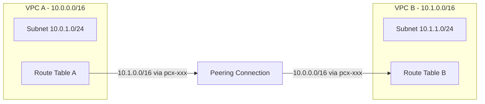

# How to Use Ansible to Configure AWS VPC Peering

Author: [nawazdhandala](https://www.github.com/nawazdhandala)

Tags: Ansible, AWS, VPC, Networking, Cloud Infrastructure

Description: Set up and manage AWS VPC peering connections with Ansible including route tables, security groups, and cross-account peering.

---

VPC peering lets two VPCs communicate using private IP addresses as if they were on the same network. No internet gateway, no VPN, no transit gateway needed. It is the simplest way to connect two VPCs, and Ansible can manage the entire setup from creating the peering connection to updating route tables. This is especially useful when you have a hub-and-spoke architecture where a shared services VPC needs to talk to multiple application VPCs.

## How VPC Peering Works

A peering connection is a one-to-one relationship between two VPCs. Traffic stays on the AWS backbone and never touches the public internet.



There are a few constraints to be aware of. VPC CIDR blocks cannot overlap. Peering is not transitive, so if VPC A peers with VPC B, and VPC B peers with VPC C, VPC A cannot reach VPC C through VPC B. Each peering connection requires route table entries on both sides.

## Prerequisites

- Ansible 2.9+ with the `amazon.aws` collection
- AWS credentials with VPC, EC2, and route table permissions
- Two existing VPCs with non-overlapping CIDR blocks

```bash
# Install the required collection
ansible-galaxy collection install amazon.aws
```

## Creating a VPC Peering Connection

The `amazon.aws.ec2_vpc_peer` module creates the peering connection:

```yaml
# create-peering.yml - Create a VPC peering connection between two VPCs
---
- name: Create VPC Peering Connection
  hosts: localhost
  connection: local
  gather_facts: false

  vars:
    aws_region: us-east-1
    requester_vpc_id: "vpc-0abc123requester"
    accepter_vpc_id: "vpc-0def456accepter"

  tasks:
    - name: Create the peering connection
      amazon.aws.ec2_vpc_peer:
        region: "{{ aws_region }}"
        vpc_id: "{{ requester_vpc_id }}"
        peer_vpc_id: "{{ accepter_vpc_id }}"
        state: present
        tags:
          Name: "app-to-shared-services"
          ManagedBy: ansible
          RequesterVPC: "{{ requester_vpc_id }}"
          AccepterVPC: "{{ accepter_vpc_id }}"
      register: peering_result

    - name: Show peering connection details
      ansible.builtin.debug:
        msg: "Peering connection {{ peering_result.peering_id }} created (status: {{ peering_result.vpc_peering_connection.status.code }})"
```

After creation, the peering connection is in a `pending-acceptance` state. If both VPCs are in the same account, you can auto-accept. For cross-account peering, the other account needs to explicitly accept.

## Accepting the Peering Connection

```yaml
# accept-peering.yml - Accept a pending VPC peering connection
---
- name: Accept VPC Peering Connection
  hosts: localhost
  connection: local
  gather_facts: false

  vars:
    aws_region: us-east-1
    peering_id: "pcx-0abc123def456789"

  tasks:
    - name: Accept the peering connection
      amazon.aws.ec2_vpc_peer:
        region: "{{ aws_region }}"
        peering_id: "{{ peering_id }}"
        state: accept
        tags:
          Name: "app-to-shared-services"
          ManagedBy: ansible
      register: accept_result

    - name: Verify the connection is active
      ansible.builtin.debug:
        msg: "Peering {{ peering_id }} status: {{ accept_result.vpc_peering_connection.status.code }}"
```

## Complete Peering Setup with Route Tables

The peering connection alone does not enable traffic flow. You also need route table entries on both sides. Here is a complete playbook:

```yaml
# full-peering-setup.yml - Create peering and configure routes on both sides
---
- name: Full VPC Peering Setup
  hosts: localhost
  connection: local
  gather_facts: false

  vars:
    aws_region: us-east-1
    # VPC A (Application)
    vpc_a_id: "vpc-0abc123requester"
    vpc_a_cidr: "10.0.0.0/16"
    vpc_a_route_table_ids:
      - "rtb-0aaa111222333"
      - "rtb-0aaa444555666"
    # VPC B (Shared Services)
    vpc_b_id: "vpc-0def456accepter"
    vpc_b_cidr: "10.1.0.0/16"
    vpc_b_route_table_ids:
      - "rtb-0bbb111222333"

  tasks:
    - name: Create the VPC peering connection
      amazon.aws.ec2_vpc_peer:
        region: "{{ aws_region }}"
        vpc_id: "{{ vpc_a_id }}"
        peer_vpc_id: "{{ vpc_b_id }}"
        state: present
        tags:
          Name: "app-to-shared"
          ManagedBy: ansible
      register: peering

    - name: Accept the peering connection
      amazon.aws.ec2_vpc_peer:
        region: "{{ aws_region }}"
        peering_id: "{{ peering.peering_id }}"
        state: accept

    - name: Add route in VPC A route tables pointing to VPC B
      amazon.aws.ec2_vpc_route_table:
        region: "{{ aws_region }}"
        vpc_id: "{{ vpc_a_id }}"
        route_table_id: "{{ item }}"
        lookup: id
        purge_routes: false
        routes:
          - dest: "{{ vpc_b_cidr }}"
            vpc_peering_connection_id: "{{ peering.peering_id }}"
      loop: "{{ vpc_a_route_table_ids }}"

    - name: Add route in VPC B route tables pointing to VPC A
      amazon.aws.ec2_vpc_route_table:
        region: "{{ aws_region }}"
        vpc_id: "{{ vpc_b_id }}"
        route_table_id: "{{ item }}"
        lookup: id
        purge_routes: false
        routes:
          - dest: "{{ vpc_a_cidr }}"
            vpc_peering_connection_id: "{{ peering.peering_id }}"
      loop: "{{ vpc_b_route_table_ids }}"

    - name: Report completion
      ansible.builtin.debug:
        msg: >
          Peering {{ peering.peering_id }} is active.
          VPC A ({{ vpc_a_cidr }}) can reach VPC B ({{ vpc_b_cidr }}) and vice versa.
```

The `purge_routes: false` flag is essential. Without it, Ansible would remove all existing routes from the route table and only keep the peering route. That would break internet access, NAT gateway routes, and any other connectivity those route tables provide.

## Updating Security Groups for Peered Traffic

Having routes in place is necessary but not sufficient. Security groups must also allow traffic from the peered CIDR:

```yaml
# peering-security-groups.yml - Configure security groups for peered VPC traffic
---
- name: Configure Security Groups for Peering
  hosts: localhost
  connection: local
  gather_facts: false

  vars:
    aws_region: us-east-1
    vpc_a_cidr: "10.0.0.0/16"
    vpc_b_cidr: "10.1.0.0/16"

  tasks:
    - name: Allow inbound from VPC A in shared services security group
      amazon.aws.ec2_security_group:
        region: "{{ aws_region }}"
        name: "shared-services-sg"
        description: "Security group for shared services"
        vpc_id: "vpc-0def456accepter"
        purge_rules: false
        rules:
          - proto: tcp
            ports:
              - 443
              - 5432
              - 6379
            cidr_ip: "{{ vpc_a_cidr }}"
            rule_desc: "Allow HTTPS, Postgres, Redis from app VPC"
        state: present

    - name: Allow inbound from VPC B in app security group
      amazon.aws.ec2_security_group:
        region: "{{ aws_region }}"
        name: "app-servers-sg"
        description: "Security group for application servers"
        vpc_id: "vpc-0abc123requester"
        purge_rules: false
        rules:
          - proto: tcp
            ports:
              - 443
            cidr_ip: "{{ vpc_b_cidr }}"
            rule_desc: "Allow HTTPS from shared services VPC"
        state: present
```

Again, `purge_rules: false` prevents Ansible from removing existing rules. You only want to add the peering-specific rules.

## Cross-Account VPC Peering

When VPCs are in different AWS accounts, the workflow changes slightly:

```yaml
# cross-account-peering.yml - Create a cross-account VPC peering connection
---
- name: Cross-Account VPC Peering (Requester Side)
  hosts: localhost
  connection: local
  gather_facts: false

  vars:
    aws_region: us-east-1
    requester_vpc_id: "vpc-0abc123requester"
    peer_account_id: "987654321098"
    peer_vpc_id: "vpc-0xyz789accepter"

  tasks:
    - name: Create cross-account peering request
      amazon.aws.ec2_vpc_peer:
        region: "{{ aws_region }}"
        vpc_id: "{{ requester_vpc_id }}"
        peer_vpc_id: "{{ peer_vpc_id }}"
        peer_owner_id: "{{ peer_account_id }}"
        state: present
        tags:
          Name: "cross-account-peering"
          PeerAccount: "{{ peer_account_id }}"
      register: cross_peering

    - name: Display peering request
      ansible.builtin.debug:
        msg: >
          Peering request {{ cross_peering.peering_id }} sent to account {{ peer_account_id }}.
          The peer account must accept this request.
```

The accepter account then runs a separate playbook with their own credentials:

```yaml
# accept-cross-account-peering.yml - Accept peering from the accepter account
---
- name: Accept Cross-Account Peering (Accepter Side)
  hosts: localhost
  connection: local
  gather_facts: false

  vars:
    aws_region: us-east-1
    peering_id: "pcx-0abc123def456789"

  tasks:
    - name: Accept the cross-account peering connection
      amazon.aws.ec2_vpc_peer:
        region: "{{ aws_region }}"
        peering_id: "{{ peering_id }}"
        state: accept
        tags:
          Name: "cross-account-peering-accepted"
          ManagedBy: ansible
```

## Deleting a Peering Connection

When you decommission a peered VPC:

```yaml
# delete-peering.yml - Remove a VPC peering connection and clean up routes
---
- name: Delete VPC Peering
  hosts: localhost
  connection: local
  gather_facts: false

  vars:
    aws_region: us-east-1
    peering_id: "pcx-0abc123def456789"

  tasks:
    - name: Delete the peering connection
      amazon.aws.ec2_vpc_peer:
        region: "{{ aws_region }}"
        peering_id: "{{ peering_id }}"
        state: absent
      register: delete_result

    - name: Confirm deletion
      ansible.builtin.debug:
        msg: "Peering {{ peering_id }} has been deleted"
```

After deleting the peering connection, the routes pointing to it become blackholed. AWS does not automatically remove them, so you should clean up the route table entries in a separate task to keep your routing tables tidy.

## Hub-and-Spoke Pattern

For organizations with many VPCs, a hub-and-spoke pattern is common:

```yaml
# hub-and-spoke.yml - Create peering connections from spoke VPCs to a hub VPC
---
- name: Hub and Spoke VPC Peering
  hosts: localhost
  connection: local
  gather_facts: false

  vars:
    aws_region: us-east-1
    hub_vpc:
      id: "vpc-0hub000000000"
      cidr: "10.0.0.0/16"
      route_table: "rtb-0hub111222"
    spoke_vpcs:
      - id: "vpc-0spoke1111111"
        cidr: "10.1.0.0/16"
        route_table: "rtb-0spoke1111"
        name: "app-team-a"
      - id: "vpc-0spoke2222222"
        cidr: "10.2.0.0/16"
        route_table: "rtb-0spoke2222"
        name: "app-team-b"
      - id: "vpc-0spoke3333333"
        cidr: "10.3.0.0/16"
        route_table: "rtb-0spoke3333"
        name: "app-team-c"

  tasks:
    - name: Create peering connections from each spoke to hub
      amazon.aws.ec2_vpc_peer:
        region: "{{ aws_region }}"
        vpc_id: "{{ item.id }}"
        peer_vpc_id: "{{ hub_vpc.id }}"
        state: present
        tags:
          Name: "{{ item.name }}-to-hub"
          Type: hub-spoke
      loop: "{{ spoke_vpcs }}"
      register: peerings

    - name: Accept all peering connections
      amazon.aws.ec2_vpc_peer:
        region: "{{ aws_region }}"
        peering_id: "{{ item.peering_id }}"
        state: accept
      loop: "{{ peerings.results }}"
```

## Summary

VPC peering with Ansible brings order to what can quickly become a tangled web of network connections. The key steps are always the same: create the connection, accept it, add routes on both sides, and update security groups. By encoding this in playbooks, you get a repeatable process that documents your network architecture in code. For environments with many VPCs, consider whether a Transit Gateway might be more appropriate, but for simpler topologies, VPC peering managed by Ansible is straightforward and cost-effective.
