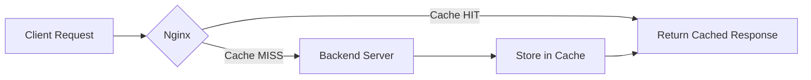

# How to Use Ansible to Configure Caching with Nginx

Author: [nawazdhandala](https://www.github.com/nawazdhandala)

Tags: Ansible, Nginx, Caching, Performance, DevOps

Description: Automate Nginx proxy caching and static asset caching configuration with Ansible to improve web application performance across your infrastructure.

---

Caching is one of the simplest and most effective ways to improve web application performance. Nginx has powerful built-in caching capabilities that can dramatically reduce load on your backend servers. But configuring caching correctly across a fleet of servers requires precision, and that is where Ansible comes in.

This post walks through building an Ansible role that sets up both proxy caching (for dynamic content from backend servers) and static asset caching (using browser cache headers) in Nginx.

## How Nginx Caching Works

Nginx supports two main caching mechanisms:

**Proxy cache**: Nginx stores responses from backend servers on disk. When the same URL is requested again within the cache validity period, Nginx serves the cached response without hitting the backend. This is configured with `proxy_cache_path` and `proxy_cache` directives.

**Browser cache**: Nginx sends `Cache-Control` and `Expires` headers to tell the client's browser to cache static assets locally. This is configured with the `expires` directive.



## Project Structure

```
nginx-caching/
  inventory/
    hosts.yml
  roles/
    nginx_cache/
      tasks/
        main.yml
      templates/
        cache_zone.conf.j2
        cached_site.conf.j2
      defaults/
        main.yml
      handlers/
        main.yml
  playbook.yml
```

## Default Variables

These defaults cover the most common caching scenarios. The proxy cache stores up to 1GB of cached content, and static assets get a 30-day browser cache lifetime.

```yaml
# roles/nginx_cache/defaults/main.yml
# Proxy cache settings
nginx_cache_path: "/var/cache/nginx"
nginx_cache_zone_name: "app_cache"
nginx_cache_zone_size: "10m"
nginx_cache_max_size: "1g"
nginx_cache_inactive: "60m"
nginx_cache_valid_200: "10m"
nginx_cache_valid_404: "1m"
nginx_cache_use_stale:
  - error
  - timeout
  - updating
  - http_500
  - http_502
  - http_503
  - http_504

# Static asset browser cache settings
nginx_static_cache_expires: "30d"
nginx_static_extensions:
  - jpg
  - jpeg
  - png
  - gif
  - ico
  - css
  - js
  - woff
  - woff2
  - ttf
  - svg

# Backend settings
nginx_cache_backend: "127.0.0.1:8080"
nginx_cache_server_name: "example.com"

# Paths to bypass cache (e.g., admin panels, user-specific content)
nginx_cache_bypass_paths:
  - "/admin"
  - "/account"
  - "/api/auth"

# Cache purge support
nginx_cache_purge_enabled: false
nginx_cache_purge_allowed_ips:
  - "127.0.0.1"
  - "10.0.0.0/8"
```

## Cache Zone Configuration Template

This template defines the cache zone at the http level. It must be included before any server blocks that use it.

```nginx
# roles/nginx_cache/templates/cache_zone.conf.j2
# Proxy cache zone definition
# levels=1:2 creates a two-level directory hierarchy for cache files
# keys_zone stores cache keys in shared memory for fast lookups
proxy_cache_path {{ nginx_cache_path }}
    levels=1:2
    keys_zone={{ nginx_cache_zone_name }}:{{ nginx_cache_zone_size }}
    max_size={{ nginx_cache_max_size }}
    inactive={{ nginx_cache_inactive }}
    use_temp_path=off;

# Cache key includes scheme, host, and URI with query string
proxy_cache_key "$scheme$request_method$host$request_uri";

# Add header to show cache status in responses (useful for debugging)
add_header X-Cache-Status $upstream_cache_status always;
```

## Site Configuration Template

This is the server block template with both proxy caching and static asset caching configured.

```nginx
# roles/nginx_cache/templates/cached_site.conf.j2
server {
    listen 80;
    server_name {{ nginx_cache_server_name }};

    # Static assets with browser caching
    location ~* \.({{ nginx_static_extensions | join('|') }})$ {
        proxy_pass http://{{ nginx_cache_backend }};
        proxy_set_header Host $host;

        # Tell browsers to cache these files
        expires {{ nginx_static_cache_expires }};
        add_header Cache-Control "public, immutable";
        add_header X-Cache-Status $upstream_cache_status always;

        # Also cache at the proxy level
        proxy_cache {{ nginx_cache_zone_name }};
        proxy_cache_valid 200 {{ nginx_static_cache_expires }};
    }


    # No caching for {{ bypass_path }}
    location {{ bypass_path }} {
        proxy_pass http://{{ nginx_cache_backend }};
        proxy_set_header Host $host;
        proxy_set_header X-Real-IP $remote_addr;
        proxy_set_header X-Forwarded-For $proxy_add_x_forwarded_for;

        # Explicitly disable caching for this path
        proxy_no_cache 1;
        proxy_cache_bypass 1;
        add_header X-Cache-Status "BYPASS" always;
    }



    # Cache purge endpoint
    location ~ /purge(/.*) {

        allow {{ ip }};

        deny all;
        proxy_cache_purge {{ nginx_cache_zone_name }} "$scheme$request_method$host$1";
    }


    # Default location with proxy caching
    location / {
        proxy_pass http://{{ nginx_cache_backend }};
        proxy_set_header Host $host;
        proxy_set_header X-Real-IP $remote_addr;
        proxy_set_header X-Forwarded-For $proxy_add_x_forwarded_for;
        proxy_set_header X-Forwarded-Proto $scheme;

        # Enable proxy caching
        proxy_cache {{ nginx_cache_zone_name }};
        proxy_cache_valid 200 {{ nginx_cache_valid_200 }};
        proxy_cache_valid 404 {{ nginx_cache_valid_404 }};

        # Serve stale content when backend is unavailable
        proxy_cache_use_stale {{ nginx_cache_use_stale | join(' ') }};

        # Allow only one request to populate cache for same URL
        proxy_cache_lock on;
        proxy_cache_lock_timeout 5s;

        # Skip cache for requests with cookies or auth headers
        proxy_cache_bypass $http_authorization $cookie_session;
        proxy_no_cache $http_authorization $cookie_session;
    }
}
```

## Ansible Tasks

```yaml
# roles/nginx_cache/tasks/main.yml
---
- name: Install Nginx
  ansible.builtin.apt:
    name: nginx
    state: present
    update_cache: yes
  become: true

- name: Create cache directory
  ansible.builtin.file:
    path: "{{ nginx_cache_path }}"
    state: directory
    owner: www-data
    group: www-data
    mode: "0755"
  become: true

- name: Deploy cache zone configuration
  ansible.builtin.template:
    src: cache_zone.conf.j2
    dest: /etc/nginx/conf.d/cache_zone.conf
    owner: root
    group: root
    mode: "0644"
  become: true
  notify: Validate and reload nginx

- name: Deploy cached site configuration
  ansible.builtin.template:
    src: cached_site.conf.j2
    dest: /etc/nginx/sites-available/cached_site.conf
    owner: root
    group: root
    mode: "0644"
  become: true
  notify: Validate and reload nginx

- name: Enable cached site
  ansible.builtin.file:
    src: /etc/nginx/sites-available/cached_site.conf
    dest: /etc/nginx/sites-enabled/cached_site.conf
    state: link
  become: true
  notify: Validate and reload nginx

- name: Remove default Nginx site
  ansible.builtin.file:
    path: /etc/nginx/sites-enabled/default
    state: absent
  become: true
  notify: Validate and reload nginx

- name: Ensure Nginx is running
  ansible.builtin.systemd:
    name: nginx
    state: started
    enabled: true
  become: true

- name: Set up cache purge cron job
  ansible.builtin.cron:
    name: "Clean expired nginx cache"
    minute: "0"
    hour: "3"
    job: "find {{ nginx_cache_path }} -type f -mmin +{{ (nginx_cache_inactive | regex_replace('[^0-9]', '') | int) * 2 }} -delete 2>/dev/null"
    user: root
  become: true
```

## Handlers

```yaml
# roles/nginx_cache/handlers/main.yml
---
- name: Validate and reload nginx
  ansible.builtin.command: nginx -t
  become: true
  changed_when: false
  notify: Reload nginx

- name: Reload nginx
  ansible.builtin.systemd:
    name: nginx
    state: reloaded
  become: true
```

## The Playbook

```yaml
# playbook.yml
---
- name: Configure Nginx caching
  hosts: webservers
  become: true
  vars:
    nginx_cache_server_name: "myapp.com"
    nginx_cache_backend: "10.0.1.5:3000"
    nginx_cache_valid_200: "30m"
    nginx_cache_purge_enabled: true
  roles:
    - nginx_cache
```

## Running and Verifying

```bash
# Deploy the caching configuration
ansible-playbook -i inventory/hosts.yml playbook.yml

# Verify cache is working by checking the X-Cache-Status header
curl -I http://myapp.com/
# First request: X-Cache-Status: MISS
# Second request: X-Cache-Status: HIT

# Check cache directory is populated
ls -la /var/cache/nginx/
```

## Monitoring Cache Performance

You can check cache hit rates by analyzing the `X-Cache-Status` header in access logs:

```bash
# Count cache hits vs misses from the last 1000 requests
awk '{print $NF}' /var/log/nginx/access.log | tail -1000 | sort | uniq -c | sort -rn
```

The `X-Cache-Status` header returns these values: `HIT` (served from cache), `MISS` (fetched from backend and cached), `EXPIRED` (cache entry expired, refreshed from backend), `STALE` (served stale content because backend was unavailable), and `BYPASS` (caching was skipped).

## Summary

Automating Nginx caching with Ansible ensures consistent cache configuration across all your web servers. The combination of proxy caching for dynamic content and browser caching for static assets can dramatically reduce backend load and improve response times. The bypass paths and cookie-based cache skipping ensure that user-specific and admin content is never served from cache. With the `X-Cache-Status` header in place, you always have visibility into whether caching is working as expected.
