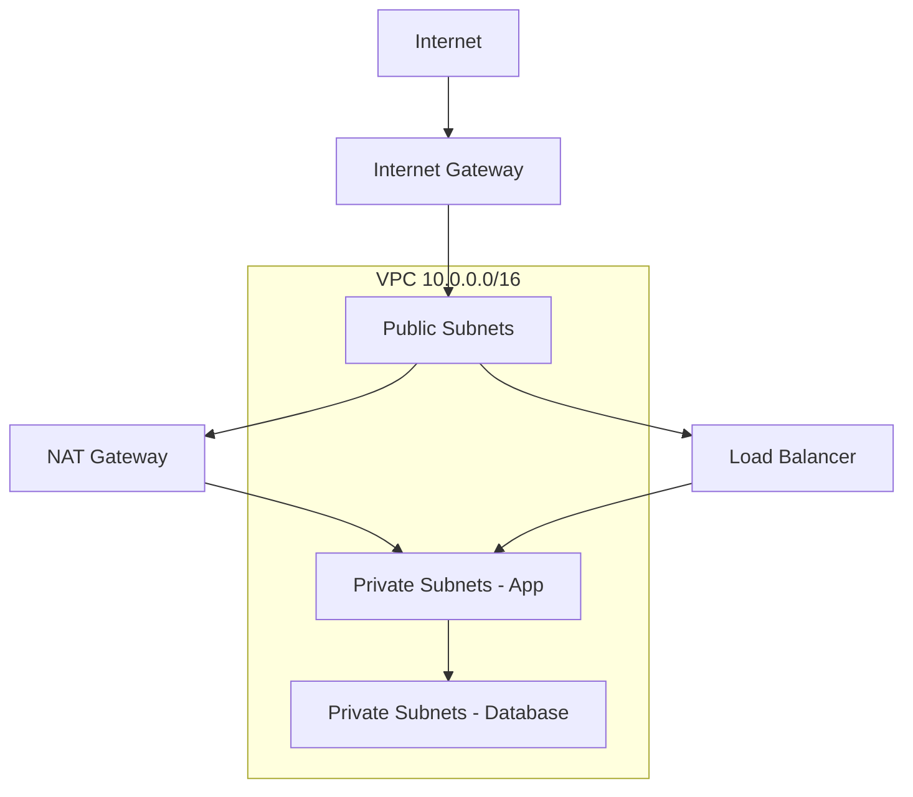

# How to Use Ansible to Configure Cloud Networking

Author: [nawazdhandala](https://www.github.com/nawazdhandala)

Tags: Ansible, Cloud Networking, VPC, Subnets, Network Security

Description: Configure cloud networking across AWS, Azure, and GCP with Ansible including VPCs, subnets, route tables, and peering connections.

---

Cloud networking is the foundation that everything else sits on. Get it wrong and you will spend weeks debugging connectivity issues, security gaps, and routing problems. Get it right and your infrastructure just works. Ansible lets you define your entire cloud network topology as code, making it repeatable, auditable, and version-controlled.

This guide covers configuring VPCs, subnets, route tables, peering connections, and network security across AWS, Azure, and GCP.

## Network Design Principles

Before writing playbooks, plan your network. Here is a typical production design.



## AWS VPC Configuration

### Creating a Complete VPC

```yaml
# playbooks/aws-networking.yml
---
- name: Configure AWS VPC networking
  hosts: localhost
  gather_facts: false

  vars:
    aws_region: us-east-1
    vpc_cidr: 10.0.0.0/16
    project: myapp
    env: production
    azs:
      - us-east-1a
      - us-east-1b
      - us-east-1c

  tasks:
    # Create the VPC
    - name: Create VPC
      amazon.aws.ec2_vpc_net:
        name: "{{ project }}-{{ env }}-vpc"
        cidr_block: "{{ vpc_cidr }}"
        region: "{{ aws_region }}"
        dns_support: true
        dns_hostnames: true
        tags:
          Project: "{{ project }}"
          Environment: "{{ env }}"
        state: present
      register: vpc

    # Create public subnets across AZs
    - name: Create public subnets
      amazon.aws.ec2_vpc_subnet:
        vpc_id: "{{ vpc.vpc.id }}"
        cidr: "10.0.{{ idx }}.0/24"
        az: "{{ item }}"
        region: "{{ aws_region }}"
        map_public: true
        tags:
          Name: "{{ project }}-{{ env }}-public-{{ idx }}"
          Tier: public
        state: present
      loop: "{{ azs }}"
      loop_control:
        index_var: idx
        label: "{{ item }}"
      register: public_subnets

    # Create private subnets for application tier
    - name: Create private app subnets
      amazon.aws.ec2_vpc_subnet:
        vpc_id: "{{ vpc.vpc.id }}"
        cidr: "10.0.{{ idx + 10 }}.0/24"
        az: "{{ item }}"
        region: "{{ aws_region }}"
        tags:
          Name: "{{ project }}-{{ env }}-private-app-{{ idx }}"
          Tier: private-app
        state: present
      loop: "{{ azs }}"
      loop_control:
        index_var: idx
        label: "{{ item }}"
      register: private_app_subnets

    # Create private subnets for database tier
    - name: Create private database subnets
      amazon.aws.ec2_vpc_subnet:
        vpc_id: "{{ vpc.vpc.id }}"
        cidr: "10.0.{{ idx + 20 }}.0/24"
        az: "{{ item }}"
        region: "{{ aws_region }}"
        tags:
          Name: "{{ project }}-{{ env }}-private-db-{{ idx }}"
          Tier: private-db
        state: present
      loop: "{{ azs }}"
      loop_control:
        index_var: idx
        label: "{{ item }}"
      register: private_db_subnets

    # Create Internet Gateway
    - name: Create Internet Gateway
      amazon.aws.ec2_vpc_igw:
        vpc_id: "{{ vpc.vpc.id }}"
        region: "{{ aws_region }}"
        tags:
          Name: "{{ project }}-{{ env }}-igw"
        state: present
      register: igw

    # Create NAT Gateway in first public subnet
    - name: Allocate Elastic IP for NAT Gateway
      amazon.aws.ec2_eip:
        region: "{{ aws_region }}"
        in_vpc: true
        tags:
          Name: "{{ project }}-{{ env }}-nat-eip"
        state: present
      register: nat_eip

    - name: Create NAT Gateway
      amazon.aws.ec2_vpc_nat_gateway:
        subnet_id: "{{ public_subnets.results[0].subnet.id }}"
        eip_address: "{{ nat_eip.public_ip }}"
        region: "{{ aws_region }}"
        tags:
          Name: "{{ project }}-{{ env }}-nat-gw"
        state: present
        wait: true
      register: nat_gw

    # Create route table for public subnets
    - name: Create public route table
      amazon.aws.ec2_vpc_route_table:
        vpc_id: "{{ vpc.vpc.id }}"
        region: "{{ aws_region }}"
        tags:
          Name: "{{ project }}-{{ env }}-public-rt"
        subnets: "{{ public_subnets.results | map(attribute='subnet.id') | list }}"
        routes:
          - dest: 0.0.0.0/0
            gateway_id: "{{ igw.gateway_id }}"
        state: present

    # Create route table for private subnets
    - name: Create private route table
      amazon.aws.ec2_vpc_route_table:
        vpc_id: "{{ vpc.vpc.id }}"
        region: "{{ aws_region }}"
        tags:
          Name: "{{ project }}-{{ env }}-private-rt"
        subnets: "{{ (private_app_subnets.results + private_db_subnets.results) | map(attribute='subnet.id') | list }}"
        routes:
          - dest: 0.0.0.0/0
            nat_gateway_id: "{{ nat_gw.nat_gateway_id }}"
        state: present
```

### Network ACLs

```yaml
# playbooks/aws-nacls.yml
---
- name: Configure Network ACLs
  hosts: localhost
  gather_facts: false

  tasks:
    # Create a restrictive NACL for the database tier
    - name: Create database NACL
      amazon.aws.ec2_vpc_nacl:
        vpc_id: "{{ vpc_id }}"
        name: "{{ project }}-{{ env }}-db-nacl"
        region: "{{ aws_region }}"
        subnets: "{{ db_subnet_ids }}"
        ingress:
          # Allow PostgreSQL from app subnets
          - [100, 'tcp', 'allow', '10.0.10.0/24', null, null, 5432, 5432]
          - [110, 'tcp', 'allow', '10.0.11.0/24', null, null, 5432, 5432]
          - [120, 'tcp', 'allow', '10.0.12.0/24', null, null, 5432, 5432]
          # Allow SSH from management subnet
          - [200, 'tcp', 'allow', '10.0.0.0/24', null, null, 22, 22]
          # Allow return traffic
          - [900, 'tcp', 'allow', '10.0.0.0/16', null, null, 1024, 65535]
        egress:
          # Allow all outbound to VPC
          - [100, 'tcp', 'allow', '10.0.0.0/16', null, null, null, null]
          # Allow HTTPS out for updates
          - [200, 'tcp', 'allow', '0.0.0.0/0', null, null, 443, 443]
        tags:
          Name: "{{ project }}-{{ env }}-db-nacl"
        state: present
```

### VPC Peering

```yaml
# playbooks/aws-vpc-peering.yml
---
- name: Configure VPC peering
  hosts: localhost
  gather_facts: false

  tasks:
    # Create peering connection between production and management VPCs
    - name: Create VPC peering connection
      amazon.aws.ec2_vpc_peer:
        vpc_id: "{{ prod_vpc_id }}"
        peer_vpc_id: "{{ mgmt_vpc_id }}"
        region: "{{ aws_region }}"
        tags:
          Name: prod-to-mgmt-peering
        state: present
      register: peering

    # Accept the peering connection
    - name: Accept VPC peering connection
      amazon.aws.ec2_vpc_peer:
        peering_id: "{{ peering.peering_id }}"
        region: "{{ aws_region }}"
        state: accept

    # Add routes for peering
    - name: Add peering route to prod route table
      amazon.aws.ec2_vpc_route_table:
        vpc_id: "{{ prod_vpc_id }}"
        region: "{{ aws_region }}"
        route_table_id: "{{ prod_private_rt_id }}"
        routes:
          - dest: "{{ mgmt_vpc_cidr }}"
            vpc_peering_connection_id: "{{ peering.peering_id }}"
        purge_routes: false
        state: present
```

## Azure Virtual Network Configuration

```yaml
# playbooks/azure-networking.yml
---
- name: Configure Azure networking
  hosts: localhost
  gather_facts: false

  vars:
    resource_group: networking-rg
    location: eastus
    project: myapp
    env: production

  tasks:
    # Create resource group
    - name: Create networking resource group
      azure.azcollection.azure_rm_resourcegroup:
        name: "{{ resource_group }}"
        location: "{{ location }}"
        state: present

    # Create VNet
    - name: Create Virtual Network
      azure.azcollection.azure_rm_virtualnetwork:
        resource_group: "{{ resource_group }}"
        name: "{{ project }}-{{ env }}-vnet"
        address_prefixes: "10.1.0.0/16"
        state: present

    # Create subnets
    - name: Create public subnet
      azure.azcollection.azure_rm_subnet:
        resource_group: "{{ resource_group }}"
        virtual_network_name: "{{ project }}-{{ env }}-vnet"
        name: public-subnet
        address_prefix_cidr: "10.1.0.0/24"
        state: present

    - name: Create app subnet
      azure.azcollection.azure_rm_subnet:
        resource_group: "{{ resource_group }}"
        virtual_network_name: "{{ project }}-{{ env }}-vnet"
        name: app-subnet
        address_prefix_cidr: "10.1.1.0/24"
        service_endpoints:
          - service: Microsoft.Sql
          - service: Microsoft.Storage
        state: present

    - name: Create database subnet
      azure.azcollection.azure_rm_subnet:
        resource_group: "{{ resource_group }}"
        virtual_network_name: "{{ project }}-{{ env }}-vnet"
        name: db-subnet
        address_prefix_cidr: "10.1.2.0/24"
        delegations:
          - name: db-delegation
            serviceName: Microsoft.DBforPostgreSQL/flexibleServers
        state: present

    # Create Network Security Groups
    - name: Create web NSG
      azure.azcollection.azure_rm_securitygroup:
        resource_group: "{{ resource_group }}"
        name: "{{ project }}-web-nsg"
        rules:
          - name: AllowHTTP
            protocol: Tcp
            destination_port_range: 80
            access: Allow
            priority: 100
            direction: Inbound
          - name: AllowHTTPS
            protocol: Tcp
            destination_port_range: 443
            access: Allow
            priority: 110
            direction: Inbound
        state: present
```

## GCP VPC Configuration

```yaml
# playbooks/gcp-networking.yml
---
- name: Configure GCP networking
  hosts: localhost
  gather_facts: false

  vars:
    gcp_project: my-project-id
    gcp_auth_kind: serviceaccount
    gcp_service_account_file: /path/to/sa-key.json

  tasks:
    # Create custom VPC
    - name: Create VPC network
      google.cloud.gcp_compute_network:
        name: myapp-prod-vpc
        auto_create_subnetworks: false
        project: "{{ gcp_project }}"
        auth_kind: "{{ gcp_auth_kind }}"
        service_account_file: "{{ gcp_service_account_file }}"
        state: present
      register: vpc

    # Create subnets in specific regions
    - name: Create US subnet
      google.cloud.gcp_compute_subnetwork:
        name: myapp-us-subnet
        network: "{{ vpc }}"
        ip_cidr_range: 10.2.0.0/20
        region: us-central1
        private_ip_google_access: true
        project: "{{ gcp_project }}"
        auth_kind: "{{ gcp_auth_kind }}"
        service_account_file: "{{ gcp_service_account_file }}"
        state: present

    # Create firewall rules
    - name: Allow internal traffic
      google.cloud.gcp_compute_firewall:
        name: myapp-allow-internal
        network: "{{ vpc }}"
        allowed:
          - ip_protocol: tcp
            ports: ['0-65535']
          - ip_protocol: udp
            ports: ['0-65535']
          - ip_protocol: icmp
        source_ranges: ['10.2.0.0/16']
        project: "{{ gcp_project }}"
        auth_kind: "{{ gcp_auth_kind }}"
        service_account_file: "{{ gcp_service_account_file }}"
        state: present

    # Create Cloud NAT for private instances
    - name: Create Cloud Router
      google.cloud.gcp_compute_router:
        name: myapp-router
        network: "{{ vpc }}"
        region: us-central1
        project: "{{ gcp_project }}"
        auth_kind: "{{ gcp_auth_kind }}"
        service_account_file: "{{ gcp_service_account_file }}"
        state: present
      register: router
```

## Security Group Management

Security groups are the primary network security tool across all providers.

```yaml
# playbooks/security-groups.yml
---
- name: Configure security groups across providers
  hosts: localhost
  gather_facts: false

  vars:
    security_rules:
      web:
        ingress:
          - { port: 80, source: "0.0.0.0/0", description: "HTTP" }
          - { port: 443, source: "0.0.0.0/0", description: "HTTPS" }
        egress:
          - { port: "all", destination: "0.0.0.0/0", description: "All outbound" }
      app:
        ingress:
          - { port: 8080, source: "10.0.0.0/24", description: "From web tier" }
          - { port: 22, source: "10.0.100.0/24", description: "SSH from bastion" }
        egress:
          - { port: 5432, destination: "10.0.20.0/24", description: "To database" }
          - { port: 443, destination: "0.0.0.0/0", description: "HTTPS out" }
      database:
        ingress:
          - { port: 5432, source: "10.0.10.0/24", description: "PostgreSQL from app" }
        egress:
          - { port: 443, destination: "0.0.0.0/0", description: "Updates only" }

  tasks:
    # Create AWS security groups
    - name: Create AWS security groups
      amazon.aws.ec2_security_group:
        name: "{{ project }}-{{ item.key }}-sg"
        description: "{{ item.key }} tier security group"
        vpc_id: "{{ vpc_id }}"
        region: "{{ aws_region }}"
        rules: "{{ item.value.ingress | map('combine', {'proto': 'tcp'}) | list }}"
        state: present
      loop: "{{ security_rules | dict2items }}"
      loop_control:
        label: "{{ item.key }}"
```

## Practical Networking Tips

1. **Plan CIDR blocks carefully.** Overlapping CIDRs prevent VPC peering and VPN connectivity. Use a spreadsheet to track all CIDR allocations across environments and providers.
2. **Use private subnets by default.** Only put resources in public subnets if they truly need direct internet-facing access. Everything else goes behind a NAT gateway.
3. **Tag subnets by purpose.** Tags on subnets help other automation tools (like Kubernetes or Terraform) find the right subnet for their resources.
4. **NAT gateways are not cheap.** AWS NAT gateways cost money for both the gateway itself and the data processed. For high-bandwidth applications, consider alternatives like NAT instances or VPC endpoints.
5. **Security groups are stateful, NACLs are not.** Understand the difference. Security groups automatically allow return traffic. NACLs require explicit rules for both directions.
6. **Document your network design.** Keep a diagram (Mermaid works great in Git) showing your VPCs, subnets, peering connections, and VPNs. Update it every time you change the network.

Cloud networking with Ansible gives you infrastructure-as-code for the layer that everything depends on. Changes become pull requests, configurations become reproducible, and your network architecture becomes a documented artifact rather than tribal knowledge.
