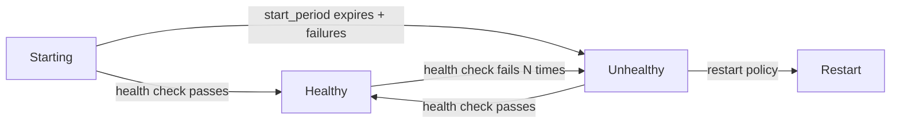

# How to Use Ansible to Configure Container Health Checks

Author: [nawazdhandala](https://www.github.com/nawazdhandala)

Tags: Ansible, Docker, Health Checks, Monitoring, Containers

Description: Configure Docker container health checks with Ansible to automatically detect and recover from unhealthy container states.

---

Health checks tell Docker whether your container's application is actually working, not just whether the process is running. A container can be "running" with a healthy PID while the application inside is deadlocked, out of memory, or unable to connect to its database. Health checks catch these situations and enable automatic recovery through container restarts.

Ansible lets you define health check configurations as part of your container deployment, ensuring every container runs with appropriate monitoring.

## How Docker Health Checks Work

Docker executes a command inside the container at regular intervals. Based on the exit code, the container is classified as healthy (exit 0), unhealthy (exit 1), or starting (during the start period).



## Basic HTTP Health Check

```yaml
# roles/container_health/tasks/http_check.yml
# Deploy container with HTTP health check
- name: Deploy web application with health check
  community.docker.docker_container:
    name: "{{ app_name }}"
    image: "{{ app_image }}:{{ app_version }}"
    state: started
    restart_policy: unless-stopped
    ports:
      - "{{ app_port }}:8080"
    healthcheck:
      test: ["CMD", "curl", "-f", "http://localhost:8080/health"]
      interval: 30s
      timeout: 10s
      retries: 3
      start_period: 60s
```

## Custom Health Check Scripts

For applications without HTTP endpoints, use a custom script:

```yaml
# roles/container_health/tasks/script_check.yml
# Deploy container with custom health check script
- name: Deploy health check script
  ansible.builtin.template:
    src: healthcheck.sh.j2
    dest: "{{ app_dir }}/healthcheck.sh"
    mode: '0755'

- name: Deploy container with script-based health check
  community.docker.docker_container:
    name: "{{ app_name }}"
    image: "{{ app_image }}"
    state: started
    volumes:
      - "{{ app_dir }}/healthcheck.sh:/healthcheck.sh:ro"
    healthcheck:
      test: ["CMD", "/healthcheck.sh"]
      interval: 15s
      timeout: 5s
      retries: 5
      start_period: 30s
```

```bash
#!/bin/bash
# roles/container_health/templates/healthcheck.sh.j2
# Custom health check script that validates application state

# Check if the application process is running
if ! pgrep -f "{{ app_process_name }}" > /dev/null; then
    echo "Application process not running"
    exit 1
fi

# Check if the application port is listening
if ! nc -z 127.0.0.1 {{ app_port }} 2>/dev/null; then
    echo "Application port {{ app_port }} not listening"
    exit 1
fi

# Check database connectivity
if ! {{ app_dir }}/bin/check-db-connection 2>/dev/null; then
    echo "Database connection failed"
    exit 1
fi

echo "All health checks passed"
exit 0
```

## Database Health Checks

```yaml
# roles/container_health/tasks/database_checks.yml
# Health checks for database containers
- name: Deploy PostgreSQL with health check
  community.docker.docker_container:
    name: postgres
    image: "postgres:{{ pg_version }}"
    state: started
    restart_policy: unless-stopped
    env:
      POSTGRES_DB: "{{ db_name }}"
      POSTGRES_USER: "{{ db_user }}"
      POSTGRES_PASSWORD: "{{ db_password }}"
    healthcheck:
      test: ["CMD-SHELL", "pg_isready -U {{ db_user }} -d {{ db_name }}"]
      interval: 10s
      timeout: 5s
      retries: 5
      start_period: 30s
    volumes:
      - "pgdata:/var/lib/postgresql/data"

- name: Deploy Redis with health check
  community.docker.docker_container:
    name: redis
    image: "redis:7-alpine"
    state: started
    restart_policy: unless-stopped
    healthcheck:
      test: ["CMD", "redis-cli", "ping"]
      interval: 10s
      timeout: 3s
      retries: 3
```

## Monitoring Health Check Status

```yaml
# roles/container_health/tasks/monitor.yml
# Monitor container health check status
- name: Get container health status
  community.docker.docker_container_info:
    name: "{{ item }}"
  register: container_info
  loop: "{{ monitored_containers }}"

- name: Report unhealthy containers
  ansible.builtin.debug:
    msg: "WARNING: {{ item.item }} is {{ item.container.State.Health.Status }}"
  loop: "{{ container_info.results }}"
  when: item.container.State.Health.Status != 'healthy'
  loop_control:
    label: "{{ item.item }}"

- name: Fail if critical containers are unhealthy
  ansible.builtin.assert:
    that:
      - item.container.State.Health.Status == 'healthy'
    fail_msg: "Critical container {{ item.item }} is unhealthy"
  loop: "{{ container_info.results }}"
  when: item.item in critical_containers
  loop_control:
    label: "{{ item.item }}"
```

## Compose with Health Checks

```yaml
# roles/container_health/templates/docker-compose.yml.j2
# Docker Compose with health checks and dependency ordering
services:
  db:
    image: postgres:16
    healthcheck:
      test: ["CMD-SHELL", "pg_isready"]
      interval: 10s
      timeout: 5s
      retries: 5

  redis:
    image: redis:7-alpine
    healthcheck:
      test: ["CMD", "redis-cli", "ping"]
      interval: 10s
      timeout: 3s
      retries: 3

  app:
    image: {{ app_image }}:{{ app_version }}
    depends_on:
      db:
        condition: service_healthy
      redis:
        condition: service_healthy
    healthcheck:
      test: ["CMD", "curl", "-f", "http://localhost:8080/health"]
      interval: 30s
      timeout: 10s
      retries: 3
      start_period: 60s
```


## Common Use Cases

Here are several practical scenarios where this module proves essential in real-world playbooks.

### Infrastructure Provisioning Workflow

```yaml
# Complete workflow incorporating this module
- name: Infrastructure provisioning
  hosts: all
  become: true
  gather_facts: true
  tasks:
    - name: Gather system information
      ansible.builtin.setup:
        gather_subset:
          - hardware
          - network

    - name: Display system summary
      ansible.builtin.debug:
        msg: >-
          Host {{ inventory_hostname }} has
          {{ ansible_memtotal_mb }}MB RAM,
          {{ ansible_processor_vcpus }} vCPUs,
          running {{ ansible_distribution }} {{ ansible_distribution_version }}

    - name: Install required packages
      ansible.builtin.package:
        name:
          - curl
          - wget
          - git
          - vim
          - htop
          - jq
        state: present

    - name: Configure system timezone
      ansible.builtin.timezone:
        name: "{{ system_timezone | default('UTC') }}"

    - name: Configure hostname
      ansible.builtin.hostname:
        name: "{{ inventory_hostname }}"

    - name: Update /etc/hosts
      ansible.builtin.lineinfile:
        path: /etc/hosts
        regexp: '^127\.0\.1\.1'
        line: "127.0.1.1 {{ inventory_hostname }}"

    - name: Configure SSH hardening
      ansible.builtin.lineinfile:
        path: /etc/ssh/sshd_config
        regexp: "{{ item.regexp }}"
        line: "{{ item.line }}"
      loop:
        - { regexp: '^PermitRootLogin', line: 'PermitRootLogin no' }
        - { regexp: '^PasswordAuthentication', line: 'PasswordAuthentication no' }
      notify: restart sshd

    - name: Configure firewall rules
      community.general.ufw:
        rule: allow
        port: "{{ item }}"
        proto: tcp
      loop:
        - "22"
        - "80"
        - "443"

    - name: Enable firewall
      community.general.ufw:
        state: enabled
        policy: deny

  handlers:
    - name: restart sshd
      ansible.builtin.service:
        name: sshd
        state: restarted
```

### Integration with Monitoring

```yaml
# Using gathered facts to configure monitoring thresholds
- name: Configure monitoring based on system specs
  hosts: all
  become: true
  tasks:
    - name: Set monitoring thresholds based on hardware
      ansible.builtin.template:
        src: monitoring_config.yml.j2
        dest: /etc/monitoring/config.yml
      vars:
        memory_warning_threshold: "{{ (ansible_memtotal_mb * 0.8) | int }}"
        memory_critical_threshold: "{{ (ansible_memtotal_mb * 0.95) | int }}"
        cpu_warning_threshold: 80
        cpu_critical_threshold: 95

    - name: Register host with monitoring system
      ansible.builtin.uri:
        url: "https://monitoring.example.com/api/hosts"
        method: POST
        body_format: json
        body:
          hostname: "{{ inventory_hostname }}"
          ip_address: "{{ ansible_default_ipv4.address }}"
          os: "{{ ansible_distribution }}"
          memory_mb: "{{ ansible_memtotal_mb }}"
          cpus: "{{ ansible_processor_vcpus }}"
        headers:
          Authorization: "Bearer {{ monitoring_api_token }}"
        status_code: [200, 201, 409]
```

### Error Handling Patterns

```yaml
# Robust error handling with this module
- name: Robust task execution
  hosts: all
  tasks:
    - name: Attempt primary operation
      ansible.builtin.command: /opt/app/primary-task.sh
      register: primary_result
      failed_when: false

    - name: Handle primary failure with fallback
      ansible.builtin.command: /opt/app/fallback-task.sh
      when: primary_result.rc != 0
      register: fallback_result

    - name: Report final status
      ansible.builtin.debug:
        msg: >-
          Task completed via {{ 'primary' if primary_result.rc == 0 else 'fallback' }} path.
          Return code: {{ primary_result.rc if primary_result.rc == 0 else fallback_result.rc }}

    - name: Fail if both paths failed
      ansible.builtin.fail:
        msg: "Both primary and fallback operations failed"
      when:
        - primary_result.rc != 0
        - fallback_result is defined
        - fallback_result.rc != 0
```

### Scheduling and Automation

```yaml
# Set up scheduled compliance scans using cron
- name: Configure automated scans
  hosts: all
  become: true
  tasks:
    - name: Create scan script
      ansible.builtin.copy:
        dest: /opt/scripts/compliance_scan.sh
        mode: '0755'
        content: |
          #!/bin/bash
          cd /opt/ansible
          ansible-playbook playbooks/validate.yml -i inventory/ > /var/log/compliance_scan.log 2>&1
          EXIT_CODE=$?
          if [ $EXIT_CODE -ne 0 ]; then
            curl -X POST https://hooks.example.com/alert \
              -H "Content-Type: application/json" \
              -d "{\"text\":\"Compliance scan failed on $(hostname)\"}"
          fi
          exit $EXIT_CODE

    - name: Schedule weekly compliance scan
      ansible.builtin.cron:
        name: "Weekly compliance scan"
        minute: "0"
        hour: "3"
        weekday: "1"
        job: "/opt/scripts/compliance_scan.sh"
        user: ansible
```


## Conclusion

Container health checks are a simple but powerful mechanism for keeping your applications running. By configuring them through Ansible, you ensure every container in your fleet has appropriate health monitoring. Combine HTTP checks for web services, CLI tools for databases, and custom scripts for complex applications. Use dependency ordering in Docker Compose to ensure containers only start when their dependencies are truly ready, not just running.
