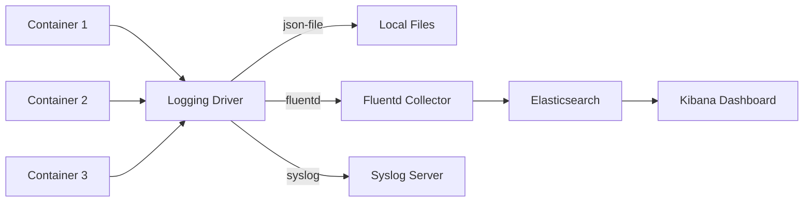

# How to Use Ansible to Configure Container Logging

Author: [nawazdhandala](https://www.github.com/nawazdhandala)

Tags: Ansible, Docker, Logging, ELK Stack, DevOps

Description: Set up centralized container logging with Ansible using Docker logging drivers, Fluentd, and ELK stack for comprehensive log management.

---

Container logs are your primary debugging tool when something goes wrong in production. By default, Docker stores logs on the host filesystem, but in a multi-host environment you need centralized logging. Ansible lets you configure Docker's logging drivers, deploy log collectors like Fluentd, and set up the entire logging pipeline consistently across your infrastructure.

## Docker Logging Architecture



## Configuring the Docker Logging Driver

```yaml
# roles/container_logging/tasks/docker_logging.yml
# Configure Docker daemon logging settings
- name: Configure Docker daemon logging driver
  ansible.builtin.template:
    src: daemon.json.j2
    dest: /etc/docker/daemon.json
    mode: '0644'
    backup: true
  notify: restart docker

- name: Ensure log directory exists
  ansible.builtin.file:
    path: "{{ docker_log_dir }}"
    state: directory
    mode: '0755'
```

```yaml
# roles/container_logging/templates/daemon.json.j2
# Docker daemon configuration with logging settings
{
  "log-driver": "{{ docker_log_driver }}",
  "log-opts": {
    "max-size": "{{ docker_log_max_size }}",
    "max-file": "{{ docker_log_max_file }}",
    "tag": "{{ docker_log_tag }}"
  }
}
```

```yaml
# defaults/main.yml
docker_log_driver: "json-file"
docker_log_max_size: "50m"
docker_log_max_file: "5"
docker_log_tag: "{{ '{{' }}.Name{{ '}}' }}/{{ '{{' }}.ID{{ '}}' }}"
docker_log_dir: "/var/log/docker"
```

## Deploying Fluentd as a Log Collector

```yaml
# roles/container_logging/tasks/fluentd.yml
# Deploy Fluentd as a centralized log collector
- name: Create Fluentd configuration directory
  ansible.builtin.file:
    path: /etc/fluentd
    state: directory
    mode: '0755'

- name: Deploy Fluentd configuration
  ansible.builtin.template:
    src: fluent.conf.j2
    dest: /etc/fluentd/fluent.conf
    mode: '0644'

- name: Run Fluentd container
  community.docker.docker_container:
    name: fluentd
    image: "fluent/fluentd:v1.16-1"
    state: started
    restart_policy: always
    ports:
      - "24224:24224"
      - "24224:24224/udp"
    volumes:
      - "/etc/fluentd/fluent.conf:/fluentd/etc/fluent.conf:ro"
      - "fluentd-buffer:/fluentd/buffer"
      - "/var/log/docker:/var/log/docker:ro"
    env:
      FLUENT_ELASTICSEARCH_HOST: "{{ elasticsearch_host }}"
      FLUENT_ELASTICSEARCH_PORT: "{{ elasticsearch_port | string }}"
```

```xml
# roles/container_logging/templates/fluent.conf.j2
# Fluentd configuration for container log collection

# Accept Docker logs via fluentd driver
<source>
  @type forward
  port 24224
  bind 0.0.0.0
</source>

# Parse Docker JSON logs
<filter docker.**>
  @type parser
  key_name log
  reserve_data true
  <parse>
    @type json
  </parse>
</filter>

# Add hostname metadata
<filter **>
  @type record_transformer
  <record>
    hostname {{ ansible_hostname }}
    environment {{ deploy_environment }}
  </record>
</filter>

# Send to Elasticsearch
<match **>
  @type elasticsearch
  host {{ elasticsearch_host }}
  port {{ elasticsearch_port }}
  index_name fluentd-${tag}-%Y%m%d
  <buffer tag, time>
    @type file
    path /fluentd/buffer/elasticsearch
    flush_interval 10s
    chunk_limit_size 8m
    retry_max_interval 30
    retry_forever true
  </buffer>
</match>
```

## Deploying Containers with Fluentd Logging

```yaml
# roles/container_logging/tasks/deploy_with_logging.yml
# Deploy containers configured to send logs to Fluentd
- name: Deploy application with Fluentd logging
  community.docker.docker_container:
    name: "{{ item.name }}"
    image: "{{ item.image }}"
    state: started
    log_driver: fluentd
    log_options:
      fluentd-address: "localhost:24224"
      fluentd-async: "true"
      fluentd-retry-wait: "1s"
      fluentd-max-retries: "30"
      tag: "docker.{{ item.name }}"
  loop: "{{ logged_containers }}"
  loop_control:
    label: "{{ item.name }}"
```

## Setting Up the ELK Stack

```yaml
# roles/container_logging/tasks/elk.yml
# Deploy Elasticsearch and Kibana for log storage and visualization
- name: Create Docker network for ELK
  community.docker.docker_network:
    name: elk
    state: present

- name: Deploy Elasticsearch
  community.docker.docker_container:
    name: elasticsearch
    image: "elasticsearch:{{ elk_version }}"
    state: started
    restart_policy: always
    networks:
      - name: elk
    ports:
      - "9200:9200"
    env:
      discovery.type: single-node
      ES_JAVA_OPTS: "-Xms{{ es_heap_size }} -Xmx{{ es_heap_size }}"
      xpack.security.enabled: "false"
    volumes:
      - "es-data:/usr/share/elasticsearch/data"
    memory: "{{ es_memory_limit }}"

- name: Wait for Elasticsearch to be ready
  ansible.builtin.uri:
    url: "http://127.0.0.1:9200/_cluster/health"
    status_code: 200
  register: es_health
  until: es_health.status == 200
  retries: 30
  delay: 10

- name: Deploy Kibana
  community.docker.docker_container:
    name: kibana
    image: "kibana:{{ elk_version }}"
    state: started
    restart_policy: always
    networks:
      - name: elk
    ports:
      - "5601:5601"
    env:
      ELASTICSEARCH_HOSTS: "http://elasticsearch:9200"
```

## Log Rotation and Cleanup

```yaml
# roles/container_logging/tasks/rotation.yml
# Configure log rotation for Docker container logs
- name: Deploy Docker log rotation config
  ansible.builtin.copy:
    dest: /etc/logrotate.d/docker-containers
    content: |
      /var/lib/docker/containers/*/*.log {
          daily
          rotate 7
          compress
          delaycompress
          missingok
          notifempty
          copytruncate
      }
    mode: '0644'

- name: Clean up old Elasticsearch indices
  ansible.builtin.uri:
    url: "http://{{ elasticsearch_host }}:{{ elasticsearch_port }}/fluentd-*-{{ item }}"
    method: DELETE
    status_code: [200, 404]
  loop: "{{ old_index_dates }}"
  when: cleanup_old_logs | default(false)
```


## Common Use Cases

Here are several practical scenarios where this module proves essential in real-world playbooks.

### Infrastructure Provisioning Workflow

```yaml
# Complete workflow incorporating this module
- name: Infrastructure provisioning
  hosts: all
  become: true
  gather_facts: true
  tasks:
    - name: Gather system information
      ansible.builtin.setup:
        gather_subset:
          - hardware
          - network

    - name: Display system summary
      ansible.builtin.debug:
        msg: >-
          Host {{ inventory_hostname }} has
          {{ ansible_memtotal_mb }}MB RAM,
          {{ ansible_processor_vcpus }} vCPUs,
          running {{ ansible_distribution }} {{ ansible_distribution_version }}

    - name: Install required packages
      ansible.builtin.package:
        name:
          - curl
          - wget
          - git
          - vim
          - htop
          - jq
        state: present

    - name: Configure system timezone
      ansible.builtin.timezone:
        name: "{{ system_timezone | default('UTC') }}"

    - name: Configure hostname
      ansible.builtin.hostname:
        name: "{{ inventory_hostname }}"

    - name: Update /etc/hosts
      ansible.builtin.lineinfile:
        path: /etc/hosts
        regexp: '^127\.0\.1\.1'
        line: "127.0.1.1 {{ inventory_hostname }}"

    - name: Configure SSH hardening
      ansible.builtin.lineinfile:
        path: /etc/ssh/sshd_config
        regexp: "{{ item.regexp }}"
        line: "{{ item.line }}"
      loop:
        - { regexp: '^PermitRootLogin', line: 'PermitRootLogin no' }
        - { regexp: '^PasswordAuthentication', line: 'PasswordAuthentication no' }
      notify: restart sshd

    - name: Configure firewall rules
      community.general.ufw:
        rule: allow
        port: "{{ item }}"
        proto: tcp
      loop:
        - "22"
        - "80"
        - "443"

    - name: Enable firewall
      community.general.ufw:
        state: enabled
        policy: deny

  handlers:
    - name: restart sshd
      ansible.builtin.service:
        name: sshd
        state: restarted
```

### Integration with Monitoring

```yaml
# Using gathered facts to configure monitoring thresholds
- name: Configure monitoring based on system specs
  hosts: all
  become: true
  tasks:
    - name: Set monitoring thresholds based on hardware
      ansible.builtin.template:
        src: monitoring_config.yml.j2
        dest: /etc/monitoring/config.yml
      vars:
        memory_warning_threshold: "{{ (ansible_memtotal_mb * 0.8) | int }}"
        memory_critical_threshold: "{{ (ansible_memtotal_mb * 0.95) | int }}"
        cpu_warning_threshold: 80
        cpu_critical_threshold: 95

    - name: Register host with monitoring system
      ansible.builtin.uri:
        url: "https://monitoring.example.com/api/hosts"
        method: POST
        body_format: json
        body:
          hostname: "{{ inventory_hostname }}"
          ip_address: "{{ ansible_default_ipv4.address }}"
          os: "{{ ansible_distribution }}"
          memory_mb: "{{ ansible_memtotal_mb }}"
          cpus: "{{ ansible_processor_vcpus }}"
        headers:
          Authorization: "Bearer {{ monitoring_api_token }}"
        status_code: [200, 201, 409]
```

### Error Handling Patterns

```yaml
# Robust error handling with this module
- name: Robust task execution
  hosts: all
  tasks:
    - name: Attempt primary operation
      ansible.builtin.command: /opt/app/primary-task.sh
      register: primary_result
      failed_when: false

    - name: Handle primary failure with fallback
      ansible.builtin.command: /opt/app/fallback-task.sh
      when: primary_result.rc != 0
      register: fallback_result

    - name: Report final status
      ansible.builtin.debug:
        msg: >-
          Task completed via {{ 'primary' if primary_result.rc == 0 else 'fallback' }} path.
          Return code: {{ primary_result.rc if primary_result.rc == 0 else fallback_result.rc }}

    - name: Fail if both paths failed
      ansible.builtin.fail:
        msg: "Both primary and fallback operations failed"
      when:
        - primary_result.rc != 0
        - fallback_result is defined
        - fallback_result.rc != 0
```

### Scheduling and Automation

```yaml
# Set up scheduled compliance scans using cron
- name: Configure automated scans
  hosts: all
  become: true
  tasks:
    - name: Create scan script
      ansible.builtin.copy:
        dest: /opt/scripts/compliance_scan.sh
        mode: '0755'
        content: |
          #!/bin/bash
          cd /opt/ansible
          ansible-playbook playbooks/validate.yml -i inventory/ > /var/log/compliance_scan.log 2>&1
          EXIT_CODE=$?
          if [ $EXIT_CODE -ne 0 ]; then
            curl -X POST https://hooks.example.com/alert \
              -H "Content-Type: application/json" \
              -d "{\"text\":\"Compliance scan failed on $(hostname)\"}"
          fi
          exit $EXIT_CODE

    - name: Schedule weekly compliance scan
      ansible.builtin.cron:
        name: "Weekly compliance scan"
        minute: "0"
        hour: "3"
        weekday: "1"
        job: "/opt/scripts/compliance_scan.sh"
        user: ansible
```


## Conclusion

Centralized container logging with Ansible involves three layers: configuring Docker's logging driver on every host, deploying log collectors like Fluentd to aggregate and forward logs, and setting up the storage and visualization backend. Ansible manages all three layers consistently, ensuring every container host sends logs to the right place with the right format. This setup gives your team a single pane of glass for debugging issues across your entire container fleet.
