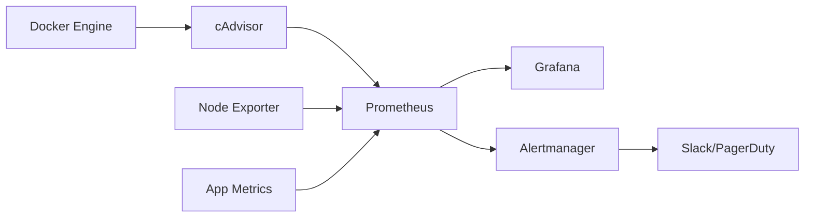

# How to Use Ansible to Configure Container Monitoring

Author: [nawazdhandala](https://www.github.com/nawazdhandala)

Tags: Ansible, Docker, Monitoring, Prometheus, Grafana

Description: Deploy container monitoring with Ansible using Prometheus, Grafana, and cAdvisor for comprehensive visibility into container health and performance.

---

Monitoring containers in production requires visibility into resource usage, health status, and application metrics. The standard open-source stack for this is Prometheus for metrics collection, Grafana for visualization, and cAdvisor for container-level metrics. Ansible lets you deploy this entire stack consistently and configure it to automatically discover your containers.

## Monitoring Architecture



## Deploying cAdvisor

cAdvisor runs on every Docker host and exposes container metrics:

```yaml
# roles/container_monitoring/tasks/cadvisor.yml
# Deploy cAdvisor for container metrics collection
- name: Run cAdvisor container
  community.docker.docker_container:
    name: cadvisor
    image: "gcr.io/cadvisor/cadvisor:{{ cadvisor_version }}"
    state: started
    restart_policy: always
    ports:
      - "{{ cadvisor_port }}:8080"
    volumes:
      - "/:/rootfs:ro"
      - "/var/run:/var/run:ro"
      - "/sys:/sys:ro"
      - "/var/lib/docker/:/var/lib/docker:ro"
      - "/dev/disk/:/dev/disk:ro"
    privileged: true
    devices:
      - "/dev/kmsg:/dev/kmsg"
    labels:
      monitoring: "true"
      component: "cadvisor"
```

## Deploying Prometheus

```yaml
# roles/container_monitoring/tasks/prometheus.yml
# Deploy Prometheus for metrics storage and querying
- name: Create Prometheus directories
  ansible.builtin.file:
    path: "{{ item }}"
    state: directory
    owner: "65534"  # nobody user in Prometheus container
    group: "65534"
    mode: '0755'
  loop:
    - /etc/prometheus
    - /var/lib/prometheus

- name: Deploy Prometheus configuration
  ansible.builtin.template:
    src: prometheus.yml.j2
    dest: /etc/prometheus/prometheus.yml
    mode: '0644'

- name: Deploy alert rules
  ansible.builtin.template:
    src: alert_rules.yml.j2
    dest: /etc/prometheus/alert_rules.yml
    mode: '0644'

- name: Run Prometheus container
  community.docker.docker_container:
    name: prometheus
    image: "prom/prometheus:{{ prometheus_version }}"
    state: started
    restart_policy: always
    ports:
      - "9090:9090"
    volumes:
      - "/etc/prometheus:/etc/prometheus:ro"
      - "prometheus-data:/prometheus"
    command:
      - "--config.file=/etc/prometheus/prometheus.yml"
      - "--storage.tsdb.path=/prometheus"
      - "--storage.tsdb.retention.time={{ prometheus_retention }}"
      - "--web.enable-lifecycle"
```

```yaml
# roles/container_monitoring/templates/prometheus.yml.j2
# Prometheus configuration with container service discovery
global:
  scrape_interval: {{ prometheus_scrape_interval }}
  evaluation_interval: 15s

rule_files:
  - alert_rules.yml

alerting:
  alertmanagers:
    - static_configs:
        - targets:
            - alertmanager:9093

scrape_configs:
  - job_name: prometheus
    static_configs:
      - targets: ['localhost:9090']

  - job_name: cadvisor
    static_configs:
      - targets:

          - '{{ hostvars[host].ansible_host }}:{{ cadvisor_port }}'


  - job_name: node-exporter
    static_configs:
      - targets:

          - '{{ hostvars[host].ansible_host }}:9100'


  - job_name: docker-containers
    docker_sd_configs:
      - host: unix:///var/run/docker.sock
        refresh_interval: 30s
    relabel_configs:
      - source_labels: ['__meta_docker_container_label_monitoring']
        regex: 'true'
        action: keep
```

## Deploying Grafana

```yaml
# roles/container_monitoring/tasks/grafana.yml
# Deploy Grafana for metrics visualization
- name: Create Grafana directories
  ansible.builtin.file:
    path: "{{ item }}"
    state: directory
    mode: '0755'
  loop:
    - /etc/grafana/provisioning/datasources
    - /etc/grafana/provisioning/dashboards
    - /var/lib/grafana/dashboards

- name: Deploy Grafana datasource configuration
  ansible.builtin.template:
    src: grafana-datasource.yml.j2
    dest: /etc/grafana/provisioning/datasources/prometheus.yml
    mode: '0644'

- name: Deploy Grafana dashboard provisioning
  ansible.builtin.copy:
    dest: /etc/grafana/provisioning/dashboards/default.yml
    content: |
      apiVersion: 1
      providers:
        - name: Default
          folder: ''
          type: file
          options:
            path: /var/lib/grafana/dashboards
    mode: '0644'

- name: Deploy container monitoring dashboard
  ansible.builtin.template:
    src: docker-dashboard.json.j2
    dest: /var/lib/grafana/dashboards/docker.json
    mode: '0644'

- name: Run Grafana container
  community.docker.docker_container:
    name: grafana
    image: "grafana/grafana:{{ grafana_version }}"
    state: started
    restart_policy: always
    ports:
      - "3000:3000"
    volumes:
      - "grafana-data:/var/lib/grafana"
      - "/etc/grafana/provisioning:/etc/grafana/provisioning:ro"
      - "/var/lib/grafana/dashboards:/var/lib/grafana/dashboards:ro"
    env:
      GF_SECURITY_ADMIN_PASSWORD: "{{ vault_grafana_admin_password }}"
      GF_USERS_ALLOW_SIGN_UP: "false"
```

## Alert Rules

```yaml
# roles/container_monitoring/templates/alert_rules.yml.j2
# Prometheus alert rules for container monitoring
groups:
  - name: container_alerts
    rules:
      - alert: ContainerHighCPU
        expr: rate(container_cpu_usage_seconds_total[5m]) > 0.8
        for: 5m
        labels:
          severity: warning
        annotations:
          summary: "Container CPU usage high"
          description: "Container {{ '{{' }} $labels.name {{ '}}' }} CPU above 80%"

      - alert: ContainerHighMemory
        expr: container_memory_usage_bytes / container_spec_memory_limit_bytes > 0.9
        for: 5m
        labels:
          severity: critical
        annotations:
          summary: "Container memory near limit"

      - alert: ContainerRestarting
        expr: increase(container_restart_count[1h]) > 3
        labels:
          severity: warning
        annotations:
          summary: "Container restarting frequently"

      - alert: ContainerDown
        expr: up{job="cadvisor"} == 0
        for: 2m
        labels:
          severity: critical
        annotations:
          summary: "cAdvisor target down"
```

## Deploying Node Exporter

```yaml
# roles/container_monitoring/tasks/node_exporter.yml
# Deploy Prometheus Node Exporter for host metrics
- name: Run Node Exporter container
  community.docker.docker_container:
    name: node-exporter
    image: "prom/node-exporter:{{ node_exporter_version }}"
    state: started
    restart_policy: always
    ports:
      - "9100:9100"
    volumes:
      - "/proc:/host/proc:ro"
      - "/sys:/host/sys:ro"
      - "/:/rootfs:ro"
    command:
      - "--path.procfs=/host/proc"
      - "--path.sysfs=/host/sys"
      - "--path.rootfs=/rootfs"
    network_mode: host
    pid_mode: host
```

## Full Deployment Playbook

```yaml
# playbooks/deploy_monitoring.yml
# Deploy complete container monitoring stack
- name: Deploy monitoring agents on all Docker hosts
  hosts: docker_hosts
  become: true
  roles:
    - role: container_monitoring
      tasks_from: cadvisor
    - role: container_monitoring
      tasks_from: node_exporter

- name: Deploy monitoring server
  hosts: monitoring_server
  become: true
  roles:
    - role: container_monitoring
      tasks_from: prometheus
    - role: container_monitoring
      tasks_from: grafana
```


## Common Use Cases

Here are several practical scenarios where this module proves essential in real-world playbooks.

### Infrastructure Provisioning Workflow

```yaml
# Complete workflow incorporating this module
- name: Infrastructure provisioning
  hosts: all
  become: true
  gather_facts: true
  tasks:
    - name: Gather system information
      ansible.builtin.setup:
        gather_subset:
          - hardware
          - network

    - name: Display system summary
      ansible.builtin.debug:
        msg: >-
          Host {{ inventory_hostname }} has
          {{ ansible_memtotal_mb }}MB RAM,
          {{ ansible_processor_vcpus }} vCPUs,
          running {{ ansible_distribution }} {{ ansible_distribution_version }}

    - name: Install required packages
      ansible.builtin.package:
        name:
          - curl
          - wget
          - git
          - vim
          - htop
          - jq
        state: present

    - name: Configure system timezone
      ansible.builtin.timezone:
        name: "{{ system_timezone | default('UTC') }}"

    - name: Configure hostname
      ansible.builtin.hostname:
        name: "{{ inventory_hostname }}"

    - name: Update /etc/hosts
      ansible.builtin.lineinfile:
        path: /etc/hosts
        regexp: '^127\.0\.1\.1'
        line: "127.0.1.1 {{ inventory_hostname }}"

    - name: Configure SSH hardening
      ansible.builtin.lineinfile:
        path: /etc/ssh/sshd_config
        regexp: "{{ item.regexp }}"
        line: "{{ item.line }}"
      loop:
        - { regexp: '^PermitRootLogin', line: 'PermitRootLogin no' }
        - { regexp: '^PasswordAuthentication', line: 'PasswordAuthentication no' }
      notify: restart sshd

    - name: Configure firewall rules
      community.general.ufw:
        rule: allow
        port: "{{ item }}"
        proto: tcp
      loop:
        - "22"
        - "80"
        - "443"

    - name: Enable firewall
      community.general.ufw:
        state: enabled
        policy: deny

  handlers:
    - name: restart sshd
      ansible.builtin.service:
        name: sshd
        state: restarted
```

### Integration with Monitoring

```yaml
# Using gathered facts to configure monitoring thresholds
- name: Configure monitoring based on system specs
  hosts: all
  become: true
  tasks:
    - name: Set monitoring thresholds based on hardware
      ansible.builtin.template:
        src: monitoring_config.yml.j2
        dest: /etc/monitoring/config.yml
      vars:
        memory_warning_threshold: "{{ (ansible_memtotal_mb * 0.8) | int }}"
        memory_critical_threshold: "{{ (ansible_memtotal_mb * 0.95) | int }}"
        cpu_warning_threshold: 80
        cpu_critical_threshold: 95

    - name: Register host with monitoring system
      ansible.builtin.uri:
        url: "https://monitoring.example.com/api/hosts"
        method: POST
        body_format: json
        body:
          hostname: "{{ inventory_hostname }}"
          ip_address: "{{ ansible_default_ipv4.address }}"
          os: "{{ ansible_distribution }}"
          memory_mb: "{{ ansible_memtotal_mb }}"
          cpus: "{{ ansible_processor_vcpus }}"
        headers:
          Authorization: "Bearer {{ monitoring_api_token }}"
        status_code: [200, 201, 409]
```

### Error Handling Patterns

```yaml
# Robust error handling with this module
- name: Robust task execution
  hosts: all
  tasks:
    - name: Attempt primary operation
      ansible.builtin.command: /opt/app/primary-task.sh
      register: primary_result
      failed_when: false

    - name: Handle primary failure with fallback
      ansible.builtin.command: /opt/app/fallback-task.sh
      when: primary_result.rc != 0
      register: fallback_result

    - name: Report final status
      ansible.builtin.debug:
        msg: >-
          Task completed via {{ 'primary' if primary_result.rc == 0 else 'fallback' }} path.
          Return code: {{ primary_result.rc if primary_result.rc == 0 else fallback_result.rc }}

    - name: Fail if both paths failed
      ansible.builtin.fail:
        msg: "Both primary and fallback operations failed"
      when:
        - primary_result.rc != 0
        - fallback_result is defined
        - fallback_result.rc != 0
```

### Scheduling and Automation

```yaml
# Set up scheduled compliance scans using cron
- name: Configure automated scans
  hosts: all
  become: true
  tasks:
    - name: Create scan script
      ansible.builtin.copy:
        dest: /opt/scripts/compliance_scan.sh
        mode: '0755'
        content: |
          #!/bin/bash
          cd /opt/ansible
          ansible-playbook playbooks/validate.yml -i inventory/ > /var/log/compliance_scan.log 2>&1
          EXIT_CODE=$?
          if [ $EXIT_CODE -ne 0 ]; then
            curl -X POST https://hooks.example.com/alert \
              -H "Content-Type: application/json" \
              -d "{\"text\":\"Compliance scan failed on $(hostname)\"}"
          fi
          exit $EXIT_CODE

    - name: Schedule weekly compliance scan
      ansible.builtin.cron:
        name: "Weekly compliance scan"
        minute: "0"
        hour: "3"
        weekday: "1"
        job: "/opt/scripts/compliance_scan.sh"
        user: ansible
```


## Conclusion

A complete container monitoring setup with Ansible involves deploying cAdvisor and Node Exporter on every Docker host, centralizing metrics in Prometheus, and visualizing everything in Grafana. Ansible ensures every host gets the same monitoring agent configuration and that Prometheus automatically discovers all your container targets. With alert rules in place, you get notified before container resource issues become outages.
