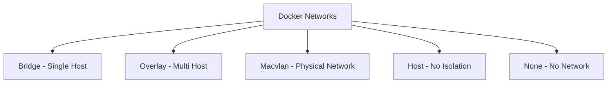

# How to Use Ansible to Configure Container Networking

Author: [nawazdhandala](https://www.github.com/nawazdhandala)

Tags: Ansible, Docker, Networking, Containers, DevOps

Description: Configure Docker and container networking with Ansible including bridge networks, overlay networks, DNS settings, and network policies.

---

Container networking determines how your containers communicate with each other and with the outside world. Getting it right is critical for security and performance. Ansible gives you a repeatable way to configure Docker networks, manage DNS settings, set up overlay networks for multi-host communication, and enforce network isolation policies.

## Docker Network Types

Before diving into Ansible configuration, here is a quick overview of Docker network types:



## Creating Bridge Networks

Bridge networks are the default for standalone Docker containers on a single host:

```yaml
# roles/container_networking/tasks/bridge.yml
# Create Docker bridge networks with custom configuration
- name: Create application bridge network
  community.docker.docker_network:
    name: "{{ item.name }}"
    driver: bridge
    ipam_config:
      - subnet: "{{ item.subnet }}"
        gateway: "{{ item.gateway }}"
    driver_options:
      com.docker.network.bridge.name: "br-{{ item.name }}"
      com.docker.network.bridge.enable_icc: "{{ item.enable_icc | default('true') }}"
      com.docker.network.bridge.enable_ip_masquerade: "true"
    state: present
  loop: "{{ docker_bridge_networks }}"
  loop_control:
    label: "{{ item.name }}"
```

```yaml
# defaults/main.yml
# Default bridge network definitions
docker_bridge_networks:
  - name: frontend
    subnet: "172.20.0.0/24"
    gateway: "172.20.0.1"
    enable_icc: "true"
  - name: backend
    subnet: "172.21.0.0/24"
    gateway: "172.21.0.1"
    enable_icc: "true"
  - name: database
    subnet: "172.22.0.0/24"
    gateway: "172.22.0.1"
    enable_icc: "false"
```

## Creating Overlay Networks

Overlay networks enable cross-host container communication in Docker Swarm:

```yaml
# roles/container_networking/tasks/overlay.yml
# Create overlay networks for multi-host container communication
- name: Create overlay networks for Swarm services
  community.docker.docker_network:
    name: "{{ item.name }}"
    driver: overlay
    attachable: "{{ item.attachable | default(true) }}"
    encrypted: "{{ item.encrypted | default(true) }}"
    ipam_config:
      - subnet: "{{ item.subnet }}"
    state: present
  loop: "{{ docker_overlay_networks }}"
  loop_control:
    label: "{{ item.name }}"
  run_once: true  # Only run on one Swarm manager
```

## Connecting Containers to Networks

```yaml
# roles/container_networking/tasks/connect.yml
# Connect running containers to specific networks
- name: Connect container to multiple networks
  community.docker.docker_container:
    name: "{{ item.0.name }}"
    networks:
      - name: "{{ item.1.network }}"
        ipv4_address: "{{ item.1.ip | default(omit) }}"
        aliases: "{{ item.1.aliases | default(omit) }}"
    networks_cli_compatible: true
    state: started
  loop: "{{ container_network_assignments | subelements('networks') }}"
  loop_control:
    label: "{{ item.0.name }} -> {{ item.1.network }}"
```

```yaml
# Variables for network assignments
container_network_assignments:
  - name: web-proxy
    networks:
      - network: frontend
        ip: "172.20.0.10"
        aliases: ["proxy", "gateway"]
      - network: backend
  - name: api-server
    networks:
      - network: backend
        ip: "172.21.0.10"
      - network: database
```

## DNS Configuration

```yaml
# roles/container_networking/tasks/dns.yml
# Configure DNS settings for Docker containers
- name: Configure Docker daemon DNS settings
  ansible.builtin.template:
    src: daemon.json.j2
    dest: /etc/docker/daemon.json
    mode: '0644'
  notify: restart docker

- name: Deploy containers with custom DNS
  community.docker.docker_container:
    name: "{{ item.name }}"
    image: "{{ item.image }}"
    dns_servers: "{{ docker_dns_servers }}"
    dns_search_domains: "{{ docker_dns_search }}"
    hostname: "{{ item.hostname }}"
    domainname: "{{ docker_domain }}"
    networks:
      - name: "{{ item.network }}"
    state: started
  loop: "{{ dns_configured_containers }}"
```

```json
{
  "dns": {{ docker_dns_servers | to_json }},
  "dns-search": {{ docker_dns_search | to_json }},
  "default-address-pools": [
    {
      "base": "172.16.0.0/12",
      "size": 24
    }
  ]
}
```

## Network Isolation with iptables

```yaml
# roles/container_networking/tasks/firewall.yml
# Configure iptables rules for container network isolation
- name: Block inter-network traffic by default
  ansible.builtin.iptables:
    chain: DOCKER-ISOLATION-STAGE-1
    source: "{{ item.0.subnet }}"
    destination: "{{ item.1.subnet }}"
    jump: DROP
    comment: "Block {{ item.0.name }} to {{ item.1.name }}"
  loop: "{{ docker_bridge_networks | product(docker_bridge_networks) | list }}"
  when:
    - item.0.name != item.1.name
    - not (item.0.name + ':' + item.1.name) in allowed_network_pairs
  loop_control:
    label: "{{ item.0.name }} -> {{ item.1.name }}"

- name: Allow specific cross-network traffic
  ansible.builtin.iptables:
    chain: DOCKER-ISOLATION-STAGE-1
    source: "{{ item.source_subnet }}"
    destination: "{{ item.dest_subnet }}"
    protocol: tcp
    destination_port: "{{ item.port }}"
    jump: ACCEPT
    comment: "Allow {{ item.description }}"
  loop: "{{ network_firewall_rules }}"
```

## Macvlan Networks

For containers that need to appear as physical devices on the network:

```yaml
# roles/container_networking/tasks/macvlan.yml
# Create macvlan networks for physical network integration
- name: Create macvlan network
  community.docker.docker_network:
    name: "{{ item.name }}"
    driver: macvlan
    driver_options:
      parent: "{{ item.parent_interface }}"
    ipam_config:
      - subnet: "{{ item.subnet }}"
        gateway: "{{ item.gateway }}"
        iprange: "{{ item.ip_range }}"
    state: present
  loop: "{{ macvlan_networks }}"
```

## Network Verification

```yaml
# roles/container_networking/tasks/verify.yml
# Verify container network connectivity
- name: List all Docker networks
  community.docker.docker_network_info:
    name: "{{ item.name }}"
  register: network_info
  loop: "{{ docker_bridge_networks + docker_overlay_networks | default([]) }}"

- name: Verify networks exist
  ansible.builtin.assert:
    that:
      - item.exists
    fail_msg: "Network {{ item.item.name }} does not exist"
  loop: "{{ network_info.results }}"
  loop_control:
    label: "{{ item.item.name }}"

- name: Test cross-container connectivity
  community.docker.docker_container:
    name: network-test
    image: busybox
    command: "ping -c 3 {{ item.target }}"
    networks:
      - name: "{{ item.network }}"
    auto_remove: true
    detach: false
  register: ping_results
  loop: "{{ connectivity_tests }}"
  loop_control:
    label: "{{ item.network }} -> {{ item.target }}"
```

## Conclusion

Container networking with Ansible gives you version-controlled, repeatable network configurations. Whether you need simple bridge networks for single-host setups, encrypted overlay networks for Swarm clusters, or macvlan networks for physical network integration, Ansible modules handle the creation and configuration. Combined with iptables rules for isolation and DNS configuration for service discovery, you have full control over how your containers communicate.
