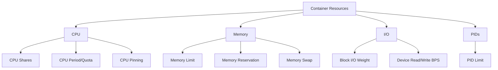

# How to Use Ansible to Configure Container Resource Limits

Author: [nawazdhandala](https://www.github.com/nawazdhandala)

Tags: Ansible, Docker, Resource Management, Containers, DevOps

Description: Set CPU, memory, and other resource limits on Docker containers using Ansible to prevent resource contention and ensure fair allocation.

---

Without resource limits, a single container can consume all available CPU and memory on a host, starving other containers and potentially crashing the system. Resource limits are not optional in production. They protect your hosts from runaway processes and ensure predictable performance across all your services.

Ansible makes it straightforward to define and enforce resource limits consistently across your container fleet.

## Types of Resource Limits



## Setting CPU Limits

```yaml
# roles/resource_limits/tasks/cpu.yml
# Configure CPU limits on containers
- name: Deploy container with CPU limits
  community.docker.docker_container:
    name: "{{ item.name }}"
    image: "{{ item.image }}"
    state: started
    # Limit to N CPUs (e.g., 1.5 = 1.5 cores)
    cpus: "{{ item.cpu_limit }}"
    # CPU shares for relative weighting (default 1024)
    cpu_shares: "{{ item.cpu_shares | default(1024) }}"
    # Pin to specific CPUs (optional)
    cpuset_cpus: "{{ item.cpuset | default(omit) }}"
  loop: "{{ containers_with_limits }}"
  loop_control:
    label: "{{ item.name }}"
```

```yaml
# Variables for container resource limits
containers_with_limits:
  - name: web-app
    image: "myapp:latest"
    cpu_limit: 2.0
    cpu_shares: 2048
    memory_limit: "1g"
    memory_reservation: "512m"
  - name: background-worker
    image: "worker:latest"
    cpu_limit: 0.5
    cpu_shares: 512
    memory_limit: "256m"
    memory_reservation: "128m"
  - name: database
    image: "postgres:16"
    cpu_limit: 4.0
    cpu_shares: 4096
    cpuset: "0,1,2,3"
    memory_limit: "4g"
    memory_reservation: "2g"
```

## Setting Memory Limits

```yaml
# roles/resource_limits/tasks/memory.yml
# Configure memory limits on containers
- name: Deploy container with memory constraints
  community.docker.docker_container:
    name: "{{ item.name }}"
    image: "{{ item.image }}"
    state: started
    # Hard memory limit - container is killed if exceeded
    memory: "{{ item.memory_limit }}"
    # Soft limit - used for scheduling decisions
    memory_reservation: "{{ item.memory_reservation | default(omit) }}"
    # Memory + swap limit (set equal to memory to disable swap)
    memory_swap: "{{ item.memory_swap | default(item.memory_limit) }}"
    # OOM kill disable (use with caution)
    oom_killer: "{{ item.oom_killer | default(true) }}"
    # OOM score adjustment
    oom_score_adj: "{{ item.oom_score_adj | default(0) }}"
  loop: "{{ containers_with_limits }}"
  loop_control:
    label: "{{ item.name }}"
```

## PID Limits

```yaml
# roles/resource_limits/tasks/pids.yml
# Limit the number of processes a container can create
- name: Deploy container with PID limit
  community.docker.docker_container:
    name: "{{ item.name }}"
    image: "{{ item.image }}"
    state: started
    pids_limit: "{{ item.pids_limit | default(200) }}"
  loop: "{{ containers_with_limits }}"
```

## Block I/O Limits

```yaml
# roles/resource_limits/tasks/io.yml
# Configure block I/O limits on containers
- name: Deploy container with I/O limits
  community.docker.docker_container:
    name: "{{ item.name }}"
    image: "{{ item.image }}"
    state: started
    blkio_weight: "{{ item.blkio_weight | default(500) }}"
    device_read_bps:
      - path: /dev/sda
        rate: "{{ item.read_bps | default('50mb') }}"
    device_write_bps:
      - path: /dev/sda
        rate: "{{ item.write_bps | default('30mb') }}"
  loop: "{{ io_limited_containers }}"
  when: item.io_limits | default(false)
```

## Docker Daemon Default Limits

```yaml
# roles/resource_limits/tasks/daemon_defaults.yml
# Set default resource limits at the Docker daemon level
- name: Configure Docker daemon with default limits
  ansible.builtin.template:
    src: daemon.json.j2
    dest: /etc/docker/daemon.json
    mode: '0644'
  notify: restart docker
```

```json
{
  "default-ulimits": {
    "nofile": {
      "Name": "nofile",
      "Hard": 64000,
      "Soft": 64000
    },
    "nproc": {
      "Name": "nproc",
      "Hard": 4096,
      "Soft": 4096
    }
  }
}
```

## Monitoring Resource Usage

```yaml
# roles/resource_limits/tasks/monitor.yml
# Check container resource usage against limits
- name: Get container stats
  ansible.builtin.command:
    cmd: docker stats --no-stream --format '{{ "{{" }}.Name{{ "}}" }},{{ "{{" }}.CPUPerc{{ "}}" }},{{ "{{" }}.MemUsage{{ "}}" }},{{ "{{" }}.MemPerc{{ "}}" }}'
  register: container_stats
  changed_when: false

- name: Display resource usage
  ansible.builtin.debug:
    msg: "{{ container_stats.stdout_lines }}"

- name: Check for containers near memory limit
  ansible.builtin.command:
    cmd: >
      docker stats --no-stream --format '{{ "{{" }}.Name{{ "}}" }} {{ "{{" }}.MemPerc{{ "}}" }}'
  register: mem_usage
  changed_when: false

- name: Warn about high memory usage
  ansible.builtin.debug:
    msg: "WARNING: {{ item }} is using high memory"
  loop: "{{ mem_usage.stdout_lines }}"
  when: (item.split()[-1] | replace('%','') | float) > 85
```


## Common Use Cases

Here are several practical scenarios where this module proves essential in real-world playbooks.

### Infrastructure Provisioning Workflow

```yaml
# Complete workflow incorporating this module
- name: Infrastructure provisioning
  hosts: all
  become: true
  gather_facts: true
  tasks:
    - name: Gather system information
      ansible.builtin.setup:
        gather_subset:
          - hardware
          - network

    - name: Display system summary
      ansible.builtin.debug:
        msg: >-
          Host {{ inventory_hostname }} has
          {{ ansible_memtotal_mb }}MB RAM,
          {{ ansible_processor_vcpus }} vCPUs,
          running {{ ansible_distribution }} {{ ansible_distribution_version }}

    - name: Install required packages
      ansible.builtin.package:
        name:
          - curl
          - wget
          - git
          - vim
          - htop
          - jq
        state: present

    - name: Configure system timezone
      ansible.builtin.timezone:
        name: "{{ system_timezone | default('UTC') }}"

    - name: Configure hostname
      ansible.builtin.hostname:
        name: "{{ inventory_hostname }}"

    - name: Update /etc/hosts
      ansible.builtin.lineinfile:
        path: /etc/hosts
        regexp: '^127\.0\.1\.1'
        line: "127.0.1.1 {{ inventory_hostname }}"

    - name: Configure SSH hardening
      ansible.builtin.lineinfile:
        path: /etc/ssh/sshd_config
        regexp: "{{ item.regexp }}"
        line: "{{ item.line }}"
      loop:
        - { regexp: '^PermitRootLogin', line: 'PermitRootLogin no' }
        - { regexp: '^PasswordAuthentication', line: 'PasswordAuthentication no' }
      notify: restart sshd

    - name: Configure firewall rules
      community.general.ufw:
        rule: allow
        port: "{{ item }}"
        proto: tcp
      loop:
        - "22"
        - "80"
        - "443"

    - name: Enable firewall
      community.general.ufw:
        state: enabled
        policy: deny

  handlers:
    - name: restart sshd
      ansible.builtin.service:
        name: sshd
        state: restarted
```

### Integration with Monitoring

```yaml
# Using gathered facts to configure monitoring thresholds
- name: Configure monitoring based on system specs
  hosts: all
  become: true
  tasks:
    - name: Set monitoring thresholds based on hardware
      ansible.builtin.template:
        src: monitoring_config.yml.j2
        dest: /etc/monitoring/config.yml
      vars:
        memory_warning_threshold: "{{ (ansible_memtotal_mb * 0.8) | int }}"
        memory_critical_threshold: "{{ (ansible_memtotal_mb * 0.95) | int }}"
        cpu_warning_threshold: 80
        cpu_critical_threshold: 95

    - name: Register host with monitoring system
      ansible.builtin.uri:
        url: "https://monitoring.example.com/api/hosts"
        method: POST
        body_format: json
        body:
          hostname: "{{ inventory_hostname }}"
          ip_address: "{{ ansible_default_ipv4.address }}"
          os: "{{ ansible_distribution }}"
          memory_mb: "{{ ansible_memtotal_mb }}"
          cpus: "{{ ansible_processor_vcpus }}"
        headers:
          Authorization: "Bearer {{ monitoring_api_token }}"
        status_code: [200, 201, 409]
```

### Error Handling Patterns

```yaml
# Robust error handling with this module
- name: Robust task execution
  hosts: all
  tasks:
    - name: Attempt primary operation
      ansible.builtin.command: /opt/app/primary-task.sh
      register: primary_result
      failed_when: false

    - name: Handle primary failure with fallback
      ansible.builtin.command: /opt/app/fallback-task.sh
      when: primary_result.rc != 0
      register: fallback_result

    - name: Report final status
      ansible.builtin.debug:
        msg: >-
          Task completed via {{ 'primary' if primary_result.rc == 0 else 'fallback' }} path.
          Return code: {{ primary_result.rc if primary_result.rc == 0 else fallback_result.rc }}

    - name: Fail if both paths failed
      ansible.builtin.fail:
        msg: "Both primary and fallback operations failed"
      when:
        - primary_result.rc != 0
        - fallback_result is defined
        - fallback_result.rc != 0
```

### Scheduling and Automation

```yaml
# Set up scheduled compliance scans using cron
- name: Configure automated scans
  hosts: all
  become: true
  tasks:
    - name: Create scan script
      ansible.builtin.copy:
        dest: /opt/scripts/compliance_scan.sh
        mode: '0755'
        content: |
          #!/bin/bash
          cd /opt/ansible
          ansible-playbook playbooks/validate.yml -i inventory/ > /var/log/compliance_scan.log 2>&1
          EXIT_CODE=$?
          if [ $EXIT_CODE -ne 0 ]; then
            curl -X POST https://hooks.example.com/alert \
              -H "Content-Type: application/json" \
              -d "{\"text\":\"Compliance scan failed on $(hostname)\"}"
          fi
          exit $EXIT_CODE

    - name: Schedule weekly compliance scan
      ansible.builtin.cron:
        name: "Weekly compliance scan"
        minute: "0"
        hour: "3"
        weekday: "1"
        job: "/opt/scripts/compliance_scan.sh"
        user: ansible
```


## Conclusion

Resource limits are a critical part of container deployments in production. Without them, you are one misbehaving application away from taking down an entire host. Ansible ensures these limits are applied consistently through your deployment roles, and monitoring tasks help you catch containers that are approaching their limits before they get killed. Set CPU, memory, PID, and I/O limits based on your application's actual needs, not just defaults, and adjust them as you learn from production usage patterns.
