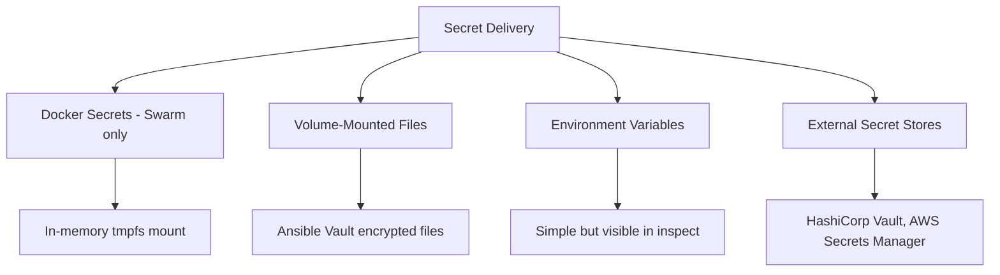

# How to Use Ansible to Configure Container Secrets

Author: [nawazdhandala](https://www.github.com/nawazdhandala)

Tags: Ansible, Docker, Secrets, Security, Containers

Description: Securely manage container secrets with Ansible using Docker secrets, Ansible Vault, environment variable injection, and secret file mounting.

---

Container secrets management is about getting sensitive data like passwords, API keys, and certificates into your containers without exposing them in images, environment variables visible in process listings, or plain-text files. Ansible provides multiple strategies for handling secrets, each with different trade-offs.

## Strategies for Container Secrets



## Docker Swarm Secrets

Docker Swarm has a native secrets management feature:

```yaml
# roles/container_secrets/tasks/swarm_secrets.yml
# Manage Docker Swarm secrets
- name: Create Docker secrets
  community.docker.docker_secret:
    name: "{{ item.name }}"
    data: "{{ item.value }}"
    state: present
  loop: "{{ docker_secrets }}"
  loop_control:
    label: "{{ item.name }}"
  no_log: true

- name: Deploy service with secrets
  community.docker.docker_swarm_service:
    name: "{{ app_name }}"
    image: "{{ app_image }}"
    secrets:
      - secret_name: db-password
        filename: /run/secrets/db_password
      - secret_name: api-key
        filename: /run/secrets/api_key
    state: present
```

## Volume-Mounted Secret Files

For standalone Docker (non-Swarm), mount secrets as files:

```yaml
# roles/container_secrets/tasks/file_secrets.yml
# Deploy secrets as mounted files
- name: Create secrets directory
  ansible.builtin.file:
    path: "{{ secrets_dir }}"
    state: directory
    mode: '0700'
    owner: root

- name: Write secret files
  ansible.builtin.copy:
    content: "{{ item.value }}"
    dest: "{{ secrets_dir }}/{{ item.name }}"
    mode: '0400'
    owner: root
  loop: "{{ app_secrets }}"
  loop_control:
    label: "{{ item.name }}"
  no_log: true

- name: Deploy container with mounted secrets
  community.docker.docker_container:
    name: "{{ app_name }}"
    image: "{{ app_image }}"
    state: started
    volumes:
      - "{{ secrets_dir }}:/run/secrets:ro"
    env:
      SECRET_FILE_PATH: "/run/secrets"
```

## Environment Variables with Ansible Vault

```yaml
# roles/container_secrets/tasks/env_secrets.yml
# Inject Vault-encrypted secrets as environment variables
- name: Deploy container with vault-encrypted env vars
  community.docker.docker_container:
    name: "{{ app_name }}"
    image: "{{ app_image }}"
    state: started
    env:
      DATABASE_PASSWORD: "{{ vault_db_password }}"
      API_SECRET_KEY: "{{ vault_api_key }}"
      JWT_SIGNING_KEY: "{{ vault_jwt_key }}"
      SMTP_PASSWORD: "{{ vault_smtp_password }}"
  no_log: true
```

## HashiCorp Vault Integration

```yaml
# roles/container_secrets/tasks/hashicorp_vault.yml
# Fetch secrets from HashiCorp Vault and inject into containers
- name: Read secrets from HashiCorp Vault
  community.hashi_vault.vault_read:
    url: "{{ vault_url }}"
    path: "secret/data/{{ app_name }}"
    auth_method: token
    token: "{{ vault_token }}"
  register: app_secrets
  no_log: true

- name: Deploy container with Vault secrets
  community.docker.docker_container:
    name: "{{ app_name }}"
    image: "{{ app_image }}"
    state: started
    env: "{{ app_secrets.data.data.data }}"
  no_log: true
```

## tmpfs-Based Secrets

For maximum security, store secrets in memory only:

```yaml
# roles/container_secrets/tasks/tmpfs_secrets.yml
# Use tmpfs for in-memory secret storage
- name: Deploy container with tmpfs secrets
  community.docker.docker_container:
    name: "{{ app_name }}"
    image: "{{ app_image }}"
    state: started
    tmpfs:
      - "/run/secrets:size=1M,mode=0700"

- name: Copy secrets into running container
  ansible.builtin.command:
    cmd: "docker exec {{ app_name }} sh -c 'echo {{ item.value }} > /run/secrets/{{ item.name }}'"
  loop: "{{ app_secrets }}"
  no_log: true
  changed_when: true
```

## Secret Rotation

```yaml
# roles/container_secrets/tasks/rotate.yml
# Rotate container secrets
- name: Generate new secret value
  ansible.builtin.set_fact:
    new_secret: "{{ lookup('password', '/dev/null length=32 chars=ascii_letters,digits') }}"
  no_log: true

- name: Update secret in external store
  community.hashi_vault.vault_write:
    url: "{{ vault_url }}"
    path: "secret/data/{{ app_name }}"
    data:
      data:
        api_key: "{{ new_secret }}"
  no_log: true

- name: Restart container to pick up new secret
  community.docker.docker_container:
    name: "{{ app_name }}"
    state: started
    restart: true
    env:
      API_KEY: "{{ new_secret }}"
  no_log: true
```


## Common Use Cases

Here are several practical scenarios where this module proves essential in real-world playbooks.

### Infrastructure Provisioning Workflow

```yaml
# Complete workflow incorporating this module
- name: Infrastructure provisioning
  hosts: all
  become: true
  gather_facts: true
  tasks:
    - name: Gather system information
      ansible.builtin.setup:
        gather_subset:
          - hardware
          - network

    - name: Display system summary
      ansible.builtin.debug:
        msg: >-
          Host {{ inventory_hostname }} has
          {{ ansible_memtotal_mb }}MB RAM,
          {{ ansible_processor_vcpus }} vCPUs,
          running {{ ansible_distribution }} {{ ansible_distribution_version }}

    - name: Install required packages
      ansible.builtin.package:
        name:
          - curl
          - wget
          - git
          - vim
          - htop
          - jq
        state: present

    - name: Configure system timezone
      ansible.builtin.timezone:
        name: "{{ system_timezone | default('UTC') }}"

    - name: Configure hostname
      ansible.builtin.hostname:
        name: "{{ inventory_hostname }}"

    - name: Update /etc/hosts
      ansible.builtin.lineinfile:
        path: /etc/hosts
        regexp: '^127\.0\.1\.1'
        line: "127.0.1.1 {{ inventory_hostname }}"

    - name: Configure SSH hardening
      ansible.builtin.lineinfile:
        path: /etc/ssh/sshd_config
        regexp: "{{ item.regexp }}"
        line: "{{ item.line }}"
      loop:
        - { regexp: '^PermitRootLogin', line: 'PermitRootLogin no' }
        - { regexp: '^PasswordAuthentication', line: 'PasswordAuthentication no' }
      notify: restart sshd

    - name: Configure firewall rules
      community.general.ufw:
        rule: allow
        port: "{{ item }}"
        proto: tcp
      loop:
        - "22"
        - "80"
        - "443"

    - name: Enable firewall
      community.general.ufw:
        state: enabled
        policy: deny

  handlers:
    - name: restart sshd
      ansible.builtin.service:
        name: sshd
        state: restarted
```

### Integration with Monitoring

```yaml
# Using gathered facts to configure monitoring thresholds
- name: Configure monitoring based on system specs
  hosts: all
  become: true
  tasks:
    - name: Set monitoring thresholds based on hardware
      ansible.builtin.template:
        src: monitoring_config.yml.j2
        dest: /etc/monitoring/config.yml
      vars:
        memory_warning_threshold: "{{ (ansible_memtotal_mb * 0.8) | int }}"
        memory_critical_threshold: "{{ (ansible_memtotal_mb * 0.95) | int }}"
        cpu_warning_threshold: 80
        cpu_critical_threshold: 95

    - name: Register host with monitoring system
      ansible.builtin.uri:
        url: "https://monitoring.example.com/api/hosts"
        method: POST
        body_format: json
        body:
          hostname: "{{ inventory_hostname }}"
          ip_address: "{{ ansible_default_ipv4.address }}"
          os: "{{ ansible_distribution }}"
          memory_mb: "{{ ansible_memtotal_mb }}"
          cpus: "{{ ansible_processor_vcpus }}"
        headers:
          Authorization: "Bearer {{ monitoring_api_token }}"
        status_code: [200, 201, 409]
```

### Error Handling Patterns

```yaml
# Robust error handling with this module
- name: Robust task execution
  hosts: all
  tasks:
    - name: Attempt primary operation
      ansible.builtin.command: /opt/app/primary-task.sh
      register: primary_result
      failed_when: false

    - name: Handle primary failure with fallback
      ansible.builtin.command: /opt/app/fallback-task.sh
      when: primary_result.rc != 0
      register: fallback_result

    - name: Report final status
      ansible.builtin.debug:
        msg: >-
          Task completed via {{ 'primary' if primary_result.rc == 0 else 'fallback' }} path.
          Return code: {{ primary_result.rc if primary_result.rc == 0 else fallback_result.rc }}

    - name: Fail if both paths failed
      ansible.builtin.fail:
        msg: "Both primary and fallback operations failed"
      when:
        - primary_result.rc != 0
        - fallback_result is defined
        - fallback_result.rc != 0
```

### Scheduling and Automation

```yaml
# Set up scheduled compliance scans using cron
- name: Configure automated scans
  hosts: all
  become: true
  tasks:
    - name: Create scan script
      ansible.builtin.copy:
        dest: /opt/scripts/compliance_scan.sh
        mode: '0755'
        content: |
          #!/bin/bash
          cd /opt/ansible
          ansible-playbook playbooks/validate.yml -i inventory/ > /var/log/compliance_scan.log 2>&1
          EXIT_CODE=$?
          if [ $EXIT_CODE -ne 0 ]; then
            curl -X POST https://hooks.example.com/alert \
              -H "Content-Type: application/json" \
              -d "{\"text\":\"Compliance scan failed on $(hostname)\"}"
          fi
          exit $EXIT_CODE

    - name: Schedule weekly compliance scan
      ansible.builtin.cron:
        name: "Weekly compliance scan"
        minute: "0"
        hour: "3"
        weekday: "1"
        job: "/opt/scripts/compliance_scan.sh"
        user: ansible
```


## Conclusion

There is no single best approach to container secrets. Docker Swarm secrets are the most secure for Swarm deployments. Volume-mounted files work well for standalone Docker with Ansible Vault encryption. Environment variables are the simplest but least secure option. For high-security environments, combine Ansible Vault for encryption at rest with HashiCorp Vault for runtime secret delivery, and use tmpfs mounts to keep secrets out of disk storage entirely.
