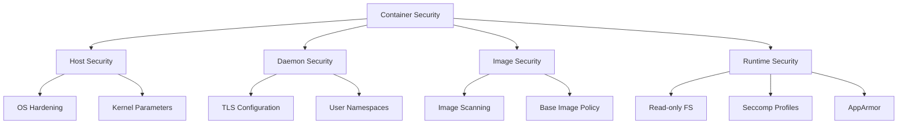

# How to Use Ansible to Configure Container Security

Author: [nawazdhandala](https://www.github.com/nawazdhandala)

Tags: Ansible, Docker, Security, Containers, DevOps

Description: Harden Docker container security with Ansible by configuring security profiles, user namespaces, read-only filesystems, and resource limits.

---

Container security is a multi-layered problem. You need to secure the Docker daemon, harden the host OS, configure containers to run with minimal privileges, and scan images for vulnerabilities. Ansible can automate all of these security controls, ensuring every host in your fleet meets the same security baseline.

I have used these patterns to pass PCI DSS audits for containerized payment processing systems. The key is defense in depth with every layer reinforcing the others.

## Security Layers



## Docker Daemon Hardening

```yaml
# roles/container_security/tasks/daemon.yml
# Harden the Docker daemon configuration
- name: Deploy hardened Docker daemon configuration
  ansible.builtin.template:
    src: daemon-secure.json.j2
    dest: /etc/docker/daemon.json
    mode: '0600'
    owner: root
    group: root
  notify: restart docker

- name: Ensure Docker socket permissions
  ansible.builtin.file:
    path: /var/run/docker.sock
    owner: root
    group: docker
    mode: '0660'

- name: Configure Docker to use TLS
  ansible.builtin.copy:
    src: "{{ item.src }}"
    dest: "/etc/docker/{{ item.dest }}"
    mode: '0400'
    owner: root
    group: root
  loop:
    - { src: ca.pem, dest: ca.pem }
    - { src: server-cert.pem, dest: server-cert.pem }
    - { src: server-key.pem, dest: server-key.pem }
  notify: restart docker
  when: docker_tls_enabled
```

```json
{
  "icc": false,
  "userns-remap": "default",
  "no-new-privileges": true,
  "live-restore": true,
  "userland-proxy": false,
  "log-driver": "json-file",
  "log-opts": {
    "max-size": "10m",
    "max-file": "3"
  },
  "storage-driver": "overlay2",
  "default-ulimits": {
    "nofile": {
      "Name": "nofile",
      "Hard": 64000,
      "Soft": 64000
    }
  }
}
```

## Host Kernel Hardening

```yaml
# roles/container_security/tasks/kernel.yml
# Configure kernel parameters for container security
- name: Set sysctl parameters for container security
  ansible.posix.sysctl:
    name: "{{ item.key }}"
    value: "{{ item.value }}"
    sysctl_set: true
    reload: true
  loop:
    - { key: "net.ipv4.conf.all.send_redirects", value: "0" }
    - { key: "net.ipv4.conf.default.send_redirects", value: "0" }
    - { key: "net.ipv4.conf.all.accept_redirects", value: "0" }
    - { key: "net.ipv4.conf.default.accept_redirects", value: "0" }
    - { key: "net.ipv4.ip_forward", value: "1" }
    - { key: "kernel.pid_max", value: "65536" }
    - { key: "vm.max_map_count", value: "262144" }
```

## Seccomp Profiles

```yaml
# roles/container_security/tasks/seccomp.yml
# Deploy custom Seccomp profiles for container restrictions
- name: Create seccomp profiles directory
  ansible.builtin.file:
    path: /etc/docker/seccomp
    state: directory
    mode: '0755'

- name: Deploy custom Seccomp profile
  ansible.builtin.copy:
    src: seccomp-default.json
    dest: /etc/docker/seccomp/default.json
    mode: '0644'

- name: Deploy container with Seccomp profile
  community.docker.docker_container:
    name: "{{ item.name }}"
    image: "{{ item.image }}"
    security_opts:
      - "seccomp=/etc/docker/seccomp/default.json"
      - "no-new-privileges:true"
    state: started
  loop: "{{ secured_containers }}"
```

## Running Containers with Minimal Privileges

```yaml
# roles/container_security/tasks/minimal_privileges.yml
# Deploy containers with security best practices
- name: Deploy hardened containers
  community.docker.docker_container:
    name: "{{ item.name }}"
    image: "{{ item.image }}"
    state: started
    # Run as non-root user
    user: "{{ item.user | default('1000:1000') }}"
    # Read-only root filesystem
    read_only: "{{ item.read_only | default(true) }}"
    # Temporary writable directories
    tmpfs:
      - "/tmp:size=100M"
      - "/var/run:size=10M"
    # Drop all capabilities, add only what is needed
    capabilities:
      - drop:ALL
    cap_add: "{{ item.capabilities | default([]) }}"
    # Security options
    security_opts:
      - "no-new-privileges:true"
    # Resource limits
    memory: "{{ item.memory_limit | default('256m') }}"
    cpus: "{{ item.cpu_limit | default(0.5) }}"
    pids_limit: "{{ item.pids_limit | default(100) }}"
    # No privileged mode
    privileged: false
  loop: "{{ hardened_containers }}"
  loop_control:
    label: "{{ item.name }}"
```

## Image Security Scanning

```yaml
# roles/container_security/tasks/scan.yml
# Scan container images for vulnerabilities
- name: Install Trivy scanner
  ansible.builtin.get_url:
    url: "https://github.com/aquasecurity/trivy/releases/download/v{{ trivy_version }}/trivy_{{ trivy_version }}_Linux-64bit.tar.gz"
    dest: /tmp/trivy.tar.gz

- name: Extract Trivy
  ansible.builtin.unarchive:
    src: /tmp/trivy.tar.gz
    dest: /usr/local/bin/
    remote_src: true

- name: Scan images for vulnerabilities
  ansible.builtin.command:
    cmd: >
      trivy image --severity HIGH,CRITICAL
      --exit-code 1
      --format json
      --output /tmp/scan-{{ item.name }}.json
      {{ item.image }}
  register: scan_results
  failed_when: false
  changed_when: false
  loop: "{{ images_to_scan }}"

- name: Report scan failures
  ansible.builtin.fail:
    msg: "Image {{ item.item.image }} has HIGH or CRITICAL vulnerabilities"
  when: item.rc == 1
  loop: "{{ scan_results.results }}"
  loop_control:
    label: "{{ item.item.name }}"
```

## Audit Logging

```yaml
# roles/container_security/tasks/audit.yml
# Configure Docker audit logging
- name: Configure auditd rules for Docker
  ansible.builtin.copy:
    dest: /etc/audit/rules.d/docker.rules
    content: |
      -w /usr/bin/docker -p wa -k docker
      -w /var/lib/docker -p wa -k docker
      -w /etc/docker -p wa -k docker
      -w /etc/docker/daemon.json -p wa -k docker
      -w /usr/bin/containerd -p wa -k docker
      -w /var/run/docker.sock -p wa -k docker
    mode: '0640'
  notify: restart auditd
```

## Conclusion

Container security with Ansible is about applying multiple layers of protection consistently. Harden the Docker daemon, lock down kernel parameters, deploy containers with minimal privileges and read-only filesystems, scan images before deployment, and log everything for audit purposes. Ansible ensures these controls are applied uniformly across every host, which is the only way to maintain a security baseline at scale.
