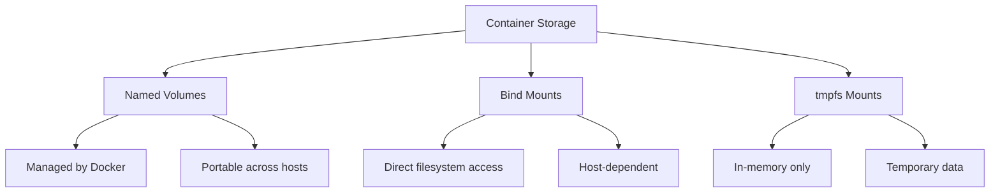

# How to Use Ansible to Configure Container Storage

Author: [nawazdhandala](https://www.github.com/nawazdhandala)

Tags: Ansible, Docker, Storage, Volumes, Containers

Description: Manage Docker container storage with Ansible including named volumes, bind mounts, NFS storage, and volume driver configuration.

---

Container storage is one of those topics that gets overlooked until something goes wrong. Containers are ephemeral by design, but your data is not. Properly configuring volumes, bind mounts, and storage drivers ensures your application data persists across container restarts and is backed up according to your organization's policies.

Ansible provides a clean way to manage Docker volumes and storage configuration, making it easy to set up consistent storage patterns across all your container hosts.

## Understanding Docker Storage Options



## Creating Named Volumes

Named volumes are the recommended way to persist data:

```yaml
# roles/container_storage/tasks/volumes.yml
# Create and manage Docker named volumes
- name: Create application data volumes
  community.docker.docker_volume:
    name: "{{ item.name }}"
    driver: "{{ item.driver | default('local') }}"
    driver_options: "{{ item.driver_options | default(omit) }}"
    labels:
      managed_by: ansible
      application: "{{ item.app | default('unknown') }}"
    state: present
  loop: "{{ docker_volumes }}"
  loop_control:
    label: "{{ item.name }}"
```

```yaml
# defaults/main.yml
# Volume definitions
docker_volumes:
  - name: postgres-data
    app: database
  - name: redis-data
    app: cache
  - name: app-uploads
    app: webapp
  - name: nginx-certs
    app: proxy
  - name: grafana-data
    app: monitoring
```

## Configuring NFS Volumes

For shared storage across multiple hosts:

```yaml
# roles/container_storage/tasks/nfs.yml
# Create Docker volumes backed by NFS storage
- name: Install NFS client packages
  ansible.builtin.package:
    name:
      - nfs-common
    state: present
  when: ansible_os_family == 'Debian'

- name: Create NFS-backed volumes
  community.docker.docker_volume:
    name: "{{ item.name }}"
    driver: local
    driver_options:
      type: nfs
      o: "addr={{ item.nfs_server }},rw,nfsvers=4"
      device: ":{{ item.nfs_path }}"
    state: present
  loop: "{{ nfs_volumes }}"
  loop_control:
    label: "{{ item.name }}"
```

```yaml
# variables
nfs_volumes:
  - name: shared-uploads
    nfs_server: "10.0.1.100"
    nfs_path: "/exports/uploads"
  - name: shared-configs
    nfs_server: "10.0.1.100"
    nfs_path: "/exports/configs"
```

## Configuring Bind Mounts

```yaml
# roles/container_storage/tasks/bind_mounts.yml
# Prepare host directories for bind mounts
- name: Create host directories for bind mounts
  ansible.builtin.file:
    path: "{{ item.host_path }}"
    state: directory
    owner: "{{ item.owner | default('root') }}"
    group: "{{ item.group | default('root') }}"
    mode: "{{ item.mode | default('0755') }}"
  loop: "{{ bind_mount_dirs }}"

- name: Deploy container with bind mounts
  community.docker.docker_container:
    name: "{{ app_name }}"
    image: "{{ app_image }}"
    volumes:
      - "{{ item.host_path }}:{{ item.container_path }}:{{ item.options | default('rw') }}"
    state: started
  loop: "{{ bind_mount_dirs }}"
```

## Docker Storage Driver Configuration

```yaml
# roles/container_storage/tasks/storage_driver.yml
# Configure Docker storage driver
- name: Configure Docker daemon storage settings
  ansible.builtin.template:
    src: daemon.json.j2
    dest: /etc/docker/daemon.json
    mode: '0644'
  notify: restart docker

- name: Prepare storage directory
  ansible.builtin.file:
    path: "{{ docker_data_root }}"
    state: directory
    mode: '0711'
  when: docker_data_root != '/var/lib/docker'
```

```json
{
  "storage-driver": "{{ docker_storage_driver | default('overlay2') }}",
  "data-root": "{{ docker_data_root | default('/var/lib/docker') }}",
  "storage-opts": [
    "overlay2.override_kernel_check=true"
  ]
}
```

## Volume Backup Tasks

```yaml
# roles/container_storage/tasks/backup.yml
# Backup Docker volumes to a remote location
- name: Stop container before backup
  community.docker.docker_container:
    name: "{{ item.container }}"
    state: stopped
  loop: "{{ volume_backup_list }}"
  when: item.stop_container | default(false)

- name: Create volume backup
  ansible.builtin.command:
    cmd: >
      docker run --rm
      -v {{ item.volume }}:/source:ro
      -v {{ backup_dir }}:/backup
      alpine tar czf /backup/{{ item.volume }}-{{ ansible_date_time.date }}.tar.gz -C /source .
  loop: "{{ volume_backup_list }}"
  changed_when: true

- name: Start container after backup
  community.docker.docker_container:
    name: "{{ item.container }}"
    state: started
  loop: "{{ volume_backup_list }}"
  when: item.stop_container | default(false)

- name: Sync backups to remote storage
  ansible.builtin.command:
    cmd: >
      aws s3 sync {{ backup_dir }}/
      s3://{{ backup_bucket }}/docker-volumes/{{ inventory_hostname }}/
      --delete
  changed_when: true
  when: backup_to_s3 | default(false)
```

## Volume Cleanup

```yaml
# roles/container_storage/tasks/cleanup.yml
# Clean up unused Docker volumes
- name: Get list of dangling volumes
  ansible.builtin.command: docker volume ls -f dangling=true -q
  register: dangling_volumes
  changed_when: false

- name: Display dangling volumes
  ansible.builtin.debug:
    msg: "Found {{ dangling_volumes.stdout_lines | length }} dangling volumes"

- name: Remove dangling volumes
  community.docker.docker_volume:
    name: "{{ item }}"
    state: absent
  loop: "{{ dangling_volumes.stdout_lines }}"
  when: cleanup_dangling_volumes | default(false)
```

## Deploying Containers with Volumes

```yaml
# playbooks/deploy_with_storage.yml
# Deploy application containers with proper storage configuration
- name: Deploy application with storage
  hosts: app_servers
  become: true
  tasks:
    - name: Create volumes
      community.docker.docker_volume:
        name: "{{ item }}"
        state: present
      loop:
        - app-data
        - app-logs
        - app-cache

    - name: Deploy application container
      community.docker.docker_container:
        name: myapp
        image: "registry.example.com/myapp:{{ app_version }}"
        volumes:
          - "app-data:/app/data"
          - "app-logs:/app/logs"
          - "app-cache:/app/cache"
          - "/etc/ssl/certs:/etc/ssl/certs:ro"
        tmpfs:
          - "/tmp:size=100M"
        state: started
        restart_policy: unless-stopped
```

## Conclusion

Container storage management with Ansible covers creating named volumes, setting up NFS-backed shared storage, configuring bind mounts with proper permissions, and automating backups. The key is treating storage configuration as code alongside your container deployment playbooks, so volumes are created before containers need them and backups run on a schedule. With proper Ansible roles for storage management, you eliminate the risk of data loss from misconfigured or missing volumes.
