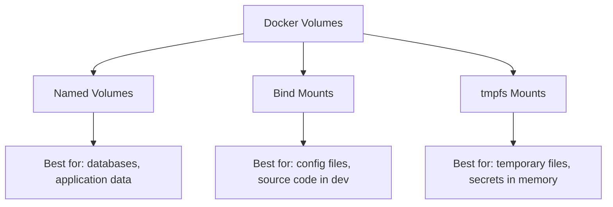

# How to Use Ansible to Configure Container Volumes

Author: [nawazdhandala](https://www.github.com/nawazdhandala)

Tags: Ansible, Docker, Volumes, Storage, Containers

Description: Manage Docker container volume mounts and persistent storage with Ansible including named volumes, bind mounts, and volume plugins.

---

Docker volumes provide persistent storage for containers. Without them, all data inside a container is lost when it stops. Ansible helps you create, configure, and manage volumes as part of your deployment workflow, ensuring data persists correctly and storage is allocated before containers start.

## Volume Types and When to Use Them



## Creating and Managing Named Volumes

```yaml
# roles/container_volumes/tasks/named.yml
# Create named volumes before deploying containers
- name: Create application volumes
  community.docker.docker_volume:
    name: "{{ item.name }}"
    driver: "{{ item.driver | default('local') }}"
    driver_options: "{{ item.options | default(omit) }}"
    labels:
      application: "{{ item.app }}"
      managed_by: ansible
    state: present
  loop: "{{ app_volumes }}"
  loop_control:
    label: "{{ item.name }}"
```

```yaml
# defaults/main.yml
app_volumes:
  - name: "{{ app_name }}-data"
    app: "{{ app_name }}"
  - name: "{{ app_name }}-logs"
    app: "{{ app_name }}"
  - name: "{{ app_name }}-config"
    app: "{{ app_name }}"
```

## Deploying Containers with Volumes

```yaml
# roles/container_volumes/tasks/deploy.yml
# Deploy containers with proper volume configuration
- name: Deploy database with persistent volume
  community.docker.docker_container:
    name: postgres
    image: "postgres:16"
    state: started
    restart_policy: unless-stopped
    volumes:
      # Named volume for data persistence
      - "postgres-data:/var/lib/postgresql/data"
      # Bind mount for custom configuration
      - "/etc/postgresql/conf.d:/etc/postgresql/conf.d:ro"
      # tmpfs for temporary files
    tmpfs:
      - "/tmp:size=100M"
    env:
      POSTGRES_DB: "{{ db_name }}"
      POSTGRES_USER: "{{ db_user }}"
      POSTGRES_PASSWORD: "{{ db_password }}"

- name: Deploy application with multiple volumes
  community.docker.docker_container:
    name: "{{ app_name }}"
    image: "{{ app_image }}"
    state: started
    volumes:
      - "{{ app_name }}-data:/app/data"
      - "{{ app_name }}-logs:/app/logs"
      - "{{ app_name }}-config:/app/config:ro"
      - "/etc/ssl/certs:/etc/ssl/certs:ro"
```

## Volume Backup and Restore

```yaml
# roles/container_volumes/tasks/backup.yml
# Backup volume data to a tar archive
- name: Create backup directory
  ansible.builtin.file:
    path: "{{ backup_path }}"
    state: directory
    mode: '0700'

- name: Backup volume data
  ansible.builtin.command:
    cmd: >
      docker run --rm
      -v {{ item }}:/source:ro
      -v {{ backup_path }}:/backup
      alpine
      tar czf /backup/{{ item }}-{{ ansible_date_time.date }}.tar.gz
      -C /source .
  loop: "{{ volumes_to_backup }}"
  changed_when: true

# roles/container_volumes/tasks/restore.yml
# Restore volume data from a tar archive
- name: Restore volume from backup
  ansible.builtin.command:
    cmd: >
      docker run --rm
      -v {{ volume_name }}:/target
      -v {{ backup_path }}:/backup:ro
      alpine
      sh -c "cd /target && tar xzf /backup/{{ backup_file }}"
  changed_when: true
```

## Volume Permissions

```yaml
# roles/container_volumes/tasks/permissions.yml
# Fix volume permissions for non-root containers
- name: Create volume with correct ownership
  ansible.builtin.command:
    cmd: >
      docker run --rm
      -v {{ item.volume }}:/data
      alpine
      chown -R {{ item.uid }}:{{ item.gid }} /data
  loop: "{{ volume_permissions }}"
  changed_when: true

# variables
volume_permissions:
  - volume: postgres-data
    uid: 999
    gid: 999
  - volume: app-data
    uid: 1000
    gid: 1000
```

## NFS Volume Driver

```yaml
# roles/container_volumes/tasks/nfs.yml
# Create volumes backed by NFS
- name: Create NFS-backed volume
  community.docker.docker_volume:
    name: shared-data
    driver: local
    driver_options:
      type: nfs
      o: "addr={{ nfs_server }},rw,nfsvers=4.1"
      device: ":{{ nfs_export_path }}"
    state: present
```

## Cleanup Unused Volumes

```yaml
# roles/container_volumes/tasks/cleanup.yml
# Remove dangling and unused volumes
- name: Get dangling volumes
  ansible.builtin.command: docker volume ls -f dangling=true -q
  register: dangling
  changed_when: false

- name: Remove dangling volumes
  community.docker.docker_volume:
    name: "{{ item }}"
    state: absent
  loop: "{{ dangling.stdout_lines }}"
  when: auto_cleanup_volumes | default(false)
```


## Common Use Cases

Here are several practical scenarios where this module proves essential in real-world playbooks.

### Infrastructure Provisioning Workflow

```yaml
# Complete workflow incorporating this module
- name: Infrastructure provisioning
  hosts: all
  become: true
  gather_facts: true
  tasks:
    - name: Gather system information
      ansible.builtin.setup:
        gather_subset:
          - hardware
          - network

    - name: Display system summary
      ansible.builtin.debug:
        msg: >-
          Host {{ inventory_hostname }} has
          {{ ansible_memtotal_mb }}MB RAM,
          {{ ansible_processor_vcpus }} vCPUs,
          running {{ ansible_distribution }} {{ ansible_distribution_version }}

    - name: Install required packages
      ansible.builtin.package:
        name:
          - curl
          - wget
          - git
          - vim
          - htop
          - jq
        state: present

    - name: Configure system timezone
      ansible.builtin.timezone:
        name: "{{ system_timezone | default('UTC') }}"

    - name: Configure hostname
      ansible.builtin.hostname:
        name: "{{ inventory_hostname }}"

    - name: Update /etc/hosts
      ansible.builtin.lineinfile:
        path: /etc/hosts
        regexp: '^127\.0\.1\.1'
        line: "127.0.1.1 {{ inventory_hostname }}"

    - name: Configure SSH hardening
      ansible.builtin.lineinfile:
        path: /etc/ssh/sshd_config
        regexp: "{{ item.regexp }}"
        line: "{{ item.line }}"
      loop:
        - { regexp: '^PermitRootLogin', line: 'PermitRootLogin no' }
        - { regexp: '^PasswordAuthentication', line: 'PasswordAuthentication no' }
      notify: restart sshd

    - name: Configure firewall rules
      community.general.ufw:
        rule: allow
        port: "{{ item }}"
        proto: tcp
      loop:
        - "22"
        - "80"
        - "443"

    - name: Enable firewall
      community.general.ufw:
        state: enabled
        policy: deny

  handlers:
    - name: restart sshd
      ansible.builtin.service:
        name: sshd
        state: restarted
```

### Integration with Monitoring

```yaml
# Using gathered facts to configure monitoring thresholds
- name: Configure monitoring based on system specs
  hosts: all
  become: true
  tasks:
    - name: Set monitoring thresholds based on hardware
      ansible.builtin.template:
        src: monitoring_config.yml.j2
        dest: /etc/monitoring/config.yml
      vars:
        memory_warning_threshold: "{{ (ansible_memtotal_mb * 0.8) | int }}"
        memory_critical_threshold: "{{ (ansible_memtotal_mb * 0.95) | int }}"
        cpu_warning_threshold: 80
        cpu_critical_threshold: 95

    - name: Register host with monitoring system
      ansible.builtin.uri:
        url: "https://monitoring.example.com/api/hosts"
        method: POST
        body_format: json
        body:
          hostname: "{{ inventory_hostname }}"
          ip_address: "{{ ansible_default_ipv4.address }}"
          os: "{{ ansible_distribution }}"
          memory_mb: "{{ ansible_memtotal_mb }}"
          cpus: "{{ ansible_processor_vcpus }}"
        headers:
          Authorization: "Bearer {{ monitoring_api_token }}"
        status_code: [200, 201, 409]
```

### Error Handling Patterns

```yaml
# Robust error handling with this module
- name: Robust task execution
  hosts: all
  tasks:
    - name: Attempt primary operation
      ansible.builtin.command: /opt/app/primary-task.sh
      register: primary_result
      failed_when: false

    - name: Handle primary failure with fallback
      ansible.builtin.command: /opt/app/fallback-task.sh
      when: primary_result.rc != 0
      register: fallback_result

    - name: Report final status
      ansible.builtin.debug:
        msg: >-
          Task completed via {{ 'primary' if primary_result.rc == 0 else 'fallback' }} path.
          Return code: {{ primary_result.rc if primary_result.rc == 0 else fallback_result.rc }}

    - name: Fail if both paths failed
      ansible.builtin.fail:
        msg: "Both primary and fallback operations failed"
      when:
        - primary_result.rc != 0
        - fallback_result is defined
        - fallback_result.rc != 0
```

### Scheduling and Automation

```yaml
# Set up scheduled compliance scans using cron
- name: Configure automated scans
  hosts: all
  become: true
  tasks:
    - name: Create scan script
      ansible.builtin.copy:
        dest: /opt/scripts/compliance_scan.sh
        mode: '0755'
        content: |
          #!/bin/bash
          cd /opt/ansible
          ansible-playbook playbooks/validate.yml -i inventory/ > /var/log/compliance_scan.log 2>&1
          EXIT_CODE=$?
          if [ $EXIT_CODE -ne 0 ]; then
            curl -X POST https://hooks.example.com/alert \
              -H "Content-Type: application/json" \
              -d "{\"text\":\"Compliance scan failed on $(hostname)\"}"
          fi
          exit $EXIT_CODE

    - name: Schedule weekly compliance scan
      ansible.builtin.cron:
        name: "Weekly compliance scan"
        minute: "0"
        hour: "3"
        weekday: "1"
        job: "/opt/scripts/compliance_scan.sh"
        user: ansible
```


## Conclusion

Docker volumes are the foundation of persistent storage in containers. Ansible ensures volumes are created before containers need them, backed up on schedule, restored when needed, and cleaned up when no longer in use. Whether you use named volumes for databases, bind mounts for configuration, or NFS-backed volumes for shared storage, Ansible gives you a consistent management layer across all your container hosts.
