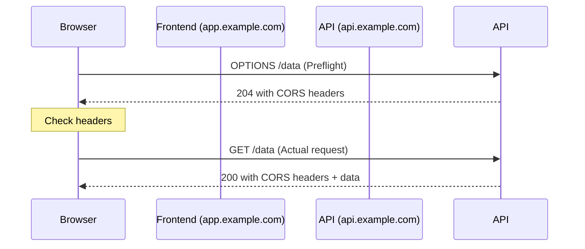

# How to Use Ansible to Configure CORS Headers

Author: [nawazdhandala](https://www.github.com/nawazdhandala)

Tags: Ansible, CORS, Nginx, Security, DevOps

Description: Automate CORS header configuration in Nginx using Ansible to manage cross-origin resource sharing policies consistently across your web servers.

---

Cross-Origin Resource Sharing (CORS) is a security mechanism that controls which domains can access resources on your server. Getting CORS wrong is one of the most common sources of frustration in web development. Either the API blocks legitimate frontend requests, or the policy is too permissive and creates security holes. Ansible helps you deploy consistent CORS configurations across all your servers so you do not end up with one server allowing everything while another blocks everything.

This post covers building an Ansible role that configures CORS headers in Nginx, handling preflight requests, allowed origins, methods, and credentials.

## How CORS Works

When a browser makes a cross-origin request (for example, a frontend on `app.example.com` calling an API on `api.example.com`), it checks the response headers to decide whether to allow the request. For certain types of requests, the browser first sends a preflight OPTIONS request to check if the server allows the actual request.



The key CORS headers are:

- `Access-Control-Allow-Origin`: Which origins can access the resource.
- `Access-Control-Allow-Methods`: Which HTTP methods are allowed.
- `Access-Control-Allow-Headers`: Which request headers are allowed.
- `Access-Control-Allow-Credentials`: Whether cookies/auth headers are allowed.
- `Access-Control-Max-Age`: How long the browser can cache the preflight response.

## Project Structure

```
nginx-cors/
  inventory/
    hosts.yml
  roles/
    nginx_cors/
      tasks/
        main.yml
      templates/
        cors.conf.j2
        cors_site.conf.j2
      defaults/
        main.yml
      handlers/
        main.yml
  playbook.yml
```

## Default Variables

```yaml
# roles/nginx_cors/defaults/main.yml
# Allowed origins - use a list for multiple domains
# Set to ["*"] to allow all origins (not recommended for production)
nginx_cors_allowed_origins:
  - "https://app.example.com"
  - "https://staging.example.com"

# Allowed HTTP methods
nginx_cors_allowed_methods:
  - GET
  - POST
  - PUT
  - DELETE
  - PATCH
  - OPTIONS

# Allowed request headers
nginx_cors_allowed_headers:
  - Authorization
  - Content-Type
  - X-Requested-With
  - Accept
  - Origin
  - X-Custom-Header

# Headers exposed to the browser
nginx_cors_expose_headers:
  - X-Request-Id
  - X-RateLimit-Limit
  - X-RateLimit-Remaining

# Allow credentials (cookies, auth headers)
nginx_cors_allow_credentials: true

# Preflight cache duration in seconds
nginx_cors_max_age: 86400

# Backend server
nginx_cors_backend: "127.0.0.1:8080"
nginx_cors_server_name: "api.example.com"
```

## CORS Configuration Template

This is the reusable CORS snippet that can be included in any location block. It handles both preflight OPTIONS requests and regular cross-origin requests.

```nginx
# roles/nginx_cors/templates/cors.conf.j2
# CORS configuration snippet
# Include this in location blocks that need CORS support

# Check if the origin is in the allowed list
set $cors_origin "";
set $cors_credentials "";
set $cors_methods "";
set $cors_headers "";
set $cors_expose "";
set $cors_max_age "";


if ($http_origin = "{{ origin }}") {
    set $cors_origin "{{ origin }}";
    set $cors_credentials "{{ 'true' if nginx_cors_allow_credentials else 'false' }}";
    set $cors_methods "{{ nginx_cors_allowed_methods | join(', ') }}";
    set $cors_headers "{{ nginx_cors_allowed_headers | join(', ') }}";
    set $cors_expose "{{ nginx_cors_expose_headers | join(', ') }}";
    set $cors_max_age "{{ nginx_cors_max_age }}";
}


# Handle preflight OPTIONS request
if ($request_method = 'OPTIONS') {
    add_header 'Access-Control-Allow-Origin' $cors_origin always;
    add_header 'Access-Control-Allow-Methods' $cors_methods always;
    add_header 'Access-Control-Allow-Headers' $cors_headers always;
    add_header 'Access-Control-Allow-Credentials' $cors_credentials always;
    add_header 'Access-Control-Max-Age' $cors_max_age always;
    add_header 'Content-Type' 'text/plain; charset=utf-8';
    add_header 'Content-Length' 0;
    return 204;
}

# Add CORS headers to actual responses
add_header 'Access-Control-Allow-Origin' $cors_origin always;
add_header 'Access-Control-Allow-Credentials' $cors_credentials always;
add_header 'Access-Control-Expose-Headers' $cors_expose always;
```

## Site Configuration Template

```nginx
# roles/nginx_cors/templates/cors_site.conf.j2
server {
    listen 80;
    server_name {{ nginx_cors_server_name }};

    # API endpoints with CORS
    location /api/ {
        # Include CORS configuration
        include /etc/nginx/snippets/cors.conf;

        proxy_pass http://{{ nginx_cors_backend }};
        proxy_set_header Host $host;
        proxy_set_header X-Real-IP $remote_addr;
        proxy_set_header X-Forwarded-For $proxy_add_x_forwarded_for;
        proxy_set_header X-Forwarded-Proto $scheme;
    }

    # Health check (no CORS needed)
    location /health {
        proxy_pass http://{{ nginx_cors_backend }};
        proxy_set_header Host $host;
    }

    # Public assets (allow all origins)
    location /public/ {
        add_header 'Access-Control-Allow-Origin' '*' always;
        proxy_pass http://{{ nginx_cors_backend }};
        proxy_set_header Host $host;
    }
}
```

## Ansible Tasks

```yaml
# roles/nginx_cors/tasks/main.yml
---
- name: Install Nginx
  ansible.builtin.apt:
    name: nginx
    state: present
    update_cache: yes
  become: true

- name: Create Nginx snippets directory
  ansible.builtin.file:
    path: /etc/nginx/snippets
    state: directory
    owner: root
    group: root
    mode: "0755"
  become: true

- name: Deploy CORS configuration snippet
  ansible.builtin.template:
    src: cors.conf.j2
    dest: /etc/nginx/snippets/cors.conf
    owner: root
    group: root
    mode: "0644"
  become: true
  notify: Validate and reload nginx

- name: Deploy site configuration
  ansible.builtin.template:
    src: cors_site.conf.j2
    dest: /etc/nginx/sites-available/cors_site.conf
    owner: root
    group: root
    mode: "0644"
  become: true
  notify: Validate and reload nginx

- name: Enable site
  ansible.builtin.file:
    src: /etc/nginx/sites-available/cors_site.conf
    dest: /etc/nginx/sites-enabled/cors_site.conf
    state: link
  become: true
  notify: Validate and reload nginx

- name: Remove default site
  ansible.builtin.file:
    path: /etc/nginx/sites-enabled/default
    state: absent
  become: true
  notify: Validate and reload nginx

- name: Ensure Nginx is running
  ansible.builtin.systemd:
    name: nginx
    state: started
    enabled: true
  become: true
```

## Handlers

```yaml
# roles/nginx_cors/handlers/main.yml
---
- name: Validate and reload nginx
  ansible.builtin.command: nginx -t
  become: true
  changed_when: false
  notify: Reload nginx

- name: Reload nginx
  ansible.builtin.systemd:
    name: nginx
    state: reloaded
  become: true
```

## The Playbook

```yaml
# playbook.yml
---
- name: Configure CORS headers in Nginx
  hosts: api_servers
  become: true
  vars:
    nginx_cors_server_name: "api.myapp.com"
    nginx_cors_backend: "127.0.0.1:3000"
    nginx_cors_allowed_origins:
      - "https://myapp.com"
      - "https://www.myapp.com"
      - "https://staging.myapp.com"
    nginx_cors_allow_credentials: true
  roles:
    - nginx_cors
```

## Testing CORS

After deployment, test CORS with curl by sending a preflight request:

```bash
# Test preflight request
curl -X OPTIONS \
  -H "Origin: https://myapp.com" \
  -H "Access-Control-Request-Method: POST" \
  -H "Access-Control-Request-Headers: Content-Type, Authorization" \
  -v http://api.myapp.com/api/data 2>&1 | grep -i "access-control"

# Expected output:
# Access-Control-Allow-Origin: https://myapp.com
# Access-Control-Allow-Methods: GET, POST, PUT, DELETE, PATCH, OPTIONS
# Access-Control-Allow-Headers: Authorization, Content-Type, ...
# Access-Control-Allow-Credentials: true

# Test actual cross-origin request
curl -X GET \
  -H "Origin: https://myapp.com" \
  -v http://api.myapp.com/api/data 2>&1 | grep -i "access-control"

# Test from disallowed origin (should have empty CORS headers)
curl -X GET \
  -H "Origin: https://evil.com" \
  -v http://api.myapp.com/api/data 2>&1 | grep -i "access-control"
```

## Common CORS Mistakes

One frequent mistake is using `Access-Control-Allow-Origin: *` together with `Access-Control-Allow-Credentials: true`. Browsers will reject this combination because it is a security risk. If you need credentials, you must specify the exact origin.

Another common issue is forgetting the `always` parameter on `add_header`. Without it, Nginx only adds headers on successful responses (2xx). If your backend returns a 4xx or 5xx error, the CORS headers will be missing and the browser will show a CORS error instead of the actual error message.

The snippet approach in this post avoids both issues by dynamically checking the request origin against the allowlist and including the `always` parameter on all headers.

## Summary

Configuring CORS correctly is critical for any API that serves frontend applications on different domains. The Ansible role in this post gives you a reusable, testable CORS configuration that handles preflight requests, multiple allowed origins, and credential support. By deploying it with Ansible, you ensure every API server has identical CORS policies.
