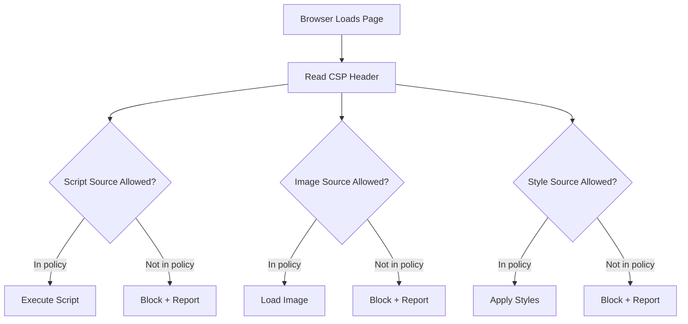

# How to Use Ansible to Configure CSP (Content Security Policy) Headers

Author: [nawazdhandala](https://www.github.com/nawazdhandala)

Tags: Ansible, CSP, Content Security Policy, Web Security, Nginx

Description: Deploy and manage Content Security Policy headers across your web servers using Ansible to protect against XSS, data injection, and other client-side attacks.

---

Content Security Policy (CSP) is a powerful HTTP header that tells browsers exactly which sources of content are allowed to load on your pages. It is one of the most effective defenses against cross-site scripting (XSS), clickjacking, and other injection attacks. But CSP is also one of the most complex security headers to configure correctly, and getting it wrong can break your site.

Managing CSP across a fleet of web servers adds another layer of complexity. Each application may need different policies, and a change in one place needs to propagate everywhere. Ansible handles this by letting you define CSP policies as variables and deploy them consistently to all your web servers.

## Understanding CSP

A CSP header is essentially a whitelist of allowed content sources. When a browser loads a page with a CSP header, it blocks any resource that does not match the policy.



Key CSP directives:
- **default-src**: Fallback for all resource types
- **script-src**: Controls JavaScript sources
- **style-src**: Controls CSS sources
- **img-src**: Controls image sources
- **connect-src**: Controls XHR, WebSocket, and fetch targets
- **font-src**: Controls web font sources
- **frame-src**: Controls iframe sources
- **report-uri / report-to**: Where to send violation reports

## Basic CSP Configuration with Nginx

Let's start with a simple CSP deployment on Nginx.

This playbook configures a basic CSP header on Nginx:

```yaml
# nginx_csp.yml - Configure CSP on Nginx
---
- name: Configure CSP headers on Nginx
  hosts: webservers
  become: true

  vars:
    csp_policy:
      default_src: "'self'"
      script_src: "'self' 'unsafe-inline' https://cdn.example.com"
      style_src: "'self' 'unsafe-inline' https://fonts.googleapis.com"
      img_src: "'self' data: https:"
      font_src: "'self' https://fonts.gstatic.com"
      connect_src: "'self' https://api.example.com"
      frame_ancestors: "'self'"
      base_uri: "'self'"
      form_action: "'self'"
      object_src: "'none'"
      upgrade_insecure_requests: true

  tasks:
    - name: Build CSP header string
      ansible.builtin.set_fact:
        csp_header: >-
          default-src {{ csp_policy.default_src }};
          script-src {{ csp_policy.script_src }};
          style-src {{ csp_policy.style_src }};
          img-src {{ csp_policy.img_src }};
          font-src {{ csp_policy.font_src }};
          connect-src {{ csp_policy.connect_src }};
          frame-ancestors {{ csp_policy.frame_ancestors }};
          base-uri {{ csp_policy.base_uri }};
          form-action {{ csp_policy.form_action }};
          object-src {{ csp_policy.object_src }}
          {{ '; upgrade-insecure-requests' if csp_policy.upgrade_insecure_requests else '' }}

    - name: Deploy CSP configuration snippet
      ansible.builtin.copy:
        content: |
          # Content Security Policy - Managed by Ansible
          add_header Content-Security-Policy "{{ csp_header }}" always;
        dest: /etc/nginx/snippets/csp.conf
        owner: root
        group: root
        mode: '0644'
      notify: reload nginx

    - name: Validate Nginx configuration
      ansible.builtin.command: nginx -t
      changed_when: false

  handlers:
    - name: reload nginx
      ansible.builtin.service:
        name: nginx
        state: reloaded
```

## CSP Report-Only Mode

Before enforcing a CSP, deploy it in report-only mode first. This logs violations without blocking anything, letting you tune the policy before enforcement.

This playbook deploys CSP in report-only mode:

```yaml
# csp_report_only.yml - Deploy CSP in report-only mode
---
- name: Deploy CSP in report-only mode
  hosts: webservers
  become: true

  vars:
    csp_report_uri: "https://csp-reports.example.com/report"
    csp_policy:
      default_src: "'self'"
      script_src: "'self'"
      style_src: "'self'"
      img_src: "'self' data:"
      object_src: "'none'"

  tasks:
    - name: Build CSP header
      ansible.builtin.set_fact:
        csp_header: >-
          default-src {{ csp_policy.default_src }};
          script-src {{ csp_policy.script_src }};
          style-src {{ csp_policy.style_src }};
          img-src {{ csp_policy.img_src }};
          object-src {{ csp_policy.object_src }};
          report-uri {{ csp_report_uri }}

    - name: Deploy CSP Report-Only header
      ansible.builtin.copy:
        content: |
          # CSP Report-Only Mode - Managed by Ansible
          # This header reports violations without blocking content
          add_header Content-Security-Policy-Report-Only "{{ csp_header }}" always;
        dest: /etc/nginx/snippets/csp-report-only.conf
        owner: root
        group: root
        mode: '0644'
      notify: reload nginx

  handlers:
    - name: reload nginx
      ansible.builtin.service:
        name: nginx
        state: reloaded
```

## Setting Up a CSP Report Collector

To process CSP violation reports, you need a collector endpoint. Here is a simple one you can deploy with Ansible.

This playbook deploys a CSP report collection endpoint:

```yaml
# csp_report_collector.yml - Deploy CSP report collector
---
- name: Deploy CSP report collector
  hosts: monitoring
  become: true

  tasks:
    - name: Install Node.js for report collector
      ansible.builtin.package:
        name: nodejs
        state: present

    - name: Create report collector directory
      ansible.builtin.file:
        path: /opt/csp-collector
        state: directory
        owner: www-data
        group: www-data
        mode: '0755'

    - name: Deploy report collector script
      ansible.builtin.copy:
        content: |
          // CSP Report Collector - Managed by Ansible
          const http = require('http');
          const fs = require('fs');

          const LOG_FILE = '/var/log/csp-reports.json';
          const PORT = 8081;

          const server = http.createServer((req, res) => {
            if (req.method === 'POST' && req.url === '/report') {
              let body = '';
              req.on('data', chunk => body += chunk);
              req.on('end', () => {
                try {
                  const report = JSON.parse(body);
                  const logEntry = {
                    timestamp: new Date().toISOString(),
                    report: report['csp-report'] || report
                  };
                  fs.appendFileSync(LOG_FILE, JSON.stringify(logEntry) + '\n');
                  console.log(`CSP violation: ${logEntry.report['violated-directive'] || 'unknown'}`);
                } catch (e) {
                  console.error('Failed to parse report:', e.message);
                }
                res.writeHead(204);
                res.end();
              });
            } else {
              res.writeHead(404);
              res.end();
            }
          });

          server.listen(PORT, () => {
            console.log(`CSP Report Collector listening on port ${PORT}`);
          });
        dest: /opt/csp-collector/server.js
        mode: '0644'

    - name: Create systemd service for collector
      ansible.builtin.copy:
        content: |
          [Unit]
          Description=CSP Report Collector
          After=network.target

          [Service]
          ExecStart=/usr/bin/node /opt/csp-collector/server.js
          Restart=always
          User=www-data
          Group=www-data
          Environment=NODE_ENV=production

          [Install]
          WantedBy=multi-user.target
        dest: /etc/systemd/system/csp-collector.service
        mode: '0644'
      notify: start csp collector

  handlers:
    - name: start csp collector
      ansible.builtin.systemd:
        name: csp-collector
        state: started
        enabled: true
        daemon_reload: true
```

## Per-Application CSP Policies

Different applications need different CSP policies. Here is how to manage multiple policies.

This playbook deploys application-specific CSP configurations:

```yaml
# app_specific_csp.yml - Per-application CSP policies
---
- name: Deploy per-application CSP policies
  hosts: webservers
  become: true

  vars:
    app_csp_policies:
      main_site:
        server_name: "www.example.com"
        policy:
          default_src: "'self'"
          script_src: "'self' https://cdn.example.com https://www.google-analytics.com"
          style_src: "'self' 'unsafe-inline' https://fonts.googleapis.com"
          img_src: "'self' data: https://images.example.com https://www.google-analytics.com"
          font_src: "'self' https://fonts.gstatic.com"
          connect_src: "'self' https://api.example.com"
          frame_ancestors: "'none'"
          object_src: "'none'"

      admin_panel:
        server_name: "admin.example.com"
        policy:
          default_src: "'self'"
          script_src: "'self'"
          style_src: "'self' 'unsafe-inline'"
          img_src: "'self' data:"
          connect_src: "'self' https://api.example.com"
          frame_ancestors: "'self'"
          object_src: "'none'"

      api:
        server_name: "api.example.com"
        policy:
          default_src: "'none'"
          frame_ancestors: "'none'"

  tasks:
    - name: Generate CSP snippets for each application
      ansible.builtin.template:
        src: csp_snippet.j2
        dest: "/etc/nginx/snippets/csp-{{ item.key }}.conf"
        owner: root
        group: root
        mode: '0644'
      loop: "{{ app_csp_policies | dict2items }}"
      notify: reload nginx

  handlers:
    - name: reload nginx
      ansible.builtin.service:
        name: nginx
        state: reloaded
```

The template for generating CSP snippets:

```
# templates/csp_snippet.j2 - CSP configuration for {{ item.key }}
# Server: {{ item.value.server_name }}
# Managed by Ansible












add_header Content-Security-Policy "{{ directives | join('; ') }}" always;
```

## Configuring CSP on Apache

Apache uses mod_headers similarly to Nginx.

This playbook configures CSP for Apache:

```yaml
# apache_csp.yml - Configure CSP on Apache
---
- name: Configure CSP on Apache
  hosts: apache_servers
  become: true

  vars:
    csp_policy: "default-src 'self'; script-src 'self' https://cdn.example.com; style-src 'self' 'unsafe-inline'; img-src 'self' data:; object-src 'none'; frame-ancestors 'self'"

  tasks:
    - name: Enable headers module
      ansible.builtin.command: a2enmod headers
      changed_when: true
      failed_when: false

    - name: Deploy CSP configuration
      ansible.builtin.copy:
        content: |
          # Content Security Policy - Managed by Ansible
          <IfModule mod_headers.c>
              Header always set Content-Security-Policy "{{ csp_policy }}"
          </IfModule>
        dest: /etc/apache2/conf-available/csp.conf
        owner: root
        group: root
        mode: '0644'

    - name: Enable CSP configuration
      ansible.builtin.command: a2enconf csp
      changed_when: true
      failed_when: false
      notify: reload apache

  handlers:
    - name: reload apache
      ansible.builtin.service:
        name: apache2
        state: reloaded
```

## Gradual CSP Rollout Strategy

A phased approach prevents breaking your site:

```yaml
# csp_rollout.yml - Phased CSP deployment
---
- name: Phased CSP rollout
  hosts: webservers
  become: true

  vars:
    csp_phase: report_only  # Options: report_only, enforce_basic, enforce_strict

    csp_phases:
      report_only:
        header_name: Content-Security-Policy-Report-Only
        policy: "default-src 'self' 'unsafe-inline' 'unsafe-eval' https: data:; report-uri /csp-report"

      enforce_basic:
        header_name: Content-Security-Policy
        policy: "default-src 'self' 'unsafe-inline' https:; img-src 'self' data: https:; object-src 'none'"

      enforce_strict:
        header_name: Content-Security-Policy
        policy: "default-src 'self'; script-src 'self'; style-src 'self' 'unsafe-inline'; img-src 'self' data:; object-src 'none'; frame-ancestors 'self'"

  tasks:
    - name: Deploy current phase CSP
      ansible.builtin.copy:
        content: |
          # CSP Phase: {{ csp_phase }} - Managed by Ansible
          add_header {{ csp_phases[csp_phase].header_name }} "{{ csp_phases[csp_phase].policy }}" always;
        dest: /etc/nginx/snippets/csp.conf
        mode: '0644'
      notify: reload nginx

    - name: Report current CSP phase
      ansible.builtin.debug:
        msg: "CSP Phase: {{ csp_phase }} | Header: {{ csp_phases[csp_phase].header_name }}"

  handlers:
    - name: reload nginx
      ansible.builtin.service:
        name: nginx
        state: reloaded
```

## Testing CSP Headers

Verify that CSP headers are correctly deployed:

```yaml
# test_csp.yml - Verify CSP header deployment
---
- name: Test CSP headers
  hosts: webservers
  become: true

  tasks:
    - name: Check CSP header is present
      ansible.builtin.uri:
        url: "https://{{ ansible_fqdn }}"
        method: HEAD
        validate_certs: false
        return_content: false
      register: response

    - name: Verify CSP header exists
      ansible.builtin.assert:
        that:
          - "'content-security-policy' in (response | string | lower) or 'content_security_policy' in (response | string | lower)"
        fail_msg: "CSP header missing on {{ inventory_hostname }}"
        success_msg: "CSP header present on {{ inventory_hostname }}"

    - name: Check for unsafe directives in production
      ansible.builtin.debug:
        msg: "WARNING: CSP contains 'unsafe-eval' which weakens protection"
      when: "'unsafe-eval' in (response.content_security_policy | default(''))"
```

## Common CSP Mistakes and Fixes

Here is a reference for common issues:

```yaml
# csp_examples.yml - CSP directive examples and anti-patterns
---
# BAD: Too permissive, defeats the purpose of CSP
bad_csp: "default-src *; script-src * 'unsafe-inline' 'unsafe-eval'"

# BAD: Missing default-src, leaves holes for unlisted directives
incomplete_csp: "script-src 'self'; style-src 'self'"

# GOOD: Restrictive with specific exceptions
good_csp: "default-src 'self'; script-src 'self' https://trusted-cdn.com; style-src 'self' 'unsafe-inline'; img-src 'self' data: https://images.example.com; object-src 'none'; frame-ancestors 'self'; base-uri 'self'"

# BEST: Using nonces or hashes instead of unsafe-inline
best_csp: "default-src 'self'; script-src 'self' 'nonce-{random}'; style-src 'self' 'nonce-{random}'; object-src 'none'"
```

## Practical Advice

1. **Always start in report-only mode.** Deploying a strict CSP without testing will almost certainly break something. Collect reports first.
2. **Avoid 'unsafe-inline' and 'unsafe-eval' if possible.** These directives significantly weaken CSP protection. Use nonces or hashes instead.
3. **Do not use wildcard sources.** `script-src *` defeats the purpose of CSP entirely. Be specific about allowed sources.
4. **Include 'object-src none'.** This blocks Flash and other plugin content, which is rarely needed and often exploited.
5. **Set frame-ancestors.** This replaces the X-Frame-Options header and prevents clickjacking.
6. **Monitor CSP reports continuously.** Violations indicate either a policy that is too strict or actual attack attempts. Both need attention.

CSP with Ansible lets you manage one of the most important web security headers consistently across your entire infrastructure. Start simple, test thoroughly, and tighten gradually.
