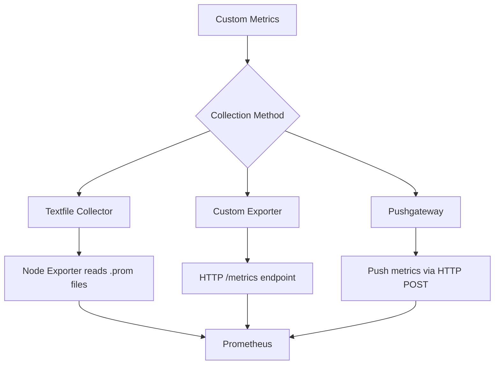

# How to Use Ansible to Configure Custom Metrics Collection

Author: [nawazdhandala](https://www.github.com/nawazdhandala)

Tags: Ansible, Monitoring, Custom Metrics, Prometheus, DevOps

Description: Automate the deployment of custom metrics collection using Ansible, including application metrics exporters, textfile collectors, and pushgateway integration.

---

Standard monitoring tools collect system metrics out of the box, but the most valuable metrics are often the ones specific to your application and business. Things like order processing time, queue depth, active user sessions, cache hit rates, and deployment frequency are not available from any standard exporter. You need custom metrics collection, and Ansible can automate the deployment of the scripts, exporters, and configurations that make this possible.

This post covers three approaches to custom metrics collection with Ansible: the Prometheus textfile collector, custom Prometheus exporters, and the Pushgateway for batch jobs.

## Three Approaches to Custom Metrics



**Textfile Collector**: Best for metrics generated by cron jobs or batch scripts. A script writes metrics to a `.prom` file, and Node Exporter exposes them.

**Custom Exporter**: Best for always-running services that expose a `/metrics` endpoint. Prometheus scrapes this endpoint directly.

**Pushgateway**: Best for short-lived jobs (like CI/CD pipelines or batch processing) that cannot be scraped because they exit before Prometheus comes around.

## Project Structure

```
custom-metrics/
  inventory/
    hosts.yml
  roles/
    textfile_metrics/
      tasks/
        main.yml
      templates/
        metric_scripts/
          backup_status.sh.j2
          cert_expiry.sh.j2
          app_health.sh.j2
      defaults/
        main.yml
    custom_exporter/
      tasks/
        main.yml
      templates/
        custom_exporter.py.j2
        custom_exporter.service.j2
      defaults/
        main.yml
      handlers/
        main.yml
    pushgateway/
      tasks/
        main.yml
      templates/
        pushgateway.service.j2
        push_metrics.sh.j2
      defaults/
        main.yml
      handlers/
        main.yml
  playbook.yml
```

## Approach 1: Textfile Collector

The textfile collector is the simplest way to expose custom metrics. You write a script that generates metrics in the Prometheus text format, schedule it with cron, and Node Exporter picks up the output.

### Default Variables

```yaml
# roles/textfile_metrics/defaults/main.yml
textfile_collector_dir: "/var/lib/node_exporter/textfile_collector"
textfile_scripts_dir: "/opt/metrics/scripts"
textfile_metrics_user: "node_exporter"

# Metric scripts to deploy
textfile_metric_scripts:
  - name: backup_status
    schedule: "*/5 * * * *"
    description: "Track backup job status"
  - name: cert_expiry
    schedule: "0 */6 * * *"
    description: "Check SSL certificate expiration"
  - name: app_health
    schedule: "* * * * *"
    description: "Application health metrics"

# Application health check URLs
app_health_endpoints:
  - name: "api"
    url: "http://localhost:3000/health"
  - name: "worker"
    url: "http://localhost:3001/health"

# SSL certificates to monitor
ssl_certificates:
  - name: "main_site"
    host: "www.example.com"
    port: 443
  - name: "api"
    host: "api.example.com"
    port: 443

# Backup directories to check
backup_directories:
  - path: "/backup/database"
    max_age_hours: 24
  - path: "/backup/files"
    max_age_hours: 48
```

### Tasks

```yaml
# roles/textfile_metrics/tasks/main.yml
---
- name: Create directories
  ansible.builtin.file:
    path: "{{ item }}"
    state: directory
    owner: "{{ textfile_metrics_user }}"
    group: "{{ textfile_metrics_user }}"
    mode: "0755"
  loop:
    - "{{ textfile_collector_dir }}"
    - "{{ textfile_scripts_dir }}"
  become: true

- name: Deploy metric collection scripts
  ansible.builtin.template:
    src: "metric_scripts/{{ item.name }}.sh.j2"
    dest: "{{ textfile_scripts_dir }}/{{ item.name }}.sh"
    owner: "{{ textfile_metrics_user }}"
    group: "{{ textfile_metrics_user }}"
    mode: "0755"
  loop: "{{ textfile_metric_scripts }}"
  become: true

- name: Schedule metric collection cron jobs
  ansible.builtin.cron:
    name: "Collect {{ item.name }} metrics"
    job: "{{ textfile_scripts_dir }}/{{ item.name }}.sh > {{ textfile_collector_dir }}/{{ item.name }}.prom.tmp && mv {{ textfile_collector_dir }}/{{ item.name }}.prom.tmp {{ textfile_collector_dir }}/{{ item.name }}.prom"
    minute: "{{ item.schedule.split(' ')[0] }}"
    hour: "{{ item.schedule.split(' ')[1] }}"
    day: "{{ item.schedule.split(' ')[2] }}"
    month: "{{ item.schedule.split(' ')[3] }}"
    weekday: "{{ item.schedule.split(' ')[4] }}"
    user: "{{ textfile_metrics_user }}"
  loop: "{{ textfile_metric_scripts }}"
  become: true

- name: Run scripts once to generate initial metrics
  ansible.builtin.command: "{{ textfile_scripts_dir }}/{{ item.name }}.sh"
  loop: "{{ textfile_metric_scripts }}"
  become: true
  become_user: "{{ textfile_metrics_user }}"
  changed_when: false
  register: script_output

- name: Write initial metric files
  ansible.builtin.copy:
    content: "{{ item.stdout }}"
    dest: "{{ textfile_collector_dir }}/{{ item.item.name }}.prom"
    owner: "{{ textfile_metrics_user }}"
    group: "{{ textfile_metrics_user }}"
    mode: "0644"
  loop: "{{ script_output.results }}"
  become: true
```

### Backup Status Script

```bash
# roles/textfile_metrics/templates/metric_scripts/backup_status.sh.j2
#!/bin/bash
# Generates Prometheus metrics for backup status
# Checks backup directories for freshness


# Check {{ backup.path }}
BACKUP_DIR="{{ backup.path }}"
MAX_AGE_SECONDS=$(( {{ backup.max_age_hours }} * 3600 ))

if [ -d "$BACKUP_DIR" ]; then
    LATEST_FILE=$(find "$BACKUP_DIR" -type f -printf '%T@\n' 2>/dev/null | sort -rn | head -1)
    if [ -n "$LATEST_FILE" ]; then
        LATEST_TIMESTAMP=$(printf "%.0f" "$LATEST_FILE")
        NOW=$(date +%s)
        AGE=$(( NOW - LATEST_TIMESTAMP ))

        if [ "$AGE" -lt "$MAX_AGE_SECONDS" ]; then
            echo "backup_status{path=\"{{ backup.path }}\"} 1"
        else
            echo "backup_status{path=\"{{ backup.path }}\"} 0"
        fi
        echo "backup_last_success_timestamp{path=\"{{ backup.path }}\"} $LATEST_TIMESTAMP"
        echo "backup_age_seconds{path=\"{{ backup.path }}\"} $AGE"
    else
        echo "backup_status{path=\"{{ backup.path }}\"} 0"
        echo "backup_age_seconds{path=\"{{ backup.path }}\"} -1"
    fi
else
    echo "backup_status{path=\"{{ backup.path }}\"} 0"
fi

```

### Certificate Expiry Script

```bash
# roles/textfile_metrics/templates/metric_scripts/cert_expiry.sh.j2
#!/bin/bash
# Generates Prometheus metrics for SSL certificate expiration


# Check certificate for {{ cert.host }}
EXPIRY_DATE=$(echo | openssl s_client -servername {{ cert.host }} -connect {{ cert.host }}:{{ cert.port }} 2>/dev/null | openssl x509 -noout -enddate 2>/dev/null | cut -d= -f2)

if [ -n "$EXPIRY_DATE" ]; then
    EXPIRY_EPOCH=$(date -d "$EXPIRY_DATE" +%s 2>/dev/null)
    NOW=$(date +%s)
    DAYS_LEFT=$(( (EXPIRY_EPOCH - NOW) / 86400 ))
    echo "ssl_certificate_expiry_days{host=\"{{ cert.host }}\",name=\"{{ cert.name }}\"} $DAYS_LEFT"
    echo "ssl_certificate_expiry_timestamp{host=\"{{ cert.host }}\",name=\"{{ cert.name }}\"} $EXPIRY_EPOCH"
fi

```

### Application Health Script

```bash
# roles/textfile_metrics/templates/metric_scripts/app_health.sh.j2
#!/bin/bash
# Generates Prometheus metrics for application health endpoints


# Check {{ endpoint.name }} health endpoint
START_TIME=$(date +%s%N)
HTTP_CODE=$(curl -s -o /dev/null -w "%{http_code}" --max-time 5 "{{ endpoint.url }}" 2>/dev/null)
END_TIME=$(date +%s%N)

DURATION_MS=$(( (END_TIME - START_TIME) / 1000000 ))
DURATION_SECONDS=$(echo "scale=3; $DURATION_MS / 1000" | bc)

if [ "$HTTP_CODE" = "200" ]; then
    echo "app_health_status{name=\"{{ endpoint.name }}\"} 1"
else
    echo "app_health_status{name=\"{{ endpoint.name }}\"} 0"
fi
echo "app_health_response_time_seconds{name=\"{{ endpoint.name }}\"} $DURATION_SECONDS"
echo "app_health_http_code{name=\"{{ endpoint.name }}\"} $HTTP_CODE"

```

## Approach 2: Custom Prometheus Exporter

For metrics that need to be collected in real time (not just every cron interval), a custom exporter is better. Here is an Ansible role that deploys a Python-based custom exporter.

### Default Variables

```yaml
# roles/custom_exporter/defaults/main.yml
custom_exporter_port: 9200
custom_exporter_user: "exporter"
custom_exporter_dir: "/opt/custom-exporter"

# Application database for collecting business metrics
custom_exporter_db_host: "localhost"
custom_exporter_db_port: 5432
custom_exporter_db_name: "myapp"
custom_exporter_db_user: "metrics"
custom_exporter_db_password: ""

# Metrics to collect via SQL queries
custom_exporter_queries:
  - name: "orders_total"
    help: "Total number of orders"
    query: "SELECT COUNT(*) as value FROM orders"
    type: "gauge"
  - name: "active_users"
    help: "Number of active users in the last 5 minutes"
    query: "SELECT COUNT(DISTINCT user_id) as value FROM sessions WHERE last_active > NOW() - INTERVAL '5 minutes'"
    type: "gauge"
  - name: "queue_depth"
    help: "Number of pending jobs in the queue"
    query: "SELECT COUNT(*) as value FROM jobs WHERE status = 'pending'"
    type: "gauge"
```

### Custom Exporter Script Template

```python
# roles/custom_exporter/templates/custom_exporter.py.j2
#!/usr/bin/env python3
"""
Custom Prometheus exporter for business metrics.
Managed by Ansible - do not edit manually.
"""

import time
import psycopg2
from prometheus_client import start_http_server, Gauge, Info

# Define metrics

{{ metric.name }}_metric = Gauge(
    '{{ metric.name }}',
    '{{ metric.help }}'
)


# Exporter info metric
exporter_info = Info('custom_exporter', 'Custom metrics exporter info')
exporter_info.info({
    'version': '1.0.0',
    'managed_by': 'ansible'
})

def get_db_connection():
    """Create a database connection."""
    return psycopg2.connect(
        host='{{ custom_exporter_db_host }}',
        port={{ custom_exporter_db_port }},
        dbname='{{ custom_exporter_db_name }}',
        user='{{ custom_exporter_db_user }}',
        password='{{ custom_exporter_db_password }}'
    )

def collect_metrics():
    """Run all metric queries and update Prometheus gauges."""
    try:
        conn = get_db_connection()
        cursor = conn.cursor()


        # Collect {{ metric.name }}
        try:
            cursor.execute("{{ metric.query }}")
            result = cursor.fetchone()
            if result and result[0] is not None:
                {{ metric.name }}_metric.set(float(result[0]))
        except Exception as e:
            print(f"Error collecting {{ metric.name }}: {e}")


        cursor.close()
        conn.close()
    except Exception as e:
        print(f"Database connection error: {e}")

if __name__ == '__main__':
    # Start the HTTP server on the configured port
    start_http_server({{ custom_exporter_port }})
    print(f"Custom exporter started on port {{ custom_exporter_port }}")

    # Collect metrics every 15 seconds
    while True:
        collect_metrics()
        time.sleep(15)
```

### Custom Exporter Tasks

```yaml
# roles/custom_exporter/tasks/main.yml
---
- name: Create exporter user
  ansible.builtin.user:
    name: "{{ custom_exporter_user }}"
    shell: /usr/sbin/nologin
    system: true
    create_home: false
  become: true

- name: Create exporter directory
  ansible.builtin.file:
    path: "{{ custom_exporter_dir }}"
    state: directory
    owner: "{{ custom_exporter_user }}"
    group: "{{ custom_exporter_user }}"
    mode: "0755"
  become: true

- name: Install Python dependencies
  ansible.builtin.pip:
    name:
      - prometheus_client
      - psycopg2-binary
    state: present
  become: true

- name: Deploy custom exporter script
  ansible.builtin.template:
    src: custom_exporter.py.j2
    dest: "{{ custom_exporter_dir }}/custom_exporter.py"
    owner: "{{ custom_exporter_user }}"
    group: "{{ custom_exporter_user }}"
    mode: "0755"
  become: true
  notify: Restart custom-exporter

- name: Deploy systemd service
  ansible.builtin.template:
    src: custom_exporter.service.j2
    dest: /etc/systemd/system/custom-exporter.service
    owner: root
    group: root
    mode: "0644"
  become: true
  notify: Restart custom-exporter

- name: Enable and start custom exporter
  ansible.builtin.systemd:
    name: custom-exporter
    state: started
    enabled: true
    daemon_reload: true
  become: true
```

### Systemd Service Template

```ini
# roles/custom_exporter/templates/custom_exporter.service.j2
[Unit]
Description=Custom Prometheus Exporter
After=network-online.target postgresql.service
Wants=network-online.target

[Service]
Type=simple
User={{ custom_exporter_user }}
ExecStart=/usr/bin/python3 {{ custom_exporter_dir }}/custom_exporter.py
Restart=always
RestartSec=5

[Install]
WantedBy=multi-user.target
```

## Approach 3: Pushgateway

For batch jobs and short-lived processes, deploy a Pushgateway and scripts that push metrics to it.

### Default Variables

```yaml
# roles/pushgateway/defaults/main.yml
pushgateway_version: "1.7.0"
pushgateway_port: 9091
pushgateway_user: "pushgateway"
```

### Push Metrics Script Template

This script is deployed alongside batch jobs to push their metrics.

```bash
# roles/pushgateway/templates/push_metrics.sh.j2
#!/bin/bash
# Push metrics to Prometheus Pushgateway
# Usage: push_metrics.sh <job_name> <metric_name> <metric_value>

PUSHGATEWAY_URL="http://localhost:{{ pushgateway_port }}"
JOB_NAME="${1:-batch_job}"
METRIC_NAME="${2:-job_duration_seconds}"
METRIC_VALUE="${3:-0}"
INSTANCE="${HOSTNAME}"

# Push the metric
cat <<EOF | curl --data-binary @- "${PUSHGATEWAY_URL}/metrics/job/${JOB_NAME}/instance/${INSTANCE}"
# HELP ${METRIC_NAME} Metric pushed from batch job
# TYPE ${METRIC_NAME} gauge
${METRIC_NAME} ${METRIC_VALUE}
job_last_run_timestamp $(date +%s)
EOF

echo "Pushed ${METRIC_NAME}=${METRIC_VALUE} for job ${JOB_NAME}"
```

## The Main Playbook

```yaml
# playbook.yml
---
- name: Deploy textfile metrics on all servers
  hosts: app_servers
  become: true
  roles:
    - textfile_metrics

- name: Deploy custom exporter on app servers
  hosts: app_servers
  become: true
  vars:
    custom_exporter_db_password: "{{ vault_metrics_db_password }}"
  roles:
    - custom_exporter

- name: Deploy Pushgateway on monitoring server
  hosts: monitoring
  become: true
  roles:
    - pushgateway
```

## Adding Custom Metrics to Prometheus

After deploying the custom metrics, add them to your Prometheus configuration:

```yaml
# Add to prometheus.yml scrape_configs
scrape_configs:
  - job_name: "custom_exporter"
    static_configs:
      - targets: ["app-server:9200"]

  - job_name: "pushgateway"
    honor_labels: true
    static_configs:
      - targets: ["monitoring:9091"]
```

## Running the Deployment

```bash
# Deploy all custom metrics collectors
ansible-playbook -i inventory/hosts.yml playbook.yml --ask-vault-pass

# Verify textfile metrics
curl http://app-server:9100/metrics | grep backup_status
curl http://app-server:9100/metrics | grep ssl_certificate

# Verify custom exporter
curl http://app-server:9200/metrics | grep orders_total

# Verify pushgateway
curl http://monitoring:9091/metrics | grep batch_job
```

## Summary

Custom metrics are what make monitoring truly useful for your specific application. The three approaches covered in this post handle different use cases: textfile collectors for cron-based metrics, custom exporters for real-time application metrics, and Pushgateway for batch job metrics. Ansible automates the deployment of all three approaches, including the metric collection scripts, exporter services, and cron schedules. As your monitoring needs grow, you just add new entries to the Ansible variables and run the playbook again.
