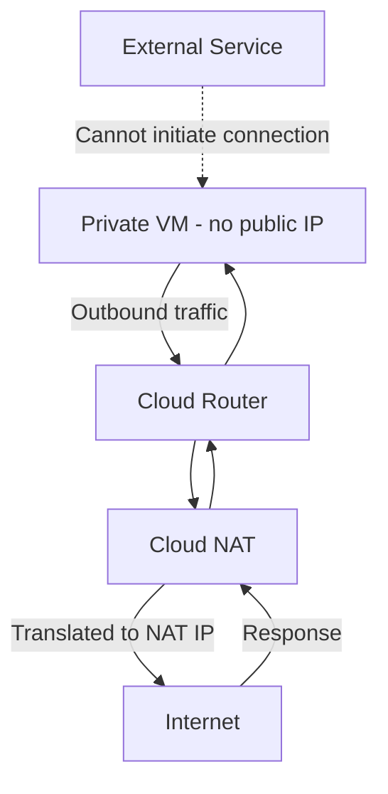

# How to Use Ansible to Configure GCP Cloud NAT

Author: [nawazdhandala](https://www.github.com/nawazdhandala)

Tags: Ansible, GCP, Cloud NAT, Networking, Infrastructure as Code

Description: Step-by-step guide to configuring GCP Cloud NAT with Ansible for secure outbound internet access from private VMs without public IP addresses.

---

Cloud NAT (Network Address Translation) lets VMs without external IP addresses access the internet for things like downloading packages, pulling container images, and calling external APIs. It is a fully managed service, so there is no NAT gateway VM to maintain. In this post, we will automate the entire Cloud NAT setup with Ansible, from the Cloud Router to the NAT configuration.

## Why Cloud NAT?

The security best practice in GCP is to avoid giving VMs public IP addresses. Private VMs are not directly reachable from the internet, which significantly reduces your attack surface. But private VMs still need outbound internet access for many reasons:

- Installing packages with apt or yum
- Pulling Docker images from public registries
- Sending data to external APIs or SaaS services
- Downloading updates and patches

Cloud NAT provides this outbound access without exposing your VMs to inbound internet traffic.

## How Cloud NAT Works

Cloud NAT works at the VPC network level. It is associated with a Cloud Router in a specific region. All VMs in subnets within that region (or specific subnets you choose) can use the NAT gateway for outbound traffic.



## Prerequisites

- Ansible 2.10+ with the `google.cloud` collection
- A GCP project with a VPC network and at least one subnet
- A service account with Network Admin permissions

```bash
# Install the GCP Ansible collection
ansible-galaxy collection install google.cloud
```

## Step 1: Create a Cloud Router

Cloud NAT requires a Cloud Router. The router does not actually route traffic between your VPC and the internet (that is handled by GCP's network infrastructure). Instead, it serves as a configuration anchor for the NAT gateway.

```yaml
# create-cloud-router.yml - Create the Cloud Router needed by Cloud NAT
---
- name: Create Cloud Router for NAT
  hosts: localhost
  connection: local
  gather_facts: false

  vars:
    gcp_project: "my-project-id"
    gcp_auth_kind: "serviceaccount"
    gcp_service_account_file: "/path/to/service-account-key.json"
    region: "us-central1"
    network_name: "my-vpc-network"

  tasks:
    - name: Create a Cloud Router
      google.cloud.gcp_compute_router:
        name: "nat-router"
        region: "{{ region }}"
        network:
          selfLink: "projects/{{ gcp_project }}/global/networks/{{ network_name }}"
        bgp:
          asn: 64514
        project: "{{ gcp_project }}"
        auth_kind: "{{ gcp_auth_kind }}"
        service_account_file: "{{ gcp_service_account_file }}"
        state: present
      register: router

    - name: Show router info
      ansible.builtin.debug:
        msg: |
          Router created: {{ router.name }}
          Region: {{ router.region }}
          Network: {{ network_name }}
```

## Step 2: Configure Cloud NAT

Now we attach a NAT configuration to the Cloud Router. The simplest setup uses automatic NAT IP allocation, where GCP assigns external IP addresses as needed.

```yaml
# configure-cloud-nat.yml - Set up Cloud NAT on the router
---
- name: Configure Cloud NAT
  hosts: localhost
  connection: local
  gather_facts: false

  vars:
    gcp_project: "my-project-id"
    gcp_auth_kind: "serviceaccount"
    gcp_service_account_file: "/path/to/service-account-key.json"
    region: "us-central1"

  tasks:
    - name: Get the Cloud Router reference
      google.cloud.gcp_compute_router:
        name: "nat-router"
        region: "{{ region }}"
        network:
          selfLink: "projects/{{ gcp_project }}/global/networks/my-vpc-network"
        bgp:
          asn: 64514
        project: "{{ gcp_project }}"
        auth_kind: "{{ gcp_auth_kind }}"
        service_account_file: "{{ gcp_service_account_file }}"
        state: present
      register: router

    - name: Configure Cloud NAT on the router
      google.cloud.gcp_compute_router_nat:
        name: "my-nat-config"
        router: "{{ router }}"
        region: "{{ region }}"
        # AUTO_ONLY lets GCP assign NAT IPs automatically
        nat_ip_allocate_option: "AUTO_ONLY"
        # Apply NAT to all subnets in the region
        source_subnetwork_ip_ranges_to_nat: "ALL_SUBNETWORKS_ALL_IP_RANGES"
        # Logging configuration
        log_config:
          enable: true
          filter: "ERRORS_ONLY"
        # Timeouts for NAT connections
        min_ports_per_vm: 64
        udp_idle_timeout_sec: 30
        icmp_idle_timeout_sec: 30
        tcp_established_idle_timeout_sec: 1200
        tcp_transitory_idle_timeout_sec: 30
        project: "{{ gcp_project }}"
        auth_kind: "{{ gcp_auth_kind }}"
        service_account_file: "{{ gcp_service_account_file }}"
        state: present
      register: nat_config

    - name: Display NAT configuration
      ansible.builtin.debug:
        msg: |
          Cloud NAT configured: {{ nat_config.name }}
          NAT IP allocation: AUTO_ONLY
          Subnet range: ALL_SUBNETWORKS_ALL_IP_RANGES
          Logging: Errors only
```

## Cloud NAT with Static IP Addresses

Sometimes you need a fixed external IP for your NAT traffic. This is common when you need to whitelist your outbound IP with a third-party service.

```yaml
# nat-with-static-ip.yml - Cloud NAT using reserved static IPs
---
- name: Cloud NAT with Static IPs
  hosts: localhost
  connection: local
  gather_facts: false

  vars:
    gcp_project: "my-project-id"
    gcp_auth_kind: "serviceaccount"
    gcp_service_account_file: "/path/to/service-account-key.json"
    region: "us-central1"

  tasks:
    - name: Reserve static external IP addresses for NAT
      google.cloud.gcp_compute_address:
        name: "nat-ip-{{ item }}"
        region: "{{ region }}"
        project: "{{ gcp_project }}"
        auth_kind: "{{ gcp_auth_kind }}"
        service_account_file: "{{ gcp_service_account_file }}"
        state: present
      loop:
        - "1"
        - "2"
      register: nat_ips

    - name: Display reserved IPs
      ansible.builtin.debug:
        msg: "NAT IP {{ item.name }}: {{ item.address }}"
      loop: "{{ nat_ips.results }}"

    - name: Get the Cloud Router
      google.cloud.gcp_compute_router:
        name: "nat-router"
        region: "{{ region }}"
        network:
          selfLink: "projects/{{ gcp_project }}/global/networks/my-vpc-network"
        bgp:
          asn: 64514
        project: "{{ gcp_project }}"
        auth_kind: "{{ gcp_auth_kind }}"
        service_account_file: "{{ gcp_service_account_file }}"
        state: present
      register: router

    - name: Configure NAT with static IPs
      google.cloud.gcp_compute_router_nat:
        name: "nat-with-static-ips"
        router: "{{ router }}"
        region: "{{ region }}"
        # Use manual allocation with our reserved IPs
        nat_ip_allocate_option: "MANUAL_ONLY"
        nat_ips: "{{ nat_ips.results | map(attribute='selfLink') | list }}"
        source_subnetwork_ip_ranges_to_nat: "ALL_SUBNETWORKS_ALL_IP_RANGES"
        min_ports_per_vm: 128
        log_config:
          enable: true
          filter: "ALL"
        project: "{{ gcp_project }}"
        auth_kind: "{{ gcp_auth_kind }}"
        service_account_file: "{{ gcp_service_account_file }}"
        state: present

    - name: Show whitelist-ready IPs
      ansible.builtin.debug:
        msg: |
          NAT configured with static IPs.
          Whitelist these IPs with external services:
          {{ nat_ips.results | map(attribute='address') | list }}
```

## NAT for Specific Subnets Only

You might not want NAT for all subnets. Maybe only your application subnet needs internet access, while your database subnet should be completely isolated.

```yaml
# nat-specific-subnets.yml - Apply NAT only to selected subnets
---
- name: Cloud NAT for Specific Subnets
  hosts: localhost
  connection: local
  gather_facts: false

  vars:
    gcp_project: "my-project-id"
    gcp_auth_kind: "serviceaccount"
    gcp_service_account_file: "/path/to/service-account-key.json"
    region: "us-central1"

  tasks:
    - name: Get the Cloud Router
      google.cloud.gcp_compute_router:
        name: "nat-router"
        region: "{{ region }}"
        network:
          selfLink: "projects/{{ gcp_project }}/global/networks/my-vpc-network"
        bgp:
          asn: 64514
        project: "{{ gcp_project }}"
        auth_kind: "{{ gcp_auth_kind }}"
        service_account_file: "{{ gcp_service_account_file }}"
        state: present
      register: router

    - name: Configure NAT for specific subnets only
      google.cloud.gcp_compute_router_nat:
        name: "selective-nat"
        router: "{{ router }}"
        region: "{{ region }}"
        nat_ip_allocate_option: "AUTO_ONLY"
        # Only apply to specific subnets
        source_subnetwork_ip_ranges_to_nat: "LIST_OF_SUBNETWORKS"
        subnetworks:
          - name: "projects/{{ gcp_project }}/regions/{{ region }}/subnetworks/app-subnet"
            source_ip_ranges_to_nat:
              - "ALL_IP_RANGES"
          - name: "projects/{{ gcp_project }}/regions/{{ region }}/subnetworks/worker-subnet"
            source_ip_ranges_to_nat:
              - "ALL_IP_RANGES"
        log_config:
          enable: true
          filter: "ERRORS_ONLY"
        project: "{{ gcp_project }}"
        auth_kind: "{{ gcp_auth_kind }}"
        service_account_file: "{{ gcp_service_account_file }}"
        state: present
```

## Complete Setup Playbook

Here is a single playbook that sets up everything from scratch: the VPC, subnets, Cloud Router, and Cloud NAT.

```yaml
# complete-nat-setup.yml - Full network setup with Cloud NAT
---
- name: Complete Cloud NAT Setup
  hosts: localhost
  connection: local
  gather_facts: false

  vars:
    gcp_project: "my-project-id"
    gcp_auth_kind: "serviceaccount"
    gcp_service_account_file: "/path/to/service-account-key.json"
    region: "us-central1"

  tasks:
    - name: Create VPC network
      google.cloud.gcp_compute_network:
        name: "app-network"
        auto_create_subnetworks: false
        project: "{{ gcp_project }}"
        auth_kind: "{{ gcp_auth_kind }}"
        service_account_file: "{{ gcp_service_account_file }}"
        state: present
      register: network

    - name: Create subnet for application VMs
      google.cloud.gcp_compute_subnetwork:
        name: "app-subnet"
        region: "{{ region }}"
        network: "{{ network }}"
        ip_cidr_range: "10.0.1.0/24"
        project: "{{ gcp_project }}"
        auth_kind: "{{ gcp_auth_kind }}"
        service_account_file: "{{ gcp_service_account_file }}"
        state: present

    - name: Create Cloud Router
      google.cloud.gcp_compute_router:
        name: "app-nat-router"
        region: "{{ region }}"
        network: "{{ network }}"
        bgp:
          asn: 64514
        project: "{{ gcp_project }}"
        auth_kind: "{{ gcp_auth_kind }}"
        service_account_file: "{{ gcp_service_account_file }}"
        state: present
      register: router

    - name: Configure Cloud NAT
      google.cloud.gcp_compute_router_nat:
        name: "app-nat"
        router: "{{ router }}"
        region: "{{ region }}"
        nat_ip_allocate_option: "AUTO_ONLY"
        source_subnetwork_ip_ranges_to_nat: "ALL_SUBNETWORKS_ALL_IP_RANGES"
        min_ports_per_vm: 128
        log_config:
          enable: true
          filter: "ERRORS_ONLY"
        project: "{{ gcp_project }}"
        auth_kind: "{{ gcp_auth_kind }}"
        service_account_file: "{{ gcp_service_account_file }}"
        state: present

    - name: Setup complete
      ansible.builtin.debug:
        msg: |
          Cloud NAT setup complete.
          VMs in app-subnet (10.0.1.0/24) can now access the internet
          without public IP addresses.
```

## Troubleshooting Cloud NAT

If your VMs cannot reach the internet after setting up NAT, check these common issues:

1. **Firewall rules**: Make sure there is no egress deny rule blocking outbound traffic. GCP allows all egress by default, but custom rules can override this.

2. **VM has a public IP**: If a VM already has an external IP, it will not use Cloud NAT. Cloud NAT only applies to VMs without external IPs.

3. **Wrong region**: Cloud NAT is regional. The NAT configuration in `us-central1` will not help VMs in `us-east1`.

4. **Port exhaustion**: If you have many VMs making lots of connections, you might run out of NAT ports. Increase `min_ports_per_vm` or add more NAT IPs.

## Monitoring Cloud NAT

Enable logging and set up alerts in Cloud Monitoring for these key metrics:

- `nat_allocation_failed` - NAT could not allocate ports for a VM
- `dropped_sent_packets_count` - Packets dropped due to NAT issues
- `open_connections` - Current number of NAT connections

## Conclusion

Cloud NAT is an essential component of any secure GCP network architecture, and Ansible makes it straightforward to automate the setup. By keeping your VMs private and routing outbound traffic through Cloud NAT, you get the security benefits of no public IPs with the convenience of internet access when needed. The playbooks in this post cover everything from basic setup to advanced configurations with static IPs and subnet-specific NAT rules.
