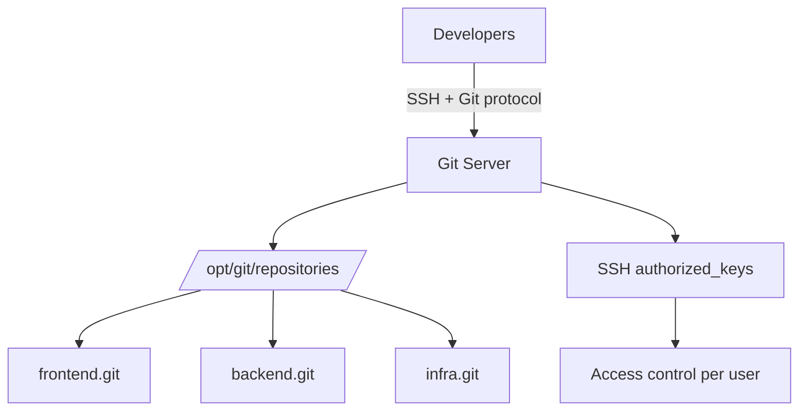

# How to Use Ansible to Configure Git Server

Author: [nawazdhandala](https://www.github.com/nawazdhandala)

Tags: Ansible, Git, Server Configuration, DevOps

Description: Learn how to use Ansible to set up and configure a self-hosted Git server with SSH access, repository management, access control, and backup automation.

---

Running your own Git server gives you full control over your source code. Whether for compliance, performance, or cost reasons, a self-hosted Git server is straightforward to set up with Ansible. This post walks through configuring a production-ready Git server with SSH access, repository management, and basic access controls.

## Setting Up a Basic Git Server

A Git server is essentially just a Linux box with Git installed and SSH access configured:

```yaml
# playbook-git-server.yml
# Sets up a basic Git server with a dedicated user and SSH access
- name: Configure Git server
  hosts: git_servers
  become: true

  tasks:
    - name: Install Git
      ansible.builtin.package:
        name: git
        state: present

    - name: Create git user
      ansible.builtin.user:
        name: git
        home: /opt/git
        shell: /usr/bin/git-shell
        system: true
        create_home: true

    - name: Create .ssh directory for git user
      ansible.builtin.file:
        path: /opt/git/.ssh
        state: directory
        owner: git
        group: git
        mode: "0700"

    - name: Deploy authorized keys for git user
      ansible.builtin.template:
        src: authorized_keys.j2
        dest: /opt/git/.ssh/authorized_keys
        owner: git
        group: git
        mode: "0600"

    - name: Create repositories directory
      ansible.builtin.file:
        path: /opt/git/repositories
        state: directory
        owner: git
        group: git
        mode: "0755"
```

## Creating Bare Repositories

Bare repositories are what Git servers use (no working directory, just the Git database):

```yaml
# playbook-create-repos.yml
# Creates bare Git repositories for each project on the Git server
- name: Create Git repositories
  hosts: git_servers
  become: true
  vars:
    repositories:
      - name: frontend
        description: "Frontend web application"
      - name: backend
        description: "Backend API service"
      - name: infrastructure
        description: "Infrastructure as code"
      - name: shared-libs
        description: "Shared libraries"

  tasks:
    - name: Create bare repositories
      ansible.builtin.shell: |
        git init --bare /opt/git/repositories/{{ item.name }}.git
      args:
        creates: "/opt/git/repositories/{{ item.name }}.git/HEAD"
      loop: "{{ repositories }}"
      loop_control:
        label: "{{ item.name }}"

    - name: Set repository ownership
      ansible.builtin.file:
        path: "/opt/git/repositories/{{ item.name }}.git"
        owner: git
        group: git
        recurse: true
      loop: "{{ repositories }}"
      loop_control:
        label: "{{ item.name }}"

    - name: Set repository descriptions
      ansible.builtin.copy:
        content: "{{ item.description }}"
        dest: "/opt/git/repositories/{{ item.name }}.git/description"
        owner: git
        group: git
      loop: "{{ repositories }}"
      loop_control:
        label: "{{ item.name }}"
```

## Server Architecture



## Access Control with SSH Keys

Manage which users have access to the Git server:

```yaml
# playbook-access-control.yml
# Manages SSH access to the Git server for multiple developers
- name: Manage Git server access
  hosts: git_servers
  become: true
  vars:
    git_users:
      - name: alice
        key: "ssh-ed25519 AAAA... alice@laptop"
        access: readwrite
      - name: bob
        key: "ssh-ed25519 BBBB... bob@desktop"
        access: readwrite
      - name: ci-bot
        key: "ssh-ed25519 CCCC... ci@jenkins"
        access: readonly
      - name: carol
        key: "ssh-ed25519 DDDD... carol@workstation"
        access: readwrite

  tasks:
    - name: Build authorized_keys file
      ansible.builtin.copy:
        content: |
          
          # {{ user.name }} ({{ user.access }})
          
          no-port-forwarding,no-X11-forwarding,no-agent-forwarding,no-pty {{ user.key }}
          
          {{ user.key }}
          
          
        dest: /opt/git/.ssh/authorized_keys
        owner: git
        group: git
        mode: "0600"
```

## Configuring Git Daemon for Anonymous Read Access

For public repositories that should be accessible without authentication:

```yaml
# playbook-git-daemon.yml
# Sets up the Git daemon for anonymous read-only access to public repositories
- name: Configure Git daemon
  hosts: git_servers
  become: true

  tasks:
    - name: Create systemd service for Git daemon
      ansible.builtin.copy:
        content: |
          [Unit]
          Description=Git Daemon
          After=network.target

          [Service]
          ExecStart=/usr/bin/git daemon --reuseaddr --base-path=/opt/git/repositories /opt/git/repositories
          Restart=always
          RestartSec=5
          User=git
          Group=git

          [Install]
          WantedBy=multi-user.target
        dest: /etc/systemd/system/git-daemon.service

    - name: Enable and start Git daemon
      ansible.builtin.systemd:
        name: git-daemon
        state: started
        enabled: true
        daemon_reload: true

    - name: Enable anonymous access for specific repos
      ansible.builtin.file:
        path: "/opt/git/repositories/{{ item }}.git/git-daemon-export-ok"
        state: touch
        owner: git
        group: git
      loop:
        - shared-libs
```

## Setting Up Git Over HTTPS with Nginx

```yaml
# playbook-git-https.yml
# Configures Nginx as a reverse proxy for Git HTTP smart protocol
- name: Set up Git over HTTPS
  hosts: git_servers
  become: true

  tasks:
    - name: Install Nginx and fcgiwrap
      ansible.builtin.package:
        name:
          - nginx
          - fcgiwrap
        state: present

    - name: Configure Nginx for Git
      ansible.builtin.copy:
        content: |
          server {
              listen 443 ssl;
              server_name git.example.com;

              ssl_certificate /etc/ssl/certs/git.example.com.pem;
              ssl_certificate_key /etc/ssl/private/git.example.com.key;

              root /opt/git/repositories;

              location ~ (/.*) {
                  auth_basic "Git Repository";
                  auth_basic_user_file /etc/nginx/git.htpasswd;

                  fastcgi_pass unix:/var/run/fcgiwrap.socket;
                  include fastcgi_params;
                  fastcgi_param SCRIPT_FILENAME /usr/lib/git-core/git-http-backend;
                  fastcgi_param GIT_HTTP_EXPORT_ALL "";
                  fastcgi_param GIT_PROJECT_ROOT /opt/git/repositories;
                  fastcgi_param PATH_INFO $1;
                  fastcgi_param REMOTE_USER $remote_user;
              }
          }
        dest: /etc/nginx/sites-available/git
      notify: Reload Nginx

    - name: Enable Nginx site
      ansible.builtin.file:
        src: /etc/nginx/sites-available/git
        dest: /etc/nginx/sites-enabled/git
        state: link
      notify: Reload Nginx

  handlers:
    - name: Reload Nginx
      ansible.builtin.systemd:
        name: nginx
        state: reloaded
```

## Repository Backup

```yaml
# playbook-git-backup.yml
# Creates automated backups of all Git repositories
- name: Set up Git repository backups
  hosts: git_servers
  become: true

  tasks:
    - name: Create backup directory
      ansible.builtin.file:
        path: /opt/git-backups
        state: directory
        owner: git
        group: git

    - name: Create backup script
      ansible.builtin.copy:
        content: |
          #!/bin/bash
          # Git repository backup script - managed by Ansible
          BACKUP_DIR="/opt/git-backups"
          REPO_DIR="/opt/git/repositories"
          DATE=$(date +%Y%m%d-%H%M%S)

          for repo in "$REPO_DIR"/*.git; do
              repo_name=$(basename "$repo" .git)
              backup_file="$BACKUP_DIR/${repo_name}-${DATE}.tar.gz"

              tar czf "$backup_file" -C "$REPO_DIR" "$(basename $repo)"
              echo "Backed up $repo_name to $backup_file"
          done

          # Remove backups older than 30 days
          find "$BACKUP_DIR" -name "*.tar.gz" -mtime +30 -delete
        dest: /opt/git/backup.sh
        mode: "0755"
        owner: git

    - name: Schedule daily backups
      ansible.builtin.cron:
        name: "Git repository backup"
        minute: "0"
        hour: "2"
        job: "/opt/git/backup.sh >> /var/log/git-backup.log 2>&1"
        user: git
```

## Summary

Setting up a Git server with Ansible is straightforward: install Git, create a service user with `git-shell`, set up SSH authorized_keys for access control, and create bare repositories. For HTTPS access, configure Nginx with fcgiwrap and basic authentication. Manage access by controlling the authorized_keys file, and back up repositories on a schedule. This gives you a fully functional, self-hosted Git server that you can manage entirely through Ansible. For teams that need web interfaces, issue tracking, and pull requests, consider deploying GitLab or Gitea instead (covered in separate posts).
