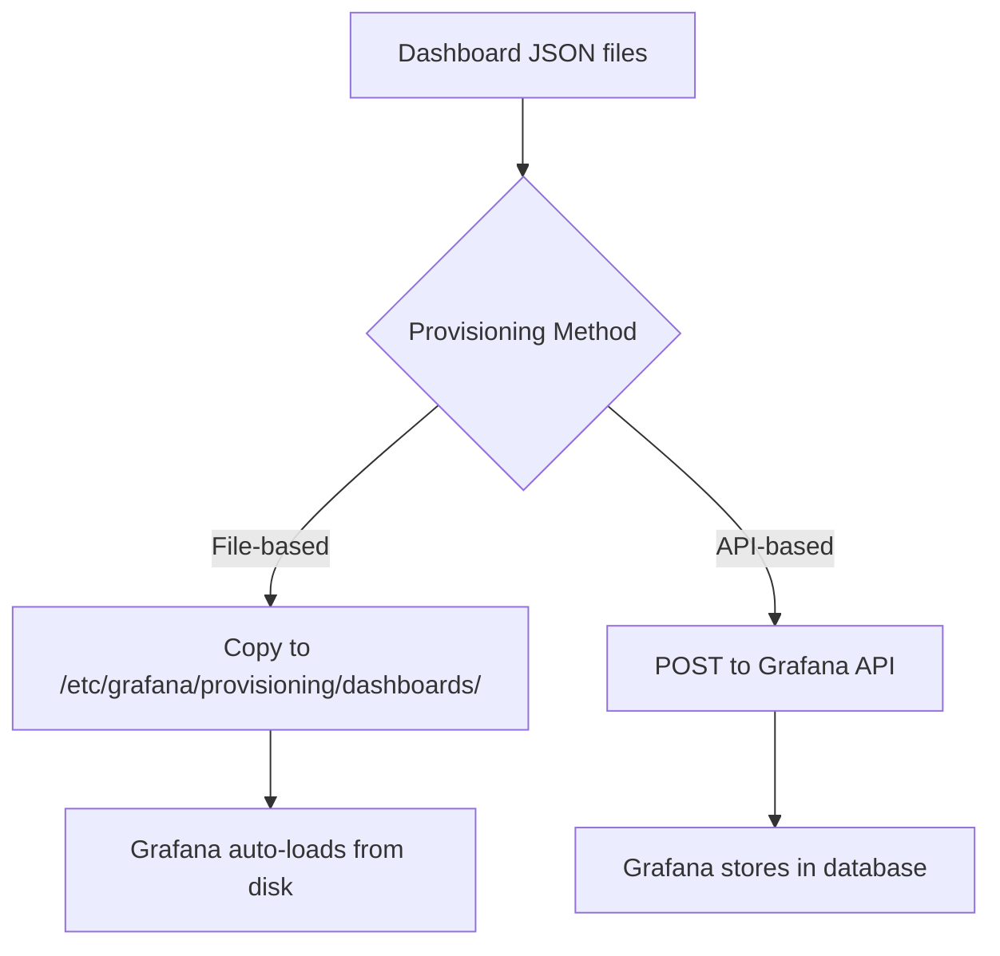

# How to Use Ansible to Configure Grafana Dashboards

Author: [nawazdhandala](https://www.github.com/nawazdhandala)

Tags: Ansible, Grafana, Dashboards, Monitoring, DevOps

Description: Automate Grafana dashboard provisioning and management using Ansible to deploy consistent monitoring dashboards across environments.

---

Having Grafana installed with datasources configured is only half the story. The real value comes from dashboards that give your team immediate visibility into system health, application performance, and business metrics. Manually creating dashboards through the Grafana UI is fine for one-off setups, but it does not scale. If you lose a Grafana instance or need to replicate it in a new environment, you lose all your dashboards.

Ansible can provision Grafana dashboards automatically, either through Grafana's built-in provisioning system or via the Grafana API. This post covers both approaches.

## Two Approaches to Dashboard Provisioning

Grafana supports two ways to deploy dashboards:

1. **File-based provisioning**: Dashboard JSON files are placed on disk and Grafana loads them automatically. Changes to files on disk are picked up without restarting Grafana.

2. **API-based provisioning**: Dashboard JSON is pushed to Grafana via its HTTP API. This is more flexible but requires Grafana to be running.



I prefer file-based provisioning for standard dashboards and API-based for dashboards that need to be dynamically generated.

## Project Structure

```
grafana-dashboards/
  inventory/
    hosts.yml
  roles/
    grafana_dashboards/
      tasks/
        main.yml
        file_provisioning.yml
        api_provisioning.yml
      templates/
        dashboard_provider.yml.j2
        node_exporter_dashboard.json.j2
        app_overview_dashboard.json.j2
      defaults/
        main.yml
      files/
        dashboards/
  playbook.yml
```

## Default Variables

```yaml
# roles/grafana_dashboards/defaults/main.yml
grafana_url: "http://localhost:3000"
grafana_admin_user: "admin"
grafana_admin_password: "changeme"

# Dashboard provisioning method: "file" or "api"
grafana_dashboard_method: "file"

# File-based provisioning settings
grafana_dashboard_dir: "/var/lib/grafana/dashboards"
grafana_provisioning_dir: "/etc/grafana/provisioning"

# Dashboards to install from Grafana.com (by ID)
grafana_community_dashboards:
  - id: 1860
    name: "Node Exporter Full"
    datasource: "Prometheus"
  - id: 3662
    name: "Prometheus 2.0 Overview"
    datasource: "Prometheus"

# Custom template dashboards to deploy
grafana_template_dashboards:
  - template: "node_exporter_dashboard.json.j2"
    filename: "node_exporter.json"
  - template: "app_overview_dashboard.json.j2"
    filename: "app_overview.json"

# Grafana organization ID
grafana_org_id: 1
```

## Dashboard Provider Configuration

This tells Grafana where to find dashboard JSON files on disk.

```yaml
# roles/grafana_dashboards/templates/dashboard_provider.yml.j2
# Dashboard provisioning configuration - managed by Ansible
apiVersion: 1

providers:
  - name: 'ansible-provisioned'
    orgId: {{ grafana_org_id }}
    folder: 'Provisioned'
    type: file
    disableDeletion: false
    updateIntervalSeconds: 30
    allowUiUpdates: false
    options:
      path: {{ grafana_dashboard_dir }}
      foldersFromFilesStructure: false
```

## Node Exporter Dashboard Template

This is a Jinja2 template that generates a Grafana dashboard JSON file. I am showing a simplified version here to keep the post focused. In production you would have many more panels.

```json
{
  "annotations": {
    "list": []
  },
  "editable": false,
  "fiscalYearStartMonth": 0,
  "graphTooltip": 1,
  "links": [],
  "panels": [
    {
      "datasource": {
        "type": "prometheus",
        "uid": "${datasource}"
      },
      "fieldConfig": {
        "defaults": {
          "thresholds": {
            "mode": "absolute",
            "steps": [
              { "color": "green", "value": null },
              { "color": "yellow", "value": 60 },
              { "color": "red", "value": 80 }
            ]
          },
          "unit": "percent"
        }
      },
      "gridPos": { "h": 6, "w": 8, "x": 0, "y": 0 },
      "id": 1,
      "options": {
        "reduceOptions": {
          "calcs": ["lastNotNull"]
        }
      },
      "title": "CPU Usage",
      "type": "gauge",
      "targets": [
        {
          "expr": "100 - (avg by(instance) (rate(node_cpu_seconds_total{mode=\"idle\", instance=~\"$instance\"}[5m])) * 100)",
          "legendFormat": "CPU Usage"
        }
      ]
    },
    {
      "datasource": {
        "type": "prometheus",
        "uid": "${datasource}"
      },
      "fieldConfig": {
        "defaults": {
          "thresholds": {
            "mode": "absolute",
            "steps": [
              { "color": "green", "value": null },
              { "color": "yellow", "value": 70 },
              { "color": "red", "value": 85 }
            ]
          },
          "unit": "percent"
        }
      },
      "gridPos": { "h": 6, "w": 8, "x": 8, "y": 0 },
      "id": 2,
      "options": {
        "reduceOptions": {
          "calcs": ["lastNotNull"]
        }
      },
      "title": "Memory Usage",
      "type": "gauge",
      "targets": [
        {
          "expr": "(1 - node_memory_MemAvailable_bytes{instance=~\"$instance\"} / node_memory_MemTotal_bytes{instance=~\"$instance\"}) * 100",
          "legendFormat": "Memory Usage"
        }
      ]
    },
    {
      "datasource": {
        "type": "prometheus",
        "uid": "${datasource}"
      },
      "fieldConfig": {
        "defaults": {
          "thresholds": {
            "mode": "absolute",
            "steps": [
              { "color": "green", "value": null },
              { "color": "yellow", "value": 70 },
              { "color": "red", "value": 85 }
            ]
          },
          "unit": "percent"
        }
      },
      "gridPos": { "h": 6, "w": 8, "x": 16, "y": 0 },
      "id": 3,
      "options": {
        "reduceOptions": {
          "calcs": ["lastNotNull"]
        }
      },
      "title": "Disk Usage",
      "type": "gauge",
      "targets": [
        {
          "expr": "(1 - node_filesystem_avail_bytes{instance=~\"$instance\", fstype!=\"tmpfs\"} / node_filesystem_size_bytes{instance=~\"$instance\", fstype!=\"tmpfs\"}) * 100",
          "legendFormat": "{{ '{{ mountpoint }}' }}"
        }
      ]
    }
  ],
  "schemaVersion": 38,
  "tags": ["ansible", "node-exporter"],
  "templating": {
    "list": [
      {
        "current": {},
        "hide": 0,
        "includeAll": false,
        "name": "datasource",
        "query": "prometheus",
        "type": "datasource"
      },
      {
        "datasource": {
          "type": "prometheus",
          "uid": "${datasource}"
        },
        "definition": "label_values(node_cpu_seconds_total, instance)",
        "includeAll": true,
        "name": "instance",
        "query": "label_values(node_cpu_seconds_total, instance)",
        "type": "query"
      }
    ]
  },
  "time": {
    "from": "now-1h",
    "to": "now"
  },
  "title": "Node Exporter Overview",
  "uid": "node-exporter-overview"
}
```

## File-Based Provisioning Tasks

```yaml
# roles/grafana_dashboards/tasks/file_provisioning.yml
---
- name: Create dashboard directory
  ansible.builtin.file:
    path: "{{ grafana_dashboard_dir }}"
    state: directory
    owner: grafana
    group: grafana
    mode: "0755"
  become: true

- name: Deploy dashboard provider configuration
  ansible.builtin.template:
    src: dashboard_provider.yml.j2
    dest: "{{ grafana_provisioning_dir }}/dashboards/ansible.yml"
    owner: root
    group: grafana
    mode: "0640"
  become: true
  notify: Restart grafana

- name: Deploy template dashboards
  ansible.builtin.template:
    src: "{{ item.template }}"
    dest: "{{ grafana_dashboard_dir }}/{{ item.filename }}"
    owner: grafana
    group: grafana
    mode: "0644"
  loop: "{{ grafana_template_dashboards }}"
  become: true

- name: Download community dashboards from Grafana.com
  ansible.builtin.uri:
    url: "https://grafana.com/api/dashboards/{{ item.id }}/revisions/latest/download"
    return_content: yes
  register: community_dashboards
  loop: "{{ grafana_community_dashboards }}"

- name: Save community dashboards to disk
  ansible.builtin.copy:
    content: "{{ item.content }}"
    dest: "{{ grafana_dashboard_dir }}/community_{{ item.item.id }}.json"
    owner: grafana
    group: grafana
    mode: "0644"
  loop: "{{ community_dashboards.results }}"
  become: true
```

## API-Based Provisioning Tasks

```yaml
# roles/grafana_dashboards/tasks/api_provisioning.yml
---
- name: Wait for Grafana API to be available
  ansible.builtin.uri:
    url: "{{ grafana_url }}/api/health"
    status_code: 200
  register: grafana_health
  until: grafana_health.status == 200
  retries: 20
  delay: 3

- name: Create dashboard folder via API
  ansible.builtin.uri:
    url: "{{ grafana_url }}/api/folders"
    method: POST
    body_format: json
    body:
      uid: "ansible-dashboards"
      title: "Ansible Provisioned"
    url_username: "{{ grafana_admin_user }}"
    url_password: "{{ grafana_admin_password }}"
    force_basic_auth: yes
    status_code: [200, 412]

- name: Deploy dashboards via API
  ansible.builtin.uri:
    url: "{{ grafana_url }}/api/dashboards/db"
    method: POST
    body_format: json
    body:
      dashboard: "{{ lookup('template', item.template) | from_json }}"
      folderUid: "ansible-dashboards"
      overwrite: true
    url_username: "{{ grafana_admin_user }}"
    url_password: "{{ grafana_admin_password }}"
    force_basic_auth: yes
    status_code: 200
  loop: "{{ grafana_template_dashboards }}"
```

## Main Tasks

```yaml
# roles/grafana_dashboards/tasks/main.yml
---
- name: Deploy dashboards via file provisioning
  ansible.builtin.include_tasks: file_provisioning.yml
  when: grafana_dashboard_method == "file"

- name: Deploy dashboards via API
  ansible.builtin.include_tasks: api_provisioning.yml
  when: grafana_dashboard_method == "api"
```

## Handlers

```yaml
# roles/grafana_dashboards/handlers/main.yml
---
- name: Restart grafana
  ansible.builtin.systemd:
    name: grafana-server
    state: restarted
  become: true
```

## The Playbook

```yaml
# playbook.yml
---
- name: Configure Grafana dashboards
  hosts: monitoring
  become: true
  vars:
    grafana_dashboard_method: "file"
    grafana_community_dashboards:
      - id: 1860
        name: "Node Exporter Full"
        datasource: "Prometheus"
      - id: 3662
        name: "Prometheus 2.0 Overview"
        datasource: "Prometheus"
      - id: 11074
        name: "Node Exporter for Prometheus"
        datasource: "Prometheus"
  roles:
    - grafana_dashboards
```

## Running It

```bash
# Deploy dashboards
ansible-playbook -i inventory/hosts.yml playbook.yml

# Verify dashboards are loaded
curl -u admin:password http://grafana-server:3000/api/search?query=&type=dash-db
```

## Exporting Existing Dashboards for Ansible

If you have dashboards already created in the Grafana UI and want to manage them with Ansible, you can export them:

```bash
# Export a dashboard by UID
curl -u admin:password \
  http://grafana-server:3000/api/dashboards/uid/my-dashboard-uid \
  | python3 -m json.tool > my_dashboard.json
```

Save the JSON file in your role's templates directory and add it to the `grafana_template_dashboards` list.

## Summary

Provisioning Grafana dashboards with Ansible ensures your monitoring visualization layer is as reproducible as your infrastructure. The file-based approach is simpler and does not require Grafana to be running during provisioning, while the API approach gives more flexibility for dynamic dashboards. Either way, you end up with dashboards stored in version control and deployable in one command, which eliminates the risk of losing custom dashboards when a server goes down.
