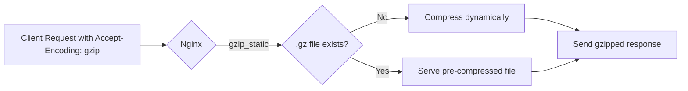

# How to Use Ansible to Configure Gzip Compression

Author: [nawazdhandala](https://www.github.com/nawazdhandala)

Tags: Ansible, Nginx, Gzip, Performance, DevOps

Description: Automate Nginx gzip compression configuration using Ansible to reduce bandwidth usage and improve page load times across your web infrastructure.

---

Gzip compression can reduce the size of HTTP responses by 60-80%, which translates directly into faster page loads and lower bandwidth costs. Nginx has excellent built-in gzip support, but the default configuration is conservative. With Ansible, you can deploy optimized gzip settings across all your web servers and keep them consistent as you tune the compression levels.

This post covers building an Ansible role that configures gzip compression in Nginx with fine-grained control over which content types get compressed and at what level.

## How Gzip Works in Nginx

When a client sends a request with the `Accept-Encoding: gzip` header, Nginx can compress the response body before sending it. The client then decompresses it. This trades a small amount of CPU time on the server for a significant reduction in data transferred over the network.

Nginx provides two compression approaches:

- **Dynamic compression** (`gzip on`): Compresses responses on-the-fly for each request.
- **Static compression** (`gzip_static`): Serves pre-compressed `.gz` files if they exist, avoiding the CPU cost of compressing on every request.



## Project Structure

```
nginx-gzip/
  inventory/
    hosts.yml
  roles/
    nginx_gzip/
      tasks/
        main.yml
      templates/
        gzip.conf.j2
      defaults/
        main.yml
      handlers/
        main.yml
  playbook.yml
```

## Default Variables

These defaults provide a good balance between compression ratio and CPU usage for most applications.

```yaml
# roles/nginx_gzip/defaults/main.yml
# Enable gzip compression
nginx_gzip_enabled: true

# Compression level (1-9, higher = better compression but more CPU)
# Level 5 is a good balance for most workloads
nginx_gzip_comp_level: 5

# Minimum response size to compress (in bytes)
# Compressing very small responses actually increases their size
nginx_gzip_min_length: 256

# Enable gzip for proxied requests
nginx_gzip_proxied: "any"

# Enable gzip_static to serve pre-compressed files
nginx_gzip_static_enabled: true

# Vary header to prevent caching issues with proxies
nginx_gzip_vary: true

# Buffer settings for compression
nginx_gzip_buffers_number: 16
nginx_gzip_buffers_size: "8k"

# MIME types to compress
# Do not compress images or videos - they are already compressed
nginx_gzip_types:
  - text/plain
  - text/css
  - text/xml
  - text/javascript
  - application/javascript
  - application/x-javascript
  - application/json
  - application/xml
  - application/xml+rss
  - application/atom+xml
  - application/vnd.ms-fontobject
  - application/x-font-ttf
  - application/x-font-opentype
  - font/opentype
  - font/woff
  - font/woff2
  - image/svg+xml
  - image/x-icon

# Disable gzip for old IE versions
nginx_gzip_disable_msie6: true

# Backend server
nginx_gzip_server_name: "example.com"
nginx_gzip_backend: "127.0.0.1:3000"
```

## Gzip Configuration Template

This template generates the gzip configuration at the http level, so it applies to all server blocks.

```nginx
# roles/nginx_gzip/templates/gzip.conf.j2
# Gzip compression configuration
# Generated by Ansible


# Enable gzip compression
gzip on;

# Compression level (1-9)
# Higher levels use more CPU but produce smaller output
gzip_comp_level {{ nginx_gzip_comp_level }};

# Minimum file size to compress
# Files smaller than this are not worth compressing
gzip_min_length {{ nginx_gzip_min_length }};

# Compress responses for proxied requests
gzip_proxied {{ nginx_gzip_proxied }};


# Add Vary: Accept-Encoding header
# This prevents caching proxies from serving gzipped content to clients
# that do not support it
gzip_vary on;


# Compression buffers
gzip_buffers {{ nginx_gzip_buffers_number }} {{ nginx_gzip_buffers_size }};

# Minimum HTTP version for compression
gzip_http_version 1.1;


# Disable gzip for Internet Explorer 6 (broken gzip support)
gzip_disable "msie6";


# MIME types to compress
# Note: text/html is always compressed when gzip is on
gzip_types

    {{ mime_type }}{{ '' }}


    ;


# Serve pre-compressed files when available
# This avoids CPU overhead for frequently requested files
gzip_static on;



# Gzip compression is disabled
gzip off;

```

## Ansible Tasks

```yaml
# roles/nginx_gzip/tasks/main.yml
---
- name: Install Nginx
  ansible.builtin.apt:
    name: nginx
    state: present
    update_cache: yes
  become: true

- name: Check if gzip_static module is available
  ansible.builtin.command: nginx -V
  register: nginx_modules
  changed_when: false
  when: nginx_gzip_static_enabled

- name: Warn if gzip_static module is not available
  ansible.builtin.debug:
    msg: "WARNING: gzip_static module not found. Pre-compressed files will not be served."
  when:
    - nginx_gzip_static_enabled
    - "'http_gzip_static_module' not in nginx_modules.stderr"

- name: Deploy gzip configuration
  ansible.builtin.template:
    src: gzip.conf.j2
    dest: /etc/nginx/conf.d/gzip.conf
    owner: root
    group: root
    mode: "0644"
  become: true
  notify: Validate and reload nginx

- name: Ensure Nginx is running
  ansible.builtin.systemd:
    name: nginx
    state: started
    enabled: true
  become: true
```

## Handlers

```yaml
# roles/nginx_gzip/handlers/main.yml
---
- name: Validate and reload nginx
  ansible.builtin.command: nginx -t
  become: true
  changed_when: false
  notify: Reload nginx

- name: Reload nginx
  ansible.builtin.systemd:
    name: nginx
    state: reloaded
  become: true
```

## Pre-compressing Static Files

If you enable `gzip_static`, you can pre-compress your static files during the build process. This is especially useful for CSS, JavaScript, and SVG files that do not change between deployments.

Here is a task that pre-compresses static files on the server:

```yaml
# Optional: Add to your deployment role
- name: Pre-compress static files for gzip_static
  ansible.builtin.shell: |
    find /var/www/html -type f \( -name "*.css" -o -name "*.js" -o -name "*.svg" -o -name "*.json" -o -name "*.xml" \) | while read file; do
      gzip -9 -k -f "$file"
    done
  become: true
  changed_when: false
```

This creates `.gz` versions of each file alongside the originals. When `gzip_static` is on, Nginx serves the `.gz` file directly without spending CPU on dynamic compression.

## The Playbook

```yaml
# playbook.yml
---
- name: Configure Nginx gzip compression
  hosts: webservers
  become: true
  vars:
    nginx_gzip_comp_level: 6
    nginx_gzip_min_length: 512
  roles:
    - nginx_gzip
```

## Testing Compression

After deploying, verify that gzip is working:

```bash
# Check if response is gzipped
curl -H "Accept-Encoding: gzip" -sI http://example.com | grep -i "content-encoding"
# Expected: Content-Encoding: gzip

# Compare compressed vs uncompressed sizes
curl -so /dev/null -w '%{size_download}' http://example.com
curl -so /dev/null -w '%{size_download}' -H "Accept-Encoding: gzip" http://example.com

# Detailed test showing compression ratio
curl -H "Accept-Encoding: gzip" -o /dev/null -w "Downloaded: %{size_download} bytes\nTotal time: %{time_total}s\n" -s http://example.com
```

## Choosing the Right Compression Level

The `gzip_comp_level` setting ranges from 1 (fastest, least compression) to 9 (slowest, most compression). Here is a rough guide:

- **Level 1-2**: Fast compression, about 60% size reduction. Good for high-traffic sites where CPU is the bottleneck.
- **Level 4-6**: Balanced. About 70-75% size reduction with moderate CPU usage. This is what I recommend for most applications.
- **Level 7-9**: Maximum compression, about 78-80% size reduction. The improvement over level 6 is small, but the CPU cost increases significantly.

If you use `gzip_static` for your static assets, you can compress those at level 9 during build time (where CPU cost does not matter) and use a lower level for dynamic content.

## What Not to Compress

Do not compress content that is already compressed. This includes JPEG, PNG, GIF, MP4, ZIP, and other binary formats. Attempting to gzip these files wastes CPU and may actually make the response slightly larger. The MIME type list in the defaults above only includes text-based and font formats, which is the right approach.

## Summary

Gzip compression is one of the highest-impact, lowest-effort performance optimizations you can make. With this Ansible role, you can deploy consistent gzip settings across all your Nginx servers in one command. The combination of dynamic compression for regular responses and static pre-compression for build assets gives you the best of both worlds: minimal CPU overhead and maximum bandwidth savings.
