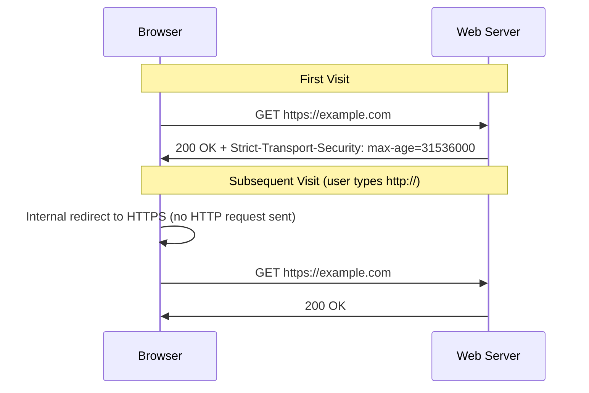

# How to Use Ansible to Configure HSTS Headers

Author: [nawazdhandala](https://www.github.com/nawazdhandala)

Tags: Ansible, HSTS, Web Security, Nginx, Apache

Description: Deploy HTTP Strict Transport Security (HSTS) headers across your web servers using Ansible to enforce HTTPS connections and prevent downgrade attacks.

---

HTTP Strict Transport Security (HSTS) tells browsers to only communicate with your site over HTTPS. Once a browser receives an HSTS header, it will refuse to connect over plain HTTP for the specified duration. This prevents SSL stripping attacks, where an attacker intercepts the initial HTTP request before the redirect to HTTPS.

Configuring HSTS sounds simple, but getting it right across all your web servers, with the correct max-age, subdomain coverage, and preload settings, requires consistency. Ansible delivers that consistency.

## How HSTS Works

When a browser first visits your HTTPS site and receives an HSTS header, it remembers this policy. On subsequent visits, even if the user types `http://`, the browser automatically upgrades to HTTPS without ever making an insecure request.



The key components of an HSTS header:

- **max-age**: How long (in seconds) the browser should remember the HSTS policy
- **includeSubDomains**: Apply the policy to all subdomains
- **preload**: Signal that you want to be included in browser preload lists

## Configuring HSTS on Nginx

This is the most common deployment scenario. Nginx adds the HSTS header to all HTTPS responses.

This playbook deploys HSTS configuration for Nginx:

```yaml
# nginx_hsts.yml - Configure HSTS on Nginx
---
- name: Configure HSTS on Nginx
  hosts: webservers
  become: true

  vars:
    hsts_max_age: 63072000          # 2 years in seconds
    hsts_include_subdomains: true
    hsts_preload: true

  tasks:
    - name: Deploy HSTS configuration snippet
      ansible.builtin.copy:
        content: |
          # HSTS Configuration - Managed by Ansible
          # Enforce HTTPS for {{ hsts_max_age }} seconds ({{ (hsts_max_age / 86400) | int }} days)
          add_header Strict-Transport-Security "max-age={{ hsts_max_age }}; includeSubDomains; preload" always;
        dest: /etc/nginx/snippets/hsts.conf
        owner: root
        group: root
        mode: '0644'
      notify: reload nginx

    - name: Include HSTS snippet in all server blocks
      ansible.builtin.lineinfile:
        path: "{{ item }}"
        regexp: "include snippets/hsts.conf"
        line: "    include snippets/hsts.conf;"
        insertafter: "listen.*443.*ssl"
      with_fileglob:
        - /etc/nginx/sites-enabled/*
      notify: reload nginx

    - name: Ensure HTTP to HTTPS redirect exists
      ansible.builtin.template:
        src: nginx_redirect.conf.j2
        dest: /etc/nginx/snippets/https-redirect.conf
        mode: '0644'
      notify: reload nginx

    - name: Validate Nginx config
      ansible.builtin.command: nginx -t
      changed_when: false

  handlers:
    - name: reload nginx
      ansible.builtin.service:
        name: nginx
        state: reloaded
```

A complete Nginx server block with HSTS:

```nginx
# Example server block with HSTS
server {
    listen 80;
    server_name example.com www.example.com;
    return 301 https://$host$request_uri;
}

server {
    listen 443 ssl http2;
    server_name example.com www.example.com;

    ssl_certificate /etc/ssl/certs/example.com.crt;
    ssl_certificate_key /etc/ssl/private/example.com.key;

    # Include HSTS header
    include snippets/hsts.conf;

    # Other security headers
    add_header X-Content-Type-Options "nosniff" always;
    add_header X-Frame-Options "SAMEORIGIN" always;
    add_header Referrer-Policy "strict-origin-when-cross-origin" always;

    root /var/www/html;
}
```

## Configuring HSTS on Apache

Apache uses mod_headers to set the HSTS header.

This playbook configures HSTS for Apache web servers:

```yaml
# apache_hsts.yml - Configure HSTS on Apache
---
- name: Configure HSTS on Apache
  hosts: apache_servers
  become: true

  vars:
    hsts_max_age: 63072000
    hsts_include_subdomains: true
    hsts_preload: true

  tasks:
    - name: Enable headers module
      ansible.builtin.command: a2enmod headers
      register: headers_mod
      changed_when: "'Enabling' in headers_mod.stdout"
      notify: reload apache

    - name: Deploy HSTS configuration
      ansible.builtin.copy:
        content: |
          # HSTS Configuration - Managed by Ansible
          <IfModule mod_headers.c>
              Header always set Strict-Transport-Security "max-age={{ hsts_max_age }}; includeSubDomains; preload"
          </IfModule>
        dest: /etc/apache2/conf-available/hsts.conf
        owner: root
        group: root
        mode: '0644'
      notify: reload apache

    - name: Enable HSTS configuration
      ansible.builtin.command: a2enconf hsts
      register: conf_enable
      changed_when: "'Enabling' in conf_enable.stdout"
      notify: reload apache

    - name: Ensure HTTP redirect VirtualHost exists
      ansible.builtin.copy:
        content: |
          <VirtualHost *:80>
              ServerName {{ ansible_fqdn }}
              Redirect permanent / https://{{ ansible_fqdn }}/
          </VirtualHost>
        dest: /etc/apache2/sites-available/000-redirect.conf
        mode: '0644'
      notify: reload apache

    - name: Validate Apache configuration
      ansible.builtin.command: apache2ctl configtest
      changed_when: false

  handlers:
    - name: reload apache
      ansible.builtin.service:
        name: apache2
        state: reloaded
```

## Gradual HSTS Rollout

Jumping straight to a 2-year max-age with preload is risky. If you have any issues with your HTTPS setup, you could lock users out. A gradual rollout is safer.

This playbook implements a phased HSTS deployment:

```yaml
# hsts_rollout.yml - Gradual HSTS rollout
---
- name: Gradual HSTS rollout
  hosts: webservers
  become: true

  vars:
    # Phase 1: 5 minutes (testing)
    # Phase 2: 1 week
    # Phase 3: 1 month
    # Phase 4: 1 year
    # Phase 5: 2 years with preload
    hsts_phases:
      phase1:
        max_age: 300
        include_subdomains: false
        preload: false
      phase2:
        max_age: 604800
        include_subdomains: false
        preload: false
      phase3:
        max_age: 2592000
        include_subdomains: true
        preload: false
      phase4:
        max_age: 31536000
        include_subdomains: true
        preload: false
      phase5:
        max_age: 63072000
        include_subdomains: true
        preload: true

    # Set current phase here
    current_phase: phase1

  tasks:
    - name: Set HSTS values for current phase
      ansible.builtin.set_fact:
        hsts_config: "{{ hsts_phases[current_phase] }}"

    - name: Deploy HSTS header for current phase
      ansible.builtin.copy:
        content: |
          # HSTS {{ current_phase }} - Managed by Ansible
          # max-age: {{ hsts_config.max_age }}s ({{ (hsts_config.max_age / 86400) | round(1) }} days)
          add_header Strict-Transport-Security "max-age={{ hsts_config.max_age }}; includeSubDomains; preload" always;
        dest: /etc/nginx/snippets/hsts.conf
        mode: '0644'
      notify: reload nginx

    - name: Report current HSTS phase
      ansible.builtin.debug:
        msg: "HSTS Phase: {{ current_phase }} | max-age={{ hsts_config.max_age }}s | subdomains={{ hsts_config.include_subdomains }} | preload={{ hsts_config.preload }}"

  handlers:
    - name: reload nginx
      ansible.builtin.service:
        name: nginx
        state: reloaded
```

## Additional Security Headers

HSTS works best alongside other security headers. Here is a comprehensive security header configuration.

This playbook deploys a full set of security headers:

```yaml
# security_headers.yml - Deploy comprehensive security headers
---
- name: Configure security headers
  hosts: webservers
  become: true

  vars:
    security_headers:
      - name: Strict-Transport-Security
        value: "max-age=63072000; includeSubDomains; preload"
      - name: X-Content-Type-Options
        value: "nosniff"
      - name: X-Frame-Options
        value: "SAMEORIGIN"
      - name: X-XSS-Protection
        value: "1; mode=block"
      - name: Referrer-Policy
        value: "strict-origin-when-cross-origin"
      - name: Permissions-Policy
        value: "camera=(), microphone=(), geolocation=()"

  tasks:
    - name: Deploy security headers snippet (Nginx)
      ansible.builtin.copy:
        content: |
          # Security Headers - Managed by Ansible
          
          add_header {{ header.name }} "{{ header.value }}" always;
          
        dest: /etc/nginx/snippets/security-headers.conf
        mode: '0644'
      notify: reload nginx

  handlers:
    - name: reload nginx
      ansible.builtin.service:
        name: nginx
        state: reloaded
```

## Testing HSTS Configuration

After deploying, verify the headers are correct:

```yaml
# test_hsts.yml - Verify HSTS headers
---
- name: Test HSTS configuration
  hosts: webservers
  become: true

  tasks:
    - name: Check HSTS header is present
      ansible.builtin.uri:
        url: "https://{{ ansible_fqdn }}"
        method: HEAD
        validate_certs: false
        return_content: false
      register: https_response
      failed_when: "'strict-transport-security' not in https_response.headers | map('lower') | list"

    - name: Display HSTS header value
      ansible.builtin.debug:
        msg: "HSTS: {{ https_response.strict_transport_security | default('NOT SET') }}"

    - name: Verify HTTP redirects to HTTPS
      ansible.builtin.uri:
        url: "http://{{ ansible_fqdn }}"
        method: GET
        follow_redirects: none
        status_code: 301
        validate_certs: false
      register: http_response
      failed_when: http_response.status != 301

    - name: Verify redirect points to HTTPS
      ansible.builtin.assert:
        that:
          - "'https://' in http_response.location"
        fail_msg: "HTTP redirect does not point to HTTPS"

    - name: Check HSTS header is NOT on HTTP responses
      ansible.builtin.debug:
        msg: "Good - HSTS should only be sent over HTTPS, not HTTP"
```

## HSTS Preload Submission

Once you have HSTS working with `includeSubDomains` and `preload`, and a max-age of at least 1 year, you can submit your domain to the browser preload list. This means browsers will know to use HTTPS for your domain even before the first visit.

Requirements for preload list submission:
- Valid HTTPS certificate
- Redirect all HTTP to HTTPS
- HSTS header on the base domain
- max-age of at least 31536000 (1 year)
- includeSubDomains directive
- preload directive

```yaml
# verify_preload_ready.yml - Check if domain is ready for preload
---
- name: Verify HSTS preload readiness
  hosts: webservers[0]
  become: true

  tasks:
    - name: Get HSTS header
      ansible.builtin.uri:
        url: "https://{{ ansible_fqdn }}"
        method: HEAD
        validate_certs: false
      register: response

    - name: Parse HSTS header
      ansible.builtin.set_fact:
        hsts_header: "{{ response.strict_transport_security | default('') }}"

    - name: Check preload requirements
      ansible.builtin.assert:
        that:
          - "'max-age=' in hsts_header"
          - "'includeSubDomains' in hsts_header"
          - "'preload' in hsts_header"
        fail_msg: "HSTS header does not meet preload requirements: {{ hsts_header }}"
        success_msg: "HSTS header meets preload requirements"
```

## Things to Watch Out For

1. **Start small.** Begin with a short max-age (5 minutes) and increase gradually. A mistake with a 2-year max-age means browsers will refuse HTTP for 2 years.
2. **Test all subdomains first.** Before adding `includeSubDomains`, make sure every subdomain has a valid HTTPS certificate. A subdomain without HTTPS will become inaccessible.
3. **HSTS preload is hard to undo.** Getting removed from browser preload lists takes months. Only submit when you are 100% committed to HTTPS.
4. **Do not send HSTS over HTTP.** The header should only be sent on HTTPS responses. Sending it over HTTP is ignored by browsers and indicates a misconfiguration.
5. **Coordinate with your team.** HSTS affects everyone who visits your site. Make sure your entire organization knows about the change.

HSTS with Ansible ensures every web server in your fleet sends the correct security headers consistently. Combined with a gradual rollout strategy, you can strengthen your HTTPS enforcement without risking downtime.
