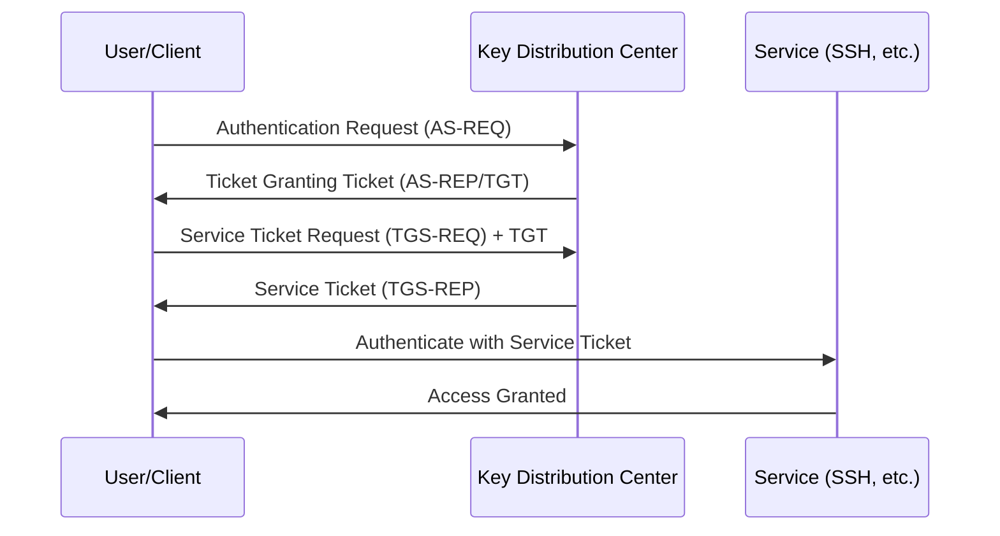

# How to Use Ansible to Configure Kerberos Authentication

Author: [nawazdhandala](https://www.github.com/nawazdhandala)

Tags: Ansible, Kerberos, Authentication, Security, Active Directory

Description: Configure Kerberos authentication on Linux servers using Ansible for ticket-based single sign-on and integration with Active Directory environments.

---

Kerberos is the standard authentication protocol for enterprise environments, especially those using Active Directory. It provides single sign-on (SSO), mutual authentication, and eliminates the need to send passwords over the network. Instead of passwords, Kerberos uses encrypted tickets that prove your identity.

Configuring Kerberos clients on Linux is notoriously fiddly. DNS, time synchronization, realm configuration, and keytab management all need to be exactly right. Ansible takes the pain out of this by ensuring every server gets the same correct configuration.

## How Kerberos Authentication Works

Kerberos uses a three-party model: the client, the service, and the Key Distribution Center (KDC). Authentication happens through ticket exchanges, never by sending passwords directly to services.



## Installing Kerberos Client Packages

The first step is installing the Kerberos client libraries and tools.

This playbook installs Kerberos packages on both Debian and RHEL systems:

```yaml
# install_kerberos.yml - Install Kerberos client packages
---
- name: Install Kerberos client
  hosts: all
  become: true

  tasks:
    - name: Install Kerberos packages (Debian/Ubuntu)
      ansible.builtin.apt:
        name:
          - krb5-user
          - krb5-config
          - libpam-krb5
          - libsasl2-modules-gssapi-mit
        state: present
        update_cache: true
      environment:
        DEBIAN_FRONTEND: noninteractive
      when: ansible_os_family == "Debian"

    - name: Install Kerberos packages (RHEL/CentOS)
      ansible.builtin.yum:
        name:
          - krb5-workstation
          - krb5-libs
          - pam_krb5
          - cyrus-sasl-gssapi
        state: present
      when: ansible_os_family == "RedHat"
```

## Configuring krb5.conf

The `/etc/krb5.conf` file is the central Kerberos configuration. It defines realms, KDC locations, and default settings.

This playbook deploys the Kerberos configuration:

```yaml
# configure_kerberos.yml - Deploy Kerberos configuration
---
- name: Configure Kerberos
  hosts: all
  become: true

  vars:
    kerberos_realm: EXAMPLE.COM
    kerberos_domain: example.com
    kerberos_kdc_servers:
      - kdc1.example.com
      - kdc2.example.com
    kerberos_admin_server: kdc1.example.com
    kerberos_dns_lookup_realm: false
    kerberos_dns_lookup_kdc: true
    kerberos_ticket_lifetime: "24h"
    kerberos_renew_lifetime: "7d"
    kerberos_forwardable: true
    kerberos_default_ccache: "FILE:/tmp/krb5cc_%{uid}"

  tasks:
    - name: Deploy krb5.conf
      ansible.builtin.template:
        src: krb5.conf.j2
        dest: /etc/krb5.conf
        owner: root
        group: root
        mode: '0644'

    - name: Verify Kerberos configuration
      ansible.builtin.command: klist -V
      register: klist_version
      changed_when: false
      failed_when: false
```

The krb5.conf template:

```ini
# templates/krb5.conf.j2 - Kerberos configuration
# Managed by Ansible

[libdefaults]
    default_realm = {{ kerberos_realm }}
    dns_lookup_realm = {{ 'true' if kerberos_dns_lookup_realm else 'false' }}
    dns_lookup_kdc = {{ 'true' if kerberos_dns_lookup_kdc else 'false' }}
    ticket_lifetime = {{ kerberos_ticket_lifetime }}
    renew_lifetime = {{ kerberos_renew_lifetime }}
    forwardable = {{ 'true' if kerberos_forwardable else 'false' }}
    rdns = false
    default_ccache_name = {{ kerberos_default_ccache }}

    # Strong encryption types only
    default_tgs_enctypes = aes256-cts-hmac-sha1-96 aes128-cts-hmac-sha1-96
    default_tkt_enctypes = aes256-cts-hmac-sha1-96 aes128-cts-hmac-sha1-96
    permitted_enctypes = aes256-cts-hmac-sha1-96 aes128-cts-hmac-sha1-96

[realms]
    {{ kerberos_realm }} = {

        kdc = {{ kdc }}

        admin_server = {{ kerberos_admin_server }}
        default_domain = {{ kerberos_domain }}
    }

[domain_realm]
    .{{ kerberos_domain }} = {{ kerberos_realm }}
    {{ kerberos_domain }} = {{ kerberos_realm }}

[logging]
    default = FILE:/var/log/krb5libs.log
    kdc = FILE:/var/log/krb5kdc.log
    admin_server = FILE:/var/log/kadmind.log
```

## Time Synchronization

Kerberos is extremely sensitive to time differences. Even a 5-minute skew between the client and KDC will cause authentication failures.

This playbook configures NTP for Kerberos compatibility:

```yaml
# kerberos_time_sync.yml - Ensure time synchronization for Kerberos
---
- name: Configure time synchronization
  hosts: all
  become: true

  vars:
    ntp_servers:
      - kdc1.example.com  # Use KDC as NTP source for consistency
      - ntp.example.com

  tasks:
    - name: Install chrony
      ansible.builtin.package:
        name: chrony
        state: present

    - name: Configure chrony for Kerberos
      ansible.builtin.template:
        src: chrony.conf.j2
        dest: /etc/chrony/chrony.conf
        owner: root
        group: root
        mode: '0644'
      notify: restart chrony

    - name: Enable and start chrony
      ansible.builtin.service:
        name: chronyd
        state: started
        enabled: true

    - name: Force time sync
      ansible.builtin.command: chronyc makestep
      changed_when: true

    - name: Check time offset
      ansible.builtin.command: chronyc tracking
      register: time_tracking
      changed_when: false

    - name: Warn on large time offset
      ansible.builtin.debug:
        msg: "WARNING: Check time sync on {{ inventory_hostname }}"
      when: "'Not synchronised' in time_tracking.stdout"

  handlers:
    - name: restart chrony
      ansible.builtin.service:
        name: chronyd
        state: restarted
```

## Creating and Managing Keytabs

Keytabs store encrypted keys that allow servers to authenticate to Kerberos without human interaction. Each server needs a keytab for its service principals.

This playbook manages keytab distribution:

```yaml
# manage_keytabs.yml - Distribute Kerberos keytabs
---
- name: Manage Kerberos keytabs
  hosts: all
  become: true

  vars:
    keytab_source_dir: files/keytabs
    keytab_path: /etc/krb5.keytab

  tasks:
    - name: Deploy host keytab
      ansible.builtin.copy:
        src: "{{ keytab_source_dir }}/{{ inventory_hostname }}.keytab"
        dest: "{{ keytab_path }}"
        owner: root
        group: root
        mode: '0600'
      when: inventory_hostname + '.keytab' is file

    - name: Verify keytab contents
      ansible.builtin.command: klist -kt {{ keytab_path }}
      register: keytab_contents
      changed_when: false
      failed_when: false

    - name: Display keytab principals
      ansible.builtin.debug:
        msg: "{{ keytab_contents.stdout_lines }}"

    - name: Test keytab authentication
      ansible.builtin.command: kinit -k -t {{ keytab_path }} host/{{ ansible_fqdn }}
      register: kinit_test
      changed_when: false
      failed_when: false

    - name: Report keytab authentication result
      ansible.builtin.debug:
        msg: "Keytab auth: {{ 'SUCCESS' if kinit_test.rc == 0 else 'FAILED' }}"
```

## Configuring SSH with Kerberos

SSH can use Kerberos for authentication, providing single sign-on for server access.

This playbook configures SSH for Kerberos authentication:

```yaml
# ssh_kerberos.yml - Configure SSH for Kerberos authentication
---
- name: Configure SSH Kerberos authentication
  hosts: all
  become: true

  tasks:
    - name: Enable Kerberos authentication in SSHD
      ansible.builtin.lineinfile:
        path: /etc/ssh/sshd_config
        regexp: "^#?{{ item.key }}"
        line: "{{ item.key }} {{ item.value }}"
      loop:
        - { key: "KerberosAuthentication", value: "yes" }
        - { key: "KerberosOrLocalPasswd", value: "yes" }
        - { key: "KerberosTicketCleanup", value: "yes" }
        - { key: "GSSAPIAuthentication", value: "yes" }
        - { key: "GSSAPICleanupCredentials", value: "yes" }
        - { key: "GSSAPIStrictAcceptorCheck", value: "yes" }
      notify: restart sshd

    - name: Configure SSH client for Kerberos
      ansible.builtin.blockinfile:
        path: /etc/ssh/ssh_config
        block: |
          Host *.{{ kerberos_domain | default('example.com') }}
              GSSAPIAuthentication yes
              GSSAPIDelegateCredentials yes
        marker: "# {mark} ANSIBLE MANAGED KERBEROS SSH"

  handlers:
    - name: restart sshd
      ansible.builtin.service:
        name: sshd
        state: restarted
```

## Integrating with SSSD

For the best experience, combine Kerberos with SSSD for both authentication and identity lookups.

This playbook configures SSSD with Kerberos and LDAP:

```yaml
# sssd_kerberos.yml - SSSD with Kerberos and LDAP
---
- name: Configure SSSD with Kerberos
  hosts: all
  become: true

  vars:
    kerberos_realm: EXAMPLE.COM
    ldap_uri: "ldaps://ldap.example.com"
    ldap_search_base: "dc=example,dc=com"

  tasks:
    - name: Deploy SSSD configuration with Kerberos
      ansible.builtin.copy:
        content: |
          [sssd]
          config_file_version = 2
          services = nss, pam
          domains = EXAMPLE

          [nss]
          filter_groups = root
          filter_users = root

          [pam]
          offline_credentials_expiration = 7

          [domain/EXAMPLE]
          id_provider = ldap
          auth_provider = krb5
          chpass_provider = krb5

          # LDAP settings for identity
          ldap_uri = {{ ldap_uri }}
          ldap_search_base = {{ ldap_search_base }}
          ldap_id_use_start_tls = true

          # Kerberos settings for authentication
          krb5_realm = {{ kerberos_realm }}
          krb5_server = kdc1.example.com, kdc2.example.com
          krb5_kpasswd = kdc1.example.com
          krb5_renewable_lifetime = 7d
          krb5_renew_interval = 60

          # Cache settings
          cache_credentials = true
          entry_cache_timeout = 600
        dest: /etc/sssd/sssd.conf
        owner: root
        group: root
        mode: '0600'
      notify: restart sssd

  handlers:
    - name: restart sssd
      ansible.builtin.service:
        name: sssd
        state: restarted
```

## Testing Kerberos Configuration

After deployment, verify everything works:

```yaml
# test_kerberos.yml - Test Kerberos configuration
---
- name: Test Kerberos configuration
  hosts: all
  become: true

  tasks:
    - name: Test KDC connectivity
      ansible.builtin.command: "dig +short SRV _kerberos._tcp.{{ kerberos_domain | default('example.com') }}"
      register: kdc_dns
      changed_when: false
      failed_when: false

    - name: Report KDC DNS results
      ansible.builtin.debug:
        msg: "KDC DNS records: {{ kdc_dns.stdout_lines }}"

    - name: Test keytab authentication
      ansible.builtin.command: kinit -k -t /etc/krb5.keytab
      register: kinit_result
      changed_when: false
      failed_when: false

    - name: Check ticket cache
      ansible.builtin.command: klist
      register: klist_result
      changed_when: false
      failed_when: false

    - name: Report ticket status
      ansible.builtin.debug:
        msg: "{{ klist_result.stdout_lines | default(['No tickets']) }}"

    - name: Destroy test ticket
      ansible.builtin.command: kdestroy
      changed_when: false
      failed_when: false

    - name: Test time offset with KDC
      ansible.builtin.shell: |
        ntpdate -q kdc1.example.com 2>/dev/null | grep offset | awk '{print $NF}'
      register: time_offset
      changed_when: false
      failed_when: false

    - name: Report time offset
      ansible.builtin.debug:
        msg: "Time offset from KDC: {{ time_offset.stdout | default('unknown') }} seconds"
```

## Practical Advice

1. **Time sync is critical.** Kerberos tickets have timestamps. Even small clock differences cause failures. Use the same NTP source as your KDC.
2. **DNS must be correct.** Kerberos relies heavily on DNS for discovering KDCs and mapping hostnames to realms. Broken DNS means broken Kerberos.
3. **Use strong encryption types.** Disable RC4 (arcfour-hmac) and stick to AES encryption. RC4 has known weaknesses.
4. **Test incrementally.** Configure and test on one server before rolling out to the fleet. Kerberos issues can be subtle.
5. **Keep keytabs secure.** A stolen keytab allows impersonation of the service. Protect them with 0600 permissions and limit access.
6. **Monitor ticket renewal.** Services that run long-running processes need tickets renewed before they expire. SSSD handles this automatically.

Kerberos authentication with Ansible eliminates the manual configuration that makes Kerberos deployments so painful. Once the playbooks are tested and working, adding new servers to your Kerberos realm is just a matter of adding them to your inventory.
