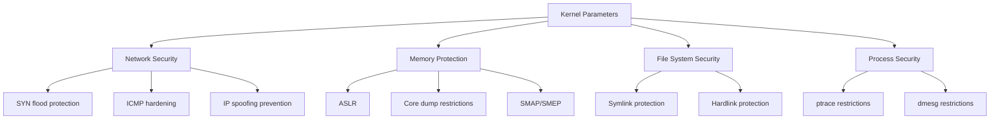

# How to Use Ansible to Configure Kernel Security Parameters

Author: [nawazdhandala](https://www.github.com/nawazdhandala)

Tags: Ansible, Kernel Security, Sysctl, Linux Hardening, Security

Description: Harden your Linux kernel security parameters using Ansible to configure sysctl settings for network protection, memory safety, and exploit mitigation.

---

The Linux kernel exposes hundreds of tunable parameters through sysctl, and many of them have direct security implications. Things like IP forwarding, SYN flood protection, address space layout randomization, and core dump handling are all kernel parameters that can make the difference between a secure server and a vulnerable one.

Manually tuning these parameters on each server is impractical. In this post, I will walk through how to use Ansible to deploy and enforce kernel security parameters consistently across your fleet.

## Why Kernel Parameters Matter for Security

Default kernel settings are designed for general compatibility, not maximum security. For example, most distributions ship with ICMP redirect acceptance enabled, which can be used for man-in-the-middle attacks. They also leave core dumps unrestricted, which can leak sensitive data from memory.



## Basic Kernel Hardening Playbook

Let's start with a playbook that applies the most important security-related sysctl settings.

This playbook sets fundamental kernel security parameters using the sysctl module:

```yaml
# kernel_hardening.yml - Apply kernel security parameters
---
- name: Configure kernel security parameters
  hosts: all
  become: true

  tasks:
    - name: Apply network security parameters
      ansible.posix.sysctl:
        name: "{{ item.key }}"
        value: "{{ item.value }}"
        sysctl_set: true
        state: present
        reload: true
        sysctl_file: /etc/sysctl.d/99-security.conf
      loop:
        # Disable IP forwarding (unless this is a router)
        - { key: "net.ipv4.ip_forward", value: "0" }

        # Enable SYN flood protection
        - { key: "net.ipv4.tcp_syncookies", value: "1" }
        - { key: "net.ipv4.tcp_max_syn_backlog", value: "2048" }
        - { key: "net.ipv4.tcp_synack_retries", value: "2" }

        # Disable ICMP redirects
        - { key: "net.ipv4.conf.all.accept_redirects", value: "0" }
        - { key: "net.ipv4.conf.default.accept_redirects", value: "0" }
        - { key: "net.ipv4.conf.all.send_redirects", value: "0" }
        - { key: "net.ipv4.conf.default.send_redirects", value: "0" }
        - { key: "net.ipv4.conf.all.secure_redirects", value: "0" }
        - { key: "net.ipv4.conf.default.secure_redirects", value: "0" }

        # Enable source address verification (anti-spoofing)
        - { key: "net.ipv4.conf.all.rp_filter", value: "1" }
        - { key: "net.ipv4.conf.default.rp_filter", value: "1" }

        # Ignore ICMP broadcast requests
        - { key: "net.ipv4.icmp_echo_ignore_broadcasts", value: "1" }

        # Ignore bogus ICMP error responses
        - { key: "net.ipv4.icmp_ignore_bogus_error_responses", value: "1" }

        # Log suspicious packets (martians)
        - { key: "net.ipv4.conf.all.log_martians", value: "1" }
        - { key: "net.ipv4.conf.default.log_martians", value: "1" }

        # Disable source routing
        - { key: "net.ipv4.conf.all.accept_source_route", value: "0" }
        - { key: "net.ipv4.conf.default.accept_source_route", value: "0" }
```

## Memory and Process Security Parameters

Beyond network settings, several kernel parameters protect against memory-based attacks.

This playbook configures memory protection and process isolation settings:

```yaml
# memory_security.yml - Kernel memory and process security
---
- name: Configure memory security parameters
  hosts: all
  become: true

  tasks:
    - name: Apply memory and process security parameters
      ansible.posix.sysctl:
        name: "{{ item.key }}"
        value: "{{ item.value }}"
        sysctl_set: true
        state: present
        reload: true
        sysctl_file: /etc/sysctl.d/99-memory-security.conf
      loop:
        # Enable ASLR (Address Space Layout Randomization)
        # 2 = full randomization
        - { key: "kernel.randomize_va_space", value: "2" }

        # Restrict core dumps for setuid programs
        - { key: "fs.suid_dumpable", value: "0" }

        # Restrict access to kernel logs (dmesg)
        - { key: "kernel.dmesg_restrict", value: "1" }

        # Restrict access to kernel pointers in /proc
        - { key: "kernel.kptr_restrict", value: "2" }

        # Restrict ptrace to parent processes only
        # 0 = no restrictions, 1 = parent only, 2 = admin only, 3 = disabled
        - { key: "kernel.yama.ptrace_scope", value: "2" }

        # Restrict loading of kernel modules
        # Uncomment only after all needed modules are loaded
        # - { key: "kernel.modules_disabled", value: "1" }

        # Disable magic SysRq key (prevents keyboard-based attacks)
        - { key: "kernel.sysrq", value: "0" }

        # Restrict perf_event access
        - { key: "kernel.perf_event_paranoid", value: "3" }

        # Restrict unprivileged BPF
        - { key: "kernel.unprivileged_bpf_disabled", value: "1" }

        # Harden BPF JIT compiler
        - { key: "net.core.bpf_jit_harden", value: "2" }
```

## File System Security Parameters

These parameters protect against symlink and hardlink attacks:

```yaml
# filesystem_security.yml - File system security parameters
---
- name: Configure filesystem security parameters
  hosts: all
  become: true

  tasks:
    - name: Apply filesystem security parameters
      ansible.posix.sysctl:
        name: "{{ item.key }}"
        value: "{{ item.value }}"
        sysctl_set: true
        state: present
        reload: true
        sysctl_file: /etc/sysctl.d/99-filesystem-security.conf
      loop:
        # Protect against symlink attacks in world-writable dirs
        - { key: "fs.protected_symlinks", value: "1" }

        # Protect against hardlink attacks
        - { key: "fs.protected_hardlinks", value: "1" }

        # Protect FIFOs in world-writable directories
        - { key: "fs.protected_fifos", value: "2" }

        # Protect regular files in world-writable directories
        - { key: "fs.protected_regular", value: "2" }

        # Restrict the use of user namespaces (if not needed)
        # Note: this breaks some container runtimes
        # - { key: "user.max_user_namespaces", value: "0" }
```

## IPv6 Security Parameters

If your servers use IPv6, you should harden those settings too:

```yaml
# ipv6_security.yml - IPv6 kernel security parameters
---
- name: Configure IPv6 security parameters
  hosts: all
  become: true

  vars:
    ipv6_enabled: true

  tasks:
    - name: Apply IPv6 security parameters
      ansible.posix.sysctl:
        name: "{{ item.key }}"
        value: "{{ item.value }}"
        sysctl_set: true
        state: present
        reload: true
        sysctl_file: /etc/sysctl.d/99-ipv6-security.conf
      loop:
        # Disable IPv6 router advertisements
        - { key: "net.ipv6.conf.all.accept_ra", value: "0" }
        - { key: "net.ipv6.conf.default.accept_ra", value: "0" }

        # Disable IPv6 redirects
        - { key: "net.ipv6.conf.all.accept_redirects", value: "0" }
        - { key: "net.ipv6.conf.default.accept_redirects", value: "0" }

        # Disable IPv6 source routing
        - { key: "net.ipv6.conf.all.accept_source_route", value: "0" }
        - { key: "net.ipv6.conf.default.accept_source_route", value: "0" }

        # Use privacy extensions for IPv6
        - { key: "net.ipv6.conf.all.use_tempaddr", value: "2" }
        - { key: "net.ipv6.conf.default.use_tempaddr", value: "2" }
      when: ipv6_enabled
```

## Building a Complete Sysctl Role

For production use, organize all of this into a role with variable-driven configuration:

```yaml
# roles/kernel_security/defaults/main.yml
---
kernel_security:
  network:
    ip_forward: 0
    tcp_syncookies: 1
    accept_redirects: 0
    send_redirects: 0
    rp_filter: 1
    log_martians: 1
    accept_source_route: 0
  memory:
    randomize_va_space: 2
    suid_dumpable: 0
    dmesg_restrict: 1
    kptr_restrict: 2
    ptrace_scope: 2
    sysrq: 0
  filesystem:
    protected_symlinks: 1
    protected_hardlinks: 1
    protected_fifos: 2
    protected_regular: 2

# Set to true for routers/firewalls
is_router: false
```

The role's tasks file applies settings based on variables:

```yaml
# roles/kernel_security/tasks/main.yml
---
- name: Deploy security sysctl configuration
  ansible.builtin.template:
    src: security-sysctl.conf.j2
    dest: /etc/sysctl.d/99-ansible-security.conf
    owner: root
    group: root
    mode: '0644'
  notify: reload sysctl

- name: Apply sysctl settings immediately
  ansible.builtin.command: sysctl --system
  changed_when: true
```

## Verifying Parameters

After applying settings, verify they took effect:

```yaml
# verify_sysctl.yml - Verify kernel security parameters
---
- name: Verify kernel security parameters
  hosts: all
  become: true

  vars:
    expected_values:
      net.ipv4.tcp_syncookies: "1"
      kernel.randomize_va_space: "2"
      net.ipv4.conf.all.accept_redirects: "0"
      kernel.dmesg_restrict: "1"
      fs.protected_symlinks: "1"

  tasks:
    - name: Check each parameter
      ansible.builtin.command: sysctl {{ item.key }}
      loop: "{{ expected_values | dict2items }}"
      register: sysctl_check
      changed_when: false

    - name: Verify values match expected
      ansible.builtin.assert:
        that:
          - item.stdout.split('=')[1] | trim == expected_values[item.item.key]
        fail_msg: "{{ item.item.key }} is {{ item.stdout.split('=')[1] | trim }}, expected {{ expected_values[item.item.key] }}"
        success_msg: "{{ item.item.key }} is correctly set"
      loop: "{{ sysctl_check.results }}"
```

## Important Considerations

1. **IP forwarding.** If your server acts as a router, gateway, or runs containers with host networking, you need IP forwarding enabled. Do not blindly set it to 0.
2. **ptrace restrictions.** Setting ptrace_scope to 2 or 3 breaks debuggers like gdb and strace for non-root users. This is fine for production servers but not development machines.
3. **Kernel module restrictions.** Setting modules_disabled to 1 prevents loading any new kernel modules. Only do this after all required modules are loaded.
4. **Test before production.** Some parameters can break applications. Always test in staging first.
5. **Persistence.** The sysctl module writes to conf files, so changes survive reboots. But always verify after a reboot to be sure.

Kernel parameter hardening is one of the most impactful security measures you can take, and Ansible makes it manageable at scale. Start with the network settings, add memory protections, and gradually tighten things based on what your workloads actually need.
