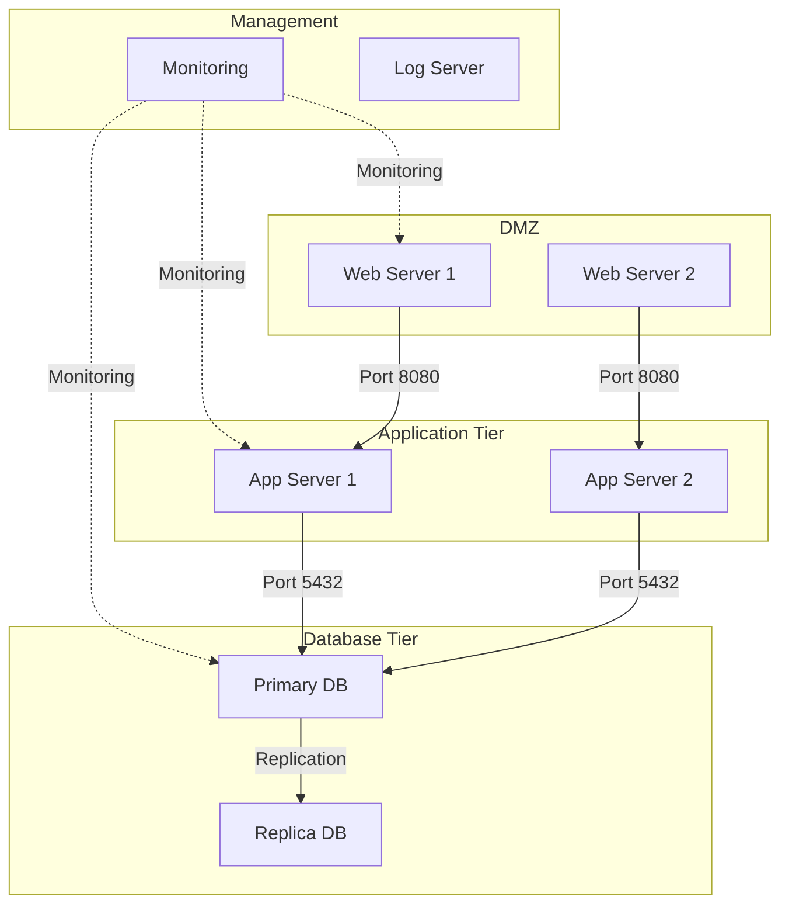

# How to Use Ansible to Configure Network Segmentation

Author: [nawazdhandala](https://www.github.com/nawazdhandala)

Tags: Ansible, Network Segmentation, Security, Firewall, iptables

Description: Implement network segmentation across your infrastructure using Ansible to isolate workloads and limit lateral movement with firewall rules and VLANs.

---

Network segmentation is one of the most effective security measures you can implement. The idea is simple: divide your network into smaller, isolated segments so that if an attacker compromises one server, they cannot easily reach everything else. In practice, implementing segmentation across a fleet of servers is challenging without automation.

Ansible makes it possible to push consistent firewall rules, configure VLAN interfaces, and enforce traffic policies across your entire infrastructure. In this post, I will walk through practical approaches to network segmentation using Ansible.

## Why Network Segmentation Matters

In a flat network, any compromised server can communicate with every other server. That means a breached web server can directly access your database, your internal APIs, and your monitoring systems. Segmentation limits this lateral movement.



## Defining Network Zones

Before writing any Ansible playbooks, you need to define your network zones. A typical setup includes:

- **DMZ (Demilitarized Zone)**: Internet-facing servers (web servers, load balancers)
- **Application Tier**: Application servers, microservices
- **Database Tier**: Databases, caches
- **Management**: Monitoring, logging, bastion hosts

Here is how to model these zones in your Ansible inventory:

```ini
# inventory/hosts.ini - Network zone-based inventory
[dmz]
web01 ansible_host=10.1.1.10
web02 ansible_host=10.1.1.11

[app_tier]
app01 ansible_host=10.2.1.10
app02 ansible_host=10.2.1.11

[db_tier]
db01 ansible_host=10.3.1.10
db02 ansible_host=10.3.1.11

[management]
monitor01 ansible_host=10.4.1.10
log01 ansible_host=10.4.1.11
bastion ansible_host=10.4.1.12
```

And group variables to define the network ranges:

```yaml
# inventory/group_vars/all.yml - Network zone definitions
---
network_zones:
  dmz:
    subnet: "10.1.1.0/24"
    description: "Internet-facing servers"
  app_tier:
    subnet: "10.2.1.0/24"
    description: "Application servers"
  db_tier:
    subnet: "10.3.1.0/24"
    description: "Database servers"
  management:
    subnet: "10.4.1.0/24"
    description: "Management and monitoring"
```

## Implementing Segmentation with iptables

The core of host-based network segmentation is firewall rules. This playbook configures iptables rules based on each server's role.

This playbook applies zone-specific firewall rules to each host:

```yaml
# network_segmentation.yml - Apply network segmentation rules
---
- name: Apply network segmentation rules
  hosts: all
  become: true

  tasks:
    - name: Install iptables-persistent
      ansible.builtin.apt:
        name: iptables-persistent
        state: present
      when: ansible_os_family == "Debian"

    - name: Flush existing rules
      ansible.builtin.iptables:
        chain: "{{ item }}"
        flush: true
      loop:
        - INPUT
        - FORWARD
        - OUTPUT

    - name: Allow established connections
      ansible.builtin.iptables:
        chain: INPUT
        ctstate: ESTABLISHED,RELATED
        jump: ACCEPT

    - name: Allow loopback
      ansible.builtin.iptables:
        chain: INPUT
        in_interface: lo
        jump: ACCEPT

    - name: Allow SSH from management zone
      ansible.builtin.iptables:
        chain: INPUT
        protocol: tcp
        destination_port: "22"
        source: "{{ network_zones.management.subnet }}"
        jump: ACCEPT

    - name: Allow monitoring from management zone
      ansible.builtin.iptables:
        chain: INPUT
        protocol: tcp
        destination_port: "9100"
        source: "{{ network_zones.management.subnet }}"
        jump: ACCEPT
        comment: "Node exporter from management"

    - name: Set default INPUT policy to DROP
      ansible.builtin.iptables:
        chain: INPUT
        policy: DROP

    - name: Save iptables rules
      ansible.builtin.command: iptables-save > /etc/iptables/rules.v4
      changed_when: true
      when: ansible_os_family == "Debian"
```

## Zone-Specific Rules

Each zone needs its own set of allowed traffic. Here are playbooks for each tier.

Rules for web servers in the DMZ:

```yaml
# dmz_rules.yml - Firewall rules for DMZ servers
---
- name: Configure DMZ firewall rules
  hosts: dmz
  become: true

  tasks:
    - name: Allow HTTP from anywhere
      ansible.builtin.iptables:
        chain: INPUT
        protocol: tcp
        destination_port: "80"
        jump: ACCEPT
        comment: "HTTP from internet"

    - name: Allow HTTPS from anywhere
      ansible.builtin.iptables:
        chain: INPUT
        protocol: tcp
        destination_port: "443"
        jump: ACCEPT
        comment: "HTTPS from internet"

    - name: Allow outbound to app tier on port 8080
      ansible.builtin.iptables:
        chain: OUTPUT
        protocol: tcp
        destination_port: "8080"
        destination: "{{ network_zones.app_tier.subnet }}"
        jump: ACCEPT
        comment: "DMZ to app tier"

    - name: Block DMZ to database tier
      ansible.builtin.iptables:
        chain: OUTPUT
        destination: "{{ network_zones.db_tier.subnet }}"
        jump: DROP
        comment: "Block DMZ direct to DB"
```

Rules for application servers:

```yaml
# app_tier_rules.yml - Firewall rules for application tier
---
- name: Configure application tier firewall rules
  hosts: app_tier
  become: true

  tasks:
    - name: Allow traffic from DMZ on app port
      ansible.builtin.iptables:
        chain: INPUT
        protocol: tcp
        destination_port: "8080"
        source: "{{ network_zones.dmz.subnet }}"
        jump: ACCEPT
        comment: "App traffic from DMZ"

    - name: Allow outbound to database tier
      ansible.builtin.iptables:
        chain: OUTPUT
        protocol: tcp
        destination_port: "5432"
        destination: "{{ network_zones.db_tier.subnet }}"
        jump: ACCEPT
        comment: "App to DB"

    - name: Allow outbound to database tier (Redis)
      ansible.builtin.iptables:
        chain: OUTPUT
        protocol: tcp
        destination_port: "6379"
        destination: "{{ network_zones.db_tier.subnet }}"
        jump: ACCEPT
        comment: "App to Redis"

    - name: Block app tier to DMZ
      ansible.builtin.iptables:
        chain: OUTPUT
        destination: "{{ network_zones.dmz.subnet }}"
        jump: DROP
        comment: "Block app to DMZ"
```

Rules for database servers:

```yaml
# db_tier_rules.yml - Firewall rules for database tier
---
- name: Configure database tier firewall rules
  hosts: db_tier
  become: true

  tasks:
    - name: Allow PostgreSQL from app tier
      ansible.builtin.iptables:
        chain: INPUT
        protocol: tcp
        destination_port: "5432"
        source: "{{ network_zones.app_tier.subnet }}"
        jump: ACCEPT
        comment: "PostgreSQL from app tier"

    - name: Allow Redis from app tier
      ansible.builtin.iptables:
        chain: INPUT
        protocol: tcp
        destination_port: "6379"
        source: "{{ network_zones.app_tier.subnet }}"
        jump: ACCEPT
        comment: "Redis from app tier"

    - name: Allow replication between DB servers
      ansible.builtin.iptables:
        chain: INPUT
        protocol: tcp
        destination_port: "5432"
        source: "{{ network_zones.db_tier.subnet }}"
        jump: ACCEPT
        comment: "DB replication"

    - name: Block all outbound to DMZ and app tier
      ansible.builtin.iptables:
        chain: OUTPUT
        destination: "{{ item }}"
        jump: DROP
        comment: "Block DB outbound to {{ item }}"
      loop:
        - "{{ network_zones.dmz.subnet }}"
```

## Configuring VLAN Interfaces

For physical network segmentation, configure VLAN interfaces on your servers:

```yaml
# configure_vlans.yml - Set up VLAN interfaces
---
- name: Configure VLAN interfaces
  hosts: all
  become: true

  vars:
    vlan_configs:
      - id: 10
        name: vlan10
        parent: eth0
        address: "10.1.1.{{ ansible_host.split('.')[-1] }}/24"
        gateway: "10.1.1.1"
      - id: 20
        name: vlan20
        parent: eth0
        address: "10.2.1.{{ ansible_host.split('.')[-1] }}/24"

  tasks:
    - name: Install VLAN package
      ansible.builtin.package:
        name: vlan
        state: present

    - name: Load 8021q kernel module
      community.general.modprobe:
        name: 8021q
        state: present
        persistent: present

    - name: Configure VLAN interfaces (Netplan)
      ansible.builtin.template:
        src: netplan-vlans.yaml.j2
        dest: /etc/netplan/60-vlans.yaml
        owner: root
        group: root
        mode: '0600'
      notify: apply netplan
      when: ansible_os_family == "Debian"

  handlers:
    - name: apply netplan
      ansible.builtin.command: netplan apply
      changed_when: true
```

## Auditing Segmentation Rules

Regularly verify that segmentation rules are in place and working:

```yaml
# audit_segmentation.yml - Verify network segmentation
---
- name: Audit network segmentation
  hosts: all
  become: true

  tasks:
    - name: Dump current iptables rules
      ansible.builtin.command: iptables -L -n -v
      register: iptables_rules
      changed_when: false

    - name: Check default INPUT policy
      ansible.builtin.shell: iptables -L INPUT | head -1
      register: input_policy
      changed_when: false

    - name: Verify default policy is DROP
      ansible.builtin.assert:
        that:
          - "'DROP' in input_policy.stdout"
        fail_msg: "INPUT policy is not DROP on {{ inventory_hostname }}"
        success_msg: "INPUT policy correctly set to DROP"

    - name: Test connectivity to blocked zones
      ansible.builtin.command: "timeout 3 bash -c 'echo > /dev/tcp/{{ item }}/22' 2>&1"
      loop: "{{ blocked_destinations | default([]) }}"
      register: conn_test
      failed_when: conn_test.rc == 0
      changed_when: false
```

## Best Practices

Network segmentation is only effective if it is maintained consistently:

1. **Start with monitoring mode.** Before enforcing rules, log traffic patterns to understand what needs to communicate with what.
2. **Document all allowed flows.** Every firewall rule should have a comment explaining why it exists.
3. **Use Ansible groups for zone management.** Your inventory structure should match your network zones.
4. **Test from both directions.** Verify that traffic is blocked in both directions, not just one.
5. **Audit regularly.** Run verification playbooks weekly to catch any drift from your desired state.
6. **Plan for failure modes.** If your firewall rules lock you out, have a console or out-of-band access method ready.

Network segmentation with Ansible turns a complicated, error-prone process into something repeatable and verifiable. Define your zones, write your rules, and let Ansible enforce them everywhere.
