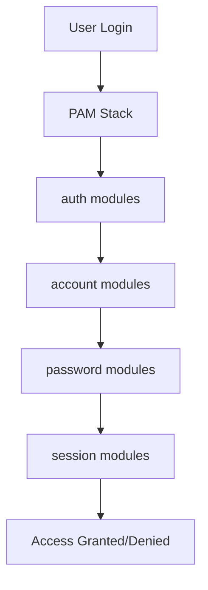

# How to Use Ansible to Configure PAM Authentication

Author: [nawazdhandala](https://www.github.com/nawazdhandala)

Tags: Ansible, PAM, Authentication, Security, Linux

Description: Learn how to configure PAM (Pluggable Authentication Modules) with Ansible for password policies, account lockout, and multi-factor authentication.

---

PAM (Pluggable Authentication Modules) is the framework that Linux uses for authentication. Every time someone logs in via SSH, runs `sudo`, or accesses any authenticated service, PAM is involved. Configuring PAM correctly is critical for security, and doing it wrong can lock everyone out of a server. Ansible lets you manage PAM configuration safely and consistently across your fleet.

## Understanding PAM Architecture

PAM uses a stack-based architecture. When a service needs to authenticate a user, it processes a series of PAM modules in order. Each module can succeed, fail, or be skipped based on configuration.

PAM has four module types:

- **auth**: Verifies the user's identity (password, token, etc.)
- **account**: Checks account restrictions (expiry, time of day, etc.)
- **password**: Handles password changes
- **session**: Sets up/tears down the user session

The main PAM configuration files live in `/etc/pam.d/`, with one file per service:



## Managing PAM with Ansible's pamd Module

The `community.general.pamd` module lets you modify PAM configuration files without dealing with raw text manipulation:

```yaml
# configure-pam-basic.yml - Basic PAM configuration
- name: Configure PAM authentication
  hosts: all
  become: yes
  tasks:
    # Ensure pam_faillock is used for auth (RHEL/CentOS)
    - name: Add pam_faillock to system-auth
      community.general.pamd:
        name: system-auth
        type: auth
        control: required
        module_path: pam_env.so
        new_type: auth
        new_control: required
        new_module_path: pam_faillock.so
        module_arguments: "preauth silent deny=5 unlock_time=900"
        state: before
```

## Configuring Account Lockout

Account lockout after failed login attempts is a common security requirement:

```yaml
# pam-lockout.yml - Configure account lockout policy
- name: Configure PAM account lockout
  hosts: all
  become: yes
  tasks:
    # Configure faillock on RHEL 8+ / CentOS 8+
    - name: Create faillock configuration
      ansible.builtin.copy:
        dest: /etc/security/faillock.conf
        content: |
          # Lock account after 5 failed attempts
          deny = 5
          # Unlock after 15 minutes (900 seconds)
          unlock_time = 900
          # Count failed attempts in this time window
          fail_interval = 900
          # Log to syslog
          audit
          # Do not lock root (optional, remove if root should be lockable)
          # even_deny_root
          # root_unlock_time = 60
        mode: '0644'
        backup: yes

    # On Debian/Ubuntu, use pam_tally2 or pam_faillock
    - name: Configure pam_faillock on Debian
      ansible.builtin.blockinfile:
        path: /etc/pam.d/common-auth
        insertbefore: "^auth.*pam_unix.so"
        block: |
          auth    required    pam_faillock.so preauth silent deny=5 unlock_time=900
        marker: "# {mark} ANSIBLE MANAGED - faillock preauth"
      when: ansible_os_family == "Debian"
```

## Configuring Password Complexity

PAM can enforce password complexity rules through `pam_pwquality`:

```yaml
# pam-password-quality.yml - Configure password complexity
- name: Configure password quality requirements
  hosts: all
  become: yes
  tasks:
    - name: Install libpam-pwquality on Debian
      ansible.builtin.apt:
        name: libpam-pwquality
        state: present
      when: ansible_os_family == "Debian"

    - name: Configure pwquality settings
      ansible.builtin.copy:
        dest: /etc/security/pwquality.conf
        content: |
          # Minimum password length
          minlen = 14

          # Require at least one digit
          dcredit = -1

          # Require at least one uppercase letter
          ucredit = -1

          # Require at least one lowercase letter
          lcredit = -1

          # Require at least one special character
          ocredit = -1

          # Minimum number of character classes
          minclass = 3

          # Maximum consecutive identical characters
          maxrepeat = 3

          # Maximum consecutive characters from the same class
          maxclassrepeat = 4

          # Reject passwords containing the username
          usercheck = 1

          # Number of characters that must differ from old password
          difok = 8

          # Reject passwords from dictionary
          dictcheck = 1
        mode: '0644'
        backup: yes
```

## Configuring PAM for SSH

SSH PAM configuration controls how SSH sessions are authenticated:

```yaml
# pam-ssh.yml - Configure PAM for SSH service
- name: Configure PAM for SSH
  hosts: all
  become: yes
  tasks:
    # Ensure SSH uses PAM
    - name: Enable PAM in sshd_config
      ansible.builtin.lineinfile:
        path: /etc/ssh/sshd_config
        regexp: '^#?UsePAM'
        line: 'UsePAM yes'
      notify: restart sshd

    # Configure access control for SSH
    - name: Create access.conf for SSH restrictions
      ansible.builtin.copy:
        dest: /etc/security/access.conf
        content: |
          # Allow root from specific networks
          + : root : 10.0.0.0/8
          + : root : 192.168.0.0/16

          # Allow admin group from anywhere
          + : @admins : ALL

          # Allow developers only from office network
          + : @developers : 10.10.0.0/16

          # Deny everything else
          - : ALL : ALL
        mode: '0644'
        backup: yes

    # Enable pam_access in the SSH PAM stack
    - name: Add pam_access to SSH PAM config
      ansible.builtin.lineinfile:
        path: /etc/pam.d/sshd
        line: "account    required     pam_access.so accessfile=/etc/security/access.conf"
        insertafter: "^account"

  handlers:
    - name: restart sshd
      ansible.builtin.systemd:
        name: sshd
        state: restarted
```

## Configuring Resource Limits via PAM

PAM's `pam_limits` module controls resource limits for user sessions:

```yaml
# pam-limits.yml - Configure resource limits via PAM
- name: Configure PAM resource limits
  hosts: all
  become: yes
  tasks:
    - name: Set resource limits
      ansible.builtin.copy:
        dest: /etc/security/limits.d/90-custom.conf
        content: |
          # Maximum number of open files for all users
          *               soft    nofile          65536
          *               hard    nofile          131072

          # Maximum processes for regular users
          *               soft    nproc           4096
          *               hard    nproc           8192

          # Higher limits for the app group
          @appgroup       soft    nofile          131072
          @appgroup       hard    nofile          262144

          # Unlimited for root
          root            soft    nofile          unlimited
          root            hard    nofile          unlimited
        mode: '0644'

    # Ensure pam_limits is enabled
    - name: Ensure pam_limits is in common-session
      ansible.builtin.lineinfile:
        path: /etc/pam.d/common-session
        line: "session    required     pam_limits.so"
        state: present
      when: ansible_os_family == "Debian"
```

## Time-Based Login Restrictions

Use `pam_time` to restrict when users can log in:

```yaml
# pam-time-restrictions.yml - Configure time-based login restrictions
- name: Configure time-based access
  hosts: all
  become: yes
  tasks:
    - name: Configure time restrictions
      ansible.builtin.copy:
        dest: /etc/security/time.conf
        content: |
          # Syntax: services;ttys;users;times
          # Allow contractors only during business hours (Mon-Fri 8am-6pm)
          sshd;*;@contractors;Wk0800-1800

          # Allow admins anytime
          *;*;@admins;Al0000-2400

          # Block all other SSH access outside business hours
          # sshd;*;!@admins;!Wk0800-1800
        mode: '0644'

    - name: Enable pam_time in SSH PAM stack
      ansible.builtin.lineinfile:
        path: /etc/pam.d/sshd
        line: "account    required     pam_time.so"
        insertafter: "^account"
```

## Complete PAM Security Configuration

Here is a comprehensive playbook that ties together multiple PAM configurations:

```yaml
# pam-security-hardening.yml - Complete PAM security setup
- name: Harden PAM configuration
  hosts: all
  become: yes
  vars:
    password_min_length: 14
    failed_login_lockout: 5
    lockout_duration: 900
    password_remember: 12
  tasks:
    - name: Configure password quality
      ansible.builtin.copy:
        dest: /etc/security/pwquality.conf
        content: |
          minlen = {{ password_min_length }}
          dcredit = -1
          ucredit = -1
          lcredit = -1
          ocredit = -1
          minclass = 3
          maxrepeat = 3
          dictcheck = 1
        mode: '0644'

    - name: Configure faillock for account lockout
      ansible.builtin.copy:
        dest: /etc/security/faillock.conf
        content: |
          deny = {{ failed_login_lockout }}
          unlock_time = {{ lockout_duration }}
          fail_interval = {{ lockout_duration }}
          audit
        mode: '0644'

    # Ensure password history is enforced (prevent reuse)
    - name: Configure password history on RHEL
      ansible.builtin.lineinfile:
        path: /etc/pam.d/system-auth
        regexp: '^password.*pam_unix.so'
        line: "password    sufficient    pam_unix.so sha512 shadow remember={{ password_remember }} use_authtok"
      when: ansible_os_family == "RedHat"

    - name: Configure password history on Debian
      ansible.builtin.lineinfile:
        path: /etc/pam.d/common-password
        regexp: '^password.*pam_unix.so'
        line: "password    [success=1 default=ignore]    pam_unix.so obscure sha512 remember={{ password_remember }}"
      when: ansible_os_family == "Debian"
```

## Verifying PAM Configuration

After making changes, verify the configuration is correct:

```yaml
# verify-pam.yml - Verify PAM configuration
- name: Verify PAM configuration
  hosts: all
  become: yes
  tasks:
    - name: Check PAM configuration syntax
      ansible.builtin.command: "pamtester sshd testuser authenticate"
      register: pam_test
      changed_when: false
      failed_when: false

    - name: List active PAM modules for SSH
      ansible.builtin.shell: "grep -v '^#' /etc/pam.d/sshd | grep -v '^$'"
      register: sshd_pam
      changed_when: false

    - name: Display SSH PAM stack
      ansible.builtin.debug:
        msg: "{{ sshd_pam.stdout_lines }}"
```

## Best Practices

1. **Always backup PAM files before modifying them**. Use the `backup: yes` parameter on `copy` and `lineinfile`. A bad PAM config can lock everyone out.

2. **Test changes on a single server first**. Keep a root SSH session open while testing so you can recover from misconfigurations.

3. **Use `pam_faillock` instead of `pam_tally2`**. The tally2 module is deprecated on newer systems.

4. **Do not mix manual and Ansible-managed PAM changes**. Either manage PAM entirely with Ansible or not at all. Half-managed configurations are fragile.

5. **Keep a rescue plan**. If PAM breaks, you need a way to access the server (console access, recovery mode, etc.).

6. **Document what each PAM change does**. Future operators need to understand why specific modules are in the stack.

PAM is powerful but also dangerous if misconfigured. Ansible gives you a way to manage it consistently, but always test thoroughly and keep recovery options available.
