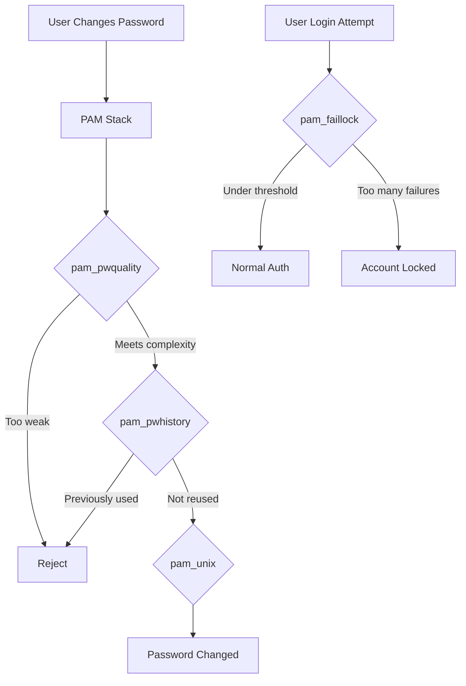

# How to Use Ansible to Configure Password Policies

Author: [nawazdhandala](https://www.github.com/nawazdhandala)

Tags: Ansible, Password Policy, Security, PAM, Linux

Description: Enforce consistent password policies across your Linux servers using Ansible to configure PAM, login.defs, and password quality requirements.

---

Password policies are one of those things that seem simple until you realize every server in your fleet has slightly different settings. One server requires 12-character passwords, another accepts 6. One locks accounts after 3 failed attempts, another never locks. Ansible lets you fix this inconsistency by pushing a unified password policy everywhere at once.

In this post, I will cover how to configure password complexity, expiration, account lockout, and history using Ansible. We will work with PAM modules, login.defs, and pwquality to build a complete password policy.

## Understanding Linux Password Policy Components

Linux password policies are spread across several configuration files and PAM modules:

- `/etc/login.defs` controls password aging and basic settings
- `/etc/security/pwquality.conf` sets password complexity rules
- PAM modules like `pam_pwquality`, `pam_faillock`, and `pam_pwhistory` enforce the policies



## Configuring Password Complexity with pwquality

The `pam_pwquality` module is the standard way to enforce password complexity on modern Linux systems.

This playbook installs pwquality and deploys a configuration file with strong complexity requirements:

```yaml
# password_complexity.yml - Configure password complexity rules
---
- name: Configure password complexity
  hosts: all
  become: true

  vars:
    pw_min_length: 14
    pw_min_class: 3        # Require 3 of 4 character classes
    pw_dcredit: -1         # At least 1 digit
    pw_ucredit: -1         # At least 1 uppercase
    pw_lcredit: -1         # At least 1 lowercase
    pw_ocredit: -1         # At least 1 special character
    pw_max_repeat: 3       # Max 3 consecutive identical chars
    pw_max_class_repeat: 4 # Max 4 consecutive same-class chars
    pw_reject_username: true
    pw_enforce_root: true

  tasks:
    - name: Install password quality library
      ansible.builtin.package:
        name: "{{ 'libpam-pwquality' if ansible_os_family == 'Debian' else 'libpwquality' }}"
        state: present

    - name: Configure pwquality settings
      ansible.builtin.template:
        src: pwquality.conf.j2
        dest: /etc/security/pwquality.conf
        owner: root
        group: root
        mode: '0644'

    - name: Ensure pam_pwquality is in password stack
      ansible.builtin.lineinfile:
        path: /etc/pam.d/common-password
        regexp: "^password.*pam_pwquality.so"
        line: "password requisite pam_pwquality.so retry=3"
        insertbefore: "^password.*pam_unix.so"
      when: ansible_os_family == "Debian"
```

The pwquality configuration template:

```ini
# templates/pwquality.conf.j2 - Password quality configuration
# Managed by Ansible

# Minimum password length
minlen = {{ pw_min_length }}

# Minimum number of character classes (uppercase, lowercase, digit, special)
minclass = {{ pw_min_class }}

# Credit settings (negative means required minimum)
dcredit = {{ pw_dcredit }}
ucredit = {{ pw_ucredit }}
lcredit = {{ pw_lcredit }}
ocredit = {{ pw_ocredit }}

# Maximum consecutive identical characters
maxrepeat = {{ pw_max_repeat }}

# Maximum consecutive characters of the same class
maxclassrepeat = {{ pw_max_class_repeat }}

# Reject passwords containing the username

usercheck = 1


# Enforce policy for root user too

enforce_for_root


# Number of characters that must differ from old password
difok = 5

# Reject passwords from dictionary
dictcheck = 1
```

## Setting Password Aging in login.defs

The `/etc/login.defs` file controls password expiration settings that apply to all new user accounts.

This playbook configures password aging parameters:

```yaml
# password_aging.yml - Configure password expiration settings
---
- name: Configure password aging
  hosts: all
  become: true

  vars:
    pass_max_days: 90    # Password expires after 90 days
    pass_min_days: 7     # Must wait 7 days before changing again
    pass_warn_age: 14    # Warn 14 days before expiration
    pass_min_len: 14     # Minimum password length

  tasks:
    - name: Set maximum password age
      ansible.builtin.lineinfile:
        path: /etc/login.defs
        regexp: "^PASS_MAX_DAYS"
        line: "PASS_MAX_DAYS   {{ pass_max_days }}"

    - name: Set minimum password age
      ansible.builtin.lineinfile:
        path: /etc/login.defs
        regexp: "^PASS_MIN_DAYS"
        line: "PASS_MIN_DAYS   {{ pass_min_days }}"

    - name: Set password warning period
      ansible.builtin.lineinfile:
        path: /etc/login.defs
        regexp: "^PASS_WARN_AGE"
        line: "PASS_WARN_AGE   {{ pass_warn_age }}"

    - name: Set minimum password length in login.defs
      ansible.builtin.lineinfile:
        path: /etc/login.defs
        regexp: "^PASS_MIN_LEN"
        line: "PASS_MIN_LEN    {{ pass_min_len }}"

    - name: Apply aging settings to existing users
      ansible.builtin.command: >
        chage --maxdays {{ pass_max_days }}
        --mindays {{ pass_min_days }}
        --warndays {{ pass_warn_age }}
        {{ item }}
      loop: "{{ existing_users | default([]) }}"
      changed_when: true
```

## Configuring Account Lockout with pam_faillock

Account lockout prevents brute-force attacks by locking accounts after too many failed login attempts.

This playbook configures pam_faillock to lock accounts after repeated failures:

```yaml
# account_lockout.yml - Configure account lockout policy
---
- name: Configure account lockout
  hosts: all
  become: true

  vars:
    faillock_deny: 5            # Lock after 5 failures
    faillock_unlock_time: 900   # Unlock after 15 minutes (0 = manual unlock)
    faillock_fail_interval: 900 # Count failures within 15-minute window
    faillock_even_deny_root: false

  tasks:
    - name: Configure faillock settings
      ansible.builtin.template:
        src: faillock.conf.j2
        dest: /etc/security/faillock.conf
        owner: root
        group: root
        mode: '0644'

    - name: Add pam_faillock to auth stack (preauth)
      ansible.builtin.lineinfile:
        path: "{{ item }}"
        regexp: "^auth.*pam_faillock.so preauth"
        line: "auth required pam_faillock.so preauth"
        insertbefore: "^auth.*pam_unix.so"
      loop:
        - /etc/pam.d/system-auth
        - /etc/pam.d/password-auth
      when: ansible_os_family == "RedHat"

    - name: Add pam_faillock to auth stack (authfail)
      ansible.builtin.lineinfile:
        path: "{{ item }}"
        regexp: "^auth.*pam_faillock.so authfail"
        line: "auth [default=die] pam_faillock.so authfail"
        insertafter: "^auth.*pam_unix.so"
      loop:
        - /etc/pam.d/system-auth
        - /etc/pam.d/password-auth
      when: ansible_os_family == "RedHat"
```

The faillock configuration template:

```ini
# templates/faillock.conf.j2 - Account lockout configuration
# Managed by Ansible

# Number of failed attempts before locking
deny = {{ faillock_deny }}

# Time in seconds before lock expires (0 = never auto-unlock)
unlock_time = {{ faillock_unlock_time }}

# Time window for counting failures
fail_interval = {{ faillock_fail_interval }}

# Lock root account too

even_deny_root
root_unlock_time = {{ faillock_unlock_time }}


# Audit failed login attempts
audit

# Log to syslog
silent
```

## Enforcing Password History

Password history prevents users from cycling through old passwords.

This task configures pam_pwhistory to remember the last N passwords:

```yaml
# password_history.yml - Prevent password reuse
---
- name: Configure password history
  hosts: all
  become: true

  vars:
    pw_history_remember: 12  # Remember last 12 passwords

  tasks:
    - name: Configure pam_pwhistory on Debian
      ansible.builtin.lineinfile:
        path: /etc/pam.d/common-password
        regexp: "^password.*pam_pwhistory.so"
        line: "password required pam_pwhistory.so remember={{ pw_history_remember }} use_authtok enforce_for_root"
        insertbefore: "^password.*pam_unix.so"
      when: ansible_os_family == "Debian"

    - name: Configure pam_pwhistory on RHEL
      ansible.builtin.lineinfile:
        path: /etc/pam.d/system-auth
        regexp: "^password.*pam_pwhistory.so"
        line: "password required pam_pwhistory.so remember={{ pw_history_remember }} use_authtok enforce_for_root"
        insertbefore: "^password.*pam_unix.so"
      when: ansible_os_family == "RedHat"

    - name: Ensure opasswd file exists with correct permissions
      ansible.builtin.file:
        path: /etc/security/opasswd
        state: touch
        owner: root
        group: root
        mode: '0600'
        modification_time: preserve
        access_time: preserve
```

## Complete Password Policy Role

Here is how to tie everything together into a reusable role:

```yaml
# roles/password_policy/defaults/main.yml
---
password_policy:
  complexity:
    min_length: 14
    min_class: 3
    dcredit: -1
    ucredit: -1
    lcredit: -1
    ocredit: -1
    max_repeat: 3
    reject_username: true
  aging:
    max_days: 90
    min_days: 7
    warn_days: 14
  lockout:
    deny: 5
    unlock_time: 900
    fail_interval: 900
  history:
    remember: 12
```

## Auditing Current Password Policy

Before making changes, audit what is already in place:

```yaml
# audit_password_policy.yml - Check current password settings
---
- name: Audit current password policy
  hosts: all
  become: true

  tasks:
    - name: Read current login.defs settings
      ansible.builtin.shell: |
        grep -E "^PASS_(MAX|MIN|WARN)" /etc/login.defs
      register: login_defs
      changed_when: false

    - name: Read current pwquality settings
      ansible.builtin.command: cat /etc/security/pwquality.conf
      register: pwquality
      changed_when: false
      failed_when: false

    - name: Check for users with no password expiry
      ansible.builtin.shell: |
        awk -F: '$5 == "" || $5 == 99999 {print $1}' /etc/shadow
      register: no_expiry_users
      changed_when: false

    - name: Report findings
      ansible.builtin.debug:
        msg:
          - "Login.defs: {{ login_defs.stdout_lines }}"
          - "Users without password expiry: {{ no_expiry_users.stdout_lines }}"
```

## Things to Watch Out For

Password policies can be disruptive if rolled out carelessly. Here are some tips:

1. **Warn users before enforcing new policies.** Nobody likes being locked out because their password suddenly does not meet new requirements.
2. **Do not set PASS_MIN_DAYS too high.** If a user's password is compromised, they need to change it immediately.
3. **Consider exempt accounts.** Service accounts with passwords (if you have them) should not be subject to expiration.
4. **Test PAM changes carefully.** A broken PAM configuration can prevent all logins, including root.
5. **Keep a rescue console available.** Always have an out-of-band access method when changing authentication settings.

By using Ansible to manage password policies, you get consistent enforcement across your entire fleet, easy auditing, and the ability to update policies globally with a single playbook run.
