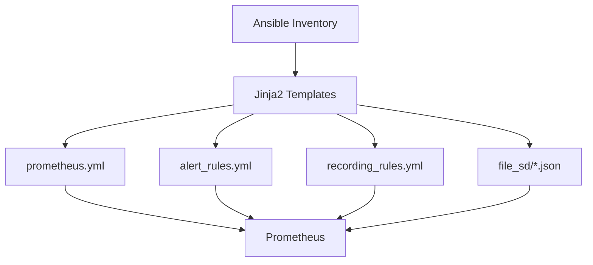

# How to Use Ansible to Configure Prometheus

Author: [nawazdhandala](https://www.github.com/nawazdhandala)

Tags: Ansible, Prometheus, Monitoring, Configuration, DevOps

Description: Learn how to manage Prometheus configuration at scale using Ansible, covering scrape targets, relabeling, service discovery, and alerting rules.

---

Installing Prometheus is the easy part. Configuring it properly for a production environment with dozens of scrape targets, relabeling rules, service discovery, and alerting is where the real complexity lives. Ansible excels at managing this complexity because Prometheus configuration is just YAML, and Ansible's templating system can generate dynamic, environment-specific configurations from your inventory data.

This post focuses on the configuration side of Prometheus: managing scrape targets, writing recording and alerting rules, setting up relabeling, and using file-based service discovery. I will assume you already have Prometheus installed (see the companion post on installing Prometheus with Ansible).

## Configuration Strategy

The approach here is to use Ansible's inventory as the source of truth for what gets monitored. Instead of manually editing `prometheus.yml`, targets are derived from your host groups and variables. When you add a new server to your inventory, it automatically becomes a Prometheus target on the next playbook run.



## Project Structure

```
prometheus-config/
  inventory/
    hosts.yml
    group_vars/
      all.yml
      webservers.yml
      databases.yml
  roles/
    prometheus_config/
      tasks/
        main.yml
      templates/
        prometheus.yml.j2
        alert_rules.yml.j2
        recording_rules.yml.j2
        file_sd_targets.json.j2
      defaults/
        main.yml
      handlers/
        main.yml
  playbook.yml
```

## Inventory as Source of Truth

Your inventory defines what gets monitored. Each host group corresponds to a Prometheus job.

```yaml
# inventory/hosts.yml
all:
  children:
    monitoring:
      hosts:
        prometheus01:
          ansible_host: 10.0.1.5
    webservers:
      hosts:
        web01:
          ansible_host: 10.0.1.10
          app_port: 3000
        web02:
          ansible_host: 10.0.1.11
          app_port: 3000
        web03:
          ansible_host: 10.0.1.12
          app_port: 3000
    databases:
      hosts:
        db01:
          ansible_host: 10.0.2.10
          postgres_exporter_port: 9187
        db02:
          ansible_host: 10.0.2.11
          postgres_exporter_port: 9187
    redis_servers:
      hosts:
        redis01:
          ansible_host: 10.0.3.10
          redis_exporter_port: 9121
```

## Default Variables

```yaml
# roles/prometheus_config/defaults/main.yml
prometheus_config_dir: "/etc/prometheus"
prometheus_data_dir: "/var/lib/prometheus"
prometheus_user: "prometheus"
prometheus_group: "prometheus"

# Global settings
prometheus_scrape_interval: "15s"
prometheus_scrape_timeout: "10s"
prometheus_evaluation_interval: "15s"

# External labels applied to all metrics
prometheus_external_labels:
  environment: "production"
  datacenter: "us-east-1"

# Alertmanager targets
prometheus_alertmanager_targets:
  - "localhost:9093"

# Node Exporter port (assumed same on all hosts)
node_exporter_port: 9100

# Enable file-based service discovery
prometheus_file_sd_enabled: true

# Relabeling settings
prometheus_add_instance_label: true
```

## Prometheus Configuration Template

This is the main configuration file. It dynamically generates scrape jobs from your inventory.

```yaml
# roles/prometheus_config/templates/prometheus.yml.j2
# Prometheus configuration - managed by Ansible
# Last updated: {{ ansible_date_time.iso8601 }}

global:
  scrape_interval: {{ prometheus_scrape_interval }}
  scrape_timeout: {{ prometheus_scrape_timeout }}
  evaluation_interval: {{ prometheus_evaluation_interval }}
  external_labels:

    {{ key }}: "{{ value }}"


rule_files:
  - "rules/alert_rules.yml"
  - "rules/recording_rules.yml"

alerting:
  alertmanagers:
    - static_configs:
        - targets:

            - "{{ target }}"


scrape_configs:
  # Prometheus self-monitoring
  - job_name: "prometheus"
    static_configs:
      - targets:
          - "localhost:9090"

  # Node Exporter on all hosts
  - job_name: "node_exporter"

    file_sd_configs:
      - files:
          - "{{ prometheus_config_dir }}/file_sd/node_targets.json"
        refresh_interval: 5m

    static_configs:



      - targets:
          - "{{ hostvars[host]['ansible_host'] }}:{{ node_exporter_port }}"
        labels:
          group: "{{ group_name }}"
          hostname: "{{ host }}"





  # Web application metrics
  - job_name: "webapp"
    metrics_path: /metrics
    static_configs:

      - targets:
          - "{{ hostvars[host]['ansible_host'] }}:{{ hostvars[host].get('app_port', 3000) }}"
        labels:
          hostname: "{{ host }}"

    # Drop high-cardinality labels to save storage
    metric_relabel_configs:
      - source_labels: [__name__]
        regex: 'http_request_duration_seconds_bucket'
        action: drop

  # PostgreSQL exporter
  - job_name: "postgres"
    static_configs:

      - targets:
          - "{{ hostvars[host]['ansible_host'] }}:{{ hostvars[host].get('postgres_exporter_port', 9187) }}"
        labels:
          hostname: "{{ host }}"


  # Redis exporter
  - job_name: "redis"
    static_configs:

      - targets:
          - "{{ hostvars[host]['ansible_host'] }}:{{ hostvars[host].get('redis_exporter_port', 9121) }}"
        labels:
          hostname: "{{ host }}"

```

## File-Based Service Discovery Template

When file-based service discovery is enabled, Ansible generates JSON target files that Prometheus watches for changes.

```json
# roles/prometheus_config/templates/file_sd_targets.json.j2
[



  {
    "targets": ["{{ hostvars[host]['ansible_host'] }}:{{ node_exporter_port }}"],
    "labels": {
      "group": "{{ group_name }}",
      "hostname": "{{ host }}"
    }
  },




]
```

## Alert Rules Template

```yaml
# roles/prometheus_config/templates/alert_rules.yml.j2
# Alerting rules - managed by Ansible
groups:
  - name: infrastructure
    rules:
      - alert: TargetDown
        expr: up == 0
        for: 3m
        labels:
          severity: critical
        annotations:
          summary: "Target {{ '{{ $labels.instance }}' }} is down"
          description: "{{ '{{ $labels.job }}' }}/{{ '{{ $labels.instance }}' }} has been down for more than 3 minutes."

      - alert: HighCPU
        expr: 100 - (avg by(instance) (rate(node_cpu_seconds_total{mode="idle"}[5m])) * 100) > 80
        for: 10m
        labels:
          severity: warning
        annotations:
          summary: "High CPU on {{ '{{ $labels.instance }}' }}"
          description: "CPU usage is {{ '{{ $value | printf \"%.1f\" }}' }}% on {{ '{{ $labels.instance }}' }}."

      - alert: HighMemory
        expr: (1 - node_memory_MemAvailable_bytes / node_memory_MemTotal_bytes) * 100 > 85
        for: 5m
        labels:
          severity: warning
        annotations:
          summary: "High memory on {{ '{{ $labels.instance }}' }}"

      - alert: DiskSpaceCritical
        expr: (1 - node_filesystem_avail_bytes{fstype!="tmpfs"} / node_filesystem_size_bytes{fstype!="tmpfs"}) * 100 > 90
        for: 5m
        labels:
          severity: critical
        annotations:
          summary: "Disk space critical on {{ '{{ $labels.instance }}' }}"

  - name: application
    rules:
      - alert: HighErrorRate
        expr: rate(http_requests_total{status=~"5.."}[5m]) / rate(http_requests_total[5m]) > 0.05
        for: 5m
        labels:
          severity: critical
        annotations:
          summary: "High error rate on {{ '{{ $labels.instance }}' }}"
          description: "More than 5% of requests are failing."

      - alert: HighLatency
        expr: histogram_quantile(0.95, rate(http_request_duration_seconds_bucket[5m])) > 1
        for: 5m
        labels:
          severity: warning
        annotations:
          summary: "High p95 latency on {{ '{{ $labels.instance }}' }}"
```

## Recording Rules Template

Recording rules pre-compute frequently used queries to speed up dashboards and alerts.

```yaml
# roles/prometheus_config/templates/recording_rules.yml.j2
# Recording rules - managed by Ansible
groups:
  - name: node_recording_rules
    interval: 15s
    rules:
      - record: instance:node_cpu_utilization:ratio
        expr: 1 - avg by(instance) (rate(node_cpu_seconds_total{mode="idle"}[5m]))

      - record: instance:node_memory_utilization:ratio
        expr: 1 - node_memory_MemAvailable_bytes / node_memory_MemTotal_bytes

      - record: instance:node_disk_utilization:ratio
        expr: 1 - node_filesystem_avail_bytes{fstype!="tmpfs"} / node_filesystem_size_bytes{fstype!="tmpfs"}

  - name: app_recording_rules
    interval: 15s
    rules:
      - record: job:http_requests:rate5m
        expr: sum by(job) (rate(http_requests_total[5m]))

      - record: job:http_errors:rate5m
        expr: sum by(job) (rate(http_requests_total{status=~"5.."}[5m]))

      - record: job:http_error_ratio:rate5m
        expr: job:http_errors:rate5m / job:http_requests:rate5m
```

## Ansible Tasks

```yaml
# roles/prometheus_config/tasks/main.yml
---
- name: Create rules directory
  ansible.builtin.file:
    path: "{{ prometheus_config_dir }}/rules"
    state: directory
    owner: "{{ prometheus_user }}"
    group: "{{ prometheus_group }}"
    mode: "0755"
  become: true

- name: Create file_sd directory
  ansible.builtin.file:
    path: "{{ prometheus_config_dir }}/file_sd"
    state: directory
    owner: "{{ prometheus_user }}"
    group: "{{ prometheus_group }}"
    mode: "0755"
  become: true

- name: Deploy Prometheus configuration
  ansible.builtin.template:
    src: prometheus.yml.j2
    dest: "{{ prometheus_config_dir }}/prometheus.yml"
    owner: "{{ prometheus_user }}"
    group: "{{ prometheus_group }}"
    mode: "0644"
  become: true
  notify: Reload prometheus

- name: Deploy alert rules
  ansible.builtin.template:
    src: alert_rules.yml.j2
    dest: "{{ prometheus_config_dir }}/rules/alert_rules.yml"
    owner: "{{ prometheus_user }}"
    group: "{{ prometheus_group }}"
    mode: "0644"
  become: true
  notify: Reload prometheus

- name: Deploy recording rules
  ansible.builtin.template:
    src: recording_rules.yml.j2
    dest: "{{ prometheus_config_dir }}/rules/recording_rules.yml"
    owner: "{{ prometheus_user }}"
    group: "{{ prometheus_group }}"
    mode: "0644"
  become: true
  notify: Reload prometheus

- name: Deploy file-based service discovery targets
  ansible.builtin.template:
    src: file_sd_targets.json.j2
    dest: "{{ prometheus_config_dir }}/file_sd/node_targets.json"
    owner: "{{ prometheus_user }}"
    group: "{{ prometheus_group }}"
    mode: "0644"
  become: true
  when: prometheus_file_sd_enabled

- name: Validate Prometheus configuration
  ansible.builtin.command: "promtool check config {{ prometheus_config_dir }}/prometheus.yml"
  become: true
  become_user: "{{ prometheus_user }}"
  changed_when: false
```

## Handlers

```yaml
# roles/prometheus_config/handlers/main.yml
---
- name: Reload prometheus
  ansible.builtin.uri:
    url: "http://localhost:9090/-/reload"
    method: POST
    status_code: 200
  become: true
```

## Running the Playbook

```bash
# Apply configuration changes
ansible-playbook -i inventory/hosts.yml playbook.yml

# Verify targets are being scraped
curl -s http://prometheus:9090/api/v1/targets | python3 -m json.tool
```

## Summary

Managing Prometheus configuration with Ansible turns your inventory into the single source of truth for monitoring targets. When you add servers to your infrastructure, you add them to the inventory, and the next playbook run automatically updates Prometheus to scrape them. The combination of Jinja2 templating and file-based service discovery means your monitoring configuration stays in sync with your actual infrastructure, which is exactly what you want in a production environment.
