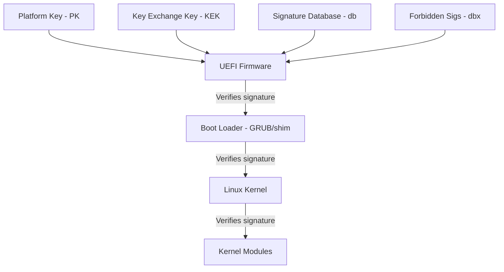

# How to Use Ansible to Configure Secure Boot

Author: [nawazdhandala](https://www.github.com/nawazdhandala)

Tags: Ansible, Secure Boot, UEFI, Security, Linux

Description: Manage Secure Boot configuration and key enrollment across your Linux servers using Ansible for hardware-level boot integrity verification.

---

Secure Boot is a UEFI firmware feature that ensures only signed and trusted software runs during the boot process. It prevents bootkit and rootkit attacks by verifying digital signatures on boot loaders, kernels, and drivers before executing them. While Secure Boot is primarily a firmware-level setting, managing its configuration, verifying its status, and handling kernel module signing across a fleet of servers is where Ansible becomes valuable.

In this post, I will cover how to use Ansible to check Secure Boot status, manage Machine Owner Keys (MOK), handle DKMS module signing, and enforce Secure Boot policies across your infrastructure.

## Understanding Secure Boot

Secure Boot uses a chain of trust. The firmware verifies the boot loader, the boot loader verifies the kernel, and the kernel can verify loaded modules.



Key components:
- **PK (Platform Key)**: The root of trust, usually owned by the hardware vendor
- **KEK (Key Exchange Key)**: Authorized to update the signature database
- **db**: Database of trusted signatures and certificates
- **dbx**: Database of revoked/forbidden signatures
- **MOK (Machine Owner Key)**: Additional keys managed by the OS

## Checking Secure Boot Status

Before making changes, audit the current Secure Boot status across your fleet.

This playbook checks whether Secure Boot is enabled on each server:

```yaml
# check_secureboot.yml - Audit Secure Boot status
---
- name: Check Secure Boot status
  hosts: all
  become: true

  tasks:
    - name: Check if system uses UEFI
      ansible.builtin.stat:
        path: /sys/firmware/efi
      register: efi_check

    - name: Report non-UEFI systems
      ansible.builtin.debug:
        msg: "{{ inventory_hostname }} uses legacy BIOS - Secure Boot not applicable"
      when: not efi_check.stat.exists

    - name: Check Secure Boot status
      ansible.builtin.command: mokutil --sb-state
      register: sb_status
      changed_when: false
      failed_when: false
      when: efi_check.stat.exists

    - name: Report Secure Boot status
      ansible.builtin.debug:
        msg: "{{ inventory_hostname }}: {{ sb_status.stdout | default('N/A') }}"
      when: efi_check.stat.exists

    - name: Check enrolled keys
      ansible.builtin.command: mokutil --list-enrolled
      register: enrolled_keys
      changed_when: false
      failed_when: false
      when: efi_check.stat.exists

    - name: Count enrolled keys
      ansible.builtin.debug:
        msg: "Enrolled MOK keys: {{ enrolled_keys.stdout_lines | select('match', '^SHA1.*') | list | length }}"
      when: efi_check.stat.exists and enrolled_keys.rc == 0
```

## Installing Secure Boot Tools

Make sure the necessary tools are available for managing Secure Boot.

This playbook installs Secure Boot management utilities:

```yaml
# install_secureboot_tools.yml - Install Secure Boot tools
---
- name: Install Secure Boot management tools
  hosts: all
  become: true

  tasks:
    - name: Install Secure Boot tools on Debian/Ubuntu
      ansible.builtin.apt:
        name:
          - mokutil
          - sbsigntool
          - efitools
          - pesign
        state: present
        update_cache: true
      when: ansible_os_family == "Debian"

    - name: Install Secure Boot tools on RHEL/CentOS
      ansible.builtin.yum:
        name:
          - mokutil
          - sbsigntools
          - efivar
          - pesign
        state: present
      when: ansible_os_family == "RedHat"
```

## Generating and Enrolling MOK Keys

Machine Owner Keys let you sign your own kernel modules while keeping Secure Boot enabled. This is essential for DKMS modules, custom kernel builds, or third-party drivers.

This playbook generates a MOK key pair and prepares it for enrollment:

```yaml
# generate_mok.yml - Generate Machine Owner Key
---
- name: Generate and manage MOK keys
  hosts: all
  become: true

  vars:
    mok_key_dir: /var/lib/shim-signed/mok
    mok_key_cn: "{{ ansible_hostname }} Secure Boot Signing Key"
    mok_key_validity_days: 3650  # 10 years

  tasks:
    - name: Create MOK key directory
      ansible.builtin.file:
        path: "{{ mok_key_dir }}"
        state: directory
        owner: root
        group: root
        mode: '0700'

    - name: Check if MOK key already exists
      ansible.builtin.stat:
        path: "{{ mok_key_dir }}/MOK.priv"
      register: mok_key

    - name: Generate MOK private key
      ansible.builtin.command: >
        openssl req -new -x509
        -newkey rsa:2048
        -keyout {{ mok_key_dir }}/MOK.priv
        -outform DER
        -out {{ mok_key_dir }}/MOK.der
        -nodes
        -days {{ mok_key_validity_days }}
        -subj "/CN={{ mok_key_cn }}/"
      when: not mok_key.stat.exists

    - name: Convert DER to PEM for module signing
      ansible.builtin.command: >
        openssl x509 -inform DER
        -in {{ mok_key_dir }}/MOK.der
        -out {{ mok_key_dir }}/MOK.pem
      args:
        creates: "{{ mok_key_dir }}/MOK.pem"

    - name: Set strict permissions on private key
      ansible.builtin.file:
        path: "{{ mok_key_dir }}/MOK.priv"
        owner: root
        group: root
        mode: '0400'

    - name: Import MOK key (requires reboot and manual confirmation)
      ansible.builtin.command: >
        mokutil --import {{ mok_key_dir }}/MOK.der
        --root-pw
      register: mok_import
      changed_when: "'already enrolled' not in mok_import.stderr"
      failed_when: false

    - name: Notify about pending enrollment
      ansible.builtin.debug:
        msg: "MOK key imported. Reboot required - you will be prompted to enroll the key at the MOK Manager screen."
      when: mok_import.changed | default(false)
```

## Signing Kernel Modules

When Secure Boot is enabled, unsigned kernel modules will not load. You need to sign any custom or third-party modules with your MOK key.

This playbook signs kernel modules:

```yaml
# sign_modules.yml - Sign kernel modules for Secure Boot
---
- name: Sign kernel modules
  hosts: all
  become: true

  vars:
    mok_key_dir: /var/lib/shim-signed/mok
    modules_to_sign:
      - vboxdrv        # VirtualBox
      - vboxnetflt
      - vboxnetadp
      - nvidia         # NVIDIA driver

  tasks:
    - name: Find module files
      ansible.builtin.shell: |
        modinfo {{ item }} 2>/dev/null | grep "^filename:" | awk '{print $2}'
      loop: "{{ modules_to_sign }}"
      register: module_paths
      changed_when: false
      failed_when: false

    - name: Sign each module
      ansible.builtin.command: >
        /usr/src/linux-headers-{{ ansible_kernel }}/scripts/sign-file
        sha256
        {{ mok_key_dir }}/MOK.priv
        {{ mok_key_dir }}/MOK.der
        {{ item.stdout }}
      loop: "{{ module_paths.results }}"
      when:
        - item.stdout is defined
        - item.stdout | length > 0
      changed_when: true
      failed_when: false

    - name: Verify module signatures
      ansible.builtin.shell: |
        modinfo {{ item }} 2>/dev/null | grep "^sig_id:"
      loop: "{{ modules_to_sign }}"
      register: sig_check
      changed_when: false
      failed_when: false

    - name: Report signing status
      ansible.builtin.debug:
        msg: "{{ item.item }}: {{ 'SIGNED' if item.stdout | length > 0 else 'NOT SIGNED' }}"
      loop: "{{ sig_check.results }}"
```

## Configuring DKMS Auto-Signing

DKMS (Dynamic Kernel Module Support) rebuilds modules when the kernel is updated. With Secure Boot, these modules need to be automatically signed.

This playbook configures DKMS to auto-sign modules:

```yaml
# dkms_autosign.yml - Configure DKMS module auto-signing
---
- name: Configure DKMS auto-signing
  hosts: all
  become: true

  vars:
    mok_key_dir: /var/lib/shim-signed/mok

  tasks:
    - name: Deploy DKMS signing script
      ansible.builtin.copy:
        content: |
          #!/bin/bash
          # DKMS post-build hook for Secure Boot module signing
          # Managed by Ansible

          SIGN_FILE="/usr/src/linux-headers-$(uname -r)/scripts/sign-file"
          MOK_KEY="{{ mok_key_dir }}/MOK.priv"
          MOK_CERT="{{ mok_key_dir }}/MOK.der"

          # Arguments from DKMS: $1=module_name $2=module_version $3=kernel_version
          MODULE_NAME="$1"
          MODULE_VERSION="$2"
          KERNEL_VERSION="${3:-$(uname -r)}"

          MODULE_DIR="/lib/modules/${KERNEL_VERSION}/updates/dkms"
          MODULE_FILE="${MODULE_DIR}/${MODULE_NAME}.ko"

          if [ -f "$MODULE_FILE" ] && [ -f "$SIGN_FILE" ] && [ -f "$MOK_KEY" ]; then
              echo "Signing ${MODULE_FILE} for Secure Boot..."
              "$SIGN_FILE" sha256 "$MOK_KEY" "$MOK_CERT" "$MODULE_FILE"
              echo "Module signed successfully."
          else
              echo "Warning: Could not sign module ${MODULE_NAME}"
          fi
        dest: /etc/dkms/sign-module.sh
        owner: root
        group: root
        mode: '0700'

    - name: Configure DKMS to use signing script
      ansible.builtin.lineinfile:
        path: /etc/dkms/framework.conf
        regexp: "^POST_BUILD="
        line: 'POST_BUILD="/etc/dkms/sign-module.sh $module $module_version $kernelver"'
        create: true
        mode: '0644'
```

## Secure Boot Validation Playbook

Regularly verify that Secure Boot is properly configured:

```yaml
# validate_secureboot.yml - Validate Secure Boot configuration
---
- name: Validate Secure Boot configuration
  hosts: all
  become: true

  tasks:
    - name: Check Secure Boot is enabled
      ansible.builtin.command: mokutil --sb-state
      register: sb_state
      changed_when: false
      failed_when: false

    - name: Verify Secure Boot is enabled
      ansible.builtin.assert:
        that:
          - "'SecureBoot enabled' in sb_state.stdout"
        fail_msg: "Secure Boot is NOT enabled on {{ inventory_hostname }}"
        success_msg: "Secure Boot is enabled"
      when: sb_state.rc == 0

    - name: Check for unsigned loaded modules
      ansible.builtin.shell: |
        for mod in $(lsmod | awk 'NR>1 {print $1}'); do
          sig=$(modinfo "$mod" 2>/dev/null | grep "^sig_id:" | wc -l)
          if [ "$sig" -eq 0 ]; then
            echo "$mod"
          fi
        done
      register: unsigned_modules
      changed_when: false

    - name: Report unsigned modules
      ansible.builtin.debug:
        msg: "Unsigned modules on {{ inventory_hostname }}: {{ unsigned_modules.stdout_lines }}"
      when: unsigned_modules.stdout_lines | length > 0

    - name: Check UEFI Secure Boot variables
      ansible.builtin.command: efivar -l
      register: efi_vars
      changed_when: false
      failed_when: false

    - name: Verify critical EFI variables exist
      ansible.builtin.shell: efivar -l | grep -c "SecureBoot"
      register: sb_var_check
      changed_when: false
      failed_when: false
```

## Handling Kernel Updates

When the kernel is updated, you need to make sure the new kernel is signed and compatible with Secure Boot.

```yaml
# kernel_update_secureboot.yml - Handle kernel updates with Secure Boot
---
- name: Handle kernel updates with Secure Boot
  hosts: all
  become: true

  tasks:
    - name: Check if shim is installed (Debian)
      ansible.builtin.package_facts:
        manager: auto

    - name: Verify shim-signed is present
      ansible.builtin.assert:
        that:
          - "'shim-signed' in ansible_facts.packages or 'shim' in ansible_facts.packages"
        fail_msg: "Shim boot loader not installed - Secure Boot may not work"
      failed_when: false

    - name: Verify GRUB is signed
      ansible.builtin.command: sbverify --cert /usr/share/secureboot/keys/grub.pem /boot/efi/EFI/ubuntu/grubx64.efi
      register: grub_signed
      changed_when: false
      failed_when: false

    - name: Report GRUB signature status
      ansible.builtin.debug:
        msg: "GRUB signature: {{ 'VALID' if grub_signed.rc == 0 else 'INVALID or MISSING' }}"
```

## Important Considerations

1. **MOK enrollment requires physical/console access.** When you import a new MOK key, the system must be rebooted and someone must confirm the enrollment at the MOK Manager screen. This cannot be fully automated.
2. **Not all hardware supports Secure Boot.** Older servers and some virtual machines do not have UEFI or Secure Boot support. Your playbooks should handle this gracefully.
3. **Third-party modules need signing.** NVIDIA drivers, VirtualBox modules, and other out-of-tree kernel modules must be signed with your MOK key to load under Secure Boot.
4. **Keep MOK private keys secure.** The private key used for signing modules should be protected with the same care as any other cryptographic key.
5. **Test kernel updates in staging.** A Secure Boot misconfiguration after a kernel update can leave a server unbootable. Always test first.
6. **Some Linux distributions handle this automatically.** Ubuntu and Fedora have built-in DKMS signing support. Check what your distro provides before building custom solutions.

Secure Boot with Ansible gives you visibility and control over boot-level security across your fleet. While the initial MOK enrollment requires manual steps, everything after that can be automated.
