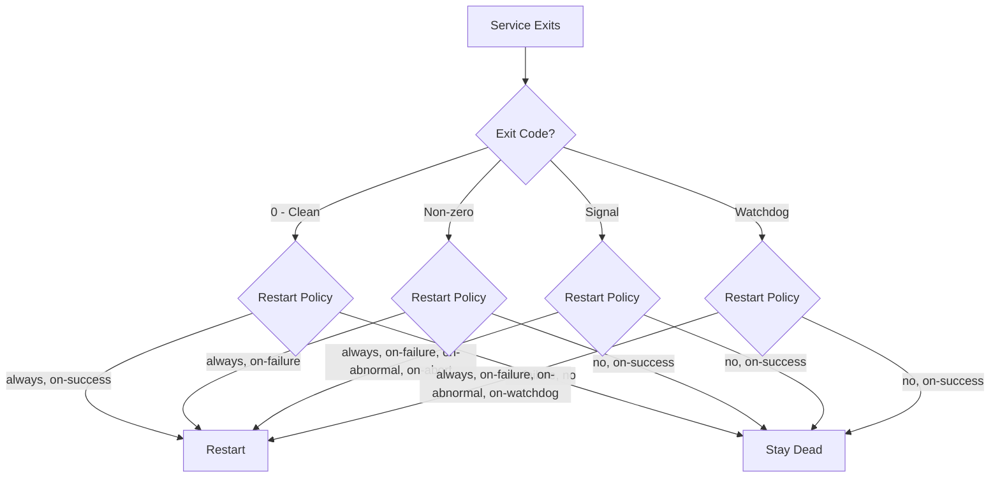

# How to Use Ansible to Configure Service Auto-Restart on Failure

Author: [nawazdhandala](https://www.github.com/nawazdhandala)

Tags: Ansible, systemd, Service Recovery, Linux, Reliability

Description: Learn how to configure automatic service restart on failure using Ansible and systemd, including restart policies, rate limiting, and failure actions.

---

Services fail. Processes crash, memory leaks cause OOM kills, and unexpected exceptions bring down applications. The question is not whether your services will fail, but how fast they recover. systemd's restart policies give you automatic recovery without human intervention, and Ansible lets you deploy these policies consistently across your entire fleet.

In this guide, I will cover every aspect of configuring service auto-restart: the different restart policies, rate limiting to prevent restart storms, failure actions for critical services, and how to monitor and verify your restart configuration.

## Restart Policies Explained

systemd offers several restart policies. Choosing the right one depends on your service's behavior and failure modes.

| Policy | Restarts On | Use Case |
|--------|------------|----------|
| `no` | Never | One-shot tasks, scripts that should not repeat |
| `on-success` | Clean exit (code 0) | Services that need to run continuously but should not restart on error |
| `on-failure` | Non-zero exit, signal, timeout, watchdog | Most application services |
| `on-abnormal` | Signal, timeout, watchdog | Services where non-zero exit is expected |
| `on-watchdog` | Watchdog timeout only | Services with watchdog support |
| `on-abort` | Unclean signal (SIGABRT, SIGSEGV, etc.) | Core dump situations |
| `always` | Any exit, regardless of reason | Critical services that must always run |



## Basic Auto-Restart Configuration

The simplest approach: restart on failure with a delay.

Ansible template for a service with auto-restart:

```jinja2
# roles/auto_restart/templates/service.j2
[Unit]
Description={{ svc_description }}
After=network.target

[Service]
Type={{ svc_type | default('simple') }}
User={{ svc_user | default('root') }}
ExecStart={{ svc_exec_start }}

# Restart configuration
Restart={{ svc_restart_policy | default('on-failure') }}
RestartSec={{ svc_restart_sec | default(5) }}

[Install]
WantedBy=multi-user.target
```

Deploy with Ansible:

```yaml
---
- name: Deploy service with auto-restart
  hosts: app_servers
  become: yes
  tasks:
    - name: Deploy service unit file
      ansible.builtin.template:
        src: service.j2
        dest: /etc/systemd/system/myapp.service
        owner: root
        group: root
        mode: '0644'
      vars:
        svc_description: "My Application"
        svc_exec_start: /opt/myapp/bin/server
        svc_user: myapp
        svc_restart_policy: on-failure
        svc_restart_sec: 5
      notify:
        - Reload systemd
        - Restart myapp

  handlers:
    - name: Reload systemd
      ansible.builtin.systemd:
        daemon_reload: yes

    - name: Restart myapp
      ansible.builtin.systemd:
        name: myapp
        state: restarted
```

## Understanding RestartSec

`RestartSec` controls the delay between the service stopping and systemd attempting to restart it. This is important for several reasons:

- It prevents tight restart loops that consume CPU
- It gives dependent services time to detect the failure
- It allows transient issues (like port already in use) to resolve

For most services, 5 seconds is a reasonable default. For services that need to reconnect to external resources (databases, message queues), consider a longer delay.

## Advanced Restart Configuration

A more comprehensive template with all restart-related directives:

```jinja2
# roles/auto_restart/templates/service-advanced.j2
[Unit]
Description={{ svc_description }}
After=network.target

OnFailure={{ svc_on_failure_job }}


[Service]
Type={{ svc_type | default('simple') }}
User={{ svc_user | default('root') }}
ExecStart={{ svc_exec_start }}

# ---- Restart Configuration ----
Restart={{ svc_restart_policy | default('on-failure') }}
RestartSec={{ svc_restart_sec | default(5) }}

# Exit codes that should prevent restart

RestartPreventExitStatus={{ svc_restart_prevent_exit_status }}


# Exit codes that should force restart even with Restart=on-success

RestartForceExitStatus={{ svc_restart_force_exit_status }}


# ---- Rate Limiting ----
# Maximum number of restarts within the interval
StartLimitBurst={{ svc_start_limit_burst | default(5) }}

# Time window for counting restarts
StartLimitIntervalSec={{ svc_start_limit_interval | default(300) }}

# What to do when the rate limit is hit

StartLimitAction={{ svc_start_limit_action }}


# ---- Timeouts ----
TimeoutStartSec={{ svc_timeout_start | default(90) }}
TimeoutStopSec={{ svc_timeout_stop | default(90) }}


WatchdogSec={{ svc_watchdog_sec }}


# ---- Success/Failure Definition ----

SuccessExitStatus={{ svc_success_exit_status }}


[Install]
WantedBy=multi-user.target
```

## Rate Limiting Restarts

Without rate limiting, a service that crashes immediately after start would restart in a tight loop forever. `StartLimitBurst` and `StartLimitIntervalSec` prevent this.

Deploy a service with restart rate limiting:

```yaml
- name: Deploy with rate-limited restarts
  ansible.builtin.template:
    src: service-advanced.j2
    dest: /etc/systemd/system/myapp.service
  vars:
    svc_description: "My Application"
    svc_exec_start: /opt/myapp/bin/server
    svc_restart_policy: on-failure
    svc_restart_sec: 5
    # Allow 5 restarts in 5 minutes
    svc_start_limit_burst: 5
    svc_start_limit_interval: 300
    # After hitting the limit, do not try again
    svc_start_limit_action: none
```

Options for `StartLimitAction`:
- `none`: Stop trying to restart (default)
- `reboot`: Reboot the machine
- `reboot-force`: Forcefully reboot without clean shutdown
- `reboot-immediate`: Immediate reboot (no service stops)
- `poweroff`: Power off the machine

For critical services on dedicated hardware, `reboot` can make sense. For cloud VMs, `none` is usually the right choice because you want your monitoring to detect the failure and decide the response.

## Preventing Restart for Specific Exit Codes

Some exit codes indicate that restarting will not help. For example, a configuration error (exit code 2) will just cause the same failure again.

Configure exit codes that should prevent restart:

```yaml
- name: Deploy with exit code handling
  ansible.builtin.template:
    src: service-advanced.j2
    dest: /etc/systemd/system/myapp.service
  vars:
    svc_restart_policy: on-failure
    # Do not restart on config errors (exit 2) or permission issues (exit 13)
    svc_restart_prevent_exit_status: "2 13 SIGKILL"
    # Treat exit code 42 as success (graceful shutdown)
    svc_success_exit_status: "42"
```

## Exponential Backoff

systemd does not natively support exponential backoff, but you can simulate it with a wrapper script.

Deploy a wrapper that implements backoff:

```yaml
- name: Deploy backoff wrapper
  ansible.builtin.copy:
    dest: /opt/myapp/bin/start-with-backoff.sh
    mode: '0755'
    content: |
      #!/bin/bash
      # Exponential backoff wrapper for systemd services
      BACKOFF_FILE="/tmp/myapp-backoff"
      MAX_BACKOFF=300  # 5 minutes max

      # Get current backoff or start at 0
      CURRENT_BACKOFF=0
      if [ -f "$BACKOFF_FILE" ]; then
        CURRENT_BACKOFF=$(cat "$BACKOFF_FILE")
      fi

      # Sleep for the backoff period
      if [ "$CURRENT_BACKOFF" -gt 0 ]; then
        echo "Backing off for ${CURRENT_BACKOFF}s before starting"
        sleep "$CURRENT_BACKOFF"
      fi

      # Double the backoff for next time (or start at 5)
      NEXT_BACKOFF=$((CURRENT_BACKOFF * 2))
      if [ "$NEXT_BACKOFF" -eq 0 ]; then
        NEXT_BACKOFF=5
      fi
      if [ "$NEXT_BACKOFF" -gt "$MAX_BACKOFF" ]; then
        NEXT_BACKOFF=$MAX_BACKOFF
      fi
      echo "$NEXT_BACKOFF" > "$BACKOFF_FILE"

      # Run the actual application
      exec /opt/myapp/bin/server "$@"

- name: Deploy reset script for successful startup
  ansible.builtin.copy:
    dest: /opt/myapp/bin/reset-backoff.sh
    mode: '0755'
    content: |
      #!/bin/bash
      rm -f /tmp/myapp-backoff

- name: Deploy service with backoff
  ansible.builtin.template:
    src: service-advanced.j2
    dest: /etc/systemd/system/myapp.service
  vars:
    svc_exec_start: /opt/myapp/bin/start-with-backoff.sh
    svc_restart_policy: always
    svc_restart_sec: 0  # Backoff is handled by the wrapper
```

## Configuring Failure Notifications

When a service fails and keeps restarting, you want to know about it.

Deploy a failure notification unit:

```yaml
- name: Deploy failure notification service
  ansible.builtin.copy:
    dest: /etc/systemd/system/notify-failure@.service
    content: |
      [Unit]
      Description=Send failure notification for %i

      [Service]
      Type=oneshot
      ExecStart=/usr/local/bin/notify-service-failure.sh %i
    mode: '0644'

- name: Deploy notification script
  ansible.builtin.copy:
    dest: /usr/local/bin/notify-service-failure.sh
    mode: '0755'
    content: |
      #!/bin/bash
      SERVICE=$1
      HOST=$(hostname)
      STATUS=$(systemctl status "$SERVICE" --no-pager 2>&1 | head -20)

      # Send to Slack/PagerDuty/email
      curl -s -X POST "${WEBHOOK_URL}" \
        -H 'Content-Type: application/json' \
        -d "{
          \"text\": \"Service failure on ${HOST}: ${SERVICE}\",
          \"blocks\": [{
            \"type\": \"section\",
            \"text\": {
              \"type\": \"mrkdwn\",
              \"text\": \"*Service Failure*\nHost: ${HOST}\nService: ${SERVICE}\n\`\`\`${STATUS}\`\`\`\"
            }
          }]
        }"

- name: Configure myapp to notify on failure
  ansible.builtin.template:
    src: service-advanced.j2
    dest: /etc/systemd/system/myapp.service
  vars:
    svc_on_failure_job: "notify-failure@myapp.service"
    svc_restart_policy: on-failure
    svc_restart_sec: 10
```

## Using Drop-in Files

For package-installed services, use drop-in files to add restart configuration without modifying the original unit file.

Add auto-restart to an existing service:

```yaml
- name: Create drop-in directory
  ansible.builtin.file:
    path: /etc/systemd/system/nginx.service.d
    state: directory
    mode: '0755'

- name: Add restart policy to nginx
  ansible.builtin.copy:
    dest: /etc/systemd/system/nginx.service.d/restart.conf
    content: |
      [Service]
      Restart=on-failure
      RestartSec=5

      [Unit]
      StartLimitBurst=5
      StartLimitIntervalSec=300
      OnFailure=notify-failure@nginx.service
    mode: '0644'
  notify: Reload and restart nginx
```

## Fleet-Wide Restart Policy

Apply consistent restart policies across all managed services.

Deploy restart policies for multiple services:

```yaml
---
- name: Configure auto-restart for all services
  hosts: all
  become: yes

  vars:
    restart_policies:
      - service: nginx
        policy: on-failure
        restart_sec: 5
        limit_burst: 5
        limit_interval: 300
      - service: myapp
        policy: on-failure
        restart_sec: 10
        limit_burst: 3
        limit_interval: 600
      - service: redis-server
        policy: always
        restart_sec: 5
        limit_burst: 10
        limit_interval: 300
      - service: prometheus-node-exporter
        policy: on-failure
        restart_sec: 3
        limit_burst: 10
        limit_interval: 120

  tasks:
    - name: Create drop-in directories
      ansible.builtin.file:
        path: "/etc/systemd/system/{{ item.service }}.service.d"
        state: directory
        mode: '0755'
      loop: "{{ restart_policies }}"
      loop_control:
        label: "{{ item.service }}"

    - name: Deploy restart policies
      ansible.builtin.copy:
        dest: "/etc/systemd/system/{{ item.service }}.service.d/restart.conf"
        content: |
          [Service]
          Restart={{ item.policy }}
          RestartSec={{ item.restart_sec }}

          [Unit]
          StartLimitBurst={{ item.limit_burst }}
          StartLimitIntervalSec={{ item.limit_interval }}
        mode: '0644'
      loop: "{{ restart_policies }}"
      loop_control:
        label: "{{ item.service }}"
      notify: Reload systemd

  handlers:
    - name: Reload systemd
      ansible.builtin.systemd:
        daemon_reload: yes
```

## Monitoring Restart Events

Track how often services are restarting.

Check restart counts across the fleet:

```yaml
- name: Check restart counts for critical services
  ansible.builtin.command: "systemctl show {{ item }} --property=NRestarts --value"
  register: restart_counts
  loop:
    - myapp.service
    - nginx.service
    - redis-server.service
  changed_when: false

- name: Report restart counts
  ansible.builtin.debug:
    msg: "{{ item.item }}: {{ item.stdout }} restarts"
  loop: "{{ restart_counts.results }}"
  loop_control:
    label: "{{ item.item }}"

- name: Alert on excessive restarts
  ansible.builtin.debug:
    msg: "WARNING: {{ item.item }} has restarted {{ item.stdout }} times!"
  loop: "{{ restart_counts.results }}"
  loop_control:
    label: "{{ item.item }}"
  when: item.stdout | int > 10
```

## Resetting Restart Counter

After fixing a bug that was causing restarts, reset the counter so the rate limiter does not keep the service from starting.

Reset the restart counter for a service:

```yaml
- name: Reset failure counter for myapp
  ansible.builtin.command: systemctl reset-failed myapp.service
  changed_when: true

- name: Start the service after reset
  ansible.builtin.systemd:
    name: myapp
    state: started
```

## Summary

Auto-restart is the first line of defense against service failures. Use `Restart=on-failure` for most application services, pair it with `RestartSec` to avoid tight restart loops, and set `StartLimitBurst` and `StartLimitIntervalSec` to cap the total number of restarts. Add `OnFailure` units for notification so you know when something is wrong. For services installed by packages, use drop-in files to add restart policies without modifying the original unit files. Monitor restart counts to detect services that are repeatedly failing, and reset the failure counter after fixing the root cause. With Ansible, all of these policies can be deployed consistently across your fleet in minutes.
