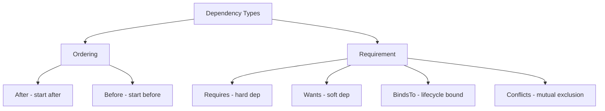

# How to Use Ansible to Configure Service Dependencies

Author: [nawazdhandala](https://www.github.com/nawazdhandala)

Tags: Ansible, systemd, Service Dependencies, Linux

Description: Learn how to configure and manage systemd service dependencies using Ansible to ensure services start in the correct order and handle failures properly.

---

When you deploy multi-tier applications, service startup order matters. Your API server needs the database to be ready. Your reverse proxy needs the backend to be listening. Your monitoring agent needs the network stack to be up. systemd provides a rich dependency system to express these relationships, and Ansible lets you deploy these configurations consistently.

In this post, I will cover the different types of systemd dependencies, how to express them in unit files, and how to manage them with Ansible.

## Types of Dependencies

systemd has two axes of dependency: ordering and requirement.

**Ordering** controls the sequence in which services start and stop:
- `After=` - Start this service after the named unit
- `Before=` - Start this service before the named unit

**Requirement** controls whether services must be running:
- `Requires=` - Hard dependency; if the required unit fails, this unit fails too
- `Wants=` - Soft dependency; if the wanted unit fails, this unit still starts
- `BindsTo=` - Like Requires, but also stops this unit when the bound unit stops
- `Conflicts=` - Ensures the conflicting unit is stopped when this unit starts



An important detail: ordering and requirement are independent. `Requires=foo.service` without `After=foo.service` means both units start simultaneously. You almost always want to pair `Requires` with `After`.

## Template for Services with Dependencies

Let's build an Ansible template that handles all dependency types.

Jinja2 template with full dependency support:

```jinja2
# roles/service_deps/templates/service.j2
[Unit]
Description={{ svc_description }}

Documentation={{ svc_documentation }}


# Ordering dependencies

After={{ dep }}


Before={{ dep }}


# Requirement dependencies

Requires={{ dep }}


Wants={{ dep }}


BindsTo={{ dep }}


# Conflicts

Conflicts={{ dep }}


# Conditions - skip if not met (no failure)

ConditionPathExists={{ svc_condition_path_exists }}


ConditionFileNotEmpty={{ svc_condition_file_not_empty }}


[Service]
Type={{ svc_type | default('simple') }}
User={{ svc_user | default('root') }}
Group={{ svc_group | default('root') }}
ExecStart={{ svc_exec_start }}


ExecStartPre={{ cmd }}


Restart={{ svc_restart | default('on-failure') }}
RestartSec={{ svc_restart_sec | default(5) }}

[Install]
WantedBy={{ svc_wanted_by | default('multi-user.target') }}
```

## Practical Example: Web Application Stack

Let's deploy a three-tier application where each service depends on the one below it.

Playbook deploying a full stack with proper dependency chains:

```yaml
---
- name: Deploy web application stack with dependencies
  hosts: app_servers
  become: yes

  tasks:
    # Layer 1: Database
    - name: Deploy database service
      ansible.builtin.template:
        src: service.j2
        dest: /etc/systemd/system/myapp-db.service
        owner: root
        group: root
        mode: '0644'
      vars:
        svc_description: "MyApp PostgreSQL Database"
        svc_after:
          - network.target
          - local-fs.target
        svc_type: forking
        svc_user: postgres
        svc_group: postgres
        svc_exec_start: "/usr/lib/postgresql/15/bin/pg_ctl start -D /var/lib/myapp/pgdata"
        svc_condition_path_exists: "/var/lib/myapp/pgdata/postgresql.conf"
      notify: Reload systemd

    # Layer 2: Application server (depends on database)
    - name: Deploy application service
      ansible.builtin.template:
        src: service.j2
        dest: /etc/systemd/system/myapp-api.service
        owner: root
        group: root
        mode: '0644'
      vars:
        svc_description: "MyApp REST API"
        svc_after:
          - network.target
          - myapp-db.service
        svc_requires:
          - myapp-db.service
        svc_type: simple
        svc_user: myapp
        svc_group: myapp
        svc_exec_start: "/opt/myapp/bin/api-server --config /etc/myapp/api.yaml"
        svc_exec_start_pre:
          - "/opt/myapp/bin/api-server --validate-config /etc/myapp/api.yaml"
        svc_condition_file_not_empty: "/etc/myapp/api.yaml"
      notify: Reload systemd

    # Layer 3: Reverse proxy (depends on application)
    - name: Deploy reverse proxy service
      ansible.builtin.template:
        src: service.j2
        dest: /etc/systemd/system/myapp-proxy.service
        owner: root
        group: root
        mode: '0644'
      vars:
        svc_description: "MyApp Nginx Reverse Proxy"
        svc_after:
          - network.target
          - myapp-api.service
        svc_wants:
          - myapp-api.service
        svc_type: forking
        svc_user: root
        svc_exec_start: "/usr/sbin/nginx -c /etc/myapp/nginx.conf"
      notify: Reload systemd

  handlers:
    - name: Reload systemd
      ansible.builtin.systemd:
        daemon_reload: yes
```

Notice that the proxy uses `Wants` instead of `Requires` for the API. This means the proxy can start even if the API is temporarily down, which gives you time to fix the API without also losing the proxy (which might serve a maintenance page).

## Using BindsTo for Tight Coupling

`BindsTo` is like `Requires` but stronger. When the bound service stops, the depending service also stops. This is useful for sidecar patterns.

A logging sidecar that must stop when the main service stops:

```yaml
- name: Deploy main application service
  ansible.builtin.template:
    src: service.j2
    dest: /etc/systemd/system/myapp.service
    owner: root
    group: root
    mode: '0644'
  vars:
    svc_description: "Main Application"
    svc_after:
      - network.target
    svc_exec_start: "/opt/myapp/bin/myapp"

- name: Deploy log shipper sidecar
  ansible.builtin.template:
    src: service.j2
    dest: /etc/systemd/system/myapp-logs.service
    owner: root
    group: root
    mode: '0644'
  vars:
    svc_description: "MyApp Log Shipper"
    svc_after:
      - myapp.service
    svc_binds_to:
      - myapp.service
    svc_exec_start: "/opt/myapp/bin/log-shipper --follow /var/log/myapp/app.log"
```

With `BindsTo`, when `myapp.service` stops (for any reason), `myapp-logs.service` will be stopped automatically.

## Handling Conflicts

The `Conflicts` directive ensures two services never run at the same time. A common case is having a maintenance mode that replaces the normal service.

Ensure maintenance mode conflicts with normal operation:

```yaml
- name: Deploy normal service
  ansible.builtin.template:
    src: service.j2
    dest: /etc/systemd/system/myapp.service
    owner: root
    group: root
    mode: '0644'
  vars:
    svc_description: "MyApp Normal Mode"
    svc_exec_start: "/opt/myapp/bin/myapp --mode production"
    svc_conflicts:
      - myapp-maintenance.service

- name: Deploy maintenance service
  ansible.builtin.template:
    src: service.j2
    dest: /etc/systemd/system/myapp-maintenance.service
    owner: root
    group: root
    mode: '0644'
  vars:
    svc_description: "MyApp Maintenance Mode"
    svc_exec_start: "/opt/myapp/bin/myapp --mode maintenance"
    svc_conflicts:
      - myapp.service
```

Starting the maintenance service will automatically stop the normal one, and vice versa.

## Creating Custom Targets

For complex applications with many services, you can create a custom target that groups them together.

Deploy a custom target for the application stack:

```yaml
- name: Deploy application target
  ansible.builtin.copy:
    dest: /etc/systemd/system/myapp.target
    content: |
      [Unit]
      Description=MyApp Full Stack
      Requires=myapp-db.service myapp-api.service myapp-proxy.service
      After=myapp-db.service myapp-api.service myapp-proxy.service

      [Install]
      WantedBy=multi-user.target
    owner: root
    group: root
    mode: '0644'
  notify: Reload systemd

- name: Enable the application target
  ansible.builtin.systemd:
    name: myapp.target
    enabled: yes
    daemon_reload: yes
```

Now you can manage the entire stack with one command:

```bash
# Start everything
systemctl start myapp.target

# Stop everything
systemctl stop myapp.target
```

## Validating Dependencies

After deploying your dependency configuration, validate that the dependency tree is correct.

Verify the dependency chain is set up correctly:

```yaml
- name: Reload systemd
  ansible.builtin.systemd:
    daemon_reload: yes

- name: Verify dependency tree
  ansible.builtin.command: "systemctl list-dependencies myapp.target"
  register: dep_tree
  changed_when: false

- name: Show dependency tree
  ansible.builtin.debug:
    var: dep_tree.stdout_lines

- name: Check for circular dependencies
  ansible.builtin.command: "systemd-analyze verify myapp-db.service myapp-api.service myapp-proxy.service"
  register: verify_result
  changed_when: false
  failed_when: false

- name: Report verification issues
  ansible.builtin.debug:
    var: verify_result.stderr_lines
  when: verify_result.stderr_lines | length > 0
```

## Ordering Without Dependencies

Sometimes you want ordering without a hard dependency. For instance, you want your app to start after the network is up, but you do not want it to fail if `network-online.target` is not present.

Use After without Requires for loose ordering:

```yaml
svc_after:
  - network-online.target
  - time-sync.target
svc_wants:
  - network-online.target
```

Using `Wants` plus `After` gives you ordered startup with a soft dependency. The service will wait for the network to be ready, but will still start even if the network target fails.

## Summary

systemd's dependency system is powerful but can get confusing if you mix up the different directives. The key rules to remember: ordering (`After`/`Before`) and requirement (`Requires`/`Wants`) are separate. Always pair `Requires` with `After` unless you want parallel startup. Use `BindsTo` for lifecycle-coupled services and `Conflicts` for mutually exclusive ones. Ansible templates make it easy to express these relationships in reusable roles and deploy them consistently across your infrastructure.
