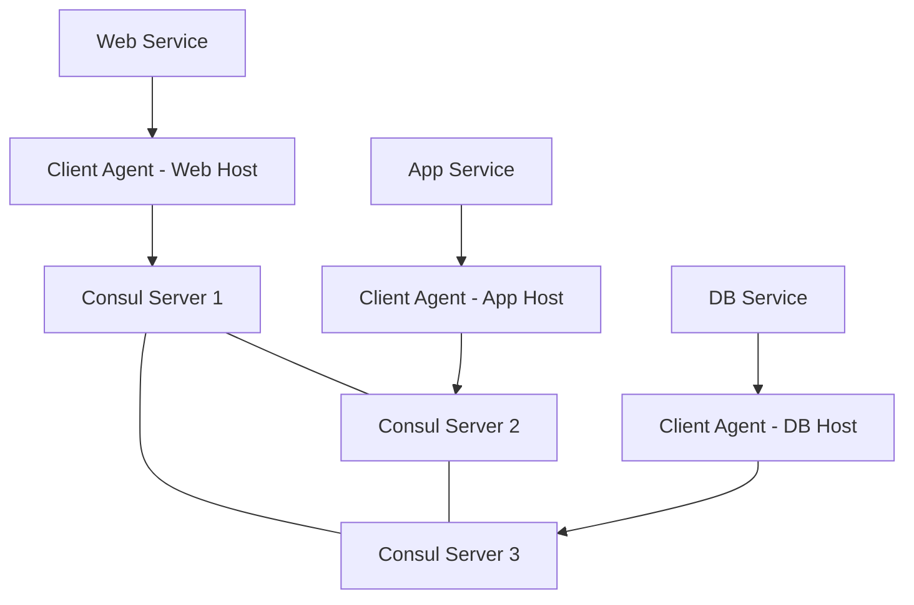

# How to Use Ansible to Configure Service Discovery (Consul)

Author: [nawazdhandala](https://www.github.com/nawazdhandala)

Tags: Ansible, Consul, Service Discovery, Microservices, DevOps

Description: Step-by-step guide to deploying and configuring HashiCorp Consul for service discovery using Ansible playbooks and roles.

---

Service discovery is the glue that holds a microservices architecture together. Instead of hardcoding IP addresses and ports in configuration files, services register themselves with a discovery system and find each other at runtime. HashiCorp Consul is one of the most popular choices for this, and Ansible is a natural fit for deploying and configuring it.

I have deployed Consul clusters ranging from three-node setups in staging to seven-node production clusters with hundreds of registered services. The patterns I share here come from those real-world deployments.

## Consul Architecture Basics

Consul runs in two modes: server and client. Server nodes form a consensus cluster (usually three or five nodes) and store the service catalog. Client nodes run on every machine that hosts services, acting as local agents that forward requests to the server cluster.



## Inventory Setup

```yaml
# inventories/production/hosts.yml
# Consul cluster inventory
all:
  children:
    consul_servers:
      hosts:
        consul-server-1:
          ansible_host: 10.0.1.10
          consul_node_role: server
        consul-server-2:
          ansible_host: 10.0.1.11
          consul_node_role: server
        consul-server-3:
          ansible_host: 10.0.1.12
          consul_node_role: server
    consul_clients:
      hosts:
        web-host-1:
          ansible_host: 10.0.2.10
          consul_node_role: client
        app-host-1:
          ansible_host: 10.0.2.11
          consul_node_role: client
        db-host-1:
          ansible_host: 10.0.3.10
          consul_node_role: client
```

## Consul Server Role

```yaml
# roles/consul_server/defaults/main.yml
# Default configuration for Consul servers
consul_version: "1.17.1"
consul_user: consul
consul_group: consul
consul_data_dir: /opt/consul/data
consul_config_dir: /etc/consul.d
consul_log_dir: /var/log/consul
consul_datacenter: dc1
consul_encrypt_key: "{{ vault_consul_encrypt_key }}"
consul_bind_addr: "{{ ansible_default_ipv4.address }}"
consul_bootstrap_expect: 3
consul_retry_join: "{{ groups['consul_servers'] | map('extract', hostvars, 'ansible_host') | list }}"
```

```yaml
# roles/consul_server/tasks/main.yml
# Install and configure Consul server
- name: Create consul system group
  ansible.builtin.group:
    name: "{{ consul_group }}"
    system: true

- name: Create consul system user
  ansible.builtin.user:
    name: "{{ consul_user }}"
    group: "{{ consul_group }}"
    system: true
    shell: /usr/sbin/nologin
    home: "{{ consul_data_dir }}"
    create_home: false

- name: Create consul directories
  ansible.builtin.file:
    path: "{{ item }}"
    state: directory
    owner: "{{ consul_user }}"
    group: "{{ consul_group }}"
    mode: '0750'
  loop:
    - "{{ consul_data_dir }}"
    - "{{ consul_config_dir }}"
    - "{{ consul_log_dir }}"

- name: Download consul binary
  ansible.builtin.get_url:
    url: "https://releases.hashicorp.com/consul/{{ consul_version }}/consul_{{ consul_version }}_linux_amd64.zip"
    dest: /tmp/consul.zip
    checksum: "sha256:https://releases.hashicorp.com/consul/{{ consul_version }}/consul_{{ consul_version }}_SHA256SUMS"

- name: Install unzip
  ansible.builtin.package:
    name: unzip
    state: present

- name: Extract consul binary
  ansible.builtin.unarchive:
    src: /tmp/consul.zip
    dest: /usr/local/bin/
    remote_src: true
    mode: '0755'
  notify: restart consul

- name: Deploy consul server configuration
  ansible.builtin.template:
    src: consul-server.hcl.j2
    dest: "{{ consul_config_dir }}/consul.hcl"
    owner: "{{ consul_user }}"
    group: "{{ consul_group }}"
    mode: '0640'
  notify: restart consul

- name: Deploy consul systemd service
  ansible.builtin.template:
    src: consul.service.j2
    dest: /etc/systemd/system/consul.service
    mode: '0644'
  notify:
    - reload systemd
    - restart consul

- name: Start and enable consul
  ansible.builtin.service:
    name: consul
    state: started
    enabled: true
```

## Consul Server Configuration Template

```hcl
# roles/consul_server/templates/consul-server.hcl.j2
# Consul server configuration
datacenter = "{{ consul_datacenter }}"
data_dir   = "{{ consul_data_dir }}"
log_level  = "INFO"
node_name  = "{{ inventory_hostname }}"
server     = true

# Cluster formation
bootstrap_expect = {{ consul_bootstrap_expect }}
retry_join = {{ consul_retry_join | to_json }}

# Network binding
bind_addr   = "{{ consul_bind_addr }}"
client_addr = "0.0.0.0"

# Encryption
encrypt = "{{ consul_encrypt_key }}"

# UI access
ui_config {
  enabled = true
}

# Performance tuning
performance {
  raft_multiplier = 1
}

# Service mesh support
connect {
  enabled = true
}

# DNS configuration
ports {
  dns   = 8600
  http  = 8500
  grpc  = 8502
}

# ACL configuration
acl {
  enabled                  = true
  default_policy           = "deny"
  enable_token_persistence = true
}
```

## Consul Client Role

```yaml
# roles/consul_client/tasks/main.yml
# Install and configure Consul client agent
- name: Create consul user and directories
  ansible.builtin.include_tasks: setup_user.yml

- name: Install consul binary
  ansible.builtin.include_tasks: install.yml

- name: Deploy consul client configuration
  ansible.builtin.template:
    src: consul-client.hcl.j2
    dest: "{{ consul_config_dir }}/consul.hcl"
    owner: "{{ consul_user }}"
    group: "{{ consul_group }}"
    mode: '0640'
  notify: restart consul

- name: Deploy systemd service
  ansible.builtin.template:
    src: consul.service.j2
    dest: /etc/systemd/system/consul.service
    mode: '0644'
  notify:
    - reload systemd
    - restart consul

- name: Start consul client
  ansible.builtin.service:
    name: consul
    state: started
    enabled: true

- name: Wait for consul agent to be ready
  ansible.builtin.uri:
    url: "http://127.0.0.1:8500/v1/agent/self"
    status_code: 200
  register: consul_ready
  until: consul_ready.status == 200
  retries: 30
  delay: 2
```

## Service Registration

Register services with Consul using a reusable task file:

```yaml
# roles/consul_client/tasks/register_service.yml
# Register a service with the local Consul agent
- name: Deploy service registration config
  ansible.builtin.template:
    src: service.hcl.j2
    dest: "{{ consul_config_dir }}/service-{{ service_name }}.hcl"
    owner: "{{ consul_user }}"
    group: "{{ consul_group }}"
    mode: '0640'
  vars:
    service_name: "{{ svc.name }}"
    service_port: "{{ svc.port }}"
    service_tags: "{{ svc.tags | default([]) }}"
    health_check_url: "{{ svc.health_check | default('http://127.0.0.1:' + svc.port | string + '/health') }}"

- name: Reload consul to pick up new service
  ansible.builtin.command: consul reload
  changed_when: true
```

```hcl
# roles/consul_client/templates/service.hcl.j2
# Service registration for Consul
service {
  name = "{{ service_name }}"
  port = {{ service_port }}
  tags = {{ service_tags | to_json }}

  check {
    http     = "{{ health_check_url }}"
    interval = "30s"
    timeout  = "5s"
  }

  meta {
    version     = "{{ svc.version | default('unknown') }}"
    environment = "{{ consul_datacenter }}"
    managed_by  = "ansible"
  }
}
```

## Using Consul for Dynamic Ansible Inventory

Query Consul to build Ansible inventory dynamically:

```python
#!/usr/bin/env python3
# inventory/consul_inventory.py
# Dynamic inventory script that pulls hosts from Consul
import json
import sys
import argparse
import requests

CONSUL_URL = "http://consul.example.com:8500"

def get_services():
    """Fetch all registered services from Consul."""
    resp = requests.get(f"{CONSUL_URL}/v1/catalog/services", timeout=10)
    resp.raise_for_status()
    return resp.json()

def get_service_nodes(service_name):
    """Fetch nodes for a specific service."""
    resp = requests.get(f"{CONSUL_URL}/v1/catalog/service/{service_name}", timeout=10)
    resp.raise_for_status()
    return resp.json()

def build_inventory():
    """Build Ansible inventory from Consul catalog."""
    inventory = {'_meta': {'hostvars': {}}}
    services = get_services()

    for service_name, tags in services.items():
        if service_name == 'consul':
            continue

        nodes = get_service_nodes(service_name)
        group_name = service_name.replace('-', '_')
        inventory[group_name] = {'hosts': [], 'vars': {}}

        for node in nodes:
            hostname = node['Node']
            inventory[group_name]['hosts'].append(hostname)
            inventory['_meta']['hostvars'][hostname] = {
                'ansible_host': node['Address'],
                'consul_service_port': node['ServicePort'],
            }

    return inventory

if __name__ == '__main__':
    parser = argparse.ArgumentParser()
    parser.add_argument('--list', action='store_true')
    parser.add_argument('--host')
    args = parser.parse_args()

    if args.list:
        print(json.dumps(build_inventory(), indent=2))
    elif args.host:
        print(json.dumps({}))
```

## Deployment Playbook

```yaml
# playbooks/deploy_consul.yml
# Full Consul cluster deployment
- name: Deploy Consul servers
  hosts: consul_servers
  become: true
  serial: 1
  roles:
    - consul_server
  post_tasks:
    - name: Wait for cluster to form
      ansible.builtin.uri:
        url: "http://127.0.0.1:8500/v1/status/leader"
      register: leader
      until: leader.json | length > 0
      retries: 30
      delay: 5
      run_once: true

- name: Deploy Consul clients
  hosts: consul_clients
  become: true
  roles:
    - consul_client

- name: Verify cluster health
  hosts: consul_servers[0]
  tasks:
    - name: Check cluster members
      ansible.builtin.command: consul members
      register: members
      changed_when: false

    - name: Display cluster status
      ansible.builtin.debug:
        var: members.stdout_lines
```

## Conclusion

Consul and Ansible complement each other well. Ansible handles the initial deployment and configuration of the Consul cluster, while Consul provides the runtime service discovery that your microservices need. The patterns shown here, separate roles for server and client, templated configuration, service registration tasks, and Consul-based dynamic inventory, give you a solid foundation for managing service discovery at scale.
