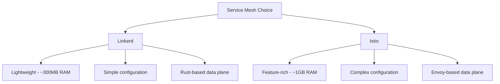

# How to Use Ansible to Configure Service Mesh (Linkerd)

Author: [nawazdhandala](https://www.github.com/nawazdhandala)

Tags: Ansible, Linkerd, Service Mesh, Kubernetes, DevOps

Description: Deploy and configure Linkerd service mesh using Ansible for lightweight service mesh management with mTLS, traffic splitting, and observability.

---

Linkerd is a lightweight, security-focused service mesh for Kubernetes. Compared to Istio, Linkerd has a smaller resource footprint and simpler operational model, which makes it appealing for teams that want service mesh benefits without the complexity overhead. Ansible works well for managing Linkerd deployments because the installation process is straightforward and the configuration is declarative.

I chose Linkerd over Istio for a client project with thirty microservices because they needed mTLS and observability but did not want to maintain a complex control plane. Ansible made the deployment repeatable across their staging and production clusters.

## Linkerd vs Istio



## Prerequisites

```bash
# Install required Ansible collection and Python packages
ansible-galaxy collection install kubernetes.core
pip install kubernetes
```

## Installing Linkerd with Ansible

```yaml
# roles/linkerd/defaults/main.yml
# Linkerd configuration defaults
linkerd_version: "2.14.7"
linkerd_namespace: linkerd
linkerd_viz_enabled: true
linkerd_ha_mode: false
linkerd_proxy_cpu_request: "100m"
linkerd_proxy_memory_request: "64Mi"
linkerd_inject_namespaces:
  - default
  - production
```

```yaml
# roles/linkerd/tasks/install.yml
# Install Linkerd CLI and control plane
- name: Download linkerd CLI
  ansible.builtin.get_url:
    url: "https://run.linkerd.io/install-edge"
    dest: /tmp/linkerd-install.sh
    mode: '0755'

- name: Install linkerd CLI
  ansible.builtin.shell: |
    curl -fsL https://run.linkerd.io/install | sh
    cp ~/.linkerd2/bin/linkerd /usr/local/bin/
  args:
    creates: /usr/local/bin/linkerd
  changed_when: true

- name: Run Linkerd pre-installation checks
  ansible.builtin.command: linkerd check --pre
  register: precheck
  changed_when: false
  failed_when: false

- name: Display pre-check results
  ansible.builtin.debug:
    var: precheck.stdout_lines

- name: Generate Linkerd CRDs manifest
  ansible.builtin.command: linkerd install --crds
  register: linkerd_crds
  changed_when: false

- name: Apply Linkerd CRDs
  kubernetes.core.k8s:
    state: present
    definition: "{{ linkerd_crds.stdout }}"

- name: Generate Linkerd control plane manifest
  ansible.builtin.command: >
    linkerd install
    --ha
    --set proxy.resources.cpu.request={{ linkerd_proxy_cpu_request }}
    --set proxy.resources.memory.request={{ linkerd_proxy_memory_request }}
  register: linkerd_manifest
  changed_when: false

- name: Apply Linkerd control plane
  kubernetes.core.k8s:
    state: present
    definition: "{{ linkerd_manifest.stdout }}"

- name: Wait for Linkerd control plane to be ready
  ansible.builtin.command: linkerd check
  register: linkerd_check
  until: linkerd_check.rc == 0
  retries: 30
  delay: 10
  changed_when: false
```

## Installing Linkerd Viz Extension

```yaml
# roles/linkerd/tasks/viz.yml
# Install Linkerd visualization dashboard
- name: Generate Linkerd viz manifest
  ansible.builtin.command: linkerd viz install
  register: viz_manifest
  changed_when: false
  when: linkerd_viz_enabled

- name: Apply Linkerd viz extension
  kubernetes.core.k8s:
    state: present
    definition: "{{ viz_manifest.stdout }}"
  when: linkerd_viz_enabled

- name: Wait for viz extension to be ready
  ansible.builtin.command: linkerd viz check
  register: viz_check
  until: viz_check.rc == 0
  retries: 20
  delay: 10
  changed_when: false
  when: linkerd_viz_enabled
```

## Enabling Mesh Injection

```yaml
# roles/linkerd/tasks/inject.yml
# Enable Linkerd proxy injection for target namespaces
- name: Annotate namespaces for Linkerd injection
  kubernetes.core.k8s:
    kind: Namespace
    name: "{{ item }}"
    state: present
    definition:
      metadata:
        annotations:
          linkerd.io/inject: enabled
  loop: "{{ linkerd_inject_namespaces }}"

- name: Restart deployments to inject Linkerd proxy
  ansible.builtin.command: >
    kubectl rollout restart deployment -n {{ item }}
  loop: "{{ linkerd_inject_namespaces }}"
  changed_when: true
  when: linkerd_restart_on_inject | default(false)
```

## Configuring Traffic Splitting

Linkerd uses the SMI (Service Mesh Interface) TrafficSplit resource for canary deployments:

```yaml
# roles/linkerd/tasks/traffic_split.yml
# Configure traffic splitting for canary deployments
- name: Deploy TrafficSplit resources
  kubernetes.core.k8s:
    state: present
    definition:
      apiVersion: split.smi-spec.io/v1alpha2
      kind: TrafficSplit
      metadata:
        name: "{{ item.name }}"
        namespace: "{{ item.namespace }}"
      spec:
        service: "{{ item.service }}"
        backends:
          - service: "{{ item.service }}-stable"
            weight: "{{ item.stable_weight }}"
          - service: "{{ item.service }}-canary"
            weight: "{{ item.canary_weight }}"
  loop: "{{ linkerd_traffic_splits }}"
```

```yaml
# inventories/production/group_vars/linkerd.yml
# Traffic split configuration for canary releases
linkerd_traffic_splits:
  - name: user-service-split
    namespace: production
    service: user-service
    stable_weight: 900
    canary_weight: 100
  - name: order-service-split
    namespace: production
    service: order-service
    stable_weight: 950
    canary_weight: 50
```

## Service Profiles for Per-Route Metrics

```yaml
# roles/linkerd/tasks/service_profiles.yml
# Create service profiles for detailed per-route metrics
- name: Deploy service profiles
  kubernetes.core.k8s:
    state: present
    definition:
      apiVersion: linkerd.io/v1alpha2
      kind: ServiceProfile
      metadata:
        name: "{{ item.name }}.{{ item.namespace }}.svc.cluster.local"
        namespace: "{{ item.namespace }}"
      spec:
        routes:
          - name: "{{ route.name }}"
            condition:
              method: "{{ route.method }}"
              pathRegex: "{{ route.path }}"
            isRetryable: "{{ route.retryable | default(false) }}"
  loop: "{{ linkerd_service_profiles }}"
  loop_control:
    label: "{{ item.name }}"
```

## Authorization Policies

```yaml
# roles/linkerd/tasks/authorization.yml
# Configure Linkerd authorization policies
- name: Apply server authorization policies
  kubernetes.core.k8s:
    state: present
    definition:
      apiVersion: policy.linkerd.io/v1beta2
      kind: Server
      metadata:
        name: "{{ item.name }}"
        namespace: "{{ item.namespace }}"
      spec:
        podSelector:
          matchLabels: "{{ item.pod_labels }}"
        port: "{{ item.port }}"
        proxyProtocol: HTTP/2
  loop: "{{ linkerd_servers }}"

- name: Apply authorization policies
  kubernetes.core.k8s:
    state: present
    definition:
      apiVersion: policy.linkerd.io/v1beta2
      kind: AuthorizationPolicy
      metadata:
        name: "{{ item.name }}"
        namespace: "{{ item.namespace }}"
      spec:
        targetRef:
          group: policy.linkerd.io
          kind: Server
          name: "{{ item.server }}"
        requiredAuthenticationRefs:
          - name: "{{ item.mesh_tls_auth }}"
            kind: MeshTLSAuthentication
            group: policy.linkerd.io
  loop: "{{ linkerd_auth_policies }}"
```

## Verification Playbook

```yaml
# roles/linkerd/tasks/verify.yml
# Verify Linkerd mesh is healthy
- name: Run Linkerd check
  ansible.builtin.command: linkerd check
  register: check_result
  changed_when: false

- name: Display check results
  ansible.builtin.debug:
    var: check_result.stdout_lines

- name: Verify meshed pods
  ansible.builtin.command: >
    linkerd stat deploy -n {{ item }} --from 0s
  register: mesh_stats
  changed_when: false
  loop: "{{ linkerd_inject_namespaces }}"

- name: Display mesh statistics
  ansible.builtin.debug:
    msg: "{{ item.stdout_lines }}"
  loop: "{{ mesh_stats.results }}"
  loop_control:
    label: "{{ item.item }}"
```

## Conclusion

Linkerd's simplicity makes it an excellent match for Ansible automation. The installation is a series of CLI commands that generate Kubernetes manifests, which Ansible applies idempotently. Traffic splitting, service profiles, and authorization policies are all standard Kubernetes resources that the kubernetes.core collection handles natively. If you need a service mesh without the operational overhead of Istio, Linkerd managed by Ansible gives you mTLS, observability, and traffic management with minimal complexity.
