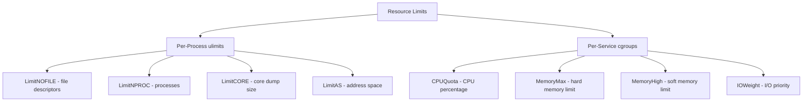

# How to Use Ansible to Configure Service Resource Limits

Author: [nawazdhandala](https://www.github.com/nawazdhandala)

Tags: Ansible, systemd, Resource Limits, Linux, Performance

Description: Learn how to set CPU, memory, file descriptor, and process limits for systemd services using Ansible to prevent resource exhaustion and improve stability.

---

A single runaway process can bring down an entire server. Maybe a memory leak causes an application to eat all available RAM. Maybe a logging bug opens thousands of file descriptors. Maybe a fork bomb spawns processes until the kernel runs out of PIDs. Resource limits are your safety net against these scenarios, and systemd gives you fine-grained control over what resources each service can consume.

Ansible makes it straightforward to deploy these limits consistently across your fleet. In this guide, I will cover both the traditional ulimits approach and the newer systemd resource control directives, including cgroup-based controls.

## Traditional Limits vs systemd Controls

There are two layers of resource limiting on modern Linux:

**Traditional ulimits** (set via `/etc/security/limits.conf` or `LimitXXX` in unit files) control per-process resource limits. These are enforced by the kernel and apply to individual processes.

**systemd resource controls** (set via `CPUQuota`, `MemoryMax`, etc. in unit files) use cgroups to limit resources at the service level, which includes all processes spawned by that service.



## Setting ulimits in systemd Unit Files

The `LimitXXX` directives in the `[Service]` section set per-process resource limits.

Ansible template with comprehensive ulimit settings:

```jinja2
# roles/service_limits/templates/service.j2
[Unit]
Description={{ svc_description }}
After=network.target

[Service]
Type={{ svc_type | default('simple') }}
User={{ svc_user | default('root') }}
Group={{ svc_group | default('root') }}
ExecStart={{ svc_exec_start }}

# File descriptor limit
LimitNOFILE={{ svc_limit_nofile | default(65536) }}

# Maximum number of processes/threads
LimitNPROC={{ svc_limit_nproc | default(4096) }}

# Core dump size (0 = disable core dumps)
LimitCORE={{ svc_limit_core | default('infinity') }}

# Maximum file size the process can create
LimitFSIZE={{ svc_limit_fsize | default('infinity') }}

# Maximum virtual memory size
LimitAS={{ svc_limit_as | default('infinity') }}

# Maximum resident set size (not enforced by kernel, use MemoryMax instead)
LimitRSS={{ svc_limit_rss | default('infinity') }}

# Maximum stack size
LimitSTACK={{ svc_limit_stack | default(8388608) }}

# Maximum locked memory
LimitMEMLOCK={{ svc_limit_memlock | default(65536) }}

# Maximum message queue size
LimitMSGQUEUE={{ svc_limit_msgqueue | default(819200) }}

# Maximum nice priority
LimitNICE={{ svc_limit_nice | default(0) }}

# Maximum real-time priority
LimitRTPRIO={{ svc_limit_rtprio | default(0) }}

[Install]
WantedBy=multi-user.target
```

## Deploying with Ansible

A playbook that deploys services with appropriate resource limits:

```yaml
---
- name: Deploy services with resource limits
  hosts: app_servers
  become: yes
  tasks:
    - name: Deploy high-traffic web server
      ansible.builtin.template:
        src: service.j2
        dest: /etc/systemd/system/webserver.service
      vars:
        svc_description: "High-traffic Web Server"
        svc_exec_start: /opt/webserver/bin/server
        svc_user: www-data
        svc_group: www-data
        # Web servers need lots of file descriptors for connections
        svc_limit_nofile: 131072
        svc_limit_nproc: 8192
        # Disable core dumps in production
        svc_limit_core: 0
      notify: Reload and restart webserver

    - name: Deploy database service
      ansible.builtin.template:
        src: service.j2
        dest: /etc/systemd/system/mydb.service
      vars:
        svc_description: "Database Server"
        svc_exec_start: /opt/mydb/bin/server
        svc_user: dbuser
        svc_group: dbuser
        svc_limit_nofile: 65536
        svc_limit_nproc: 4096
        # Databases need locked memory for shared buffers
        svc_limit_memlock: infinity
        # Enable core dumps for debugging
        svc_limit_core: infinity
      notify: Reload and restart database

  handlers:
    - name: Reload and restart webserver
      ansible.builtin.systemd:
        name: webserver
        state: restarted
        daemon_reload: yes

    - name: Reload and restart database
      ansible.builtin.systemd:
        name: mydb
        state: restarted
        daemon_reload: yes
```

## cgroup-Based Resource Controls

systemd's cgroup integration provides service-level resource limits that apply to all processes within the service, not just individual processes.

Template with cgroup-based resource controls:

```jinja2
# roles/service_limits/templates/service-with-cgroups.j2
[Unit]
Description={{ svc_description }}
After=network.target

[Service]
Type={{ svc_type | default('simple') }}
User={{ svc_user | default('root') }}
ExecStart={{ svc_exec_start }}

# ---- cgroup-based CPU limits ----

# Percentage of one CPU core (200% = 2 cores)
CPUQuota={{ svc_cpu_quota }}



# CPU scheduling weight (1-10000, default 100)
CPUWeight={{ svc_cpu_weight }}



# Pin to specific CPU cores
AllowedCPUs={{ svc_allowed_cpus }}


# ---- cgroup-based memory limits ----

# Hard memory limit (service gets OOM-killed beyond this)
MemoryMax={{ svc_memory_max }}



# Soft memory limit (throttled beyond this, not killed)
MemoryHigh={{ svc_memory_high }}



# Limit swap usage
MemorySwapMax={{ svc_memory_swap_max }}


# ---- cgroup-based I/O limits ----

# I/O weight (1-10000, default 100)
IOWeight={{ svc_io_weight }}



# Maximum read bandwidth
IOReadBandwidthMax={{ svc_io_read_bandwidth_max }}



# Maximum write bandwidth
IOWriteBandwidthMax={{ svc_io_write_bandwidth_max }}


# ---- Task limits ----

# Maximum number of tasks (processes + threads)
TasksMax={{ svc_tasks_max }}


[Install]
WantedBy=multi-user.target
```

## Practical Examples

### Limiting a Java Application

Java applications are notorious for consuming memory. Set hard limits to prevent heap expansion from taking down the server.

Deploy a Java service with strict memory limits:

```yaml
- name: Deploy Java API service
  ansible.builtin.template:
    src: service-with-cgroups.j2
    dest: /etc/systemd/system/java-api.service
  vars:
    svc_description: "Java REST API"
    svc_exec_start: "/usr/bin/java -Xmx2g -Xms512m -jar /opt/api/api.jar"
    svc_user: appuser
    # Memory: soft limit at 2.5G, hard kill at 3G
    svc_memory_high: "2560M"
    svc_memory_max: "3G"
    svc_memory_swap_max: "0"
    # CPU: limit to 2 cores
    svc_cpu_quota: "200%"
    # File descriptors for network connections
    svc_limit_nofile: 65536
    svc_tasks_max: 512
```

### Limiting a Background Worker

Workers should not starve the main application of resources.

Deploy a background worker with conservative limits:

```yaml
- name: Deploy background worker
  ansible.builtin.template:
    src: service-with-cgroups.j2
    dest: /etc/systemd/system/worker.service
  vars:
    svc_description: "Background Job Worker"
    svc_exec_start: "/opt/worker/bin/worker"
    svc_user: worker
    # Low CPU priority - main app gets priority
    svc_cpu_weight: 50
    svc_cpu_quota: "100%"
    # Moderate memory limit
    svc_memory_max: "1G"
    svc_memory_high: "768M"
    # Low I/O priority
    svc_io_weight: 50
    svc_tasks_max: 64
```

### Limiting a Logging Agent

Logging agents should use minimal resources.

Deploy a logging agent with tight limits:

```yaml
- name: Deploy logging agent
  ansible.builtin.template:
    src: service-with-cgroups.j2
    dest: /etc/systemd/system/log-agent.service
  vars:
    svc_description: "Log Forwarding Agent"
    svc_exec_start: "/opt/log-agent/bin/agent -c /etc/log-agent/config.yaml"
    svc_user: logagent
    svc_cpu_quota: "25%"
    svc_memory_max: "256M"
    svc_memory_high: "200M"
    svc_io_weight: 25
    svc_tasks_max: 16
    svc_limit_nofile: 8192
```

## Setting System-Wide Defaults

You can set default limits for all services using a drop-in configuration.

Deploy system-wide default resource limits:

```yaml
- name: Create systemd default limits directory
  ansible.builtin.file:
    path: /etc/systemd/system.conf.d
    state: directory
    mode: '0755'

- name: Deploy system-wide default limits
  ansible.builtin.copy:
    dest: /etc/systemd/system.conf.d/limits.conf
    content: |
      [Manager]
      DefaultLimitNOFILE=65536
      DefaultLimitNPROC=4096
      DefaultTasksMax=4096
    owner: root
    group: root
    mode: '0644'
  notify: Reload systemd daemon
```

## Verifying Applied Limits

After deploying limits, verify they are in effect.

Check resource limits for a running service:

```yaml
- name: Check applied limits for the service
  ansible.builtin.command: "systemctl show {{ item.service }} --property={{ item.property }}"
  register: limit_checks
  loop:
    - { service: "java-api", property: "LimitNOFILE" }
    - { service: "java-api", property: "MemoryMax" }
    - { service: "java-api", property: "CPUQuota" }
    - { service: "java-api", property: "TasksMax" }
  changed_when: false

- name: Display applied limits
  ansible.builtin.debug:
    msg: "{{ item.item.service }}: {{ item.item.property }}={{ item.stdout.split('=')[1] }}"
  loop: "{{ limit_checks.results }}"
  loop_control:
    label: "{{ item.item.property }}"

- name: Check actual cgroup usage
  ansible.builtin.command: "systemctl status java-api --no-pager"
  register: svc_status
  changed_when: false

- name: Show current resource usage
  ansible.builtin.debug:
    var: svc_status.stdout_lines
```

## Using Drop-in Files for Overrides

Instead of editing the main unit file, use drop-in files to override specific settings. This is especially useful for services installed by packages.

Override resource limits for a package-installed service:

```yaml
- name: Create drop-in directory for nginx
  ansible.builtin.file:
    path: /etc/systemd/system/nginx.service.d
    state: directory
    mode: '0755'

- name: Deploy resource limit overrides for nginx
  ansible.builtin.copy:
    dest: /etc/systemd/system/nginx.service.d/limits.conf
    content: |
      [Service]
      LimitNOFILE=131072
      MemoryMax=2G
      CPUQuota=150%
    mode: '0644'
  notify: Reload and restart nginx
```

Drop-in files in the `.d` directory are merged with the main unit file. This way, package updates do not overwrite your customizations.

## Summary

Resource limits are a fundamental part of production service management. systemd gives you two complementary approaches: per-process ulimits via `LimitXXX` directives (good for file descriptors and process counts) and cgroup-based controls via `MemoryMax`, `CPUQuota`, and friends (good for overall service resource consumption). Ansible templates let you deploy these consistently, and drop-in files let you customize limits for package-installed services without touching their unit files. Always verify your limits are applied after deployment, and start with conservative values that you can relax as you observe real-world usage patterns.
