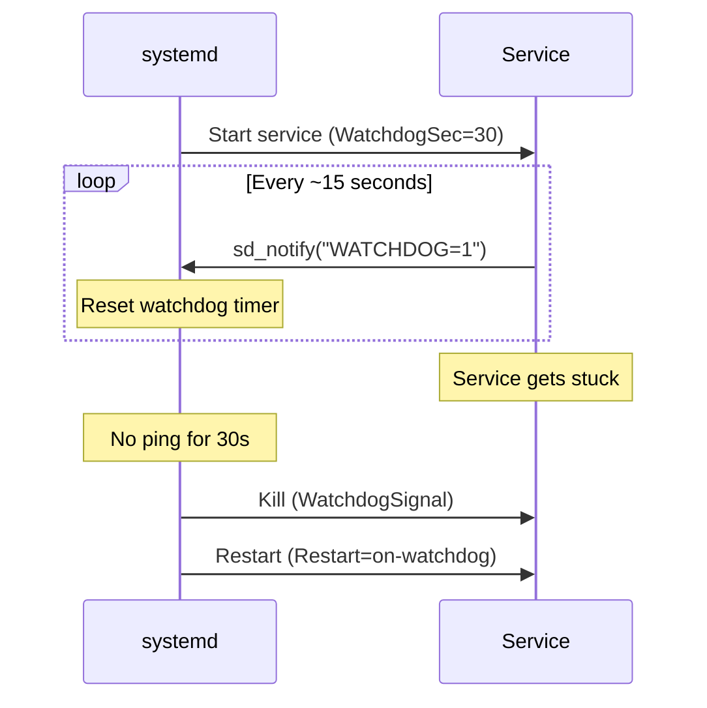
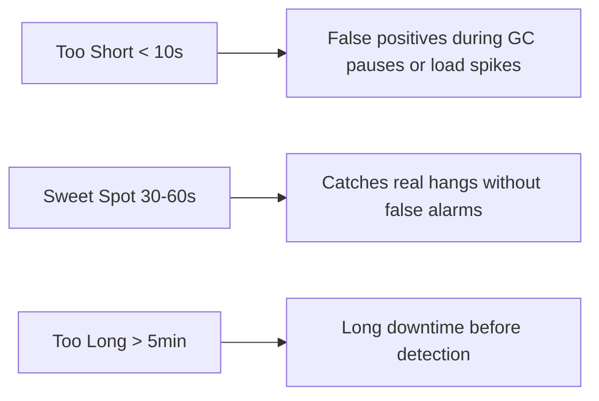

# How to Use Ansible to Configure Service Watchdog

Author: [nawazdhandala](https://www.github.com/nawazdhandala)

Tags: Ansible, systemd, Watchdog, Service Monitoring, Linux

Description: Learn how to configure systemd watchdog timers with Ansible to automatically detect and restart hung services that stop responding.

---

A service can appear to be running while actually being stuck. The process is alive, it is consuming memory, and systemd shows it as active, but it is not doing any useful work. Maybe it is deadlocked, maybe it hit an infinite loop, or maybe it is waiting on an I/O operation that will never complete. The systemd watchdog feature addresses this by requiring services to periodically signal that they are healthy. If the signal stops coming, systemd considers the service hung and takes action.

In this guide, I will show how to configure systemd watchdog timers with Ansible, including both the systemd side and the application side.

## How the Watchdog Works

The systemd watchdog is a cooperative mechanism between the service manager and the application:



1. The unit file specifies `WatchdogSec`, which sets the timeout
2. The application periodically calls `sd_notify("WATCHDOG=1")` to signal health
3. If the timeout expires without a signal, systemd kills the service
4. Based on the `Restart` policy, systemd restarts the service

## Configuring the Watchdog in Unit Files

Here is a Jinja2 template for a service with watchdog support.

Service unit template with watchdog configuration:

```jinja2
# roles/watchdog_service/templates/service.j2
[Unit]
Description={{ svc_description }}
After=network.target

[Service]
Type=notify
User={{ svc_user | default('root') }}
Group={{ svc_group | default('root') }}
ExecStart={{ svc_exec_start }}

# Watchdog configuration
WatchdogSec={{ svc_watchdog_sec | default(30) }}

WatchdogSignal={{ svc_watchdog_signal }}


# Restart policy for watchdog failures
Restart={{ svc_restart | default('on-watchdog') }}
RestartSec={{ svc_restart_sec | default(5) }}

# How many restarts before giving up

StartLimitBurst={{ svc_start_limit_burst }}
StartLimitIntervalSec={{ svc_start_limit_interval | default(600) }}


# Action to take when the service is repeatedly failing

FailureAction={{ svc_failure_action }}


# Notify access for the watchdog
NotifyAccess=main

# Resource limits
LimitNOFILE={{ svc_limit_nofile | default(65536) }}

[Install]
WantedBy=multi-user.target
```

## Deploying with Ansible

Deploy a watchdog-enabled service:

```yaml
---
- name: Deploy service with watchdog monitoring
  hosts: app_servers
  become: yes
  tasks:
    - name: Deploy watchdog-enabled service
      ansible.builtin.template:
        src: service.j2
        dest: /etc/systemd/system/myapp.service
        owner: root
        group: root
        mode: '0644'
      vars:
        svc_description: "My Application with Watchdog"
        svc_exec_start: /opt/myapp/bin/server
        svc_user: myapp
        svc_watchdog_sec: 30
        svc_restart: on-watchdog
        svc_restart_sec: 5
        svc_start_limit_burst: 5
        svc_start_limit_interval: 300
      notify:
        - Reload systemd
        - Restart myapp

  handlers:
    - name: Reload systemd
      ansible.builtin.systemd:
        daemon_reload: yes

    - name: Restart myapp
      ansible.builtin.systemd:
        name: myapp
        state: restarted
```

## Application-Side Watchdog Implementation

The application needs to send periodic watchdog notifications. Here are examples in different languages.

### Python

```python
#!/usr/bin/env python3
"""Application with systemd watchdog support."""
import os
import time
import threading
import socket

def sd_notify(message):
    """Send a notification to systemd."""
    sock_path = os.environ.get('NOTIFY_SOCKET')
    if not sock_path:
        return
    sock = socket.socket(socket.AF_UNIX, socket.SOCK_DGRAM)
    try:
        sock.connect(sock_path)
        sock.sendall(message.encode())
    finally:
        sock.close()

def watchdog_ping():
    """Periodically ping the watchdog."""
    # Get the watchdog interval from environment
    usec = int(os.environ.get('WATCHDOG_USEC', 0))
    if usec == 0:
        return
    # Ping at half the interval
    interval = usec / 1000000 / 2
    while True:
        # Only ping if the application is healthy
        if check_health():
            sd_notify('WATCHDOG=1')
        time.sleep(interval)

def check_health():
    """Application health check logic."""
    # Add your real health checks here
    # Return False if the application is unhealthy
    return True

# Notify systemd that we are ready
sd_notify('READY=1')

# Start watchdog thread
watcher = threading.Thread(target=watchdog_ping, daemon=True)
watcher.start()

# Main application loop
run_application()
```

### Go

```go
package main

import (
    "net"
    "os"
    "time"
)

func sdNotify(state string) error {
    socketPath := os.Getenv("NOTIFY_SOCKET")
    if socketPath == "" {
        return nil
    }
    conn, err := net.Dial("unixgram", socketPath)
    if err != nil {
        return err
    }
    defer conn.Close()
    _, err = conn.Write([]byte(state))
    return err
}

func watchdog() {
    // Ping at half the configured interval
    interval := 15 * time.Second
    ticker := time.NewTicker(interval)
    for range ticker.C {
        if isHealthy() {
            sdNotify("WATCHDOG=1")
        }
    }
}

func main() {
    // Signal ready
    sdNotify("READY=1")
    // Start watchdog goroutine
    go watchdog()
    // Run main application
    runApplication()
}
```

Deploy the application with Ansible:

```yaml
- name: Deploy application binary
  ansible.builtin.copy:
    src: "{{ app_binary }}"
    dest: /opt/myapp/bin/server
    owner: myapp
    group: myapp
    mode: '0755'
  notify: Restart myapp
```

## Watchdog Without Application Support

If your application does not support the watchdog protocol natively, you can use a wrapper script that checks a health endpoint.

Deploy a watchdog wrapper script:

```yaml
- name: Deploy watchdog wrapper script
  ansible.builtin.copy:
    dest: /opt/myapp/bin/watchdog-wrapper.sh
    mode: '0755'
    content: |
      #!/bin/bash
      # Watchdog wrapper for applications without native sd_notify support

      # Get watchdog interval (in microseconds) and convert to seconds
      INTERVAL=$(( ${WATCHDOG_USEC:-0} / 1000000 / 2 ))

      if [ "$INTERVAL" -eq 0 ]; then
        INTERVAL=15
      fi

      HEALTH_URL="http://localhost:8080/health"

      # Notify systemd that we are ready
      systemd-notify --ready

      # Background health checker
      while true; do
        if curl -sf "$HEALTH_URL" > /dev/null 2>&1; then
          systemd-notify WATCHDOG=1
        fi
        sleep "$INTERVAL"
      done &

      WATCHER_PID=$!

      # Start the actual application
      exec /opt/myapp/bin/server "$@"

- name: Deploy service with wrapper
  ansible.builtin.template:
    src: service.j2
    dest: /etc/systemd/system/myapp.service
  vars:
    svc_description: "My Application (with watchdog wrapper)"
    svc_exec_start: /opt/myapp/bin/watchdog-wrapper.sh
    svc_watchdog_sec: 60
    svc_restart: on-watchdog
```

## Configuring Watchdog for Existing Services

For services installed by packages, use drop-in files to add watchdog configuration.

Add watchdog to an existing service via drop-in:

```yaml
- name: Create drop-in directory for nginx
  ansible.builtin.file:
    path: /etc/systemd/system/nginx.service.d
    state: directory
    mode: '0755'

- name: Add watchdog configuration to nginx
  ansible.builtin.copy:
    dest: /etc/systemd/system/nginx.service.d/watchdog.conf
    content: |
      [Service]
      # Nginx supports watchdog since 1.19.5+
      Type=notify
      WatchdogSec=30
      Restart=on-watchdog
      RestartSec=5
    mode: '0644'
  notify:
    - Reload systemd
    - Restart nginx
```

## Hardware Watchdog Integration

systemd can also manage a hardware watchdog timer. If the entire system hangs (not just one service), the hardware watchdog will reset the machine.

Configure the system-wide hardware watchdog:

```yaml
- name: Configure system-wide watchdog
  ansible.builtin.template:
    src: system.conf.j2
    dest: /etc/systemd/system.conf.d/watchdog.conf
    mode: '0644'
  notify: Reload systemd daemon configuration

# The template:
# [Manager]
# RuntimeWatchdogSec=30
# RebootWatchdogSec=10min
# KExecWatchdogSec=30
```

Explanation:
- `RuntimeWatchdogSec`: If systemd itself becomes unresponsive for 30 seconds, the hardware watchdog triggers a reboot
- `RebootWatchdogSec`: Maximum time allowed for a reboot before the hardware watchdog forces a reset
- `KExecWatchdogSec`: Maximum time for kexec before hardware reset

## Monitoring Watchdog Events

Track watchdog-triggered restarts with Ansible:

```yaml
- name: Check for recent watchdog events
  ansible.builtin.command: >
    journalctl -u myapp --since "24 hours ago" --no-pager
    -g "watchdog|Watchdog"
  register: watchdog_events
  changed_when: false

- name: Report watchdog events
  ansible.builtin.debug:
    var: watchdog_events.stdout_lines
  when: watchdog_events.stdout_lines | length > 0

- name: Check service restart count
  ansible.builtin.command: "systemctl show myapp --property=NRestarts"
  register: restart_count
  changed_when: false

- name: Alert on excessive restarts
  ansible.builtin.debug:
    msg: "WARNING: myapp has restarted {{ restart_count.stdout.split('=')[1] }} times"
  when: restart_count.stdout.split('=')[1] | int > 5
```

## Tuning Watchdog Parameters

The watchdog timeout needs to be tuned for your application. Too short and you get false positives during legitimate slow operations. Too long and you do not catch real hangs quickly enough.



General guidelines:
- For web APIs that should respond within milliseconds: 30 seconds
- For batch processors with occasional long operations: 2-5 minutes
- For database servers with complex queries: 60-120 seconds

Deploy with configurable watchdog timeout per environment:

```yaml
# group_vars/production.yml
watchdog_timeout: 30

# group_vars/staging.yml
watchdog_timeout: 60

# In the playbook
- name: Deploy with environment-specific watchdog
  ansible.builtin.template:
    src: service.j2
    dest: /etc/systemd/system/myapp.service
  vars:
    svc_watchdog_sec: "{{ watchdog_timeout }}"
```

## Combining Watchdog with Restart Limits

To prevent a broken service from restart-looping forever, set restart limits:

```yaml
- name: Deploy service with watchdog and restart limits
  ansible.builtin.template:
    src: service.j2
    dest: /etc/systemd/system/myapp.service
  vars:
    svc_watchdog_sec: 30
    svc_restart: on-watchdog
    svc_restart_sec: 5
    svc_start_limit_burst: 5
    svc_start_limit_interval: 300
    svc_failure_action: none  # Use 'reboot' for critical services
```

This allows 5 restarts within a 5-minute window. If the service keeps failing after 5 attempts, systemd stops trying. For truly critical services, you can set `FailureAction=reboot` to reboot the entire machine as a last resort.

## Summary

The systemd watchdog transforms service monitoring from "is the process running?" to "is the process actually healthy?" It catches hung processes that traditional monitoring misses. The setup requires coordination between the unit file (setting `WatchdogSec` and `Type=notify`) and the application (periodically calling `sd_notify("WATCHDOG=1")`). For applications without native watchdog support, a wrapper script that checks a health endpoint works well. Ansible handles deploying all of this consistently, from the unit files to the wrapper scripts to the drop-in overrides for existing services.
