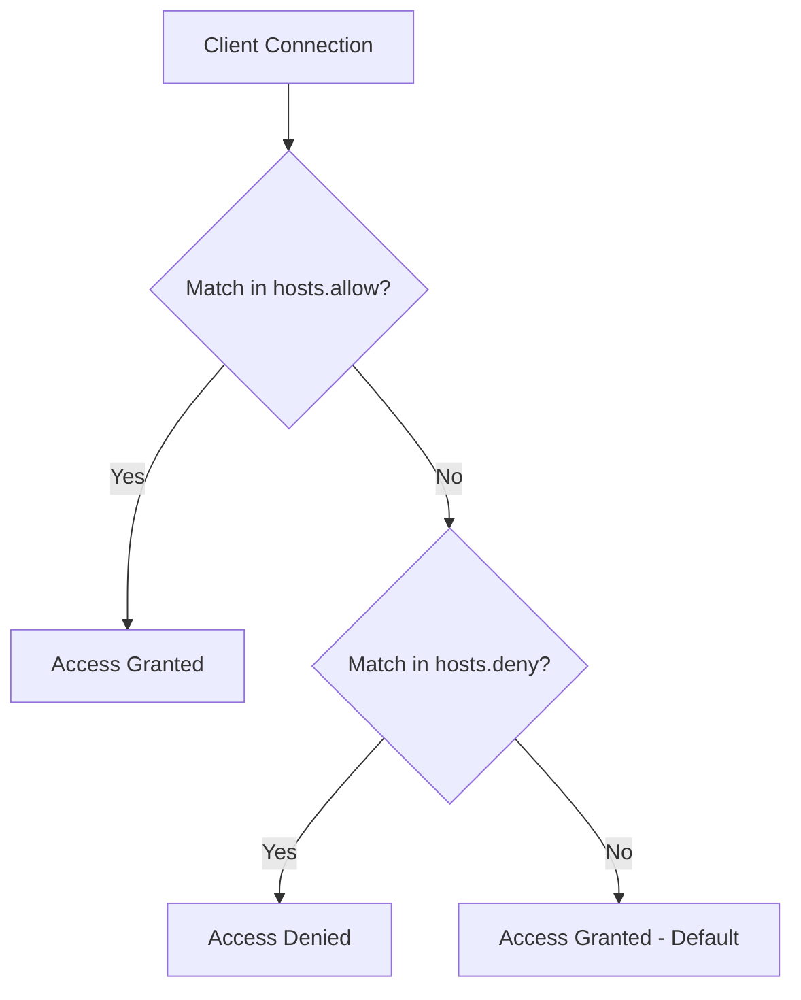

# How to Use Ansible to Configure TCP Wrappers

Author: [nawazdhandala](https://www.github.com/nawazdhandala)

Tags: Ansible, TCP Wrappers, Security, Access Control, Linux

Description: Configure TCP Wrappers (hosts.allow and hosts.deny) across your Linux servers using Ansible for host-based access control on network services.

---

TCP Wrappers have been around since the early 1990s, and while they are considered a legacy technology, they are still used in many environments as an additional layer of access control. Services that are compiled with libwrap support (like SSH, NFS, and various other daemons) check `/etc/hosts.allow` and `/etc/hosts.deny` before accepting connections. This gives you a simple way to restrict which hosts can connect to specific services.

While modern firewalls (iptables, nftables, firewalld) are more capable, TCP Wrappers provide defense in depth. Even if a firewall rule is misconfigured, TCP Wrappers can block unauthorized access. In this post, I will show you how to manage TCP Wrappers consistently across your fleet using Ansible.

## How TCP Wrappers Work

When a client connects to a TCP-wrapped service, the system checks two files in order:

1. `/etc/hosts.allow` - If a matching rule is found, access is granted
2. `/etc/hosts.deny` - If a matching rule is found, access is denied
3. If no rules match in either file, access is granted (default allow)

The security best practice is to deny everything in `hosts.deny` and explicitly allow only what is needed in `hosts.allow`.



## Checking TCP Wrapper Support

Before configuring TCP Wrappers, verify that your services support them. Not all services are compiled with libwrap.

This playbook checks which installed services support TCP Wrappers:

```yaml
# check_tcpwrappers.yml - Check TCP Wrapper support
---
- name: Check TCP Wrapper support on services
  hosts: all
  become: true

  tasks:
    - name: Check if libwrap is available
      ansible.builtin.command: ldconfig -p
      register: ldconfig_output
      changed_when: false

    - name: Verify libwrap is installed
      ansible.builtin.debug:
        msg: "libwrap {{ 'is' if 'libwrap' in ldconfig_output.stdout else 'is NOT' }} installed"

    - name: Check sshd for TCP Wrapper support
      ansible.builtin.shell: ldd $(which sshd) 2>/dev/null | grep -c libwrap
      register: sshd_tcpwrap
      changed_when: false
      failed_when: false

    - name: Report SSH TCP Wrapper support
      ansible.builtin.debug:
        msg: "sshd TCP Wrapper support: {{ 'yes' if sshd_tcpwrap.stdout | int > 0 else 'no' }}"
```

## Basic TCP Wrapper Configuration

The most common pattern is to deny all by default and then allow specific hosts.

This playbook deploys a deny-all policy with specific exceptions:

```yaml
# configure_tcpwrappers.yml - Configure TCP Wrappers
---
- name: Configure TCP Wrappers
  hosts: all
  become: true

  vars:
    # Define allowed access rules
    hosts_allow_rules:
      - daemon: sshd
        clients:
          - "10.0.0.0/8"
          - "192.168.1.0/24"
        comment: "SSH access from internal networks"

      - daemon: ALL
        clients:
          - "127.0.0.1"
          - "[::1]"
        comment: "Localhost access for all services"

    # Deny everything else
    hosts_deny_all: true

  tasks:
    - name: Deploy hosts.allow
      ansible.builtin.template:
        src: hosts.allow.j2
        dest: /etc/hosts.allow
        owner: root
        group: root
        mode: '0644'
        backup: true

    - name: Deploy hosts.deny
      ansible.builtin.template:
        src: hosts.deny.j2
        dest: /etc/hosts.deny
        owner: root
        group: root
        mode: '0644'
        backup: true
```

The hosts.allow template:

```
# templates/hosts.allow.j2 - TCP Wrappers allow rules
# Managed by Ansible - do not edit manually
# Last updated: {{ ansible_date_time.iso8601 }}


# {{ rule.comment }}
{{ rule.daemon }}: {{ rule.clients | join(', ') }}


```

The hosts.deny template:

```
# templates/hosts.deny.j2 - TCP Wrappers deny rules
# Managed by Ansible - do not edit manually
# Last updated: {{ ansible_date_time.iso8601 }}


# Deny all connections not explicitly allowed in hosts.allow
ALL: ALL

```

## Role-Based Access Rules

Different server roles need different access patterns. Here is how to customize TCP Wrapper rules per role.

This playbook applies role-specific TCP Wrapper configurations:

```yaml
# role_based_tcpwrappers.yml - Role-specific TCP Wrapper rules
---
- name: Configure TCP Wrappers for web servers
  hosts: webservers
  become: true

  vars:
    hosts_allow_rules:
      - daemon: sshd
        clients: ["10.4.0.0/24"]
        comment: "SSH from management network"
      - daemon: httpd
        clients: ["ALL"]
        comment: "HTTP from anywhere"
      - daemon: ALL
        clients: ["127.0.0.1"]
        comment: "Localhost"

  tasks:
    - name: Deploy hosts.allow for web servers
      ansible.builtin.template:
        src: hosts.allow.j2
        dest: /etc/hosts.allow
        owner: root
        group: root
        mode: '0644'

- name: Configure TCP Wrappers for database servers
  hosts: databases
  become: true

  vars:
    hosts_allow_rules:
      - daemon: sshd
        clients: ["10.4.0.0/24"]
        comment: "SSH from management network"
      - daemon: ALL
        clients: ["10.2.0.0/24"]
        comment: "App tier access"
      - daemon: ALL
        clients: ["127.0.0.1"]
        comment: "Localhost"

  tasks:
    - name: Deploy hosts.allow for database servers
      ansible.builtin.template:
        src: hosts.allow.j2
        dest: /etc/hosts.allow
        owner: root
        group: root
        mode: '0644'
```

## Advanced TCP Wrapper Features

TCP Wrappers support more than just IP-based filtering. You can use hostnames, spawn commands, and set options.

This playbook configures advanced TCP Wrapper rules with logging and actions:

```yaml
# advanced_tcpwrappers.yml - Advanced TCP Wrapper configuration
---
- name: Configure advanced TCP Wrappers
  hosts: all
  become: true

  tasks:
    - name: Deploy advanced hosts.allow
      ansible.builtin.copy:
        content: |
          # Advanced TCP Wrapper rules - Managed by Ansible

          # Allow SSH from internal networks with logging
          sshd: 10.0.0.0/8: ALLOW

          # Allow SSH from specific external IP with spawn for logging
          sshd: 203.0.113.50: spawn /usr/bin/logger -t tcpwrappers "SSH access from %a to %d" : ALLOW

          # Allow NFS from local subnet only
          portmap: 10.2.0.0/24: ALLOW
          mountd: 10.2.0.0/24: ALLOW
          statd: 10.2.0.0/24: ALLOW

          # Localhost always allowed
          ALL: 127.0.0.1 [::1]: ALLOW
        dest: /etc/hosts.allow
        owner: root
        group: root
        mode: '0644'

    - name: Deploy hosts.deny with logging
      ansible.builtin.copy:
        content: |
          # TCP Wrapper deny rules - Managed by Ansible
          # Log all denied connections, then deny

          ALL: ALL: spawn /usr/bin/logger -t tcpwrappers "DENIED connection from %a to %d on %H" : DENY
        dest: /etc/hosts.deny
        owner: root
        group: root
        mode: '0644'
```

## Building a Complete TCP Wrapper Role

Here is a reusable role structure:

```yaml
# roles/tcp_wrappers/defaults/main.yml
---
tcp_wrappers_deny_all: true
tcp_wrappers_log_denied: true
tcp_wrappers_base_allow:
  - daemon: ALL
    clients: ["127.0.0.1", "[::1]"]
    comment: "Localhost access"
  - daemon: sshd
    clients: ["10.4.0.0/24"]
    comment: "SSH from management"

tcp_wrappers_extra_allow: []
```

```yaml
# roles/tcp_wrappers/tasks/main.yml
---
- name: Combine allow rules
  ansible.builtin.set_fact:
    tcp_wrappers_all_rules: "{{ tcp_wrappers_base_allow + tcp_wrappers_extra_allow }}"

- name: Deploy hosts.allow
  ansible.builtin.template:
    src: hosts.allow.j2
    dest: /etc/hosts.allow
    owner: root
    group: root
    mode: '0644'
    validate: /bin/true  # TCP Wrappers has no built-in validator

- name: Deploy hosts.deny
  ansible.builtin.template:
    src: hosts.deny.j2
    dest: /etc/hosts.deny
    owner: root
    group: root
    mode: '0644'
```

Use the role with per-host overrides:

```yaml
# site.yml - Apply TCP Wrappers role with overrides
---
- name: Apply TCP Wrappers
  hosts: all
  become: true
  roles:
    - role: tcp_wrappers
      vars:
        tcp_wrappers_extra_allow:
          - daemon: httpd
            clients: ["ALL"]
            comment: "Web traffic"
      when: "'webservers' in group_names"

    - role: tcp_wrappers
      vars:
        tcp_wrappers_extra_allow:
          - daemon: mysqld
            clients: ["10.2.0.0/24"]
            comment: "MySQL from app tier"
      when: "'databases' in group_names"
```

## Testing TCP Wrapper Rules

Always test your rules to make sure they work as expected.

This playbook validates TCP Wrapper configuration:

```yaml
# test_tcpwrappers.yml - Test TCP Wrapper rules
---
- name: Test TCP Wrapper configuration
  hosts: all
  become: true

  tasks:
    - name: Verify hosts.allow syntax
      ansible.builtin.command: cat /etc/hosts.allow
      register: hosts_allow_content
      changed_when: false

    - name: Verify hosts.deny syntax
      ansible.builtin.command: cat /etc/hosts.deny
      register: hosts_deny_content
      changed_when: false

    - name: Test SSH access with tcpdmatch
      ansible.builtin.command: tcpdmatch sshd 10.4.0.5
      register: ssh_test
      changed_when: false
      failed_when: false

    - name: Report test results
      ansible.builtin.debug:
        msg:
          - "SSH from 10.4.0.5: {{ ssh_test.stdout | default('tcpdmatch not available') }}"

    - name: Test denied access
      ansible.builtin.command: tcpdmatch sshd 1.2.3.4
      register: deny_test
      changed_when: false
      failed_when: false

    - name: Report denied test
      ansible.builtin.debug:
        msg:
          - "SSH from 1.2.3.4: {{ deny_test.stdout | default('tcpdmatch not available') }}"
```

## Important Considerations

1. **TCP Wrappers are not a firewall replacement.** They only protect services compiled with libwrap support. Always use TCP Wrappers alongside a proper firewall.
2. **Many modern services do not support TCP Wrappers.** Nginx, for example, does not use libwrap. Check each service before relying on TCP Wrappers for access control.
3. **Order matters in hosts.allow.** The first matching rule wins. Put more specific rules before general ones.
4. **Test before deploying.** A mistake in hosts.deny can lock you out of SSH. Use `tcpdmatch` to test rules before applying.
5. **Some distributions are removing TCP Wrapper support.** Fedora and newer RHEL versions have deprecated libwrap. Check if your OS still supports it.
6. **Always have console access.** If you accidentally deny SSH access, you need another way to reach the server.

TCP Wrappers with Ansible provide an easy-to-manage additional security layer. While they are not a replacement for modern firewalls, they add defense in depth that can catch traffic that slips through other controls.
