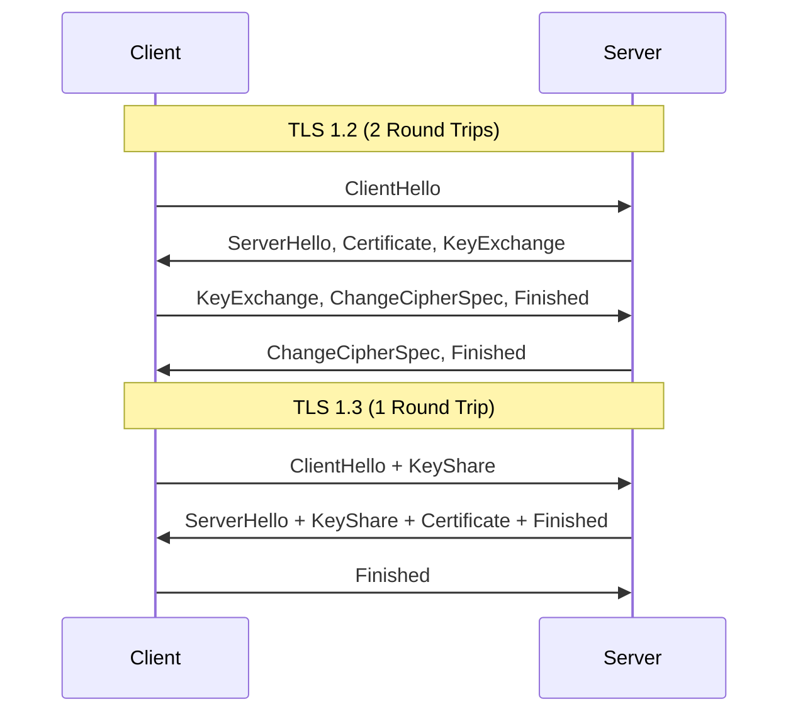

# How to Use Ansible to Configure TLS 1.3 on Web Servers

Author: [nawazdhandala](https://www.github.com/nawazdhandala)

Tags: Ansible, TLS 1.3, Nginx, Apache, Web Security

Description: Configure TLS 1.3 on Nginx and Apache web servers using Ansible playbooks for faster, more secure HTTPS connections across your fleet.

---

TLS 1.3 is a significant improvement over TLS 1.2. It reduces the handshake from two round trips to one (and supports zero round-trip resumption), removes outdated cipher suites, and simplifies the protocol. If your web servers are still running TLS 1.2 only, upgrading to support TLS 1.3 gives you both better security and better performance.

The challenge with any TLS configuration change is doing it consistently across all your web servers. One misconfigured server can leave a gap in your security posture. Ansible solves this by letting you push the same TLS configuration everywhere at once.

## TLS 1.3 vs TLS 1.2

Here is what changed between TLS 1.2 and TLS 1.3:



TLS 1.3 also removes support for weak algorithms like RSA key exchange, CBC mode ciphers, and MD5/SHA-1 hashing. This means fewer configuration mistakes are possible.

## Configuring TLS 1.3 on Nginx

Let's start with Nginx, which has supported TLS 1.3 since version 1.13.0 (when compiled with OpenSSL 1.1.1+).

This playbook configures Nginx with TLS 1.3 support:

```yaml
# nginx_tls13.yml - Configure TLS 1.3 on Nginx
---
- name: Configure TLS 1.3 on Nginx
  hosts: webservers
  become: true

  vars:
    nginx_ssl_protocols: "TLSv1.2 TLSv1.3"
    nginx_ssl_ciphers: "TLS_AES_256_GCM_SHA384:TLS_CHACHA20_POLY1305_SHA256:TLS_AES_128_GCM_SHA256:ECDHE-ECDSA-AES256-GCM-SHA384:ECDHE-RSA-AES256-GCM-SHA384:ECDHE-ECDSA-CHACHA20-POLY1305:ECDHE-RSA-CHACHA20-POLY1305"
    nginx_ssl_certificate: /etc/ssl/certs/server.crt
    nginx_ssl_certificate_key: /etc/ssl/private/server.key
    nginx_ssl_session_timeout: "1d"
    nginx_ssl_session_cache: "shared:SSL:50m"
    nginx_ssl_session_tickets: false
    nginx_ssl_stapling: true

  tasks:
    - name: Check Nginx version supports TLS 1.3
      ansible.builtin.command: nginx -v
      register: nginx_version
      changed_when: false

    - name: Check OpenSSL version
      ansible.builtin.command: openssl version
      register: openssl_version
      changed_when: false

    - name: Display versions
      ansible.builtin.debug:
        msg:
          - "Nginx: {{ nginx_version.stderr }}"
          - "OpenSSL: {{ openssl_version.stdout }}"

    - name: Deploy Nginx TLS configuration snippet
      ansible.builtin.template:
        src: nginx_ssl.conf.j2
        dest: /etc/nginx/snippets/ssl-params.conf
        owner: root
        group: root
        mode: '0644'
      notify: reload nginx

    - name: Validate Nginx configuration
      ansible.builtin.command: nginx -t
      changed_when: false

  handlers:
    - name: reload nginx
      ansible.builtin.service:
        name: nginx
        state: reloaded
```

The Nginx SSL configuration template:

```nginx
# templates/nginx_ssl.conf.j2 - TLS 1.3 configuration for Nginx
# Managed by Ansible

# Protocol versions - only TLS 1.2 and 1.3
ssl_protocols {{ nginx_ssl_protocols }};

# Cipher suite configuration
# TLS 1.3 ciphers are configured separately in OpenSSL
# The listed ciphers cover both TLS 1.2 and 1.3
ssl_ciphers {{ nginx_ssl_ciphers }};
ssl_prefer_server_ciphers off;  # TLS 1.3 ciphers are all strong

# Session configuration
ssl_session_timeout {{ nginx_ssl_session_timeout }};
ssl_session_cache {{ nginx_ssl_session_cache }};
ssl_session_tickets {{ 'on' if nginx_ssl_session_tickets else 'off' }};

# OCSP Stapling

ssl_stapling on;
ssl_stapling_verify on;
resolver 8.8.8.8 8.8.4.4 valid=300s;
resolver_timeout 5s;


# DH parameters for TLS 1.2 key exchange
ssl_dhparam /etc/ssl/dhparams.pem;

# Early data (0-RTT) - use with caution
# ssl_early_data on;
```

The full Nginx server block:

```yaml
    - name: Deploy Nginx server block with TLS 1.3
      ansible.builtin.template:
        src: nginx_vhost_tls13.j2
        dest: /etc/nginx/sites-available/default
        owner: root
        group: root
        mode: '0644'
      notify: reload nginx
```

```nginx
# templates/nginx_vhost_tls13.j2 - Server block with TLS 1.3
server {
    listen 443 ssl http2;
    listen [::]:443 ssl http2;
    server_name {{ ansible_fqdn }};

    ssl_certificate {{ nginx_ssl_certificate }};
    ssl_certificate_key {{ nginx_ssl_certificate_key }};
    include snippets/ssl-params.conf;

    # Security headers
    add_header Strict-Transport-Security "max-age=63072000; includeSubDomains; preload" always;
    add_header X-Content-Type-Options "nosniff" always;
    add_header X-Frame-Options "SAMEORIGIN" always;

    root /var/www/html;
    index index.html;

    location / {
        try_files $uri $uri/ =404;
    }
}

server {
    listen 80;
    listen [::]:80;
    server_name {{ ansible_fqdn }};
    return 301 https://$host$request_uri;
}
```

## Configuring TLS 1.3 on Apache

Apache supports TLS 1.3 with version 2.4.36+ and OpenSSL 1.1.1+.

This playbook configures Apache with TLS 1.3:

```yaml
# apache_tls13.yml - Configure TLS 1.3 on Apache
---
- name: Configure TLS 1.3 on Apache
  hosts: apache_servers
  become: true

  vars:
    apache_ssl_protocols: "all -SSLv3 -TLSv1 -TLSv1.1"
    apache_ssl_cipher_suite: "TLS_AES_256_GCM_SHA384:TLS_CHACHA20_POLY1305_SHA256:TLS_AES_128_GCM_SHA256:ECDHE-ECDSA-AES256-GCM-SHA384:ECDHE-RSA-AES256-GCM-SHA384"
    apache_ssl_certificate: /etc/ssl/certs/server.crt
    apache_ssl_key: /etc/ssl/private/server.key

  tasks:
    - name: Enable SSL and headers modules
      ansible.builtin.command: a2enmod {{ item }}
      loop:
        - ssl
        - headers
      changed_when: true
      failed_when: false

    - name: Deploy Apache SSL configuration
      ansible.builtin.copy:
        content: |
          # TLS 1.3 configuration for Apache - Managed by Ansible

          SSLProtocol {{ apache_ssl_protocols }}
          SSLCipherSuite {{ apache_ssl_cipher_suite }}
          SSLHonorCipherOrder off

          # Session settings
          SSLSessionTickets off

          # OCSP Stapling
          SSLUseStapling On
          SSLStaplingCache "shmcb:logs/ssl_stapling(32768)"
          SSLStaplingResponseMaxAge 900

          # Compression (disabled for security)
          SSLCompression off

          # TLS 1.3 specific settings
          SSLOpenSSLConfCmd Curves X25519:secp256r1:secp384r1
        dest: /etc/apache2/conf-available/ssl-tls13.conf
        owner: root
        group: root
        mode: '0644'
      notify: reload apache

    - name: Enable SSL configuration
      ansible.builtin.command: a2enconf ssl-tls13
      changed_when: true
      failed_when: false
      notify: reload apache

    - name: Validate Apache configuration
      ansible.builtin.command: apache2ctl configtest
      changed_when: false

  handlers:
    - name: reload apache
      ansible.builtin.service:
        name: apache2
        state: reloaded
```

## Generating DH Parameters

For TLS 1.2 backward compatibility, generate strong DH parameters:

```yaml
# generate_dhparams.yml - Generate DH parameters for TLS
---
- name: Generate DH parameters
  hosts: webservers
  become: true

  tasks:
    - name: Check if DH params exist
      ansible.builtin.stat:
        path: /etc/ssl/dhparams.pem
      register: dhparams_file

    - name: Generate 2048-bit DH parameters
      community.crypto.openssl_dhparam:
        path: /etc/ssl/dhparams.pem
        size: 2048
        owner: root
        group: root
        mode: '0644'
      when: not dhparams_file.stat.exists
```

## Testing TLS 1.3 Configuration

After deploying, verify that TLS 1.3 is working correctly:

```yaml
# test_tls13.yml - Verify TLS 1.3 configuration
---
- name: Test TLS 1.3 configuration
  hosts: webservers
  become: true

  tasks:
    - name: Test TLS 1.3 connection
      ansible.builtin.command: >
        openssl s_client -connect localhost:443
        -tls1_3 -brief
      register: tls13_test
      changed_when: false
      failed_when: "'Protocol  : TLSv1.3' not in tls13_test.stderr"

    - name: Report TLS 1.3 status
      ansible.builtin.debug:
        msg: "TLS 1.3 is working on {{ inventory_hostname }}"

    - name: Verify TLS 1.0 is disabled
      ansible.builtin.command: >
        openssl s_client -connect localhost:443
        -tls1 -brief
      register: tls10_test
      changed_when: false
      failed_when: tls10_test.rc == 0

    - name: Verify TLS 1.1 is disabled
      ansible.builtin.command: >
        openssl s_client -connect localhost:443
        -tls1_1 -brief
      register: tls11_test
      changed_when: false
      failed_when: tls11_test.rc == 0

    - name: Check supported cipher suites
      ansible.builtin.shell: >
        openssl s_client -connect localhost:443
        -tls1_3 2>/dev/null </dev/null | grep "Cipher"
      register: cipher_info
      changed_when: false

    - name: Display active cipher
      ansible.builtin.debug:
        msg: "{{ cipher_info.stdout }}"
```

## Building a TLS 1.3 Role

For reuse across projects, structure this as a role:

```yaml
# roles/tls13/defaults/main.yml
---
tls13_web_server: nginx  # nginx or apache
tls13_protocols: "TLSv1.2 TLSv1.3"
tls13_disable_old_protocols: true
tls13_generate_dhparams: true
tls13_dhparam_size: 2048
tls13_ssl_stapling: true
tls13_session_tickets: false
tls13_hsts_enabled: true
tls13_hsts_max_age: 63072000
```

## Rollback Plan

If TLS 1.3 causes issues with older clients:

```yaml
# rollback_tls13.yml - Revert to TLS 1.2 only
---
- name: Rollback to TLS 1.2
  hosts: webservers
  become: true

  tasks:
    - name: Update Nginx to TLS 1.2 only
      ansible.builtin.lineinfile:
        path: /etc/nginx/snippets/ssl-params.conf
        regexp: "^ssl_protocols"
        line: "ssl_protocols TLSv1.2;"
      notify: reload nginx
      when: "'nginx' in ansible_facts.services | default({})"

  handlers:
    - name: reload nginx
      ansible.builtin.service:
        name: nginx
        state: reloaded
```

## Things to Know

1. **Check your OpenSSL version.** TLS 1.3 requires OpenSSL 1.1.1 or later. Run `openssl version` to verify.
2. **Do not disable TLS 1.2 yet.** Some older clients do not support TLS 1.3. Keep TLS 1.2 as a fallback unless you are certain all your clients support 1.3.
3. **0-RTT has replay risks.** TLS 1.3 early data (0-RTT) can be replayed by an attacker. Only enable it for idempotent requests.
4. **Cipher selection is simpler.** TLS 1.3 only includes strong ciphers, so there is less room to misconfigure.
5. **Monitor connection errors.** After deployment, watch your access logs for TLS handshake failures from legitimate clients.

TLS 1.3 with Ansible gives you modern encryption across your web servers with consistent configuration. The performance improvement from the faster handshake is a nice bonus on top of the security benefits.
