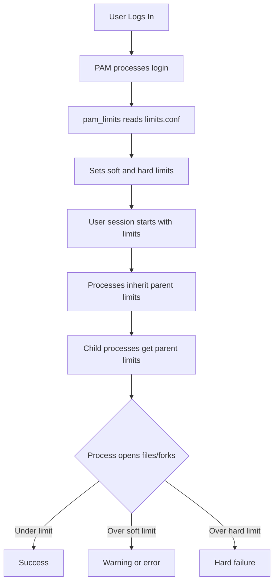

# How to Use Ansible to Configure User Resource Limits (ulimit)

Author: [nawazdhandala](https://www.github.com/nawazdhandala)

Tags: Ansible, Linux, Resource Limits, Performance Tuning

Description: Learn how to configure user resource limits (ulimit) with Ansible using limits.conf, systemd overrides, and PAM for production workloads.

---

Resource limits (ulimits) control how much of the system's resources a process or user can consume. If you have ever seen the "Too many open files" error on a busy server, you have hit a ulimit. Databases, web servers, and message brokers all need their limits tuned for production workloads. Ansible makes it easy to configure these limits consistently across your infrastructure.

## Understanding ulimit

Linux provides two types of limits for each resource:

- **Soft limit**: The current effective limit. Users can raise it up to the hard limit.
- **Hard limit**: The maximum value that the soft limit can be set to. Only root can raise hard limits.

Common resources controlled by ulimit:

| Resource | Flag | Description |
|----------|------|-------------|
| nofile | -n | Maximum open file descriptors |
| nproc | -u | Maximum user processes |
| memlock | -l | Maximum locked memory (KB) |
| stack | -s | Maximum stack size (KB) |
| core | -c | Maximum core file size |
| fsize | -f | Maximum file size |
| as | -v | Maximum virtual memory |

## Configuring Limits via limits.conf

The primary way to set persistent resource limits is through `/etc/security/limits.conf` or files in `/etc/security/limits.d/`:

```yaml
# set-ulimits.yml - Configure resource limits
- name: Configure user resource limits
  hosts: all
  become: yes
  tasks:
    - name: Set file descriptor limits for all users
      community.general.pam_limits:
        domain: '*'
        limit_type: soft
        limit_item: nofile
        value: 65536

    - name: Set hard file descriptor limit for all users
      community.general.pam_limits:
        domain: '*'
        limit_type: hard
        limit_item: nofile
        value: 131072

    - name: Set process limit for all users
      community.general.pam_limits:
        domain: '*'
        limit_type: soft
        limit_item: nproc
        value: 4096

    - name: Set hard process limit
      community.general.pam_limits:
        domain: '*'
        limit_type: hard
        limit_item: nproc
        value: 8192
```

## Using a Configuration File Approach

For more control, write the entire limits file:

```yaml
# limits-conf.yml - Deploy complete limits configuration
- name: Configure comprehensive resource limits
  hosts: all
  become: yes
  tasks:
    - name: Deploy custom limits configuration
      ansible.builtin.copy:
        dest: /etc/security/limits.d/90-custom.conf
        content: |
          # Global defaults
          *               soft    nofile          65536
          *               hard    nofile          131072
          *               soft    nproc           4096
          *               hard    nproc           8192
          *               soft    memlock         unlimited
          *               hard    memlock         unlimited

          # Database users need more file descriptors
          postgres        soft    nofile          131072
          postgres        hard    nofile          262144
          mysql           soft    nofile          131072
          mysql           hard    nofile          262144

          # Elasticsearch needs locked memory
          elasticsearch   soft    memlock         unlimited
          elasticsearch   hard    memlock         unlimited
          elasticsearch   soft    nofile          131072
          elasticsearch   hard    nofile          131072

          # Application group limits
          @appgroup       soft    nofile          131072
          @appgroup       hard    nofile          262144
          @appgroup       soft    nproc           16384
          @appgroup       hard    nproc           32768

          # Root gets unlimited
          root            soft    nofile          unlimited
          root            hard    nofile          unlimited
          root            soft    nproc           unlimited
          root            hard    nproc           unlimited
        mode: '0644'
```

## How Resource Limits Are Applied

Understanding when limits take effect is important:



## Per-Service Limits with systemd

Modern Linux distributions use systemd, which has its own limit configuration that overrides limits.conf for services:

```yaml
# systemd-limits.yml - Configure limits for systemd services
- name: Configure systemd service limits
  hosts: all
  become: yes
  tasks:
    # Create override directory for the service
    - name: Create systemd override directory for nginx
      ansible.builtin.file:
        path: /etc/systemd/system/nginx.service.d
        state: directory
        mode: '0755'

    # Set limits for the service
    - name: Configure nginx service limits
      ansible.builtin.copy:
        dest: /etc/systemd/system/nginx.service.d/limits.conf
        content: |
          [Service]
          LimitNOFILE=131072
          LimitNPROC=8192
          LimitMEMLOCK=infinity
        mode: '0644'
      notify: reload systemd

    # Same for PostgreSQL
    - name: Create systemd override for PostgreSQL
      ansible.builtin.file:
        path: /etc/systemd/system/postgresql.service.d
        state: directory
        mode: '0755'

    - name: Configure PostgreSQL service limits
      ansible.builtin.copy:
        dest: /etc/systemd/system/postgresql.service.d/limits.conf
        content: |
          [Service]
          LimitNOFILE=262144
          LimitNPROC=16384
          LimitMEMLOCK=infinity
        mode: '0644'
      notify: reload systemd

  handlers:
    - name: reload systemd
      ansible.builtin.systemd:
        daemon_reload: yes
```

## Configuring System-Wide Limits

Some limits are system-wide, not per-user. These are controlled through sysctl:

```yaml
# sysctl-limits.yml - System-wide limits via sysctl
- name: Configure system-wide resource limits
  hosts: all
  become: yes
  tasks:
    # Maximum number of file descriptors system-wide
    - name: Set system-wide max file descriptors
      ansible.posix.sysctl:
        name: fs.file-max
        value: '2097152'
        sysctl_set: yes
        state: present
        reload: yes

    # Maximum number of inotify watches
    - name: Set inotify max watches
      ansible.posix.sysctl:
        name: fs.inotify.max_user_watches
        value: '524288'
        sysctl_set: yes
        state: present
        reload: yes

    # Maximum number of inotify instances
    - name: Set inotify max instances
      ansible.posix.sysctl:
        name: fs.inotify.max_user_instances
        value: '8192'
        sysctl_set: yes
        state: present
        reload: yes

    # Maximum PID count
    - name: Set max PID
      ansible.posix.sysctl:
        name: kernel.pid_max
        value: '4194304'
        sysctl_set: yes
        state: present
        reload: yes
```

## Application-Specific Limit Profiles

Different applications need different limits. Here is a role-based approach:

```yaml
# app-limits.yml - Application-specific limit profiles
- name: Configure limits based on server role
  hosts: all
  become: yes
  vars:
    limit_profiles:
      webserver:
        nofile_soft: 65536
        nofile_hard: 131072
        nproc_soft: 4096
        nproc_hard: 8192
      database:
        nofile_soft: 131072
        nofile_hard: 262144
        nproc_soft: 16384
        nproc_hard: 32768
        memlock: unlimited
      elasticsearch:
        nofile_soft: 131072
        nofile_hard: 131072
        nproc_soft: 4096
        nproc_hard: 4096
        memlock: unlimited
  tasks:
    - name: Deploy webserver limits
      ansible.builtin.copy:
        dest: /etc/security/limits.d/90-webserver.conf
        content: |
          www-data        soft    nofile    {{ limit_profiles.webserver.nofile_soft }}
          www-data        hard    nofile    {{ limit_profiles.webserver.nofile_hard }}
          www-data        soft    nproc     {{ limit_profiles.webserver.nproc_soft }}
          www-data        hard    nproc     {{ limit_profiles.webserver.nproc_hard }}
          nginx           soft    nofile    {{ limit_profiles.webserver.nofile_soft }}
          nginx           hard    nofile    {{ limit_profiles.webserver.nofile_hard }}
        mode: '0644'
      when: "'webservers' in group_names"

    - name: Deploy database limits
      ansible.builtin.copy:
        dest: /etc/security/limits.d/90-database.conf
        content: |
          postgres        soft    nofile    {{ limit_profiles.database.nofile_soft }}
          postgres        hard    nofile    {{ limit_profiles.database.nofile_hard }}
          postgres        soft    nproc     {{ limit_profiles.database.nproc_soft }}
          postgres        hard    nproc     {{ limit_profiles.database.nproc_hard }}
          postgres        soft    memlock   {{ limit_profiles.database.memlock }}
          postgres        hard    memlock   {{ limit_profiles.database.memlock }}
        mode: '0644'
      when: "'dbservers' in group_names"
```

## Verifying Limits

After setting limits, verify they are applied correctly:

```yaml
# verify-limits.yml - Verify resource limits
- name: Verify resource limits
  hosts: all
  become: yes
  tasks:
    # Check limits.conf is loaded
    - name: Check current limits for a user
      ansible.builtin.shell: "su - deploy -c 'ulimit -n'"
      register: nofile_limit
      changed_when: false

    - name: Display file descriptor limit
      ansible.builtin.debug:
        msg: "{{ inventory_hostname }} - nofile limit for deploy: {{ nofile_limit.stdout }}"

    # Check system-wide limit
    - name: Check system-wide file-max
      ansible.builtin.command: "cat /proc/sys/fs/file-max"
      register: file_max
      changed_when: false

    - name: Display system file-max
      ansible.builtin.debug:
        msg: "{{ inventory_hostname }} - system file-max: {{ file_max.stdout }}"

    # Check current file descriptor usage
    - name: Check current fd usage
      ansible.builtin.shell: "cat /proc/sys/fs/file-nr"
      register: fd_usage
      changed_when: false

    - name: Display fd usage
      ansible.builtin.debug:
        msg: "{{ inventory_hostname }} - fd usage: {{ fd_usage.stdout }} (allocated/free/max)"
```

## Ensuring PAM Loads limits.conf

For limits.conf to work, PAM must be configured to use `pam_limits`:

```yaml
# ensure-pam-limits.yml - Ensure pam_limits is active
- name: Ensure pam_limits is enabled
  hosts: all
  become: yes
  tasks:
    - name: Ensure pam_limits is in common-session (Debian)
      ansible.builtin.lineinfile:
        path: /etc/pam.d/common-session
        line: "session    required    pam_limits.so"
        state: present
      when: ansible_os_family == "Debian"

    - name: Ensure pam_limits is in common-session-noninteractive (Debian)
      ansible.builtin.lineinfile:
        path: /etc/pam.d/common-session-noninteractive
        line: "session    required    pam_limits.so"
        state: present
      when: ansible_os_family == "Debian"
```

## Best Practices

1. **Use `/etc/security/limits.d/` files** instead of editing `/etc/security/limits.conf` directly. Drop-in files are easier to manage and less likely to conflict with package updates.

2. **Set both soft and hard limits**. The soft limit is what the user gets by default. The hard limit is the ceiling.

3. **Use systemd overrides for services**. Limits in limits.conf only apply to PAM sessions. Systemd services need their own configuration.

4. **Do not forget sysctl**. Per-user limits cannot exceed system-wide limits. If `fs.file-max` is 65536, no user can have more than 65536 file descriptors regardless of their ulimit setting.

5. **Verify after deploying**. Always check that limits are actually applied. A missing PAM module or a systemd override can silently ignore your configuration.

6. **Start conservative, increase as needed**. Setting everything to unlimited is lazy and dangerous. Set limits based on actual requirements.

Resource limits are a critical part of production server configuration. Get them wrong and you get "Too many open files" errors at 3 AM. Get them right with Ansible and you have one less thing to worry about.
