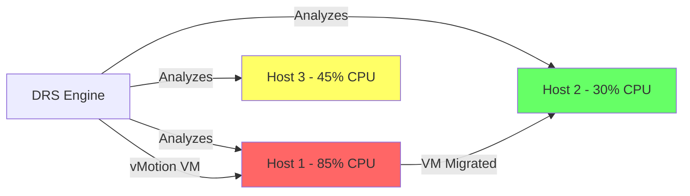

# How to Use Ansible to Configure VMware DRS

Author: [nawazdhandala](https://www.github.com/nawazdhandala)

Tags: Ansible, VMware, DRS, vSphere, Automation

Description: Automate VMware Distributed Resource Scheduler configuration using Ansible playbooks for optimal cluster resource balancing.

---

VMware Distributed Resource Scheduler (DRS) is the feature that keeps your cluster workloads balanced across hosts. When configured properly, it ensures no single ESXi host is overloaded while others sit idle. Manually tuning DRS across multiple clusters is tedious and error-prone, which is exactly why Ansible is such a good fit for this task.

In this guide, I will show you how to configure DRS settings, affinity rules, and VM-host groups using Ansible playbooks that you can version control and reuse.

## Prerequisites

You need the following before starting:

- Ansible 2.10+ on your control node
- The `community.vmware` collection
- vCenter Server access with administrator privileges
- Python libraries `pyvmomi` and `requests`

Install dependencies if you have not already.

```bash
# Install the VMware collection and Python packages
ansible-galaxy collection install community.vmware
pip install pyvmomi requests
```

## How DRS Works

DRS monitors resource usage across all hosts in a cluster and makes recommendations (or automatic migrations) to balance the load. It uses vMotion to live-migrate VMs between hosts without downtime.



## Basic DRS Configuration

The `community.vmware.vmware_cluster_drs` module handles the core DRS settings. Here is a playbook that enables DRS with fully automated mode.

```yaml
# playbooks/configure-drs.yml
---
- name: Configure VMware DRS on production cluster
  hosts: localhost
  gather_facts: false
  vars_files:
    - ../vars/vcenter_creds.yml

  vars:
    vcenter_hostname: vcenter.lab.local
    vcenter_datacenter: "DC-Production"
    vcenter_cluster: "Cluster-Prod-01"

  tasks:
    # Enable DRS with fully automated mode
    - name: Enable and configure DRS
      community.vmware.vmware_cluster_drs:
        hostname: "{{ vcenter_hostname }}"
        username: "{{ vcenter_username }}"
        password: "{{ vcenter_password }}"
        datacenter_name: "{{ vcenter_datacenter }}"
        cluster_name: "{{ vcenter_cluster }}"
        validate_certs: false
        enable: true
        drs_default_vm_behavior: fullyAutomated
        drs_vmotion_rate: 3
      register: drs_result

    - name: Display DRS configuration result
      ansible.builtin.debug:
        var: drs_result
```

The `drs_vmotion_rate` controls how aggressively DRS moves VMs. The scale goes from 1 (most conservative) to 5 (most aggressive). I usually keep it at 3 for production and bump it to 4 for non-production environments.

## DRS Automation Levels Explained

DRS supports three automation levels, and picking the right one matters.

```yaml
# playbooks/drs-automation-levels.yml
---
- name: Configure DRS automation level
  hosts: localhost
  gather_facts: false
  vars_files:
    - ../vars/vcenter_creds.yml

  tasks:
    # Manual mode - DRS only provides recommendations
    - name: Set DRS to manual mode for sensitive clusters
      community.vmware.vmware_cluster_drs:
        hostname: "{{ vcenter_hostname }}"
        username: "{{ vcenter_username }}"
        password: "{{ vcenter_password }}"
        datacenter_name: "{{ vcenter_datacenter }}"
        cluster_name: "Cluster-FinServ"
        validate_certs: false
        enable: true
        # Options: fullyAutomated, partiallyAutomated, manual
        drs_default_vm_behavior: manual
        drs_vmotion_rate: 2
```

- **fullyAutomated**: DRS places VMs on initial power-on and migrates them automatically. Best for general workloads.
- **partiallyAutomated**: DRS places VMs automatically at power-on but only recommends migrations. Good for clusters with latency-sensitive workloads.
- **manual**: DRS only makes recommendations. You approve each migration. Use this for financial or compliance-heavy environments.

## Configuring DRS VM-Host Affinity Rules

Affinity and anti-affinity rules let you control which hosts a VM can run on. This is useful for licensing (keeping SQL Server VMs on licensed hosts) or for keeping redundant VMs on separate hosts.

```yaml
# playbooks/drs-affinity-rules.yml
---
- name: Configure DRS affinity and anti-affinity rules
  hosts: localhost
  gather_facts: false
  vars_files:
    - ../vars/vcenter_creds.yml

  tasks:
    # Create a VM group for database servers
    - name: Create VM group for database servers
      community.vmware.vmware_drs_group:
        hostname: "{{ vcenter_hostname }}"
        username: "{{ vcenter_username }}"
        password: "{{ vcenter_password }}"
        datacenter_name: "{{ vcenter_datacenter }}"
        cluster_name: "{{ vcenter_cluster }}"
        validate_certs: false
        group_name: "db-servers"
        vms:
          - sql-prod-01
          - sql-prod-02
          - sql-prod-03
        state: present

    # Create a host group for licensed ESXi hosts
    - name: Create host group for SQL-licensed hosts
      community.vmware.vmware_drs_group:
        hostname: "{{ vcenter_hostname }}"
        username: "{{ vcenter_username }}"
        password: "{{ vcenter_password }}"
        datacenter_name: "{{ vcenter_datacenter }}"
        cluster_name: "{{ vcenter_cluster }}"
        validate_certs: false
        group_name: "sql-licensed-hosts"
        hosts:
          - esxi-01.lab.local
          - esxi-02.lab.local
        state: present

    # Create a rule that keeps DB VMs on licensed hosts
    - name: Create VM-Host affinity rule
      community.vmware.vmware_drs_rule:
        hostname: "{{ vcenter_hostname }}"
        username: "{{ vcenter_username }}"
        password: "{{ vcenter_password }}"
        datacenter_name: "{{ vcenter_datacenter }}"
        cluster_name: "{{ vcenter_cluster }}"
        validate_certs: false
        drs_rule_name: "keep-db-on-licensed-hosts"
        enabled: true
        mandatory: true
        affinity_rule: true
        vm_group_name: "db-servers"
        host_group_name: "sql-licensed-hosts"
```

## VM-to-VM Anti-Affinity Rules

To keep redundant VMs on separate hosts (so a single host failure does not take out both), use VM-to-VM anti-affinity rules.

```yaml
# playbooks/drs-anti-affinity.yml
---
- name: Configure VM-to-VM anti-affinity
  hosts: localhost
  gather_facts: false
  vars_files:
    - ../vars/vcenter_creds.yml

  tasks:
    # Keep domain controllers on separate hosts
    - name: Create anti-affinity rule for domain controllers
      community.vmware.vmware_drs_rule:
        hostname: "{{ vcenter_hostname }}"
        username: "{{ vcenter_username }}"
        password: "{{ vcenter_password }}"
        datacenter_name: "{{ vcenter_datacenter }}"
        cluster_name: "{{ vcenter_cluster }}"
        validate_certs: false
        drs_rule_name: "separate-domain-controllers"
        enabled: true
        mandatory: true
        affinity_rule: false
        vms:
          - dc01
          - dc02
```

## Per-VM DRS Overrides

Some VMs need different DRS behavior than the cluster default. For example, a latency-sensitive trading application might need to stay put even when the cluster default is fully automated.

```yaml
# playbooks/drs-vm-overrides.yml
---
- name: Set per-VM DRS overrides
  hosts: localhost
  gather_facts: false
  vars_files:
    - ../vars/vcenter_creds.yml

  vars:
    # VMs that should not be auto-migrated
    pinned_vms:
      - name: trading-engine-01
        behavior: manual
      - name: trading-engine-02
        behavior: manual
      - name: gpu-ml-worker-01
        behavior: partiallyAutomated

  tasks:
    # Override DRS automation for specific VMs
    - name: Set DRS override for latency-sensitive VMs
      community.vmware.vmware_vm_vm_drs_rule:
        hostname: "{{ vcenter_hostname }}"
        username: "{{ vcenter_username }}"
        password: "{{ vcenter_password }}"
        validate_certs: false
        cluster_name: "{{ vcenter_cluster }}"
        vms: "{{ item.name }}"
        drs_behavior: "{{ item.behavior }}"
        enabled: true
      loop: "{{ pinned_vms }}"
      loop_control:
        label: "{{ item.name }}"
```

## Building a Reusable DRS Role

When you manage multiple clusters with different DRS requirements, a role keeps things clean.

```yaml
# roles/vmware_drs/defaults/main.yml
---
drs_enabled: true
drs_automation_level: fullyAutomated
drs_migration_threshold: 3
drs_affinity_rules: []
drs_anti_affinity_rules: []
drs_vm_overrides: []
```

```yaml
# roles/vmware_drs/tasks/main.yml
---
- name: Configure DRS on cluster
  community.vmware.vmware_cluster_drs:
    hostname: "{{ vcenter_hostname }}"
    username: "{{ vcenter_username }}"
    password: "{{ vcenter_password }}"
    datacenter_name: "{{ vcenter_datacenter }}"
    cluster_name: "{{ drs_cluster_name }}"
    validate_certs: "{{ validate_certs | default(false) }}"
    enable: "{{ drs_enabled }}"
    drs_default_vm_behavior: "{{ drs_automation_level }}"
    drs_vmotion_rate: "{{ drs_migration_threshold }}"

- name: Create anti-affinity rules
  community.vmware.vmware_drs_rule:
    hostname: "{{ vcenter_hostname }}"
    username: "{{ vcenter_username }}"
    password: "{{ vcenter_password }}"
    datacenter_name: "{{ vcenter_datacenter }}"
    cluster_name: "{{ drs_cluster_name }}"
    validate_certs: "{{ validate_certs | default(false) }}"
    drs_rule_name: "{{ item.name }}"
    enabled: true
    mandatory: "{{ item.mandatory | default(false) }}"
    affinity_rule: false
    vms: "{{ item.vms }}"
  loop: "{{ drs_anti_affinity_rules }}"
  when: drs_anti_affinity_rules | length > 0
```

## Verifying DRS Configuration

Always verify after applying changes. This playbook checks that DRS is enabled and reports the current settings.

```yaml
# playbooks/verify-drs.yml
---
- name: Verify DRS configuration
  hosts: localhost
  gather_facts: false
  vars_files:
    - ../vars/vcenter_creds.yml

  tasks:
    - name: Get cluster information
      community.vmware.vmware_cluster_info:
        hostname: "{{ vcenter_hostname }}"
        username: "{{ vcenter_username }}"
        password: "{{ vcenter_password }}"
        datacenter: "{{ vcenter_datacenter }}"
        cluster_name: "{{ vcenter_cluster }}"
        validate_certs: false
      register: cluster_info

    - name: Assert DRS is enabled
      ansible.builtin.assert:
        that:
          - cluster_info.clusters[vcenter_cluster].drs_enabled is true
        fail_msg: "DRS is not enabled on {{ vcenter_cluster }}"
        success_msg: "DRS verified on {{ vcenter_cluster }}"
```

## Practical Tips

After configuring DRS on many production clusters, here are a few things worth keeping in mind:

1. **Start with partially automated** on new clusters. Watch the recommendations for a week before switching to fully automated. This gives you a feel for how DRS wants to move things around.
2. **Mandatory anti-affinity rules can block HA failover.** If you have three VMs in an anti-affinity group and only two hosts, the third VM cannot power on. Use "should" rules instead of "must" rules when possible.
3. **DRS and resource pools interact.** If you have resource pool limits set, DRS will respect those limits when making placement decisions.
4. **Monitor DRS events in vCenter.** If you see excessive vMotion activity, lower the migration threshold.

DRS is one of those features that, once properly configured through Ansible, mostly takes care of itself. The key is getting the initial configuration right and having rules that match your actual workload requirements.
