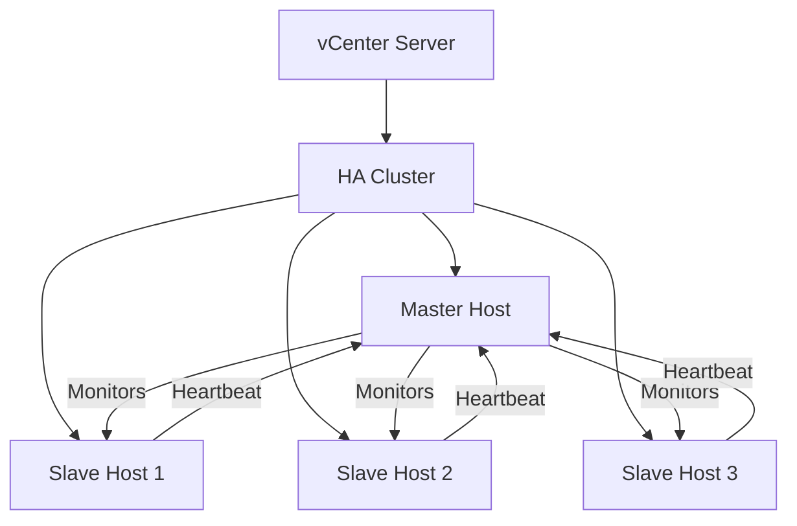

# How to Use Ansible to Configure VMware HA

Author: [nawazdhandala](https://www.github.com/nawazdhandala)

Tags: Ansible, VMware, High Availability, vSphere, Automation

Description: Learn how to configure VMware High Availability clusters using Ansible playbooks for automated failover and uptime guarantees.

---

VMware High Availability (HA) is one of those features that every production vSphere environment needs, but configuring it by hand across dozens of clusters gets old fast. I have been managing VMware environments for years, and the moment I started using Ansible to handle HA configuration, my deployment consistency improved dramatically.

In this post, I will walk through how to automate VMware HA configuration using Ansible, from the prerequisites all the way to admission control policies and advanced settings.

## Prerequisites

Before you start, you need a few things in place:

- Ansible 2.10 or newer installed on your control node
- The `community.vmware` collection installed
- A vCenter Server with admin-level credentials
- Python packages `pyvmomi` and `requests` installed
- At least one ESXi cluster with two or more hosts

Install the required collection and Python dependencies first.

```bash
# Install the VMware community collection
ansible-galaxy collection install community.vmware

# Install required Python libraries
pip install pyvmomi requests
```

## Understanding VMware HA Architecture

VMware HA works at the cluster level. When you enable HA on a cluster, vCenter elects a master host that monitors all other hosts in the cluster. If a host fails, the master host restarts the affected VMs on surviving hosts.



## Setting Up Your Inventory

Your inventory file should reference the vCenter server, not individual ESXi hosts. HA is a cluster-level setting, so you work through vCenter.

```yaml
# inventory/vmware.yml
all:
  hosts:
    vcenter:
      ansible_host: vcenter.lab.local
      ansible_user: administrator@vsphere.local
      ansible_password: "{{ vault_vcenter_password }}"
  vars:
    vcenter_hostname: vcenter.lab.local
    vcenter_username: administrator@vsphere.local
    vcenter_password: "{{ vault_vcenter_password }}"
    vcenter_datacenter: "DC-Production"
    vcenter_cluster: "Cluster-Prod-01"
    validate_certs: false
```

## Enabling VMware HA on a Cluster

The `community.vmware.vmware_cluster_ha` module gives you direct control over HA settings. Here is a playbook that enables HA with sensible production defaults.

```yaml
# playbooks/configure-vmware-ha.yml
---
- name: Configure VMware HA on production cluster
  hosts: localhost
  gather_facts: false
  vars_files:
    - ../vars/vcenter_creds.yml

  tasks:
    # Enable HA with host monitoring and admission control
    - name: Enable VMware HA on cluster
      community.vmware.vmware_cluster_ha:
        hostname: "{{ vcenter_hostname }}"
        username: "{{ vcenter_username }}"
        password: "{{ vcenter_password }}"
        datacenter_name: "{{ vcenter_datacenter }}"
        cluster_name: "{{ vcenter_cluster }}"
        validate_certs: "{{ validate_certs }}"
        enable: true
        ha_host_monitoring: enabled
        ha_vm_monitoring: vmMonitoringOnly
        ha_vm_min_up_time: 120
        ha_vm_max_failures: 3
        ha_vm_max_failure_window: 24
        ha_restart_priority: medium
        ha_vm_failure_interval: 30
        ha_vm_monitoring_sensitivity: 2
      register: ha_result

    - name: Show HA configuration result
      ansible.builtin.debug:
        var: ha_result
```

## Configuring Admission Control

Admission control prevents you from powering on VMs if the cluster does not have enough resources to guarantee failover. This is a critical production setting that many people skip, only to find out during an actual failure that they over-committed.

```yaml
# playbooks/configure-admission-control.yml
---
- name: Configure HA admission control
  hosts: localhost
  gather_facts: false
  vars_files:
    - ../vars/vcenter_creds.yml

  tasks:
    # Set admission control to reserve resources for one host failure
    - name: Configure admission control policy
      community.vmware.vmware_cluster_ha:
        hostname: "{{ vcenter_hostname }}"
        username: "{{ vcenter_username }}"
        password: "{{ vcenter_password }}"
        datacenter_name: "{{ vcenter_datacenter }}"
        cluster_name: "{{ vcenter_cluster }}"
        validate_certs: "{{ validate_certs }}"
        enable: true
        ha_admission_control: true
        ha_failover_level: 1
        reservation_based_admission_control:
          auto_compute_percentages: true
          failover_level: 1
      register: admission_result

    - name: Print admission control status
      ansible.builtin.debug:
        msg: "Admission control configured: {{ admission_result.changed }}"
```

## Setting VM Restart Priority by Group

Not all VMs are equal. Your domain controllers and database servers should come back before your dev environments. Ansible lets you set per-VM restart priorities.

```yaml
# playbooks/set-vm-restart-priority.yml
---
- name: Set VM restart priorities for HA
  hosts: localhost
  gather_facts: false
  vars_files:
    - ../vars/vcenter_creds.yml

  vars:
    # Define VM groups with their restart priorities
    critical_vms:
      - name: dc01
        priority: high
      - name: dc02
        priority: high
      - name: sql-prod-01
        priority: high
    standard_vms:
      - name: app-server-01
        priority: medium
      - name: app-server-02
        priority: medium
    low_priority_vms:
      - name: dev-vm-01
        priority: low
      - name: monitoring-01
        priority: low

  tasks:
    # Configure restart priority for each critical VM
    - name: Set HA restart priority for critical VMs
      community.vmware.vmware_vm_ha:
        hostname: "{{ vcenter_hostname }}"
        username: "{{ vcenter_username }}"
        password: "{{ vcenter_password }}"
        validate_certs: "{{ validate_certs }}"
        vm_name: "{{ item.name }}"
        ha_restart_priority: "{{ item.priority }}"
      loop: "{{ critical_vms + standard_vms + low_priority_vms }}"
      loop_control:
        label: "{{ item.name }} -> {{ item.priority }}"
```

## Configuring Heartbeat Datastores

HA uses datastore heartbeating as a secondary mechanism to determine if a host is really down or just network-isolated. You should explicitly specify which datastores to use for heartbeating rather than letting vCenter pick automatically.

```yaml
# playbooks/configure-heartbeat-datastores.yml
---
- name: Configure HA heartbeat datastores
  hosts: localhost
  gather_facts: false
  vars_files:
    - ../vars/vcenter_creds.yml

  tasks:
    # Set specific datastores for HA heartbeating
    - name: Configure heartbeat datastore policy
      community.vmware.vmware_cluster_ha:
        hostname: "{{ vcenter_hostname }}"
        username: "{{ vcenter_username }}"
        password: "{{ vcenter_password }}"
        datacenter_name: "{{ vcenter_datacenter }}"
        cluster_name: "{{ vcenter_cluster }}"
        validate_certs: "{{ validate_certs }}"
        enable: true
        ha_datastore_heartbeating: allFeasibleDsWithUserPreference
        ha_heartbeat_datastore:
          - ds-shared-01
          - ds-shared-02
```

## Advanced HA Settings

Sometimes you need to tweak settings that are not exposed through the standard module parameters. You can use the `vmware_cluster_ha` module's `advanced_settings` parameter or fall back to the REST API.

```yaml
# playbooks/advanced-ha-settings.yml
---
- name: Configure advanced HA settings
  hosts: localhost
  gather_facts: false
  vars_files:
    - ../vars/vcenter_creds.yml

  tasks:
    # Apply advanced HA configuration options
    - name: Set advanced HA parameters
      community.vmware.vmware_cluster_ha:
        hostname: "{{ vcenter_hostname }}"
        username: "{{ vcenter_username }}"
        password: "{{ vcenter_password }}"
        datacenter_name: "{{ vcenter_datacenter }}"
        cluster_name: "{{ vcenter_cluster }}"
        validate_certs: "{{ validate_certs }}"
        enable: true
        advanced_settings:
          # Isolation response when host loses network
          das.isolationResponse: "powerOff"
          # Time to wait before declaring host isolated
          das.isolationShutdownTimeout: "300"
          # Use specific isolation addresses
          das.useDefaultIsolationAddress: "false"
          das.isolationAddress0: "10.0.0.1"
          das.isolationAddress1: "10.0.1.1"
```

## Putting It All Together with a Role

For production use, wrap everything in a reusable role that you can apply across multiple clusters.

```yaml
# roles/vmware_ha/tasks/main.yml
---
- name: Enable and configure HA
  community.vmware.vmware_cluster_ha:
    hostname: "{{ vcenter_hostname }}"
    username: "{{ vcenter_username }}"
    password: "{{ vcenter_password }}"
    datacenter_name: "{{ ha_datacenter }}"
    cluster_name: "{{ ha_cluster_name }}"
    validate_certs: "{{ validate_certs }}"
    enable: true
    ha_host_monitoring: enabled
    ha_vm_monitoring: vmAndAppMonitoring
    ha_admission_control: true
    ha_failover_level: "{{ ha_failover_hosts | default(1) }}"
    ha_restart_priority: "{{ ha_default_restart_priority | default('medium') }}"
    advanced_settings: "{{ ha_advanced_settings | default({}) }}"
  register: ha_config

- name: Verify HA configuration
  ansible.builtin.assert:
    that:
      - ha_config is not failed
    fail_msg: "HA configuration failed on {{ ha_cluster_name }}"
    success_msg: "HA configured successfully on {{ ha_cluster_name }}"
```

## Testing Your HA Configuration

After deploying, you should validate that HA is actually working. This playbook gathers cluster info and checks HA status.

```yaml
# playbooks/verify-ha.yml
---
- name: Verify HA is properly configured
  hosts: localhost
  gather_facts: false
  vars_files:
    - ../vars/vcenter_creds.yml

  tasks:
    # Pull cluster info and verify HA is active
    - name: Gather cluster info
      community.vmware.vmware_cluster_info:
        hostname: "{{ vcenter_hostname }}"
        username: "{{ vcenter_username }}"
        password: "{{ vcenter_password }}"
        datacenter: "{{ vcenter_datacenter }}"
        cluster_name: "{{ vcenter_cluster }}"
        validate_certs: "{{ validate_certs }}"
      register: cluster_info

    - name: Verify HA is enabled
      ansible.builtin.assert:
        that:
          - cluster_info.clusters[vcenter_cluster].ha_enabled is true
        fail_msg: "HA is NOT enabled on {{ vcenter_cluster }}"
        success_msg: "HA is enabled and running on {{ vcenter_cluster }}"
```

## Common Pitfalls

A few things I have learned the hard way when automating VMware HA:

1. **Network partition issues**: If your management network is unreliable, HA will declare false positives. Always configure multiple isolation addresses.
2. **Admission control too aggressive**: Setting failover level to 2 on a 3-host cluster means you can only use one-third of your capacity. Balance availability against cost.
3. **Forgetting to set VM restart order**: Without explicit priorities, your database servers might come up after the application servers that depend on them.
4. **Not testing failover**: Automated configuration is great, but simulate a host failure at least once to verify VMs actually restart where you expect them to.

## Wrapping Up

Automating VMware HA with Ansible removes the human error from one of the most critical parts of your virtualization infrastructure. Once you have the playbooks in place, every new cluster gets the exact same HA configuration, and you can audit the settings by just reading the YAML files. That consistency alone makes the investment worthwhile, especially when you are managing more than a handful of clusters across different datacenters.
