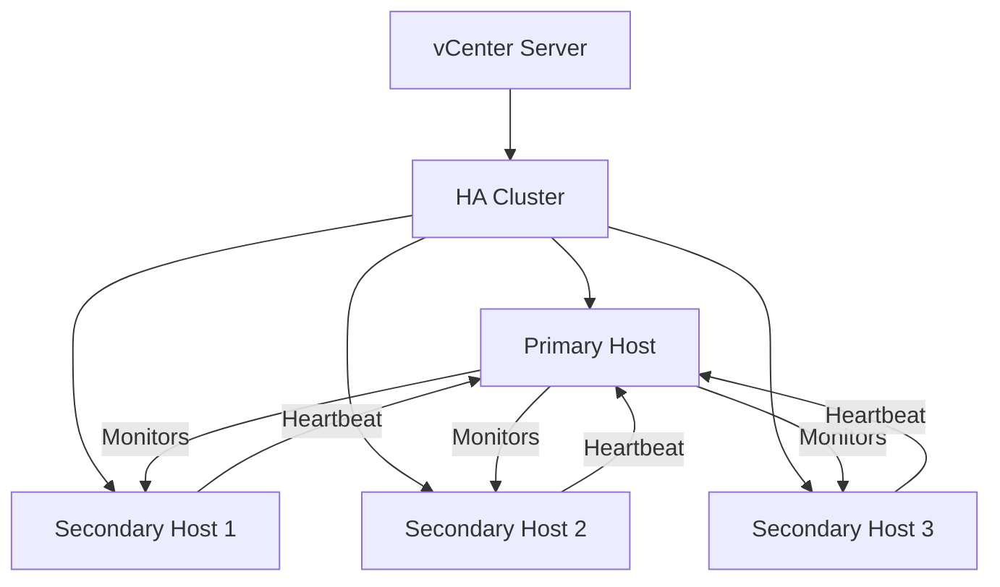

# How to Use Ansible to Configure VMware HA

Author: [nawazdhandala](https://www.github.com/nawazdhandala)

Tags: Ansible, VMware, High Availability, vSphere, Automation

Description: Learn how to configure VMware High Availability clusters using Ansible playbooks for automated failover and uptime guarantees.

---

VMware High Availability (HA) is one of those features that every production vSphere environment needs, but configuring it by hand across dozens of clusters gets old fast. I have been managing VMware environments for years, and the moment I started using Ansible to handle HA configuration, my deployment consistency improved dramatically.

In this post, I will walk through how to automate VMware HA configuration using Ansible, from the prerequisites all the way to admission control policies and advanced settings.

## Prerequisites

Before you start, you need a few things in place:

- ansible-core 2.19 or newer installed on your control node
- The `vmware.vmware` collection installed
- The `community.vmware` collection installed if you want to run the datastore verification example
- A vCenter Server with admin-level credentials
- Python packages `pyvmomi` and `requests` installed
- At least one ESXi cluster with two or more hosts

Install the required collections and Python dependencies first.

```bash
# Install the VMware collection

ansible-galaxy collection install vmware.vmware
ansible-galaxy collection install community.vmware

# Install required Python libraries
pip install pyvmomi requests
```

## Understanding VMware HA Architecture

VMware HA works at the cluster level. When you enable HA on a cluster, vSphere HA elects a primary host that monitors the other hosts in the cluster. If a host fails, HA restarts the affected VMs on surviving hosts.


```mermaid
graph TD
    A[vCenter Server] --> B[HA Cluster]
    B --> C[Primary Host]
    B --> D[Secondary Host 1]
    B --> E[Secondary Host 2]
    B --> F[Secondary Host 3]
    C -->|Monitors| D
    C -->|Monitors| E
    C -->|Monitors| F
    D -->|Heartbeat| C
    E -->|Heartbeat| C
    F -->|Heartbeat| C
```

## Setting Up Your Inventory

Your inventory file should reference the vCenter server, not individual ESXi hosts. HA is a cluster-level setting, so you work through vCenter.

```yaml
# inventory/vmware.yml
all:
  hosts:
    vcenter:
      ansible_host: vcenter.lab.local
      ansible_user: administrator@vsphere.local
      ansible_password: "{{ vault_vcenter_password }}"
  vars:
    vcenter_hostname: vcenter.lab.local
    vcenter_username: administrator@vsphere.local
    vcenter_password: "{{ vault_vcenter_password }}"
    vcenter_datacenter: "DC-Production"
    vcenter_cluster: "Cluster-Prod-01"
    validate_certs: false
```

## Enabling VMware HA on a Cluster

The `vmware.vmware.cluster_ha` module gives you direct control over HA settings. Here is a playbook that enables HA with sensible production defaults.

```yaml
# playbooks/configure-vmware-ha.yml
---
- name: Configure VMware HA on production cluster
  hosts: localhost
  gather_facts: false
  vars_files:
    - ../vars/vcenter_creds.yml

  tasks:
    # Enable HA with host monitoring and admission control
    - name: Enable VMware HA on cluster
      vmware.vmware.cluster_ha:
        hostname: "{{ vcenter_hostname }}"
        username: "{{ vcenter_username }}"
        password: "{{ vcenter_password }}"
        datacenter_name: "{{ vcenter_datacenter }}"
        cluster_name: "{{ vcenter_cluster }}"
        validate_certs: "{{ validate_certs }}"
        enable: true
        host_failure_response:
          restart_vms: true
          default_vm_restart_priority: medium
        vm_monitoring:
          mode: vmMonitoringOnly
          minimum_uptime: 120
          maximum_resets: 3
          maximum_resets_window: 86400
          failure_interval: 30
      register: ha_result

    - name: Show HA configuration result
      ansible.builtin.debug:
        var: ha_result
```

## Configuring Admission Control

Admission control prevents you from powering on VMs if the cluster does not have enough resources to guarantee failover. This is a critical production setting that many people skip, only to find out during an actual failure that they over-committed.

```yaml
# playbooks/configure-admission-control.yml
---
- name: Configure HA admission control
  hosts: localhost
  gather_facts: false
  vars_files:
    - ../vars/vcenter_creds.yml

  tasks:
    # Set admission control to reserve resources for one host failure
    - name: Configure admission control policy
      vmware.vmware.cluster_ha:
        hostname: "{{ vcenter_hostname }}"
        username: "{{ vcenter_username }}"
        password: "{{ vcenter_password }}"
        datacenter_name: "{{ vcenter_datacenter }}"
        cluster_name: "{{ vcenter_cluster }}"
        validate_certs: "{{ validate_certs }}"
        enable: true
        admission_control_policy: cluster_resource
        admission_control_failover_level: 1
      register: admission_result

    - name: Print admission control status
      ansible.builtin.debug:
        msg: "Admission control configured: {{ admission_result.changed }}"
```

## Setting VM Restart Priority by Group

Not all VMs are equal. Your domain controllers and database servers should have a higher restart priority than your dev environments. The current `vmware.vmware.cluster_ha` module lets you set the cluster's default VM restart priority; per-VM HA overrides still need to be managed through vCenter, PowerCLI, or the vSphere API.

```yaml
# playbooks/set-vm-restart-priority.yml
---
- name: Set VM restart priorities for HA
  hosts: localhost
  gather_facts: false
  vars_files:
    - ../vars/vcenter_creds.yml

  vars:
    default_restart_priority: high

  tasks:
    # Configure the cluster default restart priority
    - name: Set default HA restart priority
      vmware.vmware.cluster_ha:
        hostname: "{{ vcenter_hostname }}"
        username: "{{ vcenter_username }}"
        password: "{{ vcenter_password }}"
        datacenter_name: "{{ vcenter_datacenter }}"
        cluster_name: "{{ vcenter_cluster }}"
        validate_certs: "{{ validate_certs }}"
        enable: true
        host_failure_response:
          restart_vms: true
          default_vm_restart_priority: "{{ default_restart_priority }}"
```

## Configuring Heartbeat Datastores

HA uses datastore heartbeating as a secondary mechanism to determine if a host is really down or just network-isolated. The current Ansible HA module does not expose heartbeat datastore selection, so configure the heartbeat datastore policy in vCenter, PowerCLI, or the vSphere API, and use Ansible to verify that the shared datastores you plan to select are visible to the cluster.

```yaml
# playbooks/verify-heartbeat-datastores.yml
---
- name: Verify candidate HA heartbeat datastores
  hosts: localhost
  gather_facts: false
  vars_files:
    - ../vars/vcenter_creds.yml

  vars:
    heartbeat_datastores:
      - ds-shared-01
      - ds-shared-02

  tasks:
    # Confirm the datastores exist before selecting them for HA heartbeating
    - name: Gather datastore info for the cluster
      community.vmware.vmware_datastore_info:
        hostname: "{{ vcenter_hostname }}"
        username: "{{ vcenter_username }}"
        password: "{{ vcenter_password }}"
        datacenter_name: "{{ vcenter_datacenter }}"
        cluster: "{{ vcenter_cluster }}"
        validate_certs: "{{ validate_certs }}"
      register: datastore_info

    - name: Verify candidate datastores exist
      ansible.builtin.assert:
        that:
          - item in datastore_info.datastores | map(attribute='name') | list
        fail_msg: "Candidate heartbeat datastore {{ item }} was not found"
      loop: "{{ heartbeat_datastores }}"
```

## Advanced HA Settings

Sometimes you need to tweak settings that are not exposed through the standard module parameters. You can use the `cluster_ha` module's `advanced_settings` parameter or fall back to the vSphere API.

```yaml
# playbooks/advanced-ha-settings.yml
---
- name: Configure advanced HA settings
  hosts: localhost
  gather_facts: false
  vars_files:
    - ../vars/vcenter_creds.yml

  tasks:
    # Apply advanced HA configuration options
    - name: Set advanced HA parameters
      vmware.vmware.cluster_ha:
        hostname: "{{ vcenter_hostname }}"
        username: "{{ vcenter_username }}"
        password: "{{ vcenter_password }}"
        datacenter_name: "{{ vcenter_datacenter }}"
        cluster_name: "{{ vcenter_cluster }}"
        validate_certs: "{{ validate_certs }}"
        enable: true
        host_isolation_response: powerOff
        advanced_settings:
          # Use specific isolation addresses
          das.useDefaultIsolationAddress: "false"
          das.isolationAddress0: "10.0.0.1"
          das.isolationAddress1: "10.0.1.1"
```

## Putting It All Together with a Role

For production use, wrap everything in a reusable role that you can apply across multiple clusters.

```yaml
# roles/vmware_ha/tasks/main.yml
---
- name: Enable and configure HA
  vmware.vmware.cluster_ha:
    hostname: "{{ vcenter_hostname }}"
    username: "{{ vcenter_username }}"
    password: "{{ vcenter_password }}"
    datacenter_name: "{{ ha_datacenter }}"
    cluster_name: "{{ ha_cluster_name }}"
    validate_certs: "{{ validate_certs }}"
    enable: true
    host_failure_response:
      restart_vms: true
      default_vm_restart_priority: "{{ ha_default_restart_priority | default('medium') }}"
    vm_monitoring:
      mode: vmAndAppMonitoring
    admission_control_policy: cluster_resource
    admission_control_failover_level: "{{ ha_failover_hosts | default(1) }}"
    advanced_settings: "{{ ha_advanced_settings | default({}) }}"
  register: ha_config

- name: Verify HA configuration
  ansible.builtin.assert:
    that:
      - ha_config is not failed
    fail_msg: "HA configuration failed on {{ ha_cluster_name }}"
    success_msg: "HA configured successfully on {{ ha_cluster_name }}"
```

## Testing Your HA Configuration

After deploying, you should validate that HA is actually working. This playbook gathers cluster info and checks HA status.

```yaml
# playbooks/verify-ha.yml
---
- name: Verify HA is properly configured
  hosts: localhost
  gather_facts: false
  vars_files:
    - ../vars/vcenter_creds.yml

  tasks:
    # Pull cluster info and verify HA is active
    - name: Gather cluster info
      vmware.vmware.cluster_info:
        hostname: "{{ vcenter_hostname }}"
        username: "{{ vcenter_username }}"
        password: "{{ vcenter_password }}"
        datacenter_name: "{{ vcenter_datacenter }}"
        cluster_name: "{{ vcenter_cluster }}"
        validate_certs: "{{ validate_certs }}"
      register: cluster_info

    - name: Verify HA is enabled
      ansible.builtin.assert:
        that:
          - cluster_info.clusters[vcenter_cluster].ha_enabled is true
        fail_msg: "HA is NOT enabled on {{ vcenter_cluster }}"
        success_msg: "HA is enabled and running on {{ vcenter_cluster }}"
```

## Common Pitfalls

A few things I have learned the hard way when automating VMware HA:

1. **Network partition issues**: If your management network is unreliable, HA will declare false positives. Always configure multiple isolation addresses.
2. **Admission control too aggressive**: Setting failover level to 2 on a 3-host cluster means you can only use one-third of your capacity. Balance availability against cost.
3. **Forgetting to set VM restart priority**: Without the right default or per-VM priorities, your database servers might come up after the application servers that depend on them.
4. **Not testing failover**: Automated configuration is great, but simulate a host failure at least once to verify VMs actually restart where you expect them to.

## Wrapping Up

Automating VMware HA with Ansible removes the human error from one of the most critical parts of your virtualization infrastructure. Once you have the playbooks in place, every new cluster gets the exact same HA configuration, and you can audit the settings by just reading the YAML files. That consistency alone makes the investment worthwhile, especially when you are managing more than a handful of clusters across different datacenters.
