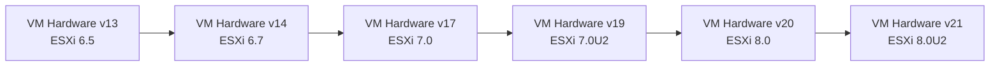

# How to Use Ansible to Configure VMware VM Hardware

Author: [nawazdhandala](https://www.github.com/nawazdhandala)

Tags: Ansible, VMware, VM Hardware, vSphere, Configuration

Description: Learn how to modify VMware virtual machine hardware settings with Ansible including CPU, memory, firmware, and advanced hardware configurations.

---

When VMs need more resources or hardware changes, doing it through the vSphere Client is straightforward for one VM but painful when you need to update dozens. Ansible lets you declaratively define VM hardware configurations and apply them across your fleet. This is especially useful for scaling up before peak traffic or standardizing hardware settings across environments. In this guide, I will cover modifying CPU, memory, firmware, hardware versions, and advanced settings.

## Understanding VM Hardware Configuration

VMware VMs have a "hardware version" that determines which virtual hardware features are available. Each ESXi release supports new hardware versions with additional capabilities.



Higher hardware versions support more vCPUs, more memory, and newer virtual device types.

## Modifying CPU Configuration

The `community.vmware.vmware_guest` module handles hardware changes. Some changes require the VM to be powered off, while others can be applied to running VMs if hot-add is enabled.

```yaml
# modify-cpu.yml
---
- name: Modify VM CPU configuration
  hosts: localhost
  gather_facts: false

  module_defaults:
    group/community.vmware.vmware:
      hostname: "{{ vcenter_hostname }}"
      username: "{{ vcenter_username }}"
      password: "{{ vcenter_password }}"
      validate_certs: false

  vars:
    vcenter_hostname: "vcenter.example.com"
    vcenter_username: "administrator@vsphere.local"
    vcenter_password: "{{ vault_vcenter_password }}"

  tasks:
    # Increase CPU count with hot-add (VM can stay running if hot-add was enabled)
    - name: Scale up VM CPU to 8 vCPUs
      community.vmware.vmware_guest:
        name: "prod-app-01"
        datacenter: "DC01"
        hardware:
          num_cpus: 8
          num_cpu_cores_per_socket: 4
          cpu_hot_add_enabled: true
          cpu_hot_remove_enabled: true
          # CPU resource limits and reservations
          cpu_limit: 8000       # MHz limit
          cpu_reservation: 2000  # MHz guaranteed
      register: cpu_result

    - name: Report CPU change status
      ansible.builtin.debug:
        msg: "CPU configuration updated: {{ cpu_result.changed }}"
```

## Modifying Memory Configuration

Memory changes follow a similar pattern to CPU changes.

```yaml
# modify-memory.yml
---
- name: Modify VM memory configuration
  hosts: localhost
  gather_facts: false

  module_defaults:
    group/community.vmware.vmware:
      hostname: "{{ vcenter_hostname }}"
      username: "{{ vcenter_username }}"
      password: "{{ vcenter_password }}"
      validate_certs: false

  vars:
    vcenter_hostname: "vcenter.example.com"
    vcenter_username: "administrator@vsphere.local"
    vcenter_password: "{{ vault_vcenter_password }}"

  tasks:
    - name: Scale up VM memory to 16 GB
      community.vmware.vmware_guest:
        name: "prod-app-01"
        datacenter: "DC01"
        hardware:
          memory_mb: 16384
          mem_hot_add_enabled: true
          # Memory resource management
          memory_reservation_lock: false
          mem_limit: 16384       # MB limit
          mem_reservation: 4096   # MB guaranteed
      register: mem_result

    - name: Report memory change status
      ansible.builtin.debug:
        msg: "Memory updated to {{ mem_result.instance.hw_memtotal_mb }} MB"
      when: mem_result.changed
```

## Full Hardware Reconfiguration

When you need to make multiple hardware changes at once, combine them in a single task.

```yaml
# full-hardware-reconfig.yml
---
- name: Complete hardware reconfiguration for production VM
  hosts: localhost
  gather_facts: false

  module_defaults:
    group/community.vmware.vmware:
      hostname: "{{ vcenter_hostname }}"
      username: "{{ vcenter_username }}"
      password: "{{ vcenter_password }}"
      validate_certs: false

  vars:
    vcenter_hostname: "vcenter.example.com"
    vcenter_username: "administrator@vsphere.local"
    vcenter_password: "{{ vault_vcenter_password }}"

  tasks:
    # Some hardware changes require the VM to be off
    - name: Shut down VM for hardware changes
      community.vmware.vmware_guest_powerstate:
        name: "prod-app-01"
        folder: "/DC01/vm/Production"
        state: shutdown-guest

    - name: Wait for VM to power off
      community.vmware.vmware_guest_info:
        datacenter: "DC01"
        name: "prod-app-01"
      register: vm_info
      until: vm_info.instance.hw_power_status == "poweredOff"
      retries: 24
      delay: 5

    # Apply all hardware changes while VM is off
    - name: Reconfigure VM hardware
      community.vmware.vmware_guest:
        name: "prod-app-01"
        datacenter: "DC01"
        hardware:
          # CPU configuration
          num_cpus: 8
          num_cpu_cores_per_socket: 4
          cpu_hot_add_enabled: true
          cpu_hot_remove_enabled: true
          # Memory configuration
          memory_mb: 32768
          mem_hot_add_enabled: true
          # SCSI controller type
          scsi: paravirtual
          # Boot configuration
          boot_firmware: efi
          secure_boot: true
          # VM hardware version upgrade
          version: 19
          # Boot order and delay
          boot_order:
            - disk
            - cdrom
            - ethernet
          boot_delay: 5000  # 5 second boot delay in ms
      register: reconfig_result

    # Power VM back on after changes
    - name: Power on VM after hardware changes
      community.vmware.vmware_guest_powerstate:
        name: "prod-app-01"
        folder: "/DC01/vm/Production"
        state: powered-on

    - name: Wait for VM to get an IP address
      community.vmware.vmware_guest_info:
        datacenter: "DC01"
        name: "prod-app-01"
      register: vm_running_info
      until: vm_running_info.instance.ipv4 is defined and vm_running_info.instance.ipv4 != ""
      retries: 30
      delay: 10

    - name: Confirm hardware changes
      ansible.builtin.debug:
        msg: >
          VM: {{ vm_running_info.instance.hw_name }}
          CPUs: {{ vm_running_info.instance.hw_processor_count }}
          Memory: {{ vm_running_info.instance.hw_memtotal_mb }} MB
          HW Version: {{ vm_running_info.instance.hw_version }}
```

## Upgrading VM Hardware Version

Upgrading the hardware version unlocks newer features but cannot be reversed.

```yaml
# upgrade-hardware-version.yml
---
- name: Upgrade VM hardware version
  hosts: localhost
  gather_facts: false

  module_defaults:
    group/community.vmware.vmware:
      hostname: "{{ vcenter_hostname }}"
      username: "{{ vcenter_username }}"
      password: "{{ vcenter_password }}"
      validate_certs: false

  vars:
    vcenter_hostname: "vcenter.example.com"
    vcenter_username: "administrator@vsphere.local"
    vcenter_password: "{{ vault_vcenter_password }}"
    target_vms:
      - "prod-web-01"
      - "prod-web-02"
      - "prod-app-01"

  tasks:
    # Get current hardware version for all target VMs
    - name: Gather current VM hardware information
      community.vmware.vmware_guest_info:
        datacenter: "DC01"
        name: "{{ item }}"
      loop: "{{ target_vms }}"
      register: vm_hw_info

    - name: Report current hardware versions
      ansible.builtin.debug:
        msg: "{{ item.instance.hw_name }}: {{ item.instance.hw_version }}"
      loop: "{{ vm_hw_info.results }}"

    # Shut down VMs before upgrading
    - name: Shut down VMs for hardware upgrade
      community.vmware.vmware_guest_powerstate:
        name: "{{ item }}"
        folder: "/DC01/vm/Production"
        state: shutdown-guest
      loop: "{{ target_vms }}"

    - name: Wait for VMs to power off
      ansible.builtin.pause:
        seconds: 60

    # Upgrade hardware version
    - name: Upgrade to VM hardware version 19
      community.vmware.vmware_guest:
        name: "{{ item }}"
        datacenter: "DC01"
        hardware:
          version: 19
      loop: "{{ target_vms }}"

    # Power VMs back on
    - name: Power on VMs after upgrade
      community.vmware.vmware_guest_powerstate:
        name: "{{ item }}"
        folder: "/DC01/vm/Production"
        state: powered-on
      loop: "{{ target_vms }}"
```

## Configuring Advanced Settings

Some settings go beyond the standard hardware parameters. Use the `advanced_settings` parameter for these.

```yaml
# advanced-settings.yml
- name: Configure advanced VM settings
  community.vmware.vmware_guest:
    hostname: "{{ vcenter_hostname }}"
    username: "{{ vcenter_username }}"
    password: "{{ vcenter_password }}"
    validate_certs: false
    name: "prod-app-01"
    datacenter: "DC01"
    advanced_settings:
      # Disable time synchronization with ESXi host
      - key: "tools.syncTime"
        value: "FALSE"
      # Set isolation settings for security
      - key: "isolation.tools.copy.disable"
        value: "TRUE"
      - key: "isolation.tools.paste.disable"
        value: "TRUE"
      - key: "isolation.tools.diskShrink.disable"
        value: "TRUE"
      # SMBIOS asset tag
      - key: "smbios.assetTag"
        value: "ASSET-PROD-APP-001"
      # Logging configuration
      - key: "log.keepOld"
        value: "10"
      - key: "log.rotateSize"
        value: "1024000"
```

## Standardizing Hardware Across a Fleet

Define your hardware standards and apply them to all VMs of a given type.

```yaml
# standardize-hardware.yml
---
- name: Standardize VM hardware configurations by role
  hosts: localhost
  gather_facts: false

  module_defaults:
    group/community.vmware.vmware:
      hostname: "{{ vcenter_hostname }}"
      username: "{{ vcenter_username }}"
      password: "{{ vcenter_password }}"
      validate_certs: false

  vars:
    vcenter_hostname: "vcenter.example.com"
    vcenter_username: "administrator@vsphere.local"
    vcenter_password: "{{ vault_vcenter_password }}"

    # Hardware standards by VM role
    hardware_standards:
      web_server:
        num_cpus: 4
        num_cpu_cores_per_socket: 2
        memory_mb: 8192
        cpu_hot_add_enabled: true
        mem_hot_add_enabled: true
      app_server:
        num_cpus: 8
        num_cpu_cores_per_socket: 4
        memory_mb: 16384
        cpu_hot_add_enabled: true
        mem_hot_add_enabled: true
      db_server:
        num_cpus: 16
        num_cpu_cores_per_socket: 8
        memory_mb: 65536
        cpu_hot_add_enabled: false
        mem_hot_add_enabled: false

    # Map VMs to their roles
    vm_assignments:
      - name: "prod-web-01"
        role: web_server
      - name: "prod-web-02"
        role: web_server
      - name: "prod-app-01"
        role: app_server
      - name: "prod-db-01"
        role: db_server

  tasks:
    - name: Apply hardware standards to each VM
      community.vmware.vmware_guest:
        name: "{{ item.name }}"
        datacenter: "DC01"
        hardware: "{{ hardware_standards[item.role] }}"
      loop: "{{ vm_assignments }}"
      register: standardize_results

    - name: Report changes made
      ansible.builtin.debug:
        msg: "{{ item.item.name }} ({{ item.item.role }}): changed={{ item.changed }}"
      loop: "{{ standardize_results.results }}"
```

## Auditing Hardware Configuration

Before making changes, audit the current state of your VMs.

```yaml
# audit-hardware.yml
- name: Gather hardware details for all VMs
  community.vmware.vmware_guest_info:
    hostname: "{{ vcenter_hostname }}"
    username: "{{ vcenter_username }}"
    password: "{{ vcenter_password }}"
    validate_certs: false
    datacenter: "DC01"
    name: "{{ item }}"
  loop:
    - "prod-web-01"
    - "prod-web-02"
    - "prod-app-01"
    - "prod-db-01"
  register: hw_audit

- name: Generate hardware audit report
  ansible.builtin.debug:
    msg: >
      {{ item.instance.hw_name }}:
      CPUs={{ item.instance.hw_processor_count }},
      Memory={{ item.instance.hw_memtotal_mb }}MB,
      HW_Version={{ item.instance.hw_version }},
      Power={{ item.instance.hw_power_status }}
  loop: "{{ hw_audit.results }}"
```

Managing VM hardware with Ansible turns what used to be maintenance window tasks into routine operations. The ability to define hardware specifications in code, apply them consistently, and track changes through version control brings the same infrastructure-as-code benefits to your VMware environment that you already have for your cloud resources.
