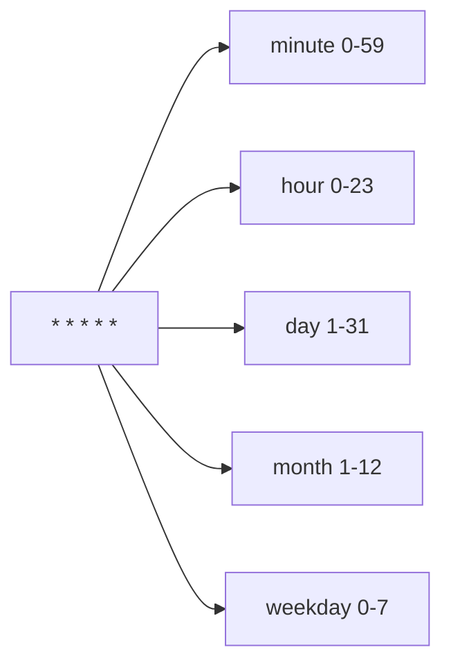

# How to Use Ansible to Create and Manage Cron Jobs

Author: [nawazdhandala](https://www.github.com/nawazdhandala)

Tags: Ansible, Cron, Linux, Automation

Description: Learn how to use the Ansible cron module to create, modify, and manage scheduled cron jobs across your infrastructure with proper naming and idempotency.

---

Cron jobs are the backbone of scheduled task execution on Linux systems. Database backups, log rotation, cache cleanup, report generation, certificate renewal - they all run on cron. Managing cron jobs manually across dozens of servers is tedious and error-prone. The Ansible `cron` module lets you manage cron entries declaratively, with support for all cron scheduling features including special time strings, environment variables, and per-user crontabs.

## Basic Cron Job Creation

The simplest cron task specifies a name, the command to run, and the schedule.

```yaml
# Create a cron job that runs a backup script every night at 2:30 AM
- name: Schedule nightly database backup
  ansible.builtin.cron:
    name: "Database backup"
    minute: "30"
    hour: "2"
    job: "/opt/scripts/backup-database.sh >> /var/log/backup.log 2>&1"
```

The `name` parameter is critical. Ansible uses it as a unique identifier for the cron entry. Without a name, you cannot update or remove the entry later, and running the task again would create duplicates.

## Cron Schedule Parameters

The scheduling parameters map directly to the five standard cron fields.

```yaml
# Run every 15 minutes
- name: Health check every 15 minutes
  ansible.builtin.cron:
    name: "Application health check"
    minute: "*/15"
    job: "/opt/scripts/health-check.sh"

# Run at 6 AM on weekdays only (Monday through Friday)
- name: Weekday morning report
  ansible.builtin.cron:
    name: "Morning status report"
    minute: "0"
    hour: "6"
    weekday: "1-5"
    job: "/opt/scripts/morning-report.sh"

# Run on the first day of every month at midnight
- name: Monthly cleanup
  ansible.builtin.cron:
    name: "Monthly log cleanup"
    minute: "0"
    hour: "0"
    day: "1"
    job: "/opt/scripts/monthly-cleanup.sh"

# Run every Sunday at 3 AM
- name: Weekly system maintenance
  ansible.builtin.cron:
    name: "Weekly maintenance"
    minute: "0"
    hour: "3"
    weekday: "0"
    job: "/opt/scripts/weekly-maintenance.sh"
```

## Using Special Time Strings

Ansible supports cron's special time strings through the `special_time` parameter.

```yaml
# Run at system boot
- name: Start application monitor at boot
  ansible.builtin.cron:
    name: "Start app monitor"
    special_time: reboot
    job: "/opt/myapp/bin/monitor-daemon start"

# Run once a day (equivalent to @daily)
- name: Daily log rotation
  ansible.builtin.cron:
    name: "Rotate application logs"
    special_time: daily
    job: "/opt/scripts/rotate-logs.sh"

# Run once an hour
- name: Hourly metrics collection
  ansible.builtin.cron:
    name: "Collect system metrics"
    special_time: hourly
    job: "/opt/scripts/collect-metrics.sh"
```

Available special time values: `reboot`, `yearly` (or `annually`), `monthly`, `weekly`, `daily` (or `midnight`), and `hourly`.

## Managing Cron for Specific Users

By default, cron entries are added to the root user's crontab (when using `become: yes`). Use the `user` parameter to manage another user's crontab.

```yaml
# Add a cron job for the application user
- name: Schedule app user's cache cleanup
  ansible.builtin.cron:
    name: "Clean application cache"
    minute: "0"
    hour: "*/4"
    user: appuser
    job: "/opt/myapp/bin/clean-cache"

# Add a cron job for the postgres user
- name: Schedule PostgreSQL vacuum
  ansible.builtin.cron:
    name: "PostgreSQL vacuum analyze"
    minute: "0"
    hour: "4"
    user: postgres
    job: "vacuumdb --all --analyze --quiet"
```

## Setting Cron Environment Variables

Cron jobs run in a minimal environment. You can set environment variables that apply to all subsequent jobs in the crontab.

```yaml
# Set environment variables in the crontab
- name: Set PATH for cron jobs
  ansible.builtin.cron:
    name: PATH
    env: yes
    job: "/usr/local/bin:/usr/bin:/bin"

- name: Set MAILTO for cron notifications
  ansible.builtin.cron:
    name: MAILTO
    env: yes
    job: "ops-team@company.com"

- name: Set SHELL for cron jobs
  ansible.builtin.cron:
    name: SHELL
    env: yes
    job: "/bin/bash"
```

## Disabling and Enabling Cron Jobs

The `disabled` parameter comments out a cron entry without removing it.

```yaml
# Disable a cron job during maintenance
- name: Disable backup job during migration
  ansible.builtin.cron:
    name: "Database backup"
    minute: "30"
    hour: "2"
    job: "/opt/scripts/backup-database.sh >> /var/log/backup.log 2>&1"
    disabled: yes

# Re-enable the cron job after maintenance
- name: Re-enable backup job
  ansible.builtin.cron:
    name: "Database backup"
    minute: "30"
    hour: "2"
    job: "/opt/scripts/backup-database.sh >> /var/log/backup.log 2>&1"
    disabled: no
```

## Removing Cron Jobs

Set `state: absent` to remove a cron entry.

```yaml
# Remove a decommissioned cron job
- name: Remove old reporting cron job
  ansible.builtin.cron:
    name: "Legacy daily report"
    state: absent

# Remove a cron job for a specific user
- name: Remove cron job from old user
  ansible.builtin.cron:
    name: "Old cache cleanup"
    user: olduser
    state: absent
```

## Managing Multiple Cron Jobs with Variables

For servers with many cron jobs, a variable-driven approach is cleaner.

```yaml
---
- name: Configure scheduled tasks
  hosts: app_servers
  become: yes
  vars:
    cron_jobs:
      - name: "Database backup"
        minute: "30"
        hour: "2"
        job: "/opt/scripts/backup-db.sh >> /var/log/cron/backup.log 2>&1"
      - name: "Log rotation"
        minute: "0"
        hour: "0"
        job: "/opt/scripts/rotate-logs.sh >> /var/log/cron/rotate.log 2>&1"
      - name: "Cache cleanup"
        minute: "0"
        hour: "*/6"
        job: "/opt/scripts/clean-cache.sh"
      - name: "Health check"
        minute: "*/5"
        job: "/opt/scripts/health-check.sh > /dev/null 2>&1"
      - name: "Certificate renewal check"
        minute: "0"
        hour: "12"
        weekday: "1"
        job: "/opt/scripts/check-certs.sh"

  tasks:
    - name: Create log directory for cron output
      ansible.builtin.file:
        path: /var/log/cron
        state: directory
        mode: '0755'

    - name: Deploy cron jobs
      ansible.builtin.cron:
        name: "{{ item.name }}"
        minute: "{{ item.minute | default('*') }}"
        hour: "{{ item.hour | default('*') }}"
        day: "{{ item.day | default('*') }}"
        month: "{{ item.month | default('*') }}"
        weekday: "{{ item.weekday | default('*') }}"
        job: "{{ item.job }}"
        user: "{{ item.user | default('root') }}"
        state: "{{ item.state | default('present') }}"
      loop: "{{ cron_jobs }}"
```

## Using cron.d Files

Instead of modifying user crontabs, you can drop cron files into `/etc/cron.d/`. The `cron_file` parameter handles this.

```yaml
# Create a cron job as a file in /etc/cron.d/
- name: Deploy application backup cron file
  ansible.builtin.cron:
    name: "Application backup"
    minute: "30"
    hour: "2"
    user: root
    job: "/opt/scripts/backup-app.sh"
    cron_file: myapp-backup

# This creates /etc/cron.d/myapp-backup with the entry
```

When using `cron_file`, you must also specify the `user` parameter because cron.d files require a user field.

```yaml
# Remove a cron.d file
- name: Remove old cron file
  ansible.builtin.cron:
    name: "Old job"
    cron_file: old-app-backup
    state: absent
```

## Best Practices for Cron Output

Always handle cron job output to avoid filling up mail queues and to maintain audit logs.

```yaml
# Good: redirect output to a log file
- name: Backup with logging
  ansible.builtin.cron:
    name: "Database backup"
    minute: "0"
    hour: "3"
    job: "/opt/scripts/backup.sh >> /var/log/backup-cron.log 2>&1"

# Good: discard output for frequent health checks
- name: Health check with no output
  ansible.builtin.cron:
    name: "Health ping"
    minute: "*/1"
    job: "/opt/scripts/ping.sh > /dev/null 2>&1"

# Good: use a wrapper script that handles its own logging
- name: Report generation
  ansible.builtin.cron:
    name: "Daily report"
    special_time: daily
    job: "/opt/scripts/generate-report.sh"
```

## Cron Scheduling Quick Reference



| Expression | Meaning |
|-----------|---------|
| `*/5 * * * *` | Every 5 minutes |
| `0 * * * *` | Every hour on the hour |
| `0 2 * * *` | Daily at 2:00 AM |
| `0 2 * * 1` | Every Monday at 2:00 AM |
| `0 0 1 * *` | First day of each month |
| `30 4 * * 0` | Every Sunday at 4:30 AM |
| `0 */6 * * *` | Every 6 hours |

## Summary

The Ansible `cron` module gives you full control over cron job management with proper idempotency. Always use the `name` parameter for every entry to enable updates and removal. Use `special_time` for common schedules, `cron_file` for application-specific cron files in `/etc/cron.d/`, and `env: yes` for setting cron environment variables. The variable-driven approach with loops is the cleanest way to manage many cron jobs. Remember to handle output redirection in your job commands, and use the `disabled` parameter when you need to temporarily pause a scheduled task without losing its configuration.
