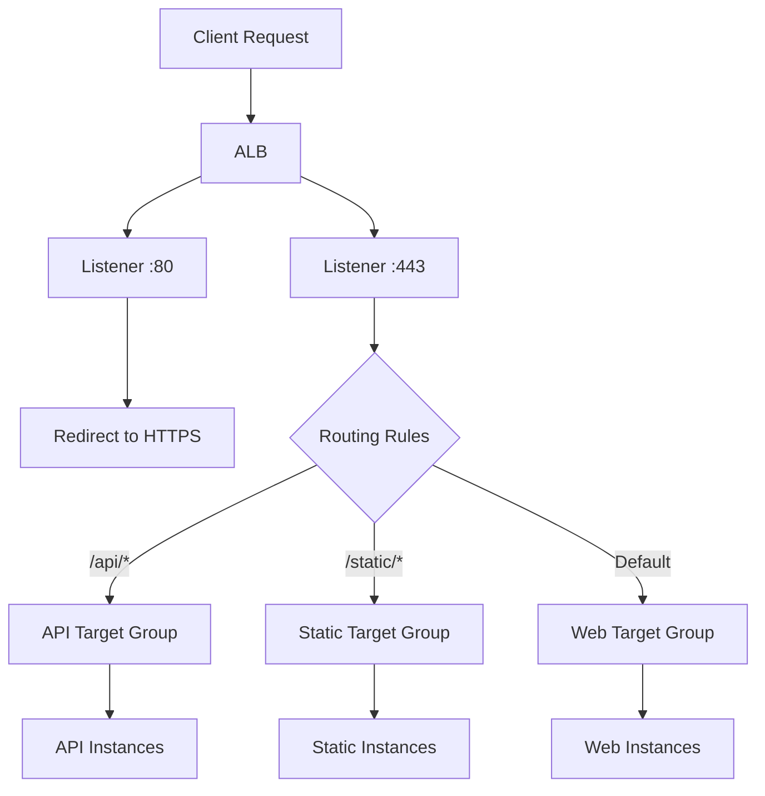

# How to Use Ansible to Create AWS Application Load Balancers

Author: [nawazdhandala](https://www.github.com/nawazdhandala)

Tags: Ansible, AWS, ALB, Load Balancing, Infrastructure as Code

Description: Complete guide to creating AWS Application Load Balancers with Ansible including target groups, listeners, path-based routing, and HTTPS setup.

---

Application Load Balancers (ALBs) are the go-to choice for HTTP and HTTPS workloads on AWS. They support path-based routing, host-based routing, WebSockets, and HTTP/2 out of the box. Setting them up through the console involves clicking through multiple screens for target groups, listeners, and rules. With Ansible, you define all of that in a single playbook.

This guide covers creating ALBs from scratch, configuring target groups, setting up routing rules, and enabling HTTPS with SSL certificates.

## Prerequisites

You will need:

- Ansible 2.14+
- The `amazon.aws` collection
- AWS credentials with ELBv2 permissions
- An existing VPC with subnets
- Python boto3 library

```bash
# Install dependencies
ansible-galaxy collection install amazon.aws
pip install boto3 botocore
```

## ALB Architecture

An ALB consists of several components that work together:



Listeners receive connections on a port. Rules evaluate conditions and forward traffic to target groups. Target groups contain the actual backend instances.

## Creating an ALB Step by Step

ALB creation in Ansible requires three separate modules: one for the ALB itself, one for target groups, and one for listeners. Here is the complete flow:

```yaml
# create-alb.yml - Full ALB setup with target group and listeners
---
- name: Create Application Load Balancer
  hosts: localhost
  connection: local
  gather_facts: false

  vars:
    aws_region: us-east-1
    vpc_id: vpc-0abc123def456789
    alb_name: webapp-alb
    subnet_ids:
      - subnet-0aaa111222333
      - subnet-0bbb444555666
    security_groups:
      - sg-0abc123def456789
    ssl_cert_arn: arn:aws:acm:us-east-1:123456789012:certificate/abc-123

  tasks:
    # Step 1: Create the target group where instances will be registered
    - name: Create target group
      community.aws.elb_target_group:
        name: webapp-tg
        protocol: http
        port: 80
        vpc_id: "{{ vpc_id }}"
        region: "{{ aws_region }}"
        health_check_protocol: http
        health_check_path: /health
        health_check_interval: 30
        health_check_timeout: 5
        healthy_threshold_count: 3
        unhealthy_threshold_count: 2
        state: present
        targets:
          - Id: i-0abc123def456001
            Port: 80
          - Id: i-0abc123def456002
            Port: 80
      register: target_group

    # Step 2: Create the ALB itself
    - name: Create Application Load Balancer
      amazon.aws.elb_application_lb:
        name: "{{ alb_name }}"
        region: "{{ aws_region }}"
        subnets: "{{ subnet_ids }}"
        security_groups: "{{ security_groups }}"
        scheme: internet-facing
        state: present
        tags:
          Name: "{{ alb_name }}"
          Environment: production
        listeners:
          # HTTP listener that redirects all traffic to HTTPS
          - Protocol: HTTP
            Port: 80
            DefaultActions:
              - Type: redirect
                RedirectConfig:
                  Protocol: HTTPS
                  Port: "443"
                  StatusCode: HTTP_301
          # HTTPS listener that forwards to the target group
          - Protocol: HTTPS
            Port: 443
            SslPolicy: ELBSecurityPolicy-TLS13-1-2-2021-06
            Certificates:
              - CertificateArn: "{{ ssl_cert_arn }}"
            DefaultActions:
              - Type: forward
                TargetGroupArn: "{{ target_group.target_group_arn }}"
      register: alb_result

    - name: Show ALB DNS
      ansible.builtin.debug:
        msg: "ALB DNS: {{ alb_result.dns_name }}"
```

## Path-Based Routing

One of the biggest advantages of ALBs over Classic ELBs is path-based routing. You can send different URL paths to different backend services:

```yaml
# path-routing.yml - ALB with path-based routing rules
---
- name: ALB with Path-Based Routing
  hosts: localhost
  connection: local
  gather_facts: false

  vars:
    aws_region: us-east-1
    vpc_id: vpc-0abc123def456789

  tasks:
    # Create separate target groups for each service
    - name: Create API target group
      community.aws.elb_target_group:
        name: api-service-tg
        protocol: http
        port: 8080
        vpc_id: "{{ vpc_id }}"
        region: "{{ aws_region }}"
        health_check_path: /api/health
        state: present
      register: api_tg

    - name: Create frontend target group
      community.aws.elb_target_group:
        name: frontend-tg
        protocol: http
        port: 3000
        vpc_id: "{{ vpc_id }}"
        region: "{{ aws_region }}"
        health_check_path: /
        state: present
      register: frontend_tg

    # Create ALB with rules that route based on URL path
    - name: Create ALB with path-based routing
      amazon.aws.elb_application_lb:
        name: microservices-alb
        region: "{{ aws_region }}"
        subnets:
          - subnet-0aaa111222333
          - subnet-0bbb444555666
        security_groups:
          - sg-0abc123def456789
        state: present
        listeners:
          - Protocol: HTTP
            Port: 80
            DefaultActions:
              - Type: forward
                TargetGroupArn: "{{ frontend_tg.target_group_arn }}"
            Rules:
              # Route /api/* requests to the API target group
              - Conditions:
                  - Field: path-pattern
                    Values:
                      - "/api/*"
                Priority: 1
                Actions:
                  - Type: forward
                    TargetGroupArn: "{{ api_tg.target_group_arn }}"
```

## Host-Based Routing

You can also route based on the hostname in the request:

```yaml
# Route based on Host header for multi-tenant setups
- name: Create ALB with host-based routing
  amazon.aws.elb_application_lb:
    name: multi-tenant-alb
    region: "{{ aws_region }}"
    subnets: "{{ subnet_ids }}"
    security_groups: "{{ security_groups }}"
    state: present
    listeners:
      - Protocol: HTTP
        Port: 80
        DefaultActions:
          - Type: forward
            TargetGroupArn: "{{ default_tg.target_group_arn }}"
        Rules:
          # Route api.example.com to the API service
          - Conditions:
              - Field: host-header
                Values:
                  - "api.example.com"
            Priority: 1
            Actions:
              - Type: forward
                TargetGroupArn: "{{ api_tg.target_group_arn }}"
          # Route admin.example.com to the admin service
          - Conditions:
              - Field: host-header
                Values:
                  - "admin.example.com"
            Priority: 2
            Actions:
              - Type: forward
                TargetGroupArn: "{{ admin_tg.target_group_arn }}"
```

## Internal ALB for Service-to-Service Communication

Not every ALB needs to face the internet. Internal ALBs are useful for microservice communication:

```yaml
# Create an internal ALB that is only accessible within the VPC
- name: Create internal ALB
  amazon.aws.elb_application_lb:
    name: internal-services-alb
    region: "{{ aws_region }}"
    scheme: internal
    subnets:
      - subnet-private-1
      - subnet-private-2
    security_groups:
      - sg-internal-only
    state: present
    listeners:
      - Protocol: HTTP
        Port: 80
        DefaultActions:
          - Type: forward
            TargetGroupArn: "{{ internal_tg.target_group_arn }}"
```

The key difference is `scheme: internal`. This places the ALB in private subnets and gives it a private DNS name only resolvable within the VPC.

## Target Group Health Checks

Proper health check configuration is crucial. Here are recommended settings for different application types:

```yaml
# Health check for a REST API that responds quickly
- name: API target group with strict health checks
  community.aws.elb_target_group:
    name: fast-api-tg
    protocol: http
    port: 8080
    vpc_id: "{{ vpc_id }}"
    region: "{{ aws_region }}"
    health_check_protocol: http
    health_check_path: /health
    health_check_interval: 10
    health_check_timeout: 5
    healthy_threshold_count: 2
    unhealthy_threshold_count: 2
    target_type: instance
    state: present

# Health check for a slower application that needs more time to start
- name: Legacy app target group with relaxed health checks
  community.aws.elb_target_group:
    name: legacy-app-tg
    protocol: http
    port: 8080
    vpc_id: "{{ vpc_id }}"
    region: "{{ aws_region }}"
    health_check_protocol: http
    health_check_path: /status
    health_check_interval: 60
    health_check_timeout: 30
    healthy_threshold_count: 2
    unhealthy_threshold_count: 5
    target_type: instance
    state: present
```

## Sticky Sessions

For applications that store session state locally, you can enable sticky sessions on the target group:

```yaml
# Enable cookie-based sticky sessions
- name: Create target group with sticky sessions
  community.aws.elb_target_group:
    name: sticky-webapp-tg
    protocol: http
    port: 80
    vpc_id: "{{ vpc_id }}"
    region: "{{ aws_region }}"
    stickiness_enabled: true
    stickiness_type: lb_cookie
    stickiness_lb_cookie_duration: 86400
    state: present
```

This tells the ALB to route all requests from the same client to the same backend instance for 24 hours (86400 seconds).

## Cleaning Up

Remove an ALB and its associated resources in reverse order:

```yaml
# Remove the ALB first, then the target groups
- name: Delete ALB
  amazon.aws.elb_application_lb:
    name: webapp-alb
    region: us-east-1
    state: absent

- name: Delete target group
  community.aws.elb_target_group:
    name: webapp-tg
    region: us-east-1
    state: absent
```

Always delete the ALB before the target groups. If a target group is still referenced by a listener, AWS will not let you delete it.

## Wrapping Up

Application Load Balancers are flexible and powerful, but they involve multiple AWS resources that need to be configured together. Ansible lets you define the entire stack in one playbook, making it easy to replicate across environments and track changes in version control. Start with a simple setup, add routing rules as your architecture grows, and always configure health checks properly to keep your applications reliable.
