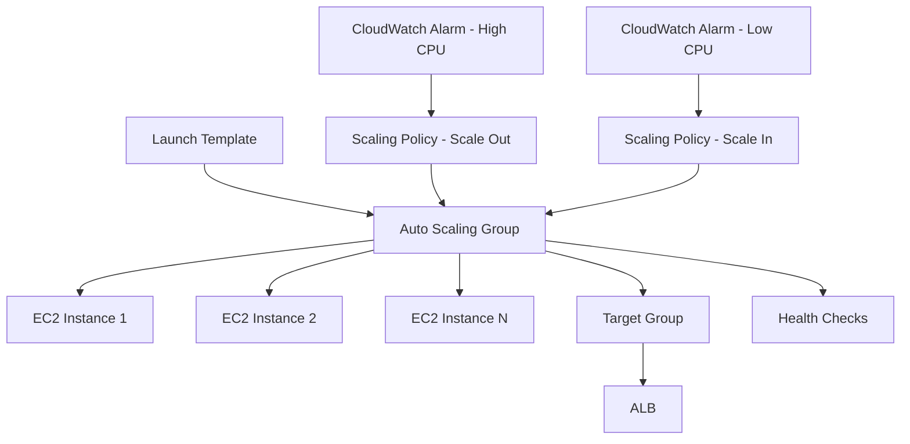

# How to Use Ansible to Create AWS Auto Scaling Groups

Author: [nawazdhandala](https://www.github.com/nawazdhandala)

Tags: Ansible, AWS, Auto Scaling, EC2, Infrastructure as Code

Description: Complete guide to creating AWS Auto Scaling Groups with Ansible including launch templates, scaling policies, health checks, and rolling updates.

---

Auto Scaling Groups (ASGs) automatically adjust the number of EC2 instances based on demand. When traffic increases, the ASG launches more instances. When traffic drops, it terminates the extras. This keeps your application responsive during peak times and saves money during quiet periods. But setting up an ASG correctly requires a launch template, scaling policies, health checks, and proper integration with load balancers.

This guide covers building the entire auto-scaling infrastructure with Ansible, from launch templates to advanced scaling policies.

## Prerequisites

You need:

- Ansible 2.14+
- The `amazon.aws` and `community.aws` collections
- AWS credentials with EC2 and Auto Scaling permissions
- An existing VPC, subnets, and security groups
- Python boto3

```bash
# Install dependencies
ansible-galaxy collection install amazon.aws community.aws
pip install boto3 botocore
```

## Auto Scaling Architecture

Here is how the components work together:



## Creating a Launch Template

Launch templates define how instances are configured when the ASG creates them:

```yaml
# create-launch-template.yml - Define instance configuration
---
- name: Create Launch Template
  hosts: localhost
  connection: local
  gather_facts: false

  vars:
    aws_region: us-east-1
    template_name: myapp-web-template
    instance_type: t3.medium
    ami_id: ami-0abc123def456789
    key_name: myapp-keypair
    security_groups:
      - sg-0abc123def456789
    instance_profile: myapp-ec2-profile

  tasks:
    # Create the launch template with user data for bootstrapping
    - name: Create launch template
      community.aws.ec2_launch_template:
        name: "{{ template_name }}"
        region: "{{ aws_region }}"
        image_id: "{{ ami_id }}"
        instance_type: "{{ instance_type }}"
        key_name: "{{ key_name }}"
        network_interfaces:
          - device_index: 0
            associate_public_ip_address: false
            groups: "{{ security_groups }}"
        iam_instance_profile: "{{ instance_profile }}"
        block_device_mappings:
          - device_name: /dev/xvda
            ebs:
              volume_size: 30
              volume_type: gp3
              encrypted: true
              delete_on_termination: true
        user_data: "{{ lookup('file', 'files/user-data.sh') | b64encode }}"
        tags:
          Name: "{{ template_name }}"
          Environment: production
        tag_specifications:
          - resource_type: instance
            tags:
              Name: myapp-web
              Environment: production
              ManagedBy: asg
          - resource_type: volume
            tags:
              Name: myapp-web-volume
              Environment: production
      register: template_result

    - name: Show template details
      ansible.builtin.debug:
        msg: "Template: {{ template_result.latest_version }}"
```

The user data script runs when each instance boots. Here is an example:

```bash
#!/bin/bash
# files/user-data.sh - Bootstrap script for new instances
yum update -y
yum install -y amazon-cloudwatch-agent
amazon-linux-extras install docker -y
systemctl start docker
systemctl enable docker

# Pull and run the application
aws ecr get-login-password --region us-east-1 | docker login --username AWS --password-stdin 123456789012.dkr.ecr.us-east-1.amazonaws.com
docker pull 123456789012.dkr.ecr.us-east-1.amazonaws.com/myapp:latest
docker run -d -p 8080:8080 123456789012.dkr.ecr.us-east-1.amazonaws.com/myapp:latest
```

## Creating the Auto Scaling Group

```yaml
# create-asg.yml - Create the Auto Scaling Group
---
- name: Create Auto Scaling Group
  hosts: localhost
  connection: local
  gather_facts: false

  vars:
    aws_region: us-east-1
    asg_name: myapp-web-asg
    template_name: myapp-web-template
    min_size: 2
    max_size: 10
    desired_capacity: 3
    target_group_arns:
      - arn:aws:elasticloadbalancing:us-east-1:123456789012:targetgroup/myapp-tg/abc123

  tasks:
    # Create the Auto Scaling Group
    - name: Create ASG
      amazon.aws.autoscaling_group:
        name: "{{ asg_name }}"
        region: "{{ aws_region }}"
        launch_template:
          launch_template_name: "{{ template_name }}"
          version: "$Latest"
        min_size: "{{ min_size }}"
        max_size: "{{ max_size }}"
        desired_capacity: "{{ desired_capacity }}"
        vpc_zone_identifier:
          - subnet-private-az-a
          - subnet-private-az-b
        target_group_arns: "{{ target_group_arns }}"
        health_check_type: ELB
        health_check_period: 300
        default_cooldown: 300
        termination_policies:
          - OldestLaunchTemplate
          - OldestInstance
        tags:
          - Name: myapp-web
            propagate_at_launch: true
          - Environment: production
            propagate_at_launch: true
          - ManagedBy: ansible
            propagate_at_launch: false
      register: asg_result

    - name: Show ASG info
      ansible.builtin.debug:
        msg: "ASG {{ asg_name }} created with {{ desired_capacity }} instances"
```

Key settings:

- `health_check_type: ELB` uses the load balancer health check instead of just EC2 status checks. This catches application-level failures.
- `health_check_period: 300` gives instances 5 minutes to pass health checks after launch. Increase this for slow-starting applications.
- `termination_policies` control which instances get terminated first during scale-in events.

## Target Tracking Scaling Policy

The simplest scaling approach is target tracking:

```yaml
# Create a target tracking scaling policy
- name: Set up target tracking scaling
  ansible.builtin.command:
    cmd: >
      aws autoscaling put-scaling-policy
      --auto-scaling-group-name myapp-web-asg
      --policy-name myapp-cpu-target-tracking
      --policy-type TargetTrackingScaling
      --target-tracking-configuration '{
        "PredefinedMetricSpecification": {
          "PredefinedMetricType": "ASGAverageCPUUtilization"
        },
        "TargetValue": 60.0,
        "ScaleOutCooldown": 60,
        "ScaleInCooldown": 300
      }'
      --region us-east-1
  changed_when: true
```

This automatically adds instances when average CPU exceeds 60% and removes them when it drops below. The asymmetric cooldowns (60s out, 300s in) mean it scales out quickly but scales in cautiously.

## Step Scaling Policy

For more control over scaling behavior:

```yaml
# Step scaling with CloudWatch alarms
- name: Create scale-out alarm
  amazon.aws.cloudwatch_metric_alarm:
    alarm_name: "myapp-asg-high-cpu"
    metric_name: CPUUtilization
    namespace: AWS/EC2
    statistic: Average
    comparison: GreaterThanThreshold
    threshold: 70
    period: 300
    evaluation_periods: 2
    dimensions:
      AutoScalingGroupName: myapp-web-asg
    alarm_actions:
      - "{{ scale_out_policy_arn }}"
    region: us-east-1
    state: present

- name: Create scale-in alarm
  amazon.aws.cloudwatch_metric_alarm:
    alarm_name: "myapp-asg-low-cpu"
    metric_name: CPUUtilization
    namespace: AWS/EC2
    statistic: Average
    comparison: LessThanThreshold
    threshold: 30
    period: 300
    evaluation_periods: 3
    dimensions:
      AutoScalingGroupName: myapp-web-asg
    alarm_actions:
      - "{{ scale_in_policy_arn }}"
    region: us-east-1
    state: present
```

## Scheduled Scaling

If you know your traffic patterns, schedule scaling actions:

```yaml
# Scale up every weekday morning
- name: Schedule scale up
  ansible.builtin.command:
    cmd: >
      aws autoscaling put-scheduled-update-group-action
      --auto-scaling-group-name myapp-web-asg
      --scheduled-action-name morning-scale-up
      --recurrence "0 8 * * MON-FRI"
      --min-size 5
      --max-size 15
      --desired-capacity 8
      --region us-east-1
  changed_when: true

# Scale down every evening
- name: Schedule scale down
  ansible.builtin.command:
    cmd: >
      aws autoscaling put-scheduled-update-group-action
      --auto-scaling-group-name myapp-web-asg
      --scheduled-action-name evening-scale-down
      --recurrence "0 20 * * MON-FRI"
      --min-size 2
      --max-size 10
      --desired-capacity 3
      --region us-east-1
  changed_when: true
```

## Rolling Updates

Update instances in the ASG by creating a new launch template version and triggering a rolling refresh:

```yaml
# rolling-update.yml - Deploy a new AMI to the ASG
---
- name: Rolling Update
  hosts: localhost
  connection: local
  gather_facts: false

  vars:
    aws_region: us-east-1
    new_ami: ami-0newversion456789

  tasks:
    # Update the launch template with the new AMI
    - name: Update launch template
      community.aws.ec2_launch_template:
        name: myapp-web-template
        region: "{{ aws_region }}"
        image_id: "{{ new_ami }}"
      register: new_template

    # Trigger an instance refresh for a rolling update
    - name: Start instance refresh
      ansible.builtin.command:
        cmd: >
          aws autoscaling start-instance-refresh
          --auto-scaling-group-name myapp-web-asg
          --preferences '{
            "MinHealthyPercentage": 75,
            "InstanceWarmup": 120
          }'
          --region {{ aws_region }}
      register: refresh_result
      changed_when: true

    - name: Show refresh ID
      ansible.builtin.debug:
        msg: "Instance refresh started: {{ refresh_result.stdout }}"
```

The instance refresh replaces instances gradually. With `MinHealthyPercentage: 75`, at least 75% of instances remain healthy during the update.

## Mixed Instance Policy

Use a mix of instance types and purchase options for cost optimization:

```yaml
# Create ASG with mixed instances for cost savings
- name: Create ASG with mixed instances
  amazon.aws.autoscaling_group:
    name: myapp-cost-optimized-asg
    region: us-east-1
    mixed_instances_policy:
      launch_template:
        launch_template_specification:
          launch_template_name: myapp-web-template
          version: "$Latest"
        overrides:
          - instance_type: t3.medium
          - instance_type: t3.large
          - instance_type: m5.large
      instances_distribution:
        on_demand_base_capacity: 2
        on_demand_percentage_above_base_capacity: 25
        spot_allocation_strategy: capacity-optimized
    min_size: 2
    max_size: 20
    desired_capacity: 5
    vpc_zone_identifier:
      - subnet-private-az-a
      - subnet-private-az-b
    health_check_type: ELB
    health_check_period: 300
```

This keeps 2 on-demand instances as a baseline, then uses 75% spot instances for additional capacity. Multiple instance types improve spot availability.

## Deleting an ASG

```yaml
# Delete the ASG (terminates all instances)
- name: Delete Auto Scaling Group
  amazon.aws.autoscaling_group:
    name: myapp-web-asg
    region: us-east-1
    state: absent
    force_delete: true
```

Setting `force_delete: true` terminates all instances immediately. Without it, the ASG waits for instances to drain.

## Wrapping Up

Auto Scaling Groups with Ansible give you elastic, cost-effective infrastructure. Define your launch templates with proper instance configuration, create ASGs with appropriate health checks, and use target tracking policies for simple scaling. For cost optimization, use mixed instance policies with spot instances. The key is testing your scaling policies before relying on them in production to make sure they respond correctly to your application's traffic patterns.
