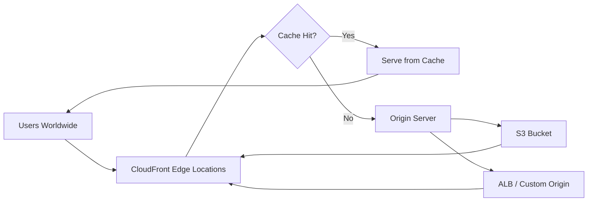

# How to Use Ansible to Create AWS CloudFront Distributions

Author: [nawazdhandala](https://www.github.com/nawazdhandala)

Tags: Ansible, AWS, CloudFront, CDN, Infrastructure as Code

Description: Complete guide to creating AWS CloudFront distributions with Ansible covering S3 origins, custom origins, caching policies, and SSL certificates.

---

CloudFront is the AWS content delivery network. It caches your content at edge locations around the world, reducing latency for users regardless of their geographic location. Setting up a CloudFront distribution involves a lot of configuration: origins, cache behaviors, SSL certificates, error pages, and more. The console interface has dozens of settings spread across multiple tabs.

Ansible lets you define all of this in one place, version control it, and replicate it across environments. This guide covers creating CloudFront distributions for common use cases.

## Prerequisites

You need:

- Ansible 2.14+
- The `community.aws` collection
- AWS credentials with CloudFront and S3 permissions
- An SSL certificate in ACM (must be in us-east-1 for CloudFront)
- Python boto3

```bash
# Install dependencies
ansible-galaxy collection install community.aws
pip install boto3 botocore
```

## CloudFront Architecture

Here is a typical CloudFront setup:



CloudFront checks its cache first. If the content is cached and still valid, it serves it immediately. If not, it fetches from the origin, caches the response, and serves it.

## CloudFront Distribution with S3 Origin

The most common use case is serving static content from S3:

```yaml
# create-cloudfront-s3.yml - CloudFront distribution with S3 origin
---
- name: Create CloudFront Distribution for S3
  hosts: localhost
  connection: local
  gather_facts: false

  vars:
    aws_region: us-east-1
    bucket_name: myapp-static-assets
    distribution_comment: "Static assets for myapp"
    acm_cert_arn: arn:aws:acm:us-east-1:123456789012:certificate/abc-123
    domain_name: cdn.example.com

  tasks:
    # Create the CloudFront distribution
    - name: Create CloudFront distribution
      community.aws.cloudfront_distribution:
        state: present
        caller_reference: "myapp-static-{{ ansible_date_time.epoch | default('1234567890') }}"
        comment: "{{ distribution_comment }}"
        default_root_object: index.html
        aliases:
          - "{{ domain_name }}"
        viewer_certificate:
          acm_certificate_arn: "{{ acm_cert_arn }}"
          ssl_support_method: sni-only
          minimum_protocol_version: TLSv1.2_2021
        origins:
          - id: s3-origin
            domain_name: "{{ bucket_name }}.s3.amazonaws.com"
            s3_origin_config:
              origin_access_identity: ""
        default_cache_behavior:
          target_origin_id: s3-origin
          viewer_protocol_policy: redirect-to-https
          allowed_methods:
            items:
              - GET
              - HEAD
            cached_methods:
              - GET
              - HEAD
          forwarded_values:
            query_string: false
            cookies:
              forward: none
          min_ttl: 0
          default_ttl: 86400
          max_ttl: 31536000
          compress: true
        enabled: true
        price_class: PriceClass_100
        tags:
          Environment: production
          Application: myapp
      register: cf_result

    - name: Show distribution domain
      ansible.builtin.debug:
        msg: "CloudFront domain: {{ cf_result.domain_name }}"
```

The `price_class` controls which edge locations are used. `PriceClass_100` uses only the cheapest locations (US, Canada, Europe). `PriceClass_All` uses every edge location worldwide.

## CloudFront with Custom Origin (ALB)

For dynamic content behind a load balancer:

```yaml
# create-cloudfront-alb.yml - CloudFront in front of an ALB
---
- name: Create CloudFront Distribution for ALB
  hosts: localhost
  connection: local
  gather_facts: false

  vars:
    alb_dns: myapp-alb-1234567890.us-east-1.elb.amazonaws.com
    acm_cert_arn: arn:aws:acm:us-east-1:123456789012:certificate/abc-123

  tasks:
    - name: Create CloudFront distribution with ALB origin
      community.aws.cloudfront_distribution:
        state: present
        caller_reference: "myapp-alb-dist"
        comment: "Application CDN for myapp"
        aliases:
          - app.example.com
        viewer_certificate:
          acm_certificate_arn: "{{ acm_cert_arn }}"
          ssl_support_method: sni-only
          minimum_protocol_version: TLSv1.2_2021
        origins:
          - id: alb-origin
            domain_name: "{{ alb_dns }}"
            custom_origin_config:
              http_port: 80
              https_port: 443
              origin_protocol_policy: https-only
              origin_ssl_protocols:
                items:
                  - TLSv1.2
        default_cache_behavior:
          target_origin_id: alb-origin
          viewer_protocol_policy: redirect-to-https
          allowed_methods:
            items:
              - GET
              - HEAD
              - OPTIONS
              - PUT
              - POST
              - PATCH
              - DELETE
            cached_methods:
              - GET
              - HEAD
          forwarded_values:
            query_string: true
            headers:
              - Host
              - Authorization
              - Accept
            cookies:
              forward: all
          min_ttl: 0
          default_ttl: 0
          max_ttl: 0
        enabled: true
      register: cf_result
```

Notice the `default_ttl: 0` for the ALB origin. Dynamic content should not be cached at the edge unless you have specific cache headers set in your application.

## Multiple Origins with Cache Behaviors

A single distribution can serve content from different origins based on the URL path:

```yaml
# Multi-origin distribution with path-based routing
- name: Create multi-origin CloudFront distribution
  community.aws.cloudfront_distribution:
    state: present
    caller_reference: "myapp-multi-origin"
    comment: "Multi-origin distribution for myapp"
    aliases:
      - www.example.com
    viewer_certificate:
      acm_certificate_arn: "{{ acm_cert_arn }}"
      ssl_support_method: sni-only
      minimum_protocol_version: TLSv1.2_2021
    origins:
      # Static assets origin
      - id: s3-static
        domain_name: myapp-static.s3.amazonaws.com
        s3_origin_config:
          origin_access_identity: ""
      # API origin
      - id: alb-api
        domain_name: myapp-alb.us-east-1.elb.amazonaws.com
        custom_origin_config:
          http_port: 80
          https_port: 443
          origin_protocol_policy: https-only
          origin_ssl_protocols:
            items:
              - TLSv1.2
    # Default behavior serves static content
    default_cache_behavior:
      target_origin_id: s3-static
      viewer_protocol_policy: redirect-to-https
      allowed_methods:
        items:
          - GET
          - HEAD
        cached_methods:
          - GET
          - HEAD
      forwarded_values:
        query_string: false
        cookies:
          forward: none
      default_ttl: 86400
      compress: true
    # Additional behavior for API paths
    cache_behaviors:
      - path_pattern: "/api/*"
        target_origin_id: alb-api
        viewer_protocol_policy: https-only
        allowed_methods:
          items:
            - GET
            - HEAD
            - OPTIONS
            - PUT
            - POST
            - PATCH
            - DELETE
          cached_methods:
            - GET
            - HEAD
        forwarded_values:
          query_string: true
          headers:
            - Authorization
            - Accept
            - Content-Type
          cookies:
            forward: all
        default_ttl: 0
    enabled: true
```

This routes `/api/*` to the ALB and everything else to S3. Static assets get cached aggressively. API calls pass through without caching.

## Custom Error Pages

Serve friendly error pages instead of generic CloudFront errors:

```yaml
# Distribution with custom error responses
- name: Create distribution with custom error pages
  community.aws.cloudfront_distribution:
    state: present
    caller_reference: "myapp-with-errors"
    comment: "Distribution with custom error pages"
    origins:
      - id: s3-origin
        domain_name: myapp-static.s3.amazonaws.com
        s3_origin_config:
          origin_access_identity: ""
    default_cache_behavior:
      target_origin_id: s3-origin
      viewer_protocol_policy: redirect-to-https
      allowed_methods:
        items:
          - GET
          - HEAD
        cached_methods:
          - GET
          - HEAD
      forwarded_values:
        query_string: false
        cookies:
          forward: none
    custom_error_responses:
      - error_code: 403
        response_page_path: /error/403.html
        response_code: 403
        error_caching_min_ttl: 300
      - error_code: 404
        response_page_path: /error/404.html
        response_code: 404
        error_caching_min_ttl: 300
      - error_code: 500
        response_page_path: /error/500.html
        response_code: 500
        error_caching_min_ttl: 60
    enabled: true
```

## Cache Invalidation

After deploying new content, invalidate the CloudFront cache:

```yaml
# Invalidate CloudFront cache after deployment
- name: Create cache invalidation
  community.aws.cloudfront_invalidation:
    distribution_id: "{{ cf_result.id }}"
    target_paths:
      - /index.html
      - /css/*
      - /js/*
  register: invalidation

- name: Show invalidation status
  ansible.builtin.debug:
    msg: "Invalidation ID: {{ invalidation.invalidation.id }}"
```

Invalidating `/*` clears everything but costs more if you do it frequently. Target specific paths when possible.

## Disabling and Deleting a Distribution

CloudFront distributions must be disabled before they can be deleted:

```yaml
# Step 1: Disable the distribution
- name: Disable CloudFront distribution
  community.aws.cloudfront_distribution:
    distribution_id: E1234567890ABC
    state: present
    enabled: false

# Step 2: Wait for the distribution to fully disable
- name: Wait for distribution to be disabled
  ansible.builtin.pause:
    minutes: 15
    prompt: "Waiting for distribution to finish disabling..."

# Step 3: Delete the distribution
- name: Delete CloudFront distribution
  community.aws.cloudfront_distribution:
    distribution_id: E1234567890ABC
    state: absent
```

Disabling takes several minutes because CloudFront needs to propagate the change to all edge locations.

## Wrapping Up

CloudFront distributions have many configuration options, and defining them in Ansible playbooks keeps everything organized, versioned, and repeatable. Use S3 origins for static content with aggressive caching, ALB origins for dynamic content with minimal caching, and path-based behaviors to combine both in a single distribution. Always use HTTPS, set appropriate TTLs, and enable compression to get the most out of the CDN.
