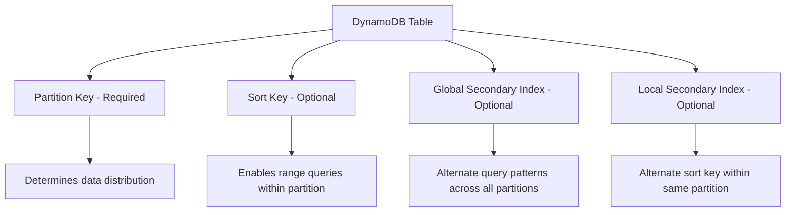

# How to Use Ansible to Create AWS DynamoDB Tables

Author: [nawazdhandala](https://www.github.com/nawazdhandala)

Tags: Ansible, AWS, DynamoDB, NoSQL, Database Automation

Description: Create and configure AWS DynamoDB tables with Ansible including key schema design, indexes, capacity settings, and TTL configuration.

---

DynamoDB is AWS's fully managed NoSQL database, and it is one of those services where the table configuration itself is a significant part of your application architecture. Your partition key choice, sort key design, global secondary indexes, and capacity mode all affect performance and cost. Having this configuration in code rather than scattered across console screenshots and wiki pages is important. Ansible's `community.aws.dynamodb_table` module lets you declare your table configuration and create it repeatably across environments.

## Prerequisites

- Ansible 2.9+ with both the `amazon.aws` and `community.aws` collections
- AWS credentials with DynamoDB permissions

```bash
# Install the required collections
ansible-galaxy collection install amazon.aws community.aws
```

## DynamoDB Key Concepts

Before writing playbooks, a quick refresher on DynamoDB table structure:



The partition key (also called hash key) determines which partition stores your data. The optional sort key (also called range key) lets you store multiple items under the same partition key and query them by range. Good key design is the single most important decision you make with DynamoDB.

## Creating a Simple Table

Here is a basic table with just a partition key:

```yaml
# create-simple-table.yml - Create a DynamoDB table with a single partition key
---
- name: Create DynamoDB Table
  hosts: localhost
  connection: local
  gather_facts: false

  vars:
    aws_region: us-east-1

  tasks:
    - name: Create a users table with on-demand capacity
      community.aws.dynamodb_table:
        region: "{{ aws_region }}"
        name: "users"
        state: present
        hash_key_name: "user_id"
        hash_key_type: STRING
        billing_mode: PAY_PER_REQUEST
        tags:
          Environment: production
          Application: user-service
          ManagedBy: ansible
      register: table_result

    - name: Show table details
      ansible.builtin.debug:
        msg: "Table '{{ table_result.table_name }}' created with status {{ table_result.table_status }}"
```

The `billing_mode: PAY_PER_REQUEST` option enables on-demand capacity, which means you pay per read and write operation rather than provisioning capacity upfront. This is the right choice when your traffic patterns are unpredictable or when you are starting a new application and do not have baseline metrics yet.

## Creating a Table with Partition Key and Sort Key

Most production tables benefit from a composite key:

```yaml
# create-composite-key-table.yml - Table with partition and sort key
---
- name: Create Orders Table
  hosts: localhost
  connection: local
  gather_facts: false

  vars:
    aws_region: us-east-1

  tasks:
    - name: Create orders table with composite key
      community.aws.dynamodb_table:
        region: "{{ aws_region }}"
        name: "orders"
        state: present
        hash_key_name: "customer_id"
        hash_key_type: STRING
        range_key_name: "order_date"
        range_key_type: STRING
        billing_mode: PAY_PER_REQUEST
        tags:
          Environment: production
          Application: order-service
          ManagedBy: ansible
      register: orders_table

    - name: Report table creation
      ansible.builtin.debug:
        msg: "Orders table created with key schema: customer_id (HASH) + order_date (RANGE)"
```

With this key design, you can efficiently query all orders for a specific customer, filter by date range, or retrieve a specific order by its exact customer_id + order_date combination. Storing the date as a string in ISO 8601 format (like `2026-02-21T10:30:00Z`) allows lexicographic sorting which aligns with chronological ordering.

## Creating a Table with Global Secondary Indexes

GSIs let you query the table using different key combinations:

```yaml
# create-table-with-gsi.yml - Table with global secondary indexes
---
- name: Create Products Table with GSIs
  hosts: localhost
  connection: local
  gather_facts: false

  vars:
    aws_region: us-east-1

  tasks:
    - name: Create products table with multiple access patterns
      community.aws.dynamodb_table:
        region: "{{ aws_region }}"
        name: "products"
        state: present
        hash_key_name: "product_id"
        hash_key_type: STRING
        billing_mode: PAY_PER_REQUEST
        indexes:
          - name: "category-price-index"
            type: global_all
            hash_key_name: "category"
            hash_key_type: STRING
            range_key_name: "price"
            range_key_type: NUMBER
          - name: "brand-index"
            type: global_all
            hash_key_name: "brand"
            hash_key_type: STRING
            range_key_name: "product_id"
            range_key_type: STRING
        tags:
          Environment: production
          Application: product-catalog
          ManagedBy: ansible
      register: products_table

    - name: Display table and index info
      ansible.builtin.debug:
        msg: >
          Table 'products' created with {{ products_table.global_indexes | default([]) | length }} GSI(s).
          Primary key: product_id. Query by category+price or brand.
```

The `type: global_all` means the GSI projects all attributes from the base table. Other projection options are `global_keys_only` (only project the keys) and `global_include` (project specific attributes). Smaller projections reduce GSI storage costs but limit what you can read without going back to the base table.

## Creating a Table with Provisioned Capacity

For predictable workloads, provisioned capacity is cheaper:

```yaml
# create-provisioned-table.yml - Table with provisioned capacity and auto-scaling
---
- name: Create Provisioned DynamoDB Table
  hosts: localhost
  connection: local
  gather_facts: false

  vars:
    aws_region: us-east-1

  tasks:
    - name: Create session table with provisioned throughput
      community.aws.dynamodb_table:
        region: "{{ aws_region }}"
        name: "sessions"
        state: present
        hash_key_name: "session_id"
        hash_key_type: STRING
        billing_mode: PROVISIONED
        read_capacity: 50
        write_capacity: 25
        tags:
          Environment: production
          Application: auth-service
          ManagedBy: ansible
      register: session_table

    - name: Show provisioned capacity
      ansible.builtin.debug:
        msg: "Sessions table: {{ session_table.read_capacity }} RCU, {{ session_table.write_capacity }} WCU"
```

With provisioned capacity, you set Read Capacity Units (RCUs) and Write Capacity Units (WCUs). One RCU gets you one strongly consistent read per second for items up to 4KB. One WCU gets you one write per second for items up to 1KB. If your application exceeds these limits, DynamoDB throttles requests.

## Enabling Time-to-Live (TTL)

TTL automatically deletes expired items, which is great for session data, cache entries, and temporary records:

```yaml
# enable-ttl.yml - Enable TTL on a DynamoDB table
---
- name: Enable DynamoDB TTL
  hosts: localhost
  connection: local
  gather_facts: false

  vars:
    aws_region: us-east-1

  tasks:
    - name: Create cache table with TTL enabled
      community.aws.dynamodb_table:
        region: "{{ aws_region }}"
        name: "cache_entries"
        state: present
        hash_key_name: "cache_key"
        hash_key_type: STRING
        billing_mode: PAY_PER_REQUEST
        tags:
          Application: caching-layer
          ManagedBy: ansible

    - name: Enable TTL on the expiry_time attribute
      community.aws.dynamodb_ttl:
        region: "{{ aws_region }}"
        table_name: "cache_entries"
        attribute_name: "expiry_time"
        state: enable
      register: ttl_result

    - name: Confirm TTL is enabled
      ansible.builtin.debug:
        msg: "TTL enabled on 'expiry_time' attribute for cache_entries table"
```

The TTL attribute should contain a Unix epoch timestamp. DynamoDB checks this attribute and deletes items whose timestamp has passed. Deletions are not instantaneous; they typically happen within 48 hours of expiration. Your application should still filter out expired items in queries rather than relying solely on TTL cleanup.

## Creating Multiple Tables for a Microservice

A single microservice often needs several tables:

```yaml
# microservice-tables.yml - Create all DynamoDB tables for a microservice
---
- name: Create Microservice Tables
  hosts: localhost
  connection: local
  gather_facts: false

  vars:
    aws_region: us-east-1
    service_name: "notification-service"
    environment: production
    tables:
      - name: "notifications"
        hash_key: "user_id"
        hash_type: STRING
        range_key: "created_at"
        range_type: STRING
        gsis:
          - name: "status-index"
            hash_key: "status"
            hash_type: STRING
            range_key: "created_at"
            range_type: STRING
      - name: "notification_preferences"
        hash_key: "user_id"
        hash_type: STRING
        gsis: []
      - name: "notification_templates"
        hash_key: "template_id"
        hash_type: STRING
        range_key: "version"
        range_type: NUMBER
        gsis: []

  tasks:
    - name: Create each table
      community.aws.dynamodb_table:
        region: "{{ aws_region }}"
        name: "{{ environment }}_{{ item.name }}"
        state: present
        hash_key_name: "{{ item.hash_key }}"
        hash_key_type: "{{ item.hash_type }}"
        range_key_name: "{{ item.range_key | default(omit) }}"
        range_key_type: "{{ item.range_type | default(omit) }}"
        billing_mode: PAY_PER_REQUEST
        indexes: "{{ item.gsis | default(omit) if item.gsis | default([]) | length > 0 else omit }}"
        tags:
          Service: "{{ service_name }}"
          Environment: "{{ environment }}"
          ManagedBy: ansible
      loop: "{{ tables }}"
      register: table_results

    - name: Summary
      ansible.builtin.debug:
        msg: "Created {{ table_results.results | length }} tables for {{ service_name }}"
```

Prefixing table names with the environment (like `production_notifications`) is a common pattern when you share an AWS account across environments. It prevents naming collisions and makes it easy to identify which tables belong to which environment.

## Deleting Tables

When decommissioning a service:

```yaml
# delete-tables.yml - Remove DynamoDB tables
---
- name: Delete DynamoDB Tables
  hosts: localhost
  connection: local
  gather_facts: false

  vars:
    aws_region: us-east-1
    tables_to_delete:
      - "staging_notifications"
      - "staging_notification_preferences"
      - "staging_notification_templates"

  tasks:
    - name: Delete each table
      community.aws.dynamodb_table:
        region: "{{ aws_region }}"
        name: "{{ item }}"
        state: absent
      loop: "{{ tables_to_delete }}"

    - name: Confirm deletion
      ansible.builtin.debug:
        msg: "Deleted {{ tables_to_delete | length }} tables"
```

Be careful with this one. DynamoDB table deletion is immediate and irreversible. There is no recycle bin. Make sure you have backups (either DynamoDB point-in-time recovery or manual exports) before running deletion playbooks in production.

## Summary

Ansible brings DynamoDB table management into your infrastructure-as-code workflow. The key things to get right are your key schema design (which you should plan before writing any playbook), appropriate capacity mode selection, and consistent environment-based naming. With your table definitions in version-controlled playbooks, you can spin up identical database schemas across environments, track changes over time, and ensure new team members can understand your data model by reading the code.
