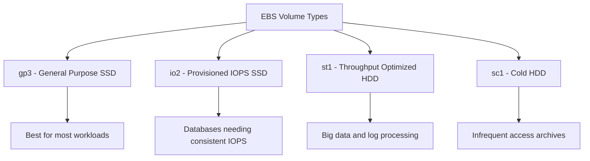

# How to Use Ansible to Create AWS EBS Volumes

Author: [nawazdhandala](https://www.github.com/nawazdhandala)

Tags: Ansible, AWS, EBS, Storage, Cloud Automation

Description: A practical guide to creating, configuring, and attaching AWS EBS volumes using Ansible playbooks with real code examples.

---

EBS volumes are the bread and butter of persistent storage in AWS. Every EC2 instance needs at least one, and most production workloads need several with different performance profiles. Managing these volumes by hand through the console is fine when you have three instances. When you have thirty or three hundred, you need automation. Ansible makes EBS volume management declarative and repeatable, so your storage configuration lives in version control right next to your application code.

## Prerequisites

You will need the following before getting started:

- Ansible 2.9+ with the `amazon.aws` collection
- AWS credentials with permissions for EC2 and EBS operations
- A running EC2 instance to attach volumes to (for the attachment examples)

Install the collection and verify your setup:

```bash
# Install the AWS collection
ansible-galaxy collection install amazon.aws

# Verify Ansible can reach AWS
ansible localhost -m amazon.aws.ec2_instance_info -a "region=us-east-1"
```

## EBS Volume Types Overview

Before writing playbooks, it helps to understand what volume types are available and when to use each:



The `gp3` type is the default and covers most use cases. It gives you a baseline of 3,000 IOPS and 125 MiB/s throughput regardless of volume size, which is a nice improvement over the older `gp2` type where performance scaled with size.

## Creating a Basic EBS Volume

The `amazon.aws.ec2_vol` module handles EBS volume creation. Here is a straightforward example:

```yaml
# create-ebs-volume.yml - Create a basic gp3 EBS volume
---
- name: Create an EBS Volume
  hosts: localhost
  connection: local
  gather_facts: false

  vars:
    aws_region: us-east-1
    availability_zone: us-east-1a

  tasks:
    - name: Create a 50GB gp3 volume
      amazon.aws.ec2_vol:
        region: "{{ aws_region }}"
        zone: "{{ availability_zone }}"
        volume_size: 50
        volume_type: gp3
        name: "data-volume-01"
        tags:
          Environment: production
          Team: platform
          ManagedBy: ansible
        state: present
      register: vol_result

    - name: Display volume details
      ansible.builtin.debug:
        msg: "Created volume {{ vol_result.volume_id }} in {{ availability_zone }}"
```

A few things to note here. The `zone` parameter is required because EBS volumes exist in a specific availability zone. You cannot attach a volume in `us-east-1a` to an instance in `us-east-1b`. This is a common mistake that will cause your playbook to fail at the attachment step. The `name` tag is used by Ansible to find existing volumes on subsequent runs, which is what makes the module idempotent.

## Creating a High-Performance Volume

For database workloads, you might need provisioned IOPS:

```yaml
# create-io2-volume.yml - Create a high-performance io2 volume for databases
---
- name: Create High Performance EBS Volume
  hosts: localhost
  connection: local
  gather_facts: false

  tasks:
    - name: Create a 200GB io2 volume with provisioned IOPS
      amazon.aws.ec2_vol:
        region: us-east-1
        zone: us-east-1a
        volume_size: 200
        volume_type: io2
        iops: 10000
        name: "postgres-data-vol"
        encrypted: true
        tags:
          Service: postgres
          Environment: production
        state: present
      register: db_volume

    - name: Show volume info
      ansible.builtin.debug:
        var: db_volume
```

The `encrypted: true` flag enables EBS encryption at rest using the default AWS KMS key. For production databases, this should always be enabled. You can also specify a custom KMS key ID if your organization requires it.

## Creating and Attaching a Volume to an Instance

The most common workflow is creating a volume and immediately attaching it:

```yaml
# create-and-attach.yml - Create a volume and attach it to an EC2 instance
---
- name: Create and Attach EBS Volume
  hosts: localhost
  connection: local
  gather_facts: false

  vars:
    instance_id: "i-0abc123def456789"
    aws_region: us-east-1

  tasks:
    - name: Create and attach a 100GB volume
      amazon.aws.ec2_vol:
        region: "{{ aws_region }}"
        instance: "{{ instance_id }}"
        volume_size: 100
        volume_type: gp3
        device_name: /dev/xvdf
        name: "app-data-{{ instance_id }}"
        encrypted: true
        tags:
          Purpose: application-data
          AttachedTo: "{{ instance_id }}"
        state: present
      register: attached_vol

    - name: Print attachment details
      ansible.builtin.debug:
        msg: "Volume {{ attached_vol.volume_id }} attached as {{ attached_vol.device }}"
```

When you specify `instance`, the module both creates and attaches the volume. The `device_name` parameter controls where the volume appears in the guest OS. On modern Linux kernels with Nitro-based instances, `/dev/xvdf` typically shows up as `/dev/nvme1n1`, so keep that in mind when writing your filesystem setup scripts.

## Creating Multiple Volumes for an Instance

Production servers often need separate volumes for different purposes. Here is how to create several at once:

```yaml
# multi-volume-setup.yml - Create multiple volumes with different specs
---
- name: Multi-Volume Setup
  hosts: localhost
  connection: local
  gather_facts: false

  vars:
    instance_id: "i-0abc123def456789"
    aws_region: us-east-1
    volumes:
      - name: "os-logs"
        size: 50
        type: gp3
        device: /dev/xvdf
        purpose: "Operating system logs"
      - name: "app-data"
        size: 200
        type: gp3
        device: /dev/xvdg
        purpose: "Application data"
      - name: "db-storage"
        size: 500
        type: io2
        device: /dev/xvdh
        iops: 5000
        purpose: "Database storage"

  tasks:
    - name: Create and attach each volume
      amazon.aws.ec2_vol:
        region: "{{ aws_region }}"
        instance: "{{ instance_id }}"
        volume_size: "{{ item.size }}"
        volume_type: "{{ item.type }}"
        iops: "{{ item.iops | default(omit) }}"
        device_name: "{{ item.device }}"
        name: "{{ item.name }}-{{ instance_id }}"
        encrypted: true
        tags:
          Purpose: "{{ item.purpose }}"
          ManagedBy: ansible
        state: present
      loop: "{{ volumes }}"
      register: vol_results

    - name: Summarize all volumes
      ansible.builtin.debug:
        msg: "{{ item.item.name }}: {{ item.volume_id }} ({{ item.item.size }}GB {{ item.item.type }})"
      loop: "{{ vol_results.results }}"
```

The `default(omit)` filter on the `iops` parameter is important. For gp3 volumes, you do not need to specify IOPS explicitly (it defaults to 3,000), and passing an explicit value for volume types that do not support it would cause an error. The `omit` filter tells Ansible to skip that parameter entirely when it is not defined.

## Formatting and Mounting Volumes on the Instance

Creating and attaching the volume is only half the job. You also need to format and mount it on the instance:

```yaml
# format-and-mount.yml - Format and mount an attached EBS volume
---
- name: Format and Mount EBS Volume
  hosts: web_servers
  become: true

  vars:
    data_device: /dev/nvme1n1
    mount_point: /data

  tasks:
    - name: Create a filesystem on the volume
      community.general.filesystem:
        fstype: ext4
        dev: "{{ data_device }}"
        opts: "-L appdata"

    - name: Create the mount point directory
      ansible.builtin.file:
        path: "{{ mount_point }}"
        state: directory
        owner: root
        group: root
        mode: "0755"

    - name: Mount the volume
      ansible.posix.mount:
        path: "{{ mount_point }}"
        src: "{{ data_device }}"
        fstype: ext4
        opts: defaults,nofail
        state: mounted

    - name: Verify the mount
      ansible.builtin.command: df -h {{ mount_point }}
      register: df_output
      changed_when: false

    - name: Show mount status
      ansible.builtin.debug:
        var: df_output.stdout_lines
```

The `nofail` mount option is critical. Without it, if the EBS volume fails to attach during boot (maybe you detached it for maintenance), the instance will hang during startup waiting for the mount. With `nofail`, the system boots normally and you can troubleshoot the missing volume.

## Detaching and Deleting Volumes

When decommissioning infrastructure, clean up your volumes:

```yaml
# cleanup-volumes.yml - Detach and delete EBS volumes
---
- name: Cleanup EBS Volumes
  hosts: localhost
  connection: local
  gather_facts: false

  vars:
    volumes_to_remove:
      - vol-0abc123def456789a
      - vol-0def456abc789012b

  tasks:
    - name: Detach and delete volumes
      amazon.aws.ec2_vol:
        region: us-east-1
        id: "{{ item }}"
        state: absent
      loop: "{{ volumes_to_remove }}"
      register: delete_results

    - name: Confirm deletion
      ansible.builtin.debug:
        msg: "Deleted volume {{ item.item }}"
      loop: "{{ delete_results.results }}"
      when: item is changed
```

## Best Practices

After managing EBS volumes with Ansible across several production environments, here are the patterns that have served me well:

1. Always enable encryption. There is no performance penalty and it satisfies most compliance requirements out of the box.
2. Tag everything. At minimum, include `Name`, `Environment`, `Team`, and `ManagedBy` tags. These make cleanup and cost attribution much easier.
3. Match availability zones carefully. Store the AZ alongside the instance ID in your inventory or variables file so the volume always lands in the right zone.
4. Use `gp3` as your default. It is cheaper than `gp2` and gives you better baseline performance. Only reach for `io2` when you have measured IOPS requirements that exceed what `gp3` can deliver.
5. Set `delete_on_termination` thoughtfully. For data volumes, you typically want this set to false so terminating the instance does not destroy your data.

## Summary

Ansible turns EBS volume management from a manual, error-prone process into something you can run confidently in a CI/CD pipeline. The `ec2_vol` module covers the full lifecycle from creation through attachment to deletion, and its idempotent behavior means you can run your playbooks repeatedly without creating duplicate volumes. Pair this with proper tagging and you have a solid foundation for managing storage at scale in AWS.
