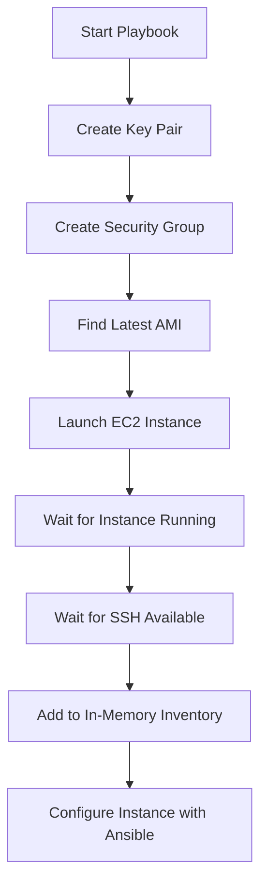

# How to Use Ansible to Create AWS EC2 Instances

Author: [nawazdhandala](https://www.github.com/nawazdhandala)

Tags: Ansible, AWS, EC2, Cloud Provisioning, Infrastructure as Code

Description: Provision AWS EC2 instances with Ansible using the amazon.aws collection, including key pairs, security groups, and post-launch configuration.

---

Provisioning EC2 instances with Ansible gives you infrastructure as code without the complexity of a full-blown provisioning tool. You describe the instance you want, Ansible creates it, and then you can immediately configure it with the same tool. No context switching between different tools for provisioning and configuration management.

## Prerequisites

You need the `amazon.aws` collection and `boto3` installed, plus valid AWS credentials configured (via environment variables, credentials file, or IAM role).

```bash
# Install required components
ansible-galaxy collection install amazon.aws
pip3 install boto3 botocore
```

## Creating a Basic EC2 Instance

The `amazon.aws.ec2_instance` module is the primary way to manage EC2 instances.

```yaml
# create-ec2.yml
---
- name: Create an EC2 instance
  hosts: localhost
  connection: local

  vars:
    aws_region: us-east-1
    instance_type: t3.micro
    ami_id: ami-0c02fb55956c7d316  # Amazon Linux 2023
    key_name: my-ansible-key
    subnet_id: subnet-0123456789abcdef0

  tasks:
    - name: Launch EC2 instance
      amazon.aws.ec2_instance:
        name: "web-server-01"
        region: "{{ aws_region }}"
        instance_type: "{{ instance_type }}"
        image_id: "{{ ami_id }}"
        key_name: "{{ key_name }}"
        subnet_id: "{{ subnet_id }}"
        security_group: "web-sg"
        network:
          assign_public_ip: true
        volumes:
          - device_name: /dev/xvda
            ebs:
              volume_size: 20
              volume_type: gp3
              delete_on_termination: true
        tags:
          Environment: production
          Role: webserver
          ManagedBy: ansible
        state: running
        wait: true
      register: ec2_result

    - name: Show instance details
      ansible.builtin.debug:
        msg: |
          Instance ID: {{ ec2_result.instances[0].instance_id }}
          Public IP: {{ ec2_result.instances[0].public_ip_address }}
          Private IP: {{ ec2_result.instances[0].private_ip_address }}
```

## Creating a Key Pair

Before launching instances, you need an SSH key pair for access.

```yaml
# create-keypair.yml
---
- name: Create EC2 key pair
  hosts: localhost
  connection: local

  tasks:
    - name: Create key pair and save private key
      amazon.aws.ec2_key:
        name: my-ansible-key
        region: us-east-1
        state: present
      register: key_result

    - name: Save private key to file
      ansible.builtin.copy:
        content: "{{ key_result.key.private_key }}"
        dest: "~/.ssh/my-ansible-key.pem"
        mode: "0600"
      when: key_result.changed
```

## Looking Up the Latest AMI

Hard-coding AMI IDs is fragile because they change per region and over time. Use a lookup to find the latest AMI.

```yaml
# Find the latest Amazon Linux 2023 AMI
- name: Get latest Amazon Linux 2023 AMI
  amazon.aws.ec2_ami_info:
    region: us-east-1
    owners:
      - amazon
    filters:
      name: "al2023-ami-2023*-x86_64"
      state: available
      architecture: x86_64
  register: ami_info

- name: Set AMI ID
  ansible.builtin.set_fact:
    latest_ami: "{{ ami_info.images | sort(attribute='creation_date') | last }}"

- name: Show selected AMI
  ansible.builtin.debug:
    msg: "Using AMI: {{ latest_ami.image_id }} ({{ latest_ami.name }})"
```

## Complete Provisioning Playbook

Here is a full playbook that creates everything from scratch: key pair, security group, and instance.

```yaml
# provision-webserver.yml
---
- name: Provision a web server on AWS
  hosts: localhost
  connection: local
  gather_facts: false

  vars:
    aws_region: us-east-1
    vpc_id: vpc-0123456789abcdef0
    subnet_id: subnet-0123456789abcdef0
    instance_name: web-prod-01
    instance_type: t3.small
    key_name: ansible-webserver-key

  tasks:
    - name: Create SSH key pair
      amazon.aws.ec2_key:
        name: "{{ key_name }}"
        region: "{{ aws_region }}"
        state: present
      register: keypair

    - name: Save private key
      ansible.builtin.copy:
        content: "{{ keypair.key.private_key }}"
        dest: "~/.ssh/{{ key_name }}.pem"
        mode: "0600"
      when: keypair.changed

    - name: Create security group
      amazon.aws.ec2_security_group:
        name: web-server-sg
        description: Security group for web servers
        vpc_id: "{{ vpc_id }}"
        region: "{{ aws_region }}"
        rules:
          - proto: tcp
            from_port: 22
            to_port: 22
            cidr_ip: 10.0.0.0/8
            rule_desc: SSH from internal
          - proto: tcp
            from_port: 80
            to_port: 80
            cidr_ip: 0.0.0.0/0
            rule_desc: HTTP from anywhere
          - proto: tcp
            from_port: 443
            to_port: 443
            cidr_ip: 0.0.0.0/0
            rule_desc: HTTPS from anywhere
        tags:
          Name: web-server-sg
          ManagedBy: ansible
      register: sg

    - name: Find latest Amazon Linux 2023 AMI
      amazon.aws.ec2_ami_info:
        region: "{{ aws_region }}"
        owners:
          - amazon
        filters:
          name: "al2023-ami-2023*-x86_64"
          state: available
      register: ami_info

    - name: Set AMI fact
      ansible.builtin.set_fact:
        ami_id: "{{ (ami_info.images | sort(attribute='creation_date') | last).image_id }}"

    - name: Launch EC2 instance
      amazon.aws.ec2_instance:
        name: "{{ instance_name }}"
        region: "{{ aws_region }}"
        instance_type: "{{ instance_type }}"
        image_id: "{{ ami_id }}"
        key_name: "{{ key_name }}"
        subnet_id: "{{ subnet_id }}"
        security_group: "{{ sg.group_id }}"
        network:
          assign_public_ip: true
        volumes:
          - device_name: /dev/xvda
            ebs:
              volume_size: 30
              volume_type: gp3
              iops: 3000
              throughput: 125
              delete_on_termination: true
        user_data: |
          #!/bin/bash
          yum update -y
          yum install -y nginx
          systemctl start nginx
          systemctl enable nginx
        tags:
          Environment: production
          Role: webserver
          ManagedBy: ansible
        state: running
        wait: true
        wait_timeout: 300
      register: ec2

    - name: Show instance details
      ansible.builtin.debug:
        msg: |
          Instance: {{ instance_name }}
          ID: {{ ec2.instances[0].instance_id }}
          Public IP: {{ ec2.instances[0].public_ip_address | default('none') }}
          Private IP: {{ ec2.instances[0].private_ip_address }}
          AMI: {{ ami_id }}
```

## Launching Multiple Instances

To create a fleet of instances, use a loop or the `exact_count` feature.

```yaml
# Create multiple instances with a loop
- name: Launch a fleet of web servers
  amazon.aws.ec2_instance:
    name: "web-prod-{{ item }}"
    region: "{{ aws_region }}"
    instance_type: t3.small
    image_id: "{{ ami_id }}"
    key_name: "{{ key_name }}"
    subnet_id: "{{ subnets[item | int % (subnets | length)] }}"
    security_group: "{{ sg.group_id }}"
    tags:
      Environment: production
      Role: webserver
      Index: "{{ item }}"
    state: running
    wait: true
  loop: "{{ range(1, 6) | list }}"
  register: fleet

- name: Collect all instance IPs
  ansible.builtin.set_fact:
    instance_ips: "{{ fleet.results | map(attribute='instances') | flatten | map(attribute='private_ip_address') | list }}"

- name: Show all IPs
  ansible.builtin.debug:
    var: instance_ips
```

## Provisioning Flow



## Adding New Instances to Inventory Dynamically

After creating instances, add them to the in-memory inventory so you can configure them in the same playbook run.

```yaml
- name: Wait for SSH to be available
  ansible.builtin.wait_for:
    host: "{{ ec2.instances[0].public_ip_address }}"
    port: 22
    delay: 10
    timeout: 300

- name: Add new instance to inventory
  ansible.builtin.add_host:
    name: "{{ ec2.instances[0].public_ip_address }}"
    groups: new_instances
    ansible_user: ec2-user
    ansible_ssh_private_key_file: "~/.ssh/{{ key_name }}.pem"

# Then in a second play, configure the new instances
- name: Configure new web servers
  hosts: new_instances
  become: true
  gather_facts: true

  tasks:
    - name: Install packages
      ansible.builtin.dnf:
        name:
          - nginx
          - python3
          - htop
        state: present

    - name: Start nginx
      ansible.builtin.systemd:
        name: nginx
        state: started
        enabled: true
```

## Managing Instance State

```yaml
# Stop an instance
- name: Stop the web server
  amazon.aws.ec2_instance:
    instance_ids:
      - i-0123456789abcdef0
    region: us-east-1
    state: stopped

# Start it back up
- name: Start the web server
  amazon.aws.ec2_instance:
    instance_ids:
      - i-0123456789abcdef0
    region: us-east-1
    state: running

# Terminate (destroy) an instance
- name: Terminate the web server
  amazon.aws.ec2_instance:
    instance_ids:
      - i-0123456789abcdef0
    region: us-east-1
    state: terminated
```

## Idempotency

The `amazon.aws.ec2_instance` module is idempotent when you use the `name` parameter. If an instance with that name already exists and is running, Ansible will not create a duplicate. It matches on the `Name` tag combined with the other filters.

```yaml
# This is safe to run multiple times
- name: Ensure web server exists
  amazon.aws.ec2_instance:
    name: "web-prod-01"
    region: us-east-1
    instance_type: t3.small
    image_id: "{{ ami_id }}"
    key_name: my-key
    state: running
```

Running this playbook twice will not create two instances. On the second run, Ansible finds the existing instance by name and reports no changes.

## Wrapping Up

Provisioning EC2 instances with Ansible is straightforward once you have credentials configured and the `amazon.aws` collection installed. The `ec2_instance` module handles the full lifecycle from creation to termination, and idempotency based on the `name` tag means you can run your provisioning playbooks safely and repeatedly. Combine provisioning with post-launch configuration in the same playbook, and you have a complete infrastructure-as-code workflow.
