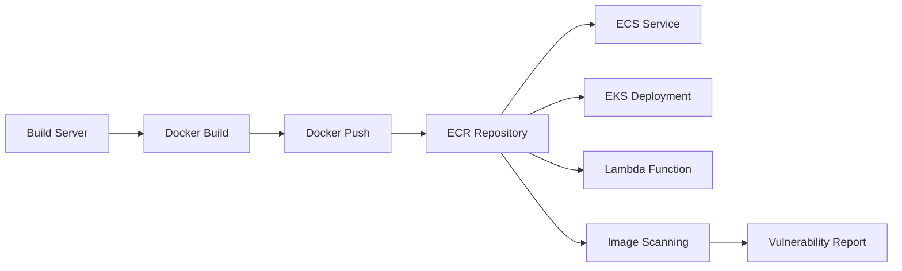

# How to Use Ansible to Create AWS ECR Repositories

Author: [nawazdhandala](https://www.github.com/nawazdhandala)

Tags: Ansible, AWS, ECR, Docker, Containers

Description: Practical guide to creating and managing AWS ECR container repositories with Ansible including lifecycle policies, scanning, and cross-account access.

---

ECR (Elastic Container Registry) is the AWS-managed Docker registry. It stores your container images close to where they run (ECS, EKS, Lambda), with built-in security scanning, encryption, and lifecycle management. If you are running containers on AWS, ECR is the natural choice for your registry.

Managing ECR repositories manually works for a few images. But in a microservices architecture with dozens of services, each needing their own repository with specific lifecycle policies and access controls, automation is necessary. Ansible handles all of this.

## Prerequisites

You need:

- Ansible 2.14+
- The `community.aws` collection
- AWS credentials with ECR permissions
- Python boto3
- Docker installed (for pushing images)

```bash
# Install dependencies
ansible-galaxy collection install community.aws
pip install boto3 botocore
```

## ECR Architecture

Here is how ECR fits into a container deployment pipeline:



Images are built, pushed to ECR, scanned for vulnerabilities, and pulled by compute services.

## Creating a Basic Repository

The `community.aws.ecs_ecr` module manages ECR repositories:

```yaml
# create-repo.yml - Create a basic ECR repository
---
- name: Create ECR Repository
  hosts: localhost
  connection: local
  gather_facts: false

  vars:
    aws_region: us-east-1
    repo_name: myapp/web-service

  tasks:
    # Create the ECR repository with image scanning enabled
    - name: Create ECR repository
      community.aws.ecs_ecr:
        name: "{{ repo_name }}"
        region: "{{ aws_region }}"
        state: present
        image_tag_mutability: immutable
        scan_on_push: true
      register: repo_result

    - name: Show repository URI
      ansible.builtin.debug:
        msg: "Repository URI: {{ repo_result.repository.repositoryUri }}"
```

Key settings:

- `image_tag_mutability: immutable` prevents overwriting existing tags. Once you push `v1.0.0`, nobody can push a different image with the same tag. This is a production best practice.
- `scan_on_push: true` automatically scans every new image for known vulnerabilities.

## Lifecycle Policies

Lifecycle policies automatically clean up old images to control storage costs:

```yaml
# create-repo-lifecycle.yml - Repository with lifecycle policy
---
- name: Create ECR Repository with Lifecycle Policy
  hosts: localhost
  connection: local
  gather_facts: false

  tasks:
    - name: Create repository with lifecycle policy
      community.aws.ecs_ecr:
        name: myapp/api-service
        region: us-east-1
        state: present
        scan_on_push: true
        lifecycle_policy:
          rules:
            # Rule 1: Remove untagged images older than 1 day
            - rulePriority: 1
              description: "Remove untagged images after 1 day"
              selection:
                tagStatus: untagged
                countType: sinceImagePushed
                countUnit: days
                countNumber: 1
              action:
                type: expire
            # Rule 2: Keep only the last 20 tagged images
            - rulePriority: 2
              description: "Keep only last 20 tagged images"
              selection:
                tagStatus: tagged
                tagPrefixList:
                  - "v"
                countType: imageCountMoreThan
                countNumber: 20
              action:
                type: expire
            # Rule 3: Remove dev images after 7 days
            - rulePriority: 3
              description: "Remove dev images after 7 days"
              selection:
                tagStatus: tagged
                tagPrefixList:
                  - "dev-"
                  - "feature-"
                countType: sinceImagePushed
                countUnit: days
                countNumber: 7
              action:
                type: expire
      register: repo_result
```

This lifecycle policy keeps your repository clean:
- Untagged images (intermediate build layers) are deleted after 1 day
- Only the 20 most recent release versions (tagged with `v`) are kept
- Development and feature branch images are deleted after 7 days

## Multiple Repositories for Microservices

Create all repositories for your microservices in one playbook:

```yaml
# create-all-repos.yml - Repositories for all microservices
---
- name: Create All ECR Repositories
  hosts: localhost
  connection: local
  gather_facts: false

  vars:
    aws_region: us-east-1
    project: myapp
    services:
      - name: web-frontend
        scan: true
        immutable: true
      - name: api-gateway
        scan: true
        immutable: true
      - name: user-service
        scan: true
        immutable: true
      - name: order-service
        scan: true
        immutable: true
      - name: notification-service
        scan: true
        immutable: true
      - name: worker
        scan: true
        immutable: false

  tasks:
    # Create a repository for each service
    - name: Create ECR repositories
      community.aws.ecs_ecr:
        name: "{{ project }}/{{ item.name }}"
        region: "{{ aws_region }}"
        state: present
        scan_on_push: "{{ item.scan }}"
        image_tag_mutability: "{{ 'immutable' if item.immutable else 'mutable' }}"
        lifecycle_policy:
          rules:
            - rulePriority: 1
              description: "Remove untagged images"
              selection:
                tagStatus: untagged
                countType: sinceImagePushed
                countUnit: days
                countNumber: 1
              action:
                type: expire
            - rulePriority: 2
              description: "Keep last 30 releases"
              selection:
                tagStatus: tagged
                tagPrefixList:
                  - "v"
                countType: imageCountMoreThan
                countNumber: 30
              action:
                type: expire
      loop: "{{ services }}"
      loop_control:
        label: "{{ project }}/{{ item.name }}"
```

## Repository Access Policy

Control who can push and pull images:

```yaml
# Set a repository policy for cross-account access
- name: Create repository with access policy
  community.aws.ecs_ecr:
    name: myapp/shared-base-image
    region: us-east-1
    state: present
    policy: |
      {
        "Version": "2012-10-17",
        "Statement": [
          {
            "Sid": "AllowPullFromOtherAccounts",
            "Effect": "Allow",
            "Principal": {
              "AWS": [
                "arn:aws:iam::111111111111:root",
                "arn:aws:iam::222222222222:root"
              ]
            },
            "Action": [
              "ecr:GetDownloadUrlForLayer",
              "ecr:BatchGetImage",
              "ecr:BatchCheckLayerAvailability"
            ]
          },
          {
            "Sid": "AllowPushFromCI",
            "Effect": "Allow",
            "Principal": {
              "AWS": "arn:aws:iam::123456789012:role/ci-cd-role"
            },
            "Action": [
              "ecr:GetDownloadUrlForLayer",
              "ecr:BatchGetImage",
              "ecr:BatchCheckLayerAvailability",
              "ecr:PutImage",
              "ecr:InitiateLayerUpload",
              "ecr:UploadLayerPart",
              "ecr:CompleteLayerUpload"
            ]
          }
        ]
      }
```

## Pushing Images with Ansible

Automate the build and push process:

```yaml
# build-and-push.yml - Build a Docker image and push to ECR
---
- name: Build and Push Docker Image
  hosts: localhost
  connection: local
  gather_facts: false

  vars:
    aws_region: us-east-1
    aws_account_id: "123456789012"
    repo_name: myapp/web-service
    image_tag: "v1.5.0"
    registry: "{{ aws_account_id }}.dkr.ecr.{{ aws_region }}.amazonaws.com"

  tasks:
    # Authenticate Docker with ECR
    - name: Get ECR login token
      ansible.builtin.command:
        cmd: >
          aws ecr get-login-password --region {{ aws_region }}
      register: ecr_token
      no_log: true

    - name: Docker login to ECR
      ansible.builtin.command:
        cmd: >
          docker login
          --username AWS
          --password {{ ecr_token.stdout }}
          {{ registry }}
      no_log: true

    # Build the Docker image
    - name: Build Docker image
      ansible.builtin.command:
        cmd: >
          docker build
          -t {{ registry }}/{{ repo_name }}:{{ image_tag }}
          -f Dockerfile
          .
        chdir: /opt/myapp
      register: build_result

    # Push to ECR
    - name: Push image to ECR
      ansible.builtin.command:
        cmd: >
          docker push {{ registry }}/{{ repo_name }}:{{ image_tag }}
      register: push_result

    - name: Show push result
      ansible.builtin.debug:
        msg: "Pushed {{ registry }}/{{ repo_name }}:{{ image_tag }}"
```

## Encryption

ECR encrypts images at rest by default using AWS-managed keys. For custom KMS keys:

```yaml
# Create repository with custom KMS encryption
- name: Create encrypted repository
  community.aws.ecs_ecr:
    name: myapp/sensitive-service
    region: us-east-1
    state: present
    encryption_configuration:
      encryption_type: KMS
      kms_key: "arn:aws:kms:us-east-1:123456789012:key/abc-123"
    scan_on_push: true
```

## Checking Scan Results

After pushing an image, check for vulnerabilities:

```yaml
# Check image scan results
- name: Get scan findings
  ansible.builtin.command:
    cmd: >
      aws ecr describe-image-scan-findings
      --repository-name myapp/web-service
      --image-id imageTag={{ image_tag }}
      --region us-east-1
      --output json
  register: scan_results

- name: Show vulnerability summary
  ansible.builtin.debug:
    msg: "{{ (scan_results.stdout | from_json).imageScanFindings.findingSeverityCounts | default({}) }}"
```

## Deleting Repositories

```yaml
# Delete an ECR repository and all its images
- name: Delete ECR repository
  community.aws.ecs_ecr:
    name: myapp/old-service
    region: us-east-1
    state: absent
    force_absent: true
```

The `force_absent: true` parameter deletes the repository even if it contains images. Without it, you need to delete all images first.

## Wrapping Up

ECR repositories managed through Ansible give you consistent container registry infrastructure. Enable image scanning for security, set lifecycle policies to control costs, use immutable tags for release images, and set repository policies for cross-account access. Combine this with your CI/CD pipeline for a complete container build and deployment workflow that is fully automated and version controlled.
